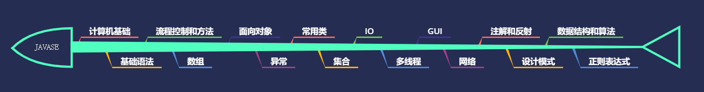
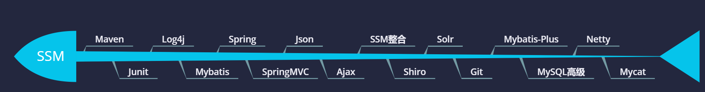
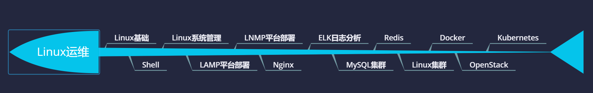

# 前言：JAVA

**JAVA的发展历史**

1990年代初，Sun公司推出了一款名为`OKA`的编程语言，目标就是应用于电视机，电话，闹钟，烤面包机等家用电器的控制和通信

但是由于发展不顺，Sun公司放弃了该计划。

在此时，互联网上的信息内容只是一些乏味死板的HTML文档，Sun公司察觉到了这一点，并对`Oka`进行改造

`1995`年正式推出==JAVA==，并在SunWorld大会上正式提出了：`Write One，Run Anywhere`

1997年2月19日，Sun公司发布JDK1.1，最基础的技术点如：JDBC，JAR文件格式，JAVABEAN，RMI，内部类，反射等特性出现

1998年`JDK 1.2`发布，Java技术体系拆分为三个方向

- `JAVASE（J2SE）`：JAVA2 Platform Standard Edition，JAVA平台标准版
- `JAVAEE（J2EE）`：JAVA2 Platform，Enterprise Edition，Java平台企业版
- `JAVAME（J2ME）`：JAVA 2 Platform Micro Edition，Java平台微型版

2006年，Sun公司宣布将JAVA开源

2009年，Oracle收购Sun公司

2014年，Oracle发布JavaSE 8

------

-----

# 1、JAVASE

# 2、JAVAWEB

# 3、SSM

# 4、Linux运维

# 5、微服务和分布式

# 6、大数据

# 7、持续学习

