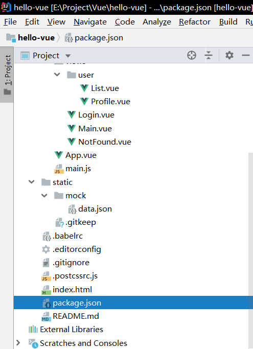
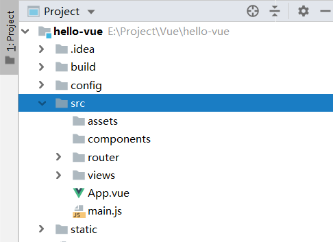
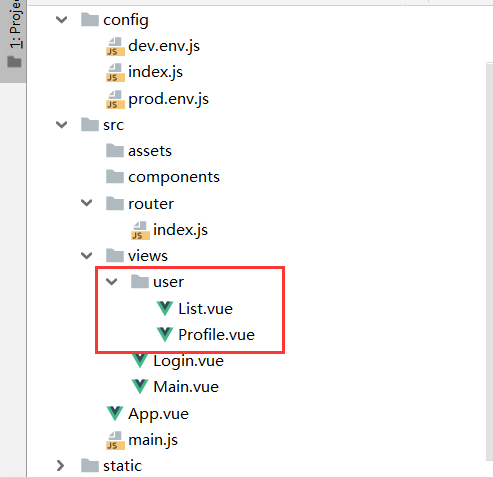
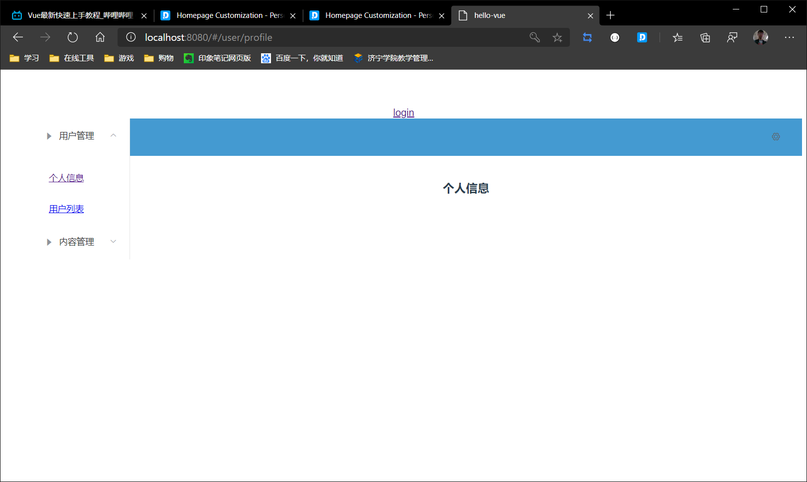

# VUE生命周期

> `Vue `实例有一个完整的生命周期，也就是从开始创建、初始化数据、编译模板、挂载 DOM、渲染→更新→渲染、卸载等一系列过程，我们称这是 `Vue `的生命周期。通俗说就是 `Vue `实例从创建到销毁的过程，就是生命周期。


# 前置环境

1. 在idea中的插件一栏中搜索vue，安装


2. 导入在线CDN

   ```html
   <script src="https://cdn.jsdelivr.net/npm/vue@2.5.21/dist/vue.js"></script>
   <script src="https://cdn.jsdelivr.net/npm/vue@2.5.21/dist/vue.min.js"></script>
   ```

---

# 起步


```vue
<!DOCTYPE html>
<html lang="en">
<head>
    <!--第一个VUE程序-->
    <meta charset="UTF-8">
    <title>Title</title>
    <!-- 1. 导入在线CDN-->
    <script src="https://cdn.jsdelivr.net/npm/vue@2.5.21/dist/vue.min.js"></script>
</head>
<body>

    <!--view层，变成了一个template模版-->

    <div id="app"><!--id：app，用于绑定数据-->
        {{message}}<!--取出数据message-->
    </div>

    <script>

        var vm = new Vue({
            el: "#app",//el：元素element，绑定元素
            /*Modle：数据*/
            data: {//data：数据，用于修改数据
                message: "Hello,Vue!"   //message：具体的数据
            }
        });

    </script>
</body>
</html>
```


这里实现了==双向绑定==，只要更改数据层，前段的view层也会跟着改变，而不用刷新界面，比如：


这样的效果以前的前段是做不到的，但是现在可以

---

---

# 基本语法

## 指令介绍

- 指令：`v-xxx`的形式称之为指令，也就是说以`v-`开头的都是指令，这样来表示他们是VUE可以提供的特殊特性


## 绑定

`v-bind`是`vue`中的绑定指令，作用是绑定到`Model`层的数据，其效果类似于`{{}}`，简写为`:`，比如

`v-bind:title="xx"`===`:title="xxx"`

使用：

 ```html
<!DOCTYPE html>
<html lang="en" xmlns:v-bind="http://www.w3.org/1999/xhtml">
<head>
    <meta charset="UTF-8">
    <title>Title</title>
    <script src="https://cdn.jsdelivr.net/npm/vue@2.5.21/dist/vue.min.js"></script>
</head>
<body>
    <!--
        1. 根据id绑定元素
        2. v-bind绑定提示信息
    -->
    <div id="app" v-bind:title="message">
        鼠标悬停几秒钟查看此处动态绑定的提示信息！
    </div>

    <script>

        var vm = new Vue({
            el: "#app",
            data: {
                message: "Hello,Vue!"
            }
        });

    </script>
</body>
</html>
 ```


## 判断

### `v-if`

需求：假如`msg`为==true==，则显示`VUE`

```vue
<body>
    
    <!--假如msg为真，则显示VUE-->
    <div id="app" v-if="msg" v-bind:title="msg">VUE</div>


    <script>
        var vm = new Vue({
            el: "#app",
            data: {
                msg: true
            }
        });
    </script>


</body>
```

### `v-else`

需求：假如`msg`为==true==，则显示`VUE`；假如`msg`为==false==，则显示`Hello`

```vue
<body>

    <!--假如msg为true，则显示VUE-->
    <!--假如msg为false，则显示Hello-->
    <div id="app">
        <div v-if="msg">VUE</div>
        <div v-else>Hello</div>
    </div>

    <script>
        var vm = new Vue({
            el: "#app",
            data: {
                msg: true
            }
        });
    </script>


</body>
```


### `v-else-if`

```vue
<body>

    <!--假如msg为A，则显示A-->
    <!--假如msg为B，则显示B-->
    <!--假如msg为C，则显示C-->
    <!--假如msg不为以上，则显示D-->
    <div id="app">
        <div v-if="msg==='A'">A</div>
        <div v-else-if="msg==='B'">B</div>
        <div v-else-if="msg==='C'">C</div>
        <div v-else>D</div>
    </div>

    <script>
        var vm = new Vue({
            el: "#app",
            data: {
                msg: "A"
            }
        });
    </script>	


</body>
```


## 循环


`v-for`是循环，可以遍历每一项

```vue
<body>

    <!--首先绑定id-->
    <div id="app">
        <!--然后绑定items，然后遍历每一项item-->
        <li v-for="item in items">{{item.message}}</li>
    </div>

    <script>
        var vm = new Vue({
            el: "#app",
            data: {
                items: [
                    {message: 'A'},
                    {message: 'B'},
                    {message: 'C'}
                ]
            }
        });
    </script>


</body>
```


还可以获取到当前的索引

```vue
<body>

    <!--首先绑定id-->
    <div id="app">
        <!--然后绑定items，然后遍历每一项item-->
        <li v-for="(item,index) in items">{{item.message}}----{{index}}</li>
    </div>

    <script>
        var vm = new Vue({
            el: "#app",
            data: {
                items: [
                    {message: 'A'},
                    {message: 'B'},
                    {message: 'C'}
                ]
            }
        });
    </script>


</body>
```


---

---

# 事件


- `v-on`指令可以监听`dom`事件，并触发一些`js`代码，简写为`@`，比如`v-on:click="hello"`===`@click="Hello"`

`JQuery`事件：https://www.w3school.com.cn/jquery/jquery_ref_events.asp

>  事件有了，那么肯定就有方法，之前我们学了`el`，`data`，下面我们学习`methods`，方法必须定义在`methods`中


```vue
<body>

    <!--首先绑定id-->
    <div id="app">
        <!--使用v-on绑定点击事件，然后执行hello方法-->
        <button v-on:click="hello">Hello</button>
    </div>

    <script>
        var vm = new Vue({
            el: "#app",
            data: {
                message: "Hello Methods"
            },
            methods: {
                /*方法必须定义在methods里面*/
                hello: function(){
                    /*定义一个叫做hello的function，this.message表示当前对象为message的数据*/
                    alert(this.message)
                }
            }
        });
    </script>


</body>
```


----

---

# 双向绑定


- 当数据变化时，视图随之变化
- 当视图变化时，数据随之变化

这就是VUE的精髓，双向绑定


==**v-model**==

可以使用`v-model`在表单的`<input> <textarea> <select>`等元素上实现双向绑定

```vue
<body>

    <!--首先绑定id-->
    <div id="app">
        <!--实现双向绑定，令视图改变的时候数据也跟着变，这里绑定了message-->
        <input type="text" v-model="message"> <br>
        绑定的数据：<br>
        {{message}}
    </div>

    <script>
        var vm = new Vue({
            el: "#app",
            data: {
                message: ""
            },
            methods: {}
        });
    </script>


</body>
```


---

```vue
<body>

    <!--首先绑定id-->
    <div id="app">
        男：<input type="radio" v-model="message" value="男">
        女：<input type="radio" v-model="message" value="女">

        <p>选中的值：{{message}}</p>
    </div>

    <script>
        var vm = new Vue({
            el: "#app",
            data: {
                message: ""
            },
            methods: {}
        });
    </script>


</body>
```


---

> 因为数据双向绑定之后，下拉框回出现一个问题，就是默认选中值会变为空，如：
>
> ```vue
> <select v-model="message">
>     <option>A</option>
>     <option>B</option>
>     <option>C</option>
> </select>
> ```
>
> 
>
> ---
>
> 假如令默认值为空的时候，苹果用户还是选择不了（不是显示文字的问题，是`value=""`）
>
> ```vue
>         <select v-model="message">
>             <option value="">A</option>
>             <option>B</option>
>             <option>C</option>
>         </select>
> ```
>
> 
>
> 而苹果用户当第一个值变为空的时候就选择不了
> 为了照顾土豪用户，我们把第一个值设置为空，显示为=="--请选择--"==


```vue
<body>

    <!--首先绑定id-->
    <div id="app">

        <!--
            因为数据双向绑定之后，下拉框回出现一个问题，就是第一个值会变为空
            而苹果用户当第一个值变为空的时候就选择不了
            为了照顾土豪用户，我们把第一个值设置为空，显示为"--请选择--"
        -->
        <select v-model="message">
            <option value="" disabled>--请选择--</option>
            <option>A</option>
            <option>B</option>
            <option>C</option>
        </select>

        <p>选中的值：{{message}}</p>
    </div>

    <script>
        var vm = new Vue({
            el: "#app",
            data: {
                message: ""
            },
            methods: {}
        });
    </script>


</body>
```


---

---

# 组件


什么是组件：

组件可以认为是多种标签的组合体，也可以认为是`容器+容器内容`，可以认为是`div+内容`，官网给了一张图：


---

## 组件起步


- 使用Vue组件component

```vue
<body>
    
    <!--首先绑定元素-->
    <div id="app">
        <vc></vc>
    </div>

    <script>
        
        
        /*用刚才定义的vue创建一个组件vc*/
        Vue.component("vc",{
            /*template：模版，这里只有一个列表项组件，叫做Hello*/
            template: "<li>Hello</li>"
        });
        
        /*定义Vue*/
        var vm = new Vue({
            el: "#app"
        });
    </script>

</body>
```


---

## 数据绑定

像上面这样使用组件不是真正的组件，因为Vue的精髓之一是数据绑定，所以现在我们要实现数据绑定


在使用数据绑定之前我们要明白几件事：

1. 组件`component`不能直接访问Vue里面的`data`
2. 组件标签可以访问`Vue`里面的`data`，也可以访问组件自身
3. 基于以上两点，我们要用组件标签这个中间件来将Vue和组件进行链接


---


```vue
<body>

    <!--首先绑定元素-->
    <div id="app">
        <!--使用v-for链接data，使用v-bind链接component-->
        <vc v-for="item in items" v-bind:binditem="item"></vc>
    </div>

    <script>
        
        Vue.component("vc",{
            /*使用props接受数据*/
            props: ['binditem'],
            template: "<li>{{binditem}}</li>",
        });

        /*定义Vue*/
        var vm = new Vue({
            el: "#app",
            data: {
                items: ['A','B','C']
            }
        });
    </script>

</body>
```


## 错误类型

> 除了上面的之外，在这里绑定数据的时候还有一个小坑，就是当props接受数据的时候，参数的名字只能第一个字母大写，如果其他字母大写，数据绑定就会失效
>
> 比如：`Binditem`可以，`BindItem`不行，失效实现：
>
> 
>
> 列表符都出现了，但是参数没出现，这个时候就要想想为啥了

> 还有一种错误：
>
> 
>
> 啥也没有，代表根本就没绑上，肯定是参数错了，比如：
>
> 

> 还有一种错误是中间加了横杠，就会出现NAN
>
> ```vue
>         Vue.component("vc-title",{
>             props: ['vc-title'],
>             template: '<p>{{vc-title}}</p>'
>         });
> ```
>
> 

----

---

# `Axios`异步通信

## 介绍和环境

> 首先第一件事就是改为ES6规范，因为ES5根本就写不了这个代码


为什么要学`Axios`

因为`vue`是专注于视图层的，而且作者严格遵守关注点分离原则（SOC），所以VUE不包含网络通信的功能


为了解决通信问题，我们需要网络通信的框架，这里有两个

- `JQuery`
- `Axios`


那么为什么要选择`Axios`？

1. VUE作者推荐
2. `JQuery`操作`dom`太频繁


在线CDN

```vue
<script src="https://unpkg.com/axios/dist/axios.min.js"></script>
```


## `Axios`起步

我们查看一下`Vue`的生命周期，发现了很多钩子事件，这些钩子事件就是可以插入到VUE的生命周期中，在那里执行的，而我们可以看到网络通信的钩子函数是在`mounted`那里执行的


因为我们经常使用的是`JSON`格式，所以这里来了一段`JSON`代码

```json
{
  "name": "狂神说Java",
  "url": "https://blog.kuangstudy.com",
  "page": 1,
  "isNonProfit": true,
  "address": {
    "street": "含光门",
    "city": "陕西西安",
    "country": "中国"
  },
  "links": [
    {
      "name": "bilibili",
      "url": "https://space.bilibili.com/95256449"
    }, 
    {
      "name": "狂伸说java",
      "url": "https://blog.kuangstudy.com"
    },
    {
      "name": "百度",
      "url": "https://www.baidu.com/"
    }
  ]
}
```

来一个目录：


上代码：

```vue
<body>

    <div id="app"></div>

    <script>


        var vm = new Vue({
            el: "#app",
            data: {},
            methods: {},
            mounted(){//钩子函数，链式编程
            /*使用get函数就是axios.get()，其余同理，我们直接访问这个路径，得到response返回值，然后输出一下看看*/
                axios.get("../data.json").then(response=>(console.log(response.data)));
            }
        });
    </script>

</body>
```


> 注意，这里是ES6的新特性，所以有些ES5的浏览器不支持，以后会学下降版本

---

---

## `data`方法绑定

刚才我们用的是直接输出，但是我们显然不会这么做，我们需要将这些数据放到`data`中，毕竟这才是正规操作

但是注意：

1. 这里的这个`data`不是属性data，而是方法`data`
2. 我们需要放的不是数据，而是数据的格式

这样说可能不懂，但是一写代码就懂了

> 首先是JSON，注意它的格式：

```json
{
  "name": "狂神说Java",
  "url": "https://blog.kuangstudy.com",
  "page": 1,
  "isNonProfit": true,
  "address": {
    "street": "含光门",
    "city": "陕西西安",
    "country": "中国"
  },
  "links": [
    {
      "name": "bilibili",
      "url": "https://space.bilibili.com/95256449"
    },
    {
      "name": "狂伸说java",
      "url": "https://blog.kuangstudy.com"
    },
    {
      "name": "百度",
      "url": "https://www.baidu.com/"
    }
  ]
}
```

> VUE

```vue
<body>

    <div id="app">
        {{info.name}} <br>
        {{info.address.street}} <br>
        <li v-for="item in info.links">
            <a v-bind:href="item.url">{{item.url}}</a>
        </li>
    </div>

    <script>


        var vm = new Vue({
            el: "#app",
            data: {},
            methods: {},
            /*看好了，这个data是data方法，不是上面的data属性*/
            data(){
                return {
                    /*定义info的格式，注意，这个格式必须和返回来的json数据格式要相同
                    * 可以不写，但是一定不能写错
                    * 不写的比如：isNonProfit,page等等我就没写，但是没错
                    * */
                    info: {
                        name: null,
                        address: {
                            street: null,
                            city: null,
                        },
                        links: [
                            {
                                name: null,
                                url: null
                            }
                        ]
                    }
                }
            },
            mounted(){
                /*这里令info为传过来的response.data*/
                axios.get("../data.json").then(response=>(this.info=response.data));
            }
        });
    </script>

</body>
```


---

---

## 闪烁问题解决

我们看生命周期的时候就会发现，数据绑定是在后面的操作，那么在数据绑定之前页面都是el属性的内容，那么这就会产生一个结果：

页面首先出现el属性，然后数据替换el属性，这样就形成了闪烁


要解决闪烁问题好解决，我们只需要让数据替换之后再把页面给用户渲染出来就好了


这个方法不是`VUE`的，只是可以这样去解决


```vue
<!DOCTYPE html>
<html lang="en">
<head>
    <meta charset="UTF-8">
    <title>Title</title>
    <script src="https://cdn.jsdelivr.net/npm/vue@2.5.21/dist/vue.js"></script>
    <script src="https://unpkg.com/axios/dist/axios.min.js"></script>

    <style>
        /*通过属性选择器，让它没加载出来之前白屏*/
        [v-clock]{
            display: none;
        }
    </style>
</head>
<body>

    <div id="app" v-clock>
        {{info.name}} <br>
        {{info.address.street}} <br>
        <li v-for="item in info.links">{{item.url}}</li>
    </div>

</body>
</html>
```

---

---


# 计算属性


## 计算属性是什么

计算属性的重点突出在 `属性` 两个字上（属性是名词）

- 首先它是个 `属性` 
- 其次这个属性有 `计算` 的能力（计算是动词），这里的 `计算` 就是个函数；
- 可以想象为缓存！

> 也就是说，这是个拥有着方法能力的属性，当数据不变的时候不会发生变化，起到了一个缓存的作用


和方法不同，比如`1+1`，当数据不会改变的时候，方法是再次算一次然后返回结果，而计算属性是直接返回上次的结果


代码：

```vue
<body>

    <div id="app" >
        <!--方法调用使用()-->
        <p>{{count1()}}</p>
        <!--计算属性属于属性，直接调用-->
        <p>{{count2}}</p>
    </div>

    <script>


        var vm = new Vue({
            el: "#app",
            data: {
                message: "data"
            },
            methods: {
                /*方法*/
                count1: function () {
                    return Date.now();
                }
            },
            computed: {
                /*computed：计算属性，计算属性写法上和方法没有什么不同，但是有根本的不同*/
                count2: function () {
                    this.message;
                    return Date.now();
                }
            }
        });
    </script>

</body>
```


> - `count1()`方法每次返回的结果必定计算
> - `count2`计算属性只有当其中的数据变化的时候才会再次计算

---

---

# 内容分发

## 插槽是什么

在一个页面中，使用组件对内容进行动态的更改，这就叫做插槽


比如狂神的页面：只有中间的内容区域改变了，其余都不变，这个用插槽也可以做


当然，不用插槽也可以做，但是使用了插槽之后回变得更加容易


## 插槽起步

首先来看一段代码：

```vue
<body>
    
    <p>Bean</p>
    <ul>
        <li>JAVA</li>
        <li>Linux</li>
        <li>Vue</li>
    </ul>

</body>
```


>  无论是Bean，Java，Linux还是Vue ，这些数据显然是不能够写死的，应该从数据读出来，下面我们就是用插槽来替换


提示：

- 插槽也是组件


```vue
<body>

    <div id="app" >
        <vc>
            <!--注意点是：这里也需要使用slot进行绑定，假如不绑定不会报错，但是不会显示数据-->
            <vc-title slot="vc-title" v-bind:Vctitle="title"></vc-title>
            <vc-content slot="vc-content" v-for="item in content" v-bind:Vcitem="item"></vc-content>
        </vc>
    </div>

    <script>

        /*注意点：<slot></slot>不能是根标签，外边要套上一层容器，否则会报错
        * vc是总组件
        * <slot name="vc-title"></slot> 使用name绑定组件vc-title
        * <slot name="vc-content"></slot>使用name绑定组件vc-content
        * */
        Vue.component("vc",{
            template: '<div>\
                            <slot name="vc-title"></slot>\
                            <ul>\
                               <slot name="vc-content"></slot>\
                            </ul>\
                        </div>'
        });

        /*插槽也是组件，这个是分组件vc-title
        * 接受参数Vctitle，注意这个参数除了第一个字母之外不能大写，也不能用 - 链接
        * */
        Vue.component("vc-title",{
            props: ['Vctitle'],
            template: '<p>{{Vctitle}}</p>'
        });

        /*插槽也是组件，这个是分组件vc-content
        * 接受参数Vcitem，注意这个参数除了第一个字母之外不能大写，也不能用 - 链接
        * */
        Vue.component("vc-content",{
            props: ['Vcitem'],
            template: '<li>{{Vcitem}}</li>'
        });

        
        /*定义好数据*/
        var vm = new Vue({
            el: "#app",
            data: {
                title: "Bean",
                content: ["JAVA","Linux","Vue"]
            },
        });
    </script>

</body>
```


---

## 错误类型

1. 报错说`<slot></slot>`标签不能为==root==标签

   在`component`组件定义的时候使用容器包裹一下，比如`<div></div>`，不能用`<slot></slot>`作为根标签

2. 数据不显示，但是不报错

   在使用插槽标签的时候也要使用==slot==属性链接插槽，否则不会报错，但是不显示数据

3. 报错

   注意点是组件的数据绑定的时候`props`接收的参数除了第一个字母之外不能大写，而且不能有横杠链接


---

---

# 自定义事件

## 什么是自定义事件

**问题描述**

内容分发的部分结束之后，我们发现一个问题：如果我们想要删除`data`里面的数据是删不掉的，因为插槽也算是一个组件，而数据是存放在`Vue`中的data部分里的


**自定义事件**

我们在`Vue`里面定义删除方法，但是在插槽组件中调用不到（因为插槽组件只能调用自己组件中的方法），所以这个时候：

我们就需要新的内容：==自定义事件==了


我们都知道，事件分为很多类型，比如点击事件，长按事件，之前讲过事件使用`v-on`绑定，然后执行方法


==那么自定义事件就是我们自己定义的事件，和点击事件长按事件没有什么区别，都需要`v-on`进行绑定（简写`@`）==


**自定义事件的功能**


使用自定义事件，可以在任何组件上执行对应的方法，以达到在组件中使用其他组件的功能


## 使用自定义事件

使用：` this.$emit('自定义事件名称', 向执行的方法传递的参数);`


```vue
<body>

    <div id="app" >
        <vc>
            <!--v-on绑定事件remove，执行对应方法removeItem-->
            <vc-content slot="vc-content" v-for="(item,index) in content" :Vcitem="item" :index="index"  @remove="removeItem(index)">
            </vc-content>
        </vc>
    </div>

    <script>

        Vue.component("vc",{
            template: '<div>\
                            <ul>\
                               <slot name="vc-content"></slot>\
                            </ul>\
                        </div>'
        });

        /*获得参数Vcitem和索引index
        令Button绑定点击事件执行vc-content中的remove方法
        * */
        Vue.component("vc-content",{
            props: ['Vcitem','index'],
            template: '<li>{{Vcitem}} <button @click="remove(index)">删除</button></li>',
            methods: {
                /*这里的remove方法
                    1.接受参数
                    2.执行自定义事件remove并传递参数
                */
                remove: function (index) {
                    this.$emit('remove',index);
                }
            }
        });


        /*定义好数据*/
        var vm = new Vue({
            el: "#app",
            data: {
                title: "Bean",
                content: ["JAVA","Linux","Vue"]
            },
            methods: {
                removeItem: function (index) {
                    /*splice这个js方法是个万能方法，他有多个参数：splice(索引，删除几个元素，添加的元素...)
                    * 所以在Index索引处删除一个，什么元素也不添加是(index,1)
                    * 注意添加的元素是个可变参数
                    * */
                    this.content.splice(index,1);
                }
            }
        });
    </script>

</body>
```

---

---

# 第一个VUE程序


## 环境安装

首先安装环境

1. `nodejs`：http://nodejs.cn/download/

2. `cnpm（淘宝国内镜像源）`：

   ```cmd
   npm install cnpm -g --registry=https://registry.npm.taobao.org
   ```

3. `vue-cli`：`cnpm install vue-cli -g`

安装完成之后可以使用`vue list`命令在命令行中查看有什么模版


## 第一个VUE项目

### 初始化项目

1. 切到对应的目录
2. 在目录下使用命令`vue init webpack vueproject`(`vueproject`是项目名字)


### 安装对应环境

1. 命令行进入到`myvue`目录
2. 初始化项目环境：`npm install`，假如不行就用`cnpm install`

等待中。。。。


### 运行

初始化完成之后，在命令行中使用`npm run dev`打包运行，运行完毕给一个端口，直接进去即可（不是管理员可能不行）


使用`ctrl+c`结束运行

---

## 使用IDEA

直接`open`就可以了，不用`import`，但是`IDEA`中的控制台不是管理员模式，所以设置`IDEA`以管理员身份打开


然后就成了


## 删除多余文件

一个干净的页面应该是什么也没有的，所以：

1. 删除图中标记的一张图，一个Vue组件，这些都是项目创建的时候自动添加的，但是并没有什么用


2. 进入到`App.vue`，删除标出的部分


这样，一个纯净的项目就出来了

---

---

# `webpack`的使用

## ES6

在讲解`webpack`，之前，首先要了解一下ES6规范

EcmaScript6 标准增加了 JavaScript 语言层面的模块体系定义。 

ES6 模块的设计思想，是尽量静态化，使编译时就能确定模块的依赖关系，以及输入和输出的变量。


但是现在的浏览器大多都只支持到ES5规范，所以我们需要一款工具来对其进行管理

## 什么是`webpack`

`webpack`是前端的模块化加载与构建管理工具，类似后端的`maven`

它能把各种资源，如 JS、JSX、ES6、SASS、LESS、图片等都作为模块来处理和使用

使用`webpack`能够将ES6规范打包降级为ES5规范，从而使现在的浏览器支持


## 安装`webpack`

```npm
npm install webpack -g
npm install webpack-cli -g
```

或者使用`cnpm`


测试是否安装成功：

```cmd
webpack -v
webpack-cli -v
```


## 配置

创建 `webpack.config.js` 配置文件

- entry：入口文件，指定 `WebPack `用哪个文件作为项目的入口
- output：输出，指定 `WebPack `把处理完成的文件放置到指定路径
- module：模块，用于处理各种类型的文件
- plugins：插件，如：热更新、代码重用等
- resolve：设置路径指向
- watch：监听，用于设置文件改动后直接打包


## 起步

1. 首先创建一个项目，比如创建一个文件夹，然后用IDEA打开


2. 创建目录`modules `，用于存放`js`文件

3. 在`modules`下创建`js`文件`hello.js`与`main.js`

   > `hello.js`是模块化组件，并设置导出方法
   >
   > ```js
   > /*这个exports命令是导出，是暴露接口，只有用了这个命令才能让别的文件导入
   > * 方法名字为sayhi
   > * */
   > exports.sayhi = function () {
   >     document.write("<h1>Hello WebPack</h1>")
   > }
   > ```
   >
   > 
   >
   > `main.js`作为入口函数，并导入对应的方法，运行
   >
   > ```js
   > /*注意，这里导入的是hello不是hello.js，相当于java中倒入类但是不导入.java文件一样
   > * 使用require命令导入对应的类(这里是hello.js)，但是导入hello不导入hello.js
   > * 注意引入要加./表示当前目录
   > * */
   > var hello = require("./hello");
   > /*导入之后就可以使用里面的方法了，因为我们只写了一个sayhi()方法，所以调用*/
   > hello.sayhi();
   > ```

4. 设置`webpack`打包配置，使用`webpack.config.js`进行配置

   > 在上面已经有`webpack.config.js`的配置了，但是最重要的是输出位置还有入口方法

   ```js
   module.exports = {
       /*注意，这里要精确到入口函数，这里写的是.js文件了
       * 使用./表示当前目录下的xxx*/
       entry: "./modules/main.js",
       output: {
           /*默认的约定是到这里去，这个文件名字*/
           filename: "./js/bundle.js"
       }
   };
   ```

5. 在控制台使用命令`webpack`打包

   

   


打包之后的`js`文件


---

下面进行测试：

在项目目录下新建一个html文件index.html

引入bundle.js

测试


---


# `Vue`中安装插件

## 如何安装

懂了`webpack`之后，我们就可以使用它来安装插件了

插件有很多中，比如`axios`也是个插件，`vue-router`也是个插件

现在我们以`vue-router`作为一个例子，讲解一下`vue`中如何安装插件


1. 使用`npm`将插件下载下来
2. 在项目中导入
3. 在项目中声明使用

## `vue-router`路由跳转

## 导入环境

1. 使用`npm`下载`vue-router`：`npm install vue-router --save-dev`，这个是下载`vue-router`并加入到配置中

   

2. 在`main.js`中导入`vue-router`：`import VueRouter from 'vue-router'`

   

   > 这个`VueRouter`是导入之后在这个项目中的名字，from xxx才是路径

3. 声明`vue-router`

   


至此，导入完成

---

## 使用`vue-router`

首先我们要准备好几个页面，作为路由跳转，放到`components`文件夹下面

- `Content.vue`

```vue
<template>
  
  <h1>Router-Content</h1>
  
</template>

<script>
    export default {
        name: "content"
    }
</script>

<style scoped>

</style>
```

- `Main.vue`

```vue
<template>
    <h1>Router-Main</h1>
</template>

<script>
    export default {
        name: "main"
    }
</script>

<style scoped>

</style>
```


---

---

要使用`vue-router`，只要三步：


1. 建立`router`文件夹，在文件夹下面创建`index.js`作为配置（`Vue`官方默认的配置文件名字就是`index`）

- `router/index.js`

```js
//首先导入vue组件，没了vue什么也干不了
import Vue from 'vue';
//然后导入vue-router
import Router from 'vue-router';
//导入要跳转的组件content
import Content from "../components/Content";
//导入要跳转的组件Main
import Main from "../components/Main";

//使用Router
Vue.use(Router);

/*导出，让main.js可以使用
* new Router，生成一个新的Router，这个Router就是前面哪个导入的vue-router，在这里叫Router
* */
export default new Router({
  /*配置路由*/
  routes: [
    {
      //请求路径，到时候就是localhost:8080/content
      path: '/content',
      //路由名称
      name: 'Content',
      //跳转的组件
      component: Content
    },
    {
      path: '/main',
      name: 'Main',
      component: Main
    }
  ]
});
```

2. 在`main.js`中配置

- `main.js`

```js
import Vue from 'vue'
import App from './App'

//注意这里导入了router，但是没有精确到哪一个文件，这是因为只要名字是默认的index.js就会自动导入，不必精确到具体的文件
import router from './router'

Vue.config.productionTip = false

Vue.use(router);

new Vue({
  el: '#app',
  //这里直接配置路由即可，但是假如导入的名字不是router而是其他的，比如Router
  // 就要这么配置：  router: Router
  router,
  components: { App },
  template: '<App/>'
})
```

3. 在`App.vue`中设置

```vue
<template>
  <div id="app">
    <h1>Vue-Router</h1>
    <!--
      router-link：跳转的链接
          to：跳转的路径
      router-view：跳转的组件显示
    -->
    <router-link to="/content">内容</router-link>
    <router-link to="/main">首页</router-link>
    <router-view></router-view>

  </div>
</template>
<script>

export default {
  name: 'App'
}
</script>

<style>
#app {
  font-family: 'Avenir', Helvetica, Arial, sans-serif;
  -webkit-font-smoothing: antialiased;
  -moz-osx-font-smoothing: grayscale;
  text-align: center;
  color: #2c3e50;
  margin-top: 60px;
}
</style>
```


---

---

# `Vue`实战快速上手

## 环境搭建


1. 创建工程`hello-vue`：`vue init webpack hello-vue`

2. 安装依赖：`vue-router`，`element-ui`，`sass-loader`，`node-sass`

   ```npm
   # 进入工程目录
   cd hello-vue
   # 安装 vue-router
   cnpm install vue-router --save-dev
   # 安装 element-ui
   cnpm i element-ui -S
   # 安装依赖
   cnpm install
   # 安装 SASS 加载器，这个用于解析css的
   cnpm install sass-loader node-sass --save-dev
   # 启动测试
   npm run dev
   ```

3. `npm`命令解释：

   - `npm install moduleName`：安装模块到项目目录下
   - `npm install -g moduleName`：-g 的意思是将模块安装到全局，具体安装到磁盘哪个位置，要看 `npm config prefix` 的位置
   - `npm install -save moduleName`：--save 的意思是将模块安装到项目目录下，并在 `package `文件的 `dependencies `节点写入依赖，-S 为该命令的缩写
   - `npm install -save-dev moduleName`：`--save-dev` 的意思是将模块安装到项目目录下，并在 `package `文件的 `devDependencies `节点写入依赖，-D 为该命令的缩写

---

这里可能会有报错，这可能是因为`sass`版本过高导致的，降级为：`"sass-loader": "^7.3.1",`，然后`cnpm install`

文件在`package.json`




## 起步



- static：静态资源
- views：视图组件
- router：路由跳转
- components：组件
- assets：资源


- `views/main.vue`

```vue
<template>
    <h1>首页</h1>
</template>

<script>
    export default {
        name: "main"
    }
</script>

<style scoped>

</style>
```

- `views/Login.vue`：这个来自`ElementUI`，我一个字没写

```vue
<template>
  <div>
    <el-form ref="loginForm" :model="form" :rules="rules" label-width="80px" class="login-box">
      <h3 class="login-title">欢迎登录</h3>
      <el-form-item label="账号" prop="username">
        <el-input type="text" placeholder="请输入账号" v-model="form.username"/>
      </el-form-item>
      <el-form-item label="密码" prop="password">
        <el-input type="password" placeholder="请输入密码" v-model="form.password"/>
      </el-form-item>
      <el-form-item>
        <el-button type="primary" v-on:click="onSubmit('loginForm')">登录</el-button>
      </el-form-item>
    </el-form>

    <el-dialog
      title="温馨提示"
      :visible.sync="dialogVisible"
      width="30%"
      :before-close="handleClose">
      <span>请输入账号和密码</span>
      <span slot="footer" class="dialog-footer">
        <el-button type="primary" @click="dialogVisible = false">确 定</el-button>
      </span>
    </el-dialog>
  </div>
</template>

<script>
  export default {
    name: "Login",
    data() {
      return {
        form: {
          username: '',
          password: ''
        },

        // 表单验证，需要在 el-form-item 元素中增加 prop 属性
        rules: {
          username: [
            {required: true, message: '账号不可为空', trigger: 'blur'}
          ],
          password: [
            {required: true, message: '密码不可为空', trigger: 'blur'}
          ]
        },

        // 对话框显示和隐藏
        dialogVisible: false
      }
    },
    methods: {
      onSubmit(formName) {
        // 为表单绑定验证功能
        this.$refs[formName].validate((valid) => {
          if (valid) {
            // 使用 vue-router 路由到指定页面，该方式称之为编程式导航
            this.$router.push("/main");
          } else {
            this.dialogVisible = true;
            return false;
          }
        });
      }
    }
  }
</script>

<style lang="scss" scoped>
  .login-box {
    border: 1px solid #DCDFE6;
    width: 350px;
    margin: 180px auto;
    padding: 35px 35px 15px 35px;
    border-radius: 5px;
    -webkit-border-radius: 5px;
    -moz-border-radius: 5px;
    box-shadow: 0 0 25px #909399;
  }

  .login-title {
    text-align: center;
    margin: 0 auto 40px auto;
    color: #303133;
  }
</style>
```


- `router/index.js`

```js
import  Vue from 'vue'                //引入VUE
import Router from 'vue-router'       //引入vue-router

import Main from '../views/main'        //引入main页面
import Login from '../views/Login'      //引入Login页面

Vue.use(Router);                      //使用router


//导出路由组件
export default new Router({         
  routes: [
    {
      path: '/main',
      component: Main
    },{
      path: '/login',
      component: Login
    }
  ]
});
```


- `main.js`

```js

import Vue from 'vue'
import App from './App'

//引入路由
import router from './router'


//elementUI导入，从官网的快速起步看出
import ElementUI from 'element-ui';
import 'element-ui/lib/theme-chalk/index.css';

//使用路由
Vue.use(router);

//使用element-ui，从官网的快速起步看出
Vue.use(ElementUI);


new Vue({
  el: '#app',
  router,
  render: h=>h(App)//ElementUI，官网的快速起步
})
```


- `App.vue`

```vue
<template>
  <div id="app">
    <router-link to="/login">login</router-link>
    <router-view></router-view>
  </div>
</template>

<script>

export default {
  name: 'App',
}
</script>

<style>
#app {
  font-family: 'Avenir', Helvetica, Arial, sans-serif;
  -webkit-font-smoothing: antialiased;
  -moz-osx-font-smoothing: grayscale;
  text-align: center;
  color: #2c3e50;
  margin-top: 60px;
}
</style>
```

---

## 路由嵌套


文件更新：




- `views/user/List.vue`

```vue
<template>
    <h1>用户列表</h1>
</template>

<script>
    export default {
        name: "List"
    }
</script>

<style scoped>

</style>
```

- `views/user/Profile.vue`

```vue
<template>
    <h1>个人信息</h1>
</template>

<script>
    export default {
        name: "Profile"
    }
</script>

<style scoped>

</style>
```

- `routers/index.js`

```js
import  Vue from 'vue'                //引入VUE
import Router from 'vue-router'       //引入vue-router

import Main from '../views/Main'        //引入main页面
import Login from '../views/Login'      //引入Login页面

import UserList from '../views/user/List'
import UserProfile from '../views/user/Profile'

Vue.use(Router);                      //使用router


//导出路由组件
export default new Router({
  routes: [
    {
      path: '/main',
      component: Main,
      //嵌套路由，Main下还能跳转
      children: [
        {
          path: '/user/profile',
          component: UserProfile
        },{
          path: '/user/list',
          component: UserList
        }
      ]
    },{
      path: '/login',
      component: Login,
    }
  ]
});
```

> 重点来了：路由嵌套，在main路由下嵌套另一个路由

- `Main.vue`：只显示部分

```vue
<template>

<router-link to="/user/profile">个人信息</router-link>
<router-link to="/user/list">用户列表</router-link>
<router-view />

</template>
```

> `Main.vue`更改之后的效果

最终效果



---

## 参数传递和重定向

### 方法一：

- `Main.vue`

```vue
<router-link :to="{name: '/user/profile',params: {id:1}}">个人信息</router-link>
```

> 注意这里使用to来发送参数
>
> - `name`：传递地址
> - `params`：传递参数
>
> 注意：因为`vue`是双向绑定的，所以使用`v-bind:to="xxx"`绑定

- `router/index.js`

```js
import  Vue from 'vue'                //引入VUE
import Router from 'vue-router'       //引入vue-router

import Main from '../views/Main'        //引入main页面
import Login from '../views/Login'      //引入Login页面

import UserList from '../views/user/List'
import UserProfile from '../views/user/Profile'

Vue.use(Router);                      //使用router


//导出路由组件
export default new Router({
  routes: [
    {
      path: '/main',
      component: Main,
      //嵌套路由，Main下还能跳转
      children: [
        {
          path: '/user/profile/:id',
          component: UserProfile
        }
      ]
    }
});
```

> 注意这里要接受一个id，使用`/:id`传递参数

- `Profile.vue`

```vue
<template>
  <div>
    <h1>个人信息</h1>
    <!-- 接受参数，注意这里是route，不是router-->
    {{$route.params.id}}
  </div>
</template>

<script>
    export default {
        name: "Profile"
    }
</script>

<style scoped>

</style>
```

> 注意，所有东西都在组件下，比如`div`

### 方法二：

- `Main.vue`

```vue
<router-link :to="{name: '/user/profile',params: {id:1}}">个人信息</router-link>
```

- `index.js`

```js
import  Vue from 'vue'                //引入VUE
import Router from 'vue-router'       //引入vue-router

import Main from '../views/Main'        //引入main页面
import Login from '../views/Login'      //引入Login页面

import UserList from '../views/user/List'
import UserProfile from '../views/user/Profile'

Vue.use(Router);                      //使用router


//导出路由组件
export default new Router({
  routes: [
    {
      path: '/main',
      component: Main,
      //嵌套路由，Main下还能跳转
      children: [
        {
          path: '/user/profile/:id',
          component: UserProfile,
          props: true
        }
  ]
});
```

> 这里令`props`为true，但是在`path`还是要接受参数
>
> 如果要接受多个，比如：
>
> `'/user/profile/:id/:name/:age'`

- `Profiles.vue`

```vue
<template>
  <div>
    <h1>个人信息</h1>
    <!-- 接受参数，注意这里是route，不是router-->
    {{id}}
  </div>
</template>

<script>
    export default {
        name: "Profile",
        props: ['id']
    }
</script>

<style scoped>

</style>
```

> 这样的方式我们更加容易接受

----

---

### 解决两个方法出现的问题：

这两个方法都会出现一个问题：

>  直接点击链接的时候画面就没了，但是直接上链接：`http://localhost:8080/#/user/profile/1`可以显示

这样的结果显然不是我们想要的，所以更改一下：

```js
import  Vue from 'vue'                //引入VUE
import Router from 'vue-router'       //引入vue-router

import Main from '../views/Main'        //引入main页面
import Login from '../views/Login'      //引入Login页面

import UserList from '../views/user/List'
import UserProfile from '../views/user/Profile'

Vue.use(Router);                      //使用router


//导出路由组件
export default new Router({
  routes: [
    {
      path: '/main',
      component: Main,
      //嵌套路由，Main下还能跳转
      children: [
        {
          path: '/user/profile/:id',
          name: UserProfile,
          component: UserProfile,
        },{
          path: '/user/list',
          name: UserList,
          component: UserList
        }
      ]
    },{
      path: '/login',
      component: Login,
    }
  ]
});
```

> 可以很清楚的看到这里增加了一个`name`属性

- `Main.vue`

```vue
<router-link :to="{name: UserProfile,params: {id:1}}">个人信息</router-link>
```

> 使用了`name`属性之后就可以了

---

### 重定向

```js
import  Vue from 'vue'                //引入VUE
import Router from 'vue-router'       //引入vue-router

import Main from '../views/Main'        //引入main页面
import Login from '../views/Login'      //引入Login页面

import UserList from '../views/user/List'
import UserProfile from '../views/user/Profile'

Vue.use(Router);                      //使用router


//导出路由组件
export default new Router({
  routes: [
    {
      path: '/main',
      component: Main,
    },{
      path: '/login',
      component: Login,
    },{
      path: '/gohome',
      redirect: '/login'
    }
  ]
});
```


- `Main.vue`

```vue
          <el-submenu index="1">
            <template slot="title"><i class="el-icon-caret-right"></i>用户管理</template>
                                                                                                        
            <el-menu-item-group>
                                                                                                         
              <el-menu-item index="1-1">
                <router-link :to="{name: UserProfile,params: {id:1}}">个人信息</router-link>
              </el-menu-item>
                                                                                                         
              <el-menu-item index="1-2">
                <router-link to="/user/list">用户列表</router-link>
              </el-menu-item>
                                                                                                         
              <el-menu-item index="1-3">
                <router-link to="/gohome">回到登录界面</router-link>
              </el-menu-item>
                                                                                                         
            </el-menu-item-group>
          </el-submenu>
```


---

## 404和路由钩子

### 路由模式

路由模式有两种：

- hash：路径带`#`号
- history：路径不带`#`号

修改路由配置：

```js
export default new Router({
  mode: 'history',
  routes: []
```

> 注意传递字符串


---

### 404

- `views/NotFound.vue`

```vue
<template>
    <div>
      <h1>你的页面走丢了</h1>
    </div>
</template>

<script>
    export default {
        name: "NotFound"
    }
</script>

<style scoped>

</style>
```

- `index.js`

```js
//导出路由组件
export default new Router({
  mode: 'history',
  routes: [
    {
      path: '*',
      component: NotFound
    }
  ]
});
```

> 因为优先级最低，所以除了其他配置的页面，就进入这个页面

---

### 钩子与异步请求

#### 钩子

```vue
<template>
  <div>
    <h1>个人信息</h1>
    <!-- 接受参数，注意这里是route，不是router-->
    {{id}}
  </div>
</template>

<script>
    export default {
      name: "Profile",

      /*
        这个就和过滤器一样，参数是固定的
        to:路由将要跳转的路径信息
        from:路径跳转前的路径信息
        next：路由的控制参数
          next()：跳转到下一个界面
          next('/path')：改变路由的跳转方向，令其跳到另外的路由
          next(false)：返回原来的页面
          next((vm)=>{})：仅在beforeRouteEnter可用，vm是组件实例
       */
      beforeRouteEnter:(to,from,next)=>{//进入路由之前进行
        console.log("进入路由之前执行");
        next();//要使用这个next,否则会卡住

      },
      beforeRouteLeave:(to,from,next)=>{//进入路由之后进行
        console.log("进入路由之后执行");
        next();
      }

    }
</script>

<style scoped>

</style>
```


#### 异步请求

首先安装`axios`

`cnpm install axios -s`


然后在`main.js`里面引入

```js
//引入axios
import axios from 'axios'
import VueAxios from 'vue-axios'
//使用Axios
Vue.use(VueAxios,axios);
```


- `UserProfile.vue`

```vue
<template>
  <div>
    <h1>个人信息</h1>
    <!-- 接受参数，注意这里是route，不是router-->
  </div>
</template>

<script>
    export default {
      name: "Profile",

      /*
        这个就和过滤器一样，参数是固定的
        to:路由将要跳转的路径信息
        from:路径跳转前的路径信息
        next：路由的控制参数
          next()：跳转到下一个界面
          next('/path')：改变路由的跳转方向，令其跳到另外的路由
          next(false)：返回原来的页面
          next((vm)=>{})：仅在beforeRouteEnter可用，vm是组件实例
       */
      beforeRouteEnter:(to,from,next)=>{//进入路由之前进行
        //进入路由之前加载数据，执行这个方法
        next(vm=>{
          vm.getData()
        });//要使用这个next,否则会卡住

      },
      beforeRouteLeave:(to,from,next)=>{//进入路由之后进行
        next();
      },
      methods: {
          getData: function () {
            this.axios({
              method: 'get',
              url:'http://localhost:8080/static/mock/data.json'
            }).then(function (response) {
              console.log(response)
            })
          }
      }

    }
</script>

<style scoped>

</style>
```

