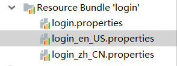
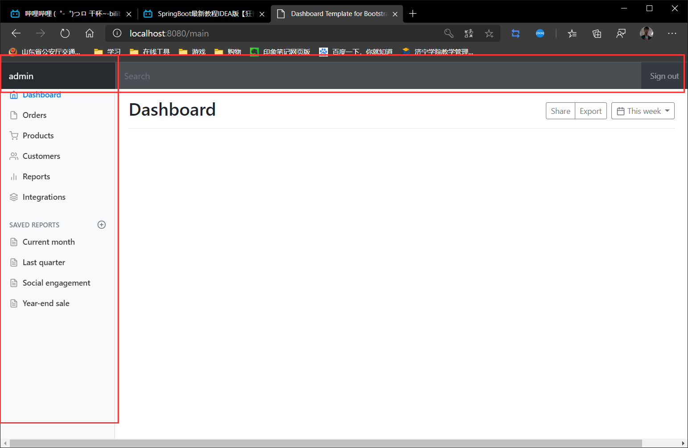
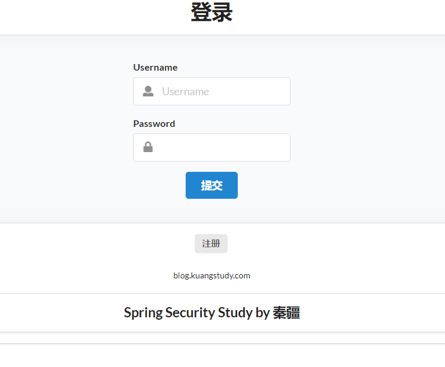
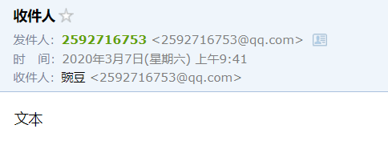
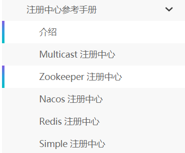

# SpringBoot快速入门

## 微服务

### 什么是微服务

微服务是一种架构，和MVC没有本质区别，都是一种架构


它要求我们在开发一个应用的时候，这个应用必须构建成一系列小服务的组合；可以通过http的方式进行互通。


### 单体应用架构

所谓单体应用架构（all in one）是指，我们将一个应用的中的所有应用服务都封装在一个应用中。

无论是ERP、CRM或是其他什么系统，你都把数据库访问，web访问，等等各个功能放到一个war包内。

这样做的好处是，易于开发和测试；也十分方便部署；当需要扩展时，只需要将war复制多份，然后放到多个服务器上，再做个负载均衡就可以了。

单体应用架构的缺点是，哪怕我要修改一个非常小的地方，我都需要停掉整个服务，重新打包、部署这个应用war包。特别是对于一个大型应用，我们不可能吧所有内容都放在一个应用里面，我们如何维护、如何分工合作都是问题。

 

### 微服务架构

all in one的架构方式，我们把所有的功能单元放在一个应用里面。然后我们把整个应用部署到服务器上。如果负载能力不行，我们将整个应用进行水平复制，进行扩展，然后在负载均衡。

所谓微服务架构，就是打破之前all in one的架构方式，把每个功能元素独立出来。把独立出来的功能元素的动态组合，需要的功能元素才去拿来组合，需要多一些时可以整合多个功能元素。所以微服务架构是对功能元素进行复制，而没有对整个应用进行复制。

这样做的好处是：

（1）节省了调用资源。

（2）每个功能元素的服务都是一个可替换的、可独立升级的软件代码。


### 如何构建微服务

一个大型系统的微服务架构，就像一个复杂交织的神经网络，每一个神经元就是一个功能元素，它们各自完成自己的功能，然后通过http相互请求调用。比如一个电商系统，查缓存、连数据库、浏览页面、结账、支付等服务都是一个个独立的功能服务，都被微化了，它们作为一个个微服务共同构建了一个庞大的系统。如果修改其中的一个功能，只需要更新升级其中一个功能服务单元即可。

 

但是这种庞大的系统架构给部署和运维带来很大的难度。

于是，spring为我们带来了构建大型分布式微服务的全套、全程产品：

构建一个个功能独立的微服务应用单元，可以使用spring boot，可以帮我们快速构建一个应用；

大型分布式网络服务的调用，这部分由spring cloud来完成，实现分布式；

在分布式中间，进行流式数据计算、批处理，我们有spring cloud data flow。

spring为我们想清楚了整个从开始构建应用到大型分布式应用全流程方案。

 


---

# 第一个Spring Boot应用程序

## 创建项目


这里是加载插件的，图中高亮的部分是web内容，选中，下一步


图中部分可以都删掉

---


---


---

---

## `SpringBoot`更改端口号

只要在`resource/application.properties`下面或者以后使用`yaml`的时候就可以更改了


## Spring Boot彩蛋

当我们运行时，会发现一开始会有图标：


这个图标叫做banner，也是可以更改的：


1. 随便到一个spring boot 的banner在线生成网站：https://www.bootschool.net/ascii
2. 得到一个图片
3. 在`resource`下面新建一个`banner.txt`
4. 复制进去
5. 完成

---

---

# 原理初探：自动配置

## `pom.xml`

- `spring-boot-depencties`的依赖都在pom.xml的父工程中

- 我们在引入一些springboot依赖的时候不需要引入版本就是因为在父工程中的依赖都配置好了版本

  

  > 所以我们通过查看源码可以得出：`pom.xml`的父工程的父工程管理着所有的依赖和版本，所以我们在设置启动器的时候才不用规定版本


## 启动器

那么说到了启动器，启动器又是什么呢？

启动器说白了就是Spring Boot的启动场景


在上面的这张图中，我们可以看到，`pom.xml`的依赖中其实就是一个又一个的启动器

其中`spring-boot-starter`是总启动器，也就是说只有靠它才能启动spring boot项目

下面还有启动器，图中只标注除了test启动器


我们的web环境其实也是依赖于一个启动器，就是`spring-boot-stater-web`，有了这个启动器，它会帮我们自动导入web环境所有依赖

```xml
<dependency>
    <groupId>org.springframework.boot</groupId>
    <artifactId>spring-boot-starter-web</artifactId>
</dependency>
```


有了这些启动器，启动场景就会启动，而启动器其实都是依赖于刚才说的`pom.xml`的所有依赖


启动器几乎包含了我们能想象到的所有的场景，所以我们要什么环境直接加上一个启动器就好了


启动器的所有依赖自然在官网上有：所有的依赖版本

https://docs.spring.io/spring-boot/docs/2.2.4.RELEASE/reference/html/appendix-dependency-versions.html#appendix-dependency-versions

所有的启动器：

https://docs.spring.io/spring-boot/docs/2.2.4.RELEASE/reference/html/using-spring-boot.html#using-boot-starter


---

## 主程序

主程序看上去很简单，只有一个注解和下面的启动方法


### 注解

通过查看源码，我们可以得出一个流程图


最后得到的文件：       


那么Spring Boot在启动的时候，从类路径下：`META-INF/spring.factories`获取指定的值

将这些自动配置的类导入容器，自动配置就会生效并且帮我进行自动配置

以前我们需要配置的东西，现在spring boot帮我们做了

整合JAVAEE和解决方案都在这个`spring-boot-autoconfiguration-xxx.jar`这个包下

它会把所有需要导入的组件以类名的方式返回，这些组件就会被添加到容器

容器中也存在着非常多的`xxxAutoConfiguration`的文件，就是这些文件给这个容器中导入了这个场景所需要的所有组件，并自动配置

---

---

### 启动方法

Run方法

1. 推断应用的类型是普通的项目还是Web项目
2. 查找并加载所有可用初始化器 ， 设置到initializers属性中
3. 找出所有的应用程序监听器，设置到listeners属性中
4. 推断并设置main方法的定义类，找到运行的主类

---

# Spring Boot配置文件

我们看到Spring Boot的配置文件`resource/application.properties`到底能配置什么东西


讲东西要讲原理，官方的配置太多了，要了解原理一通百通


1. 可以删掉`application.properties`，因为官方不建议使用`properties`
2. 建立`application.yaml`，因为官方支持`yaml`并且建议使用`yaml`并且`yaml`功能易学强大，用的人多


> 注意，`applicatioin`这个名称是固定的，在配置中可以看到：
>
> 我们要么使用`application.prperties`
>
> 要么使用`application.yaml`


## `yaml`

### `yaml`是什么


`yaml`不是一种标记语言的，但是它同时也是一种标记语言，以数据为中心的

可以做配置

---

### `yaml`的语法与`properties`做对比

- `yaml`的语法是 `key: value`（注意空格）

- `properties`的语法是`key=value`


> 注意，`yaml`对空格的严格十分高


### 给实体类赋值

> 除此之外，`yaml`一个更强大的地方为还可以注入到配置类中！

首先来两个`pojo`

- `Dog`

```java
@Component
@Data
@NoArgsConstructor
@AllArgsConstructor
public class Dog {
    private String name;
    private Integer age;
}
```

- `Person`

```java
@Component
@Data
@AllArgsConstructor
@NoArgsConstructor
@ConfigurationProperties(prefix = "person") //这个就是那个赋值的注解，直接关联yaml中的person
public class Person {
    private String name;
    private Integer age;
    private Boolean happy;
    private Date birth;
    private Map<String,Object> maps;
    private List<Object> lists;
    private Dog dog;
}
```

下面来给Person赋值：

- `application.yaml`，将会被`@ConfigurationProperties`注解关联到

```yaml
person:
  name: bean
  age: 3
  happy: false
  birth: 2020/2/19
  maps: {k1: v1,k2: v2}
  list:
    - code
    - music
    - girl
  dog:
    name: wang
    age: 3
```

- 测试

```java
@SpringBootTest
class SpringbootprojectApplicationTests {

    @Autowired
    private Person person;

    @Test
    void contextLoads() {

        System.out.println(person);

    }

}
```

- 结果

```
Person{name='bean', age=3, happy=false, birth=Wed Feb 19 00:00:00 CST 2020, maps={k1=v1, k2=v2}, lists=[code, music, girl], dog=Dog{name='wang', age=3}}
```


---

> 虽然在上面已经看到了，但是还是要再说一遍：
>
> 通过`application.yaml`可以配置各种配置，其中就包括给`pojo`赋值
>
> 通过注解`@ConfigurationProperties(prefix = "")`来指定配置，将其关联起来


> 如图所示，关联起来了
>
> 但是我们还看见了一个提示框，忽略也可以，但是不忽略的话就去它的链接，去那里找到一句话加上就可以了
>
> https://docs.spring.io/spring-boot/docs/2.1.6.RELEASE/reference/html/configuration-metadata.html#configuration-metadata-annotation-processor
>
> 
>
> 它让放，你就放，放完就没了

---

### 松散绑定

假如`pojo`里面的属性为小驼峰写法的时候，比如`firstName`，

`yaml`中也可以写为：first-name

这叫做松散绑定

---

---

## 配置文件

### 配置文件的路径

在官网上我们可以找到，配制文件可以在这么几个地方：

- `file:./config`
- `file:./`
- `classpath:/config/`
- `classpath:/`

上面的`file`就是我们总的项目路径


`springbootproject`

- `application.yaml`
- `config`
  - `application.yaml`
- `src`
  - `resource/java`
    - `application.yaml`
    - `config`
      - `application.yaml`


### 优先级

通过测试，我们看到优先级是：

1. `file:./config`
2. `file:./`
3. `classpath:/config/`
4. `classpath:/`

也就是说，默认的给我们排序的优先级是最低的...


### 多套环境自由切换

#### 多文件切换的方式

我们可以使用优先级覆盖的方式，但是这种方法太low了，我们要自助切换

首先我们来认清几个文件名字：

- `application.yaml`：默认环境
- `application-dev.yaml`：开发环境
- `application-test.yaml`：测试环境

我们可以在默认环境中使用`spring.profiles.active=xxx`来切换环境

其中值只写application-xxx后面的xxx即可，比如

```yaml
spring:
  profiles:
    active: dev
```


---

#### 一个文件的方式

`yaml`还有一个重大突破，就是可以把多套环境放在一个文件中，而不需要必须像`properties`一样放在不同的文件中

使用`---`来进行环境的分割


- `application.yaml`

```yaml
# 环境切换，这里是默认配置
# 使用spring.profiles.active来激活某个版本
# 不激活版本就是默认配置
server:
  port: 8080
spring:
  profiles:
    active: dev

---
# 通过---来进行配置的分割
# 首先设置配置
# 然后通过spring.profiles来给此配置命名
server:
  port: 8081
spring:
  profiles: dev

---
# 通过---来进行配置的分割
# 首先设置配置
# 然后通过spring.profiles来给此配置命名
server:
  port: 8082
spring:
  profiles: test
```


---

# JSR303校验

spring boot中可以使用校验，来验证这个数据是什么类型，比如：email，phone等等


spring boot他有一个注解叫做`@Validated`数据校验，举个例子：


---

下面这里有很多注解：


> 尤其注意这个符合指定的正则表达式，这个可以代替任何的其他的注解

---

---

# 自动配置原理再讲解


>  看过配置之后，我们就想明白：到底还能配置些什么？


## 原理


首先我们在上次原理初探的时候已经看过了一些源码，最后的结论是一个文件：

`spring-boot-autoconfigure-2.2.4.RELEASE.jar\META-INF\spring.factories`

我们知道这是一个核心的自动装配的文件，所有的东西都在这里配好了


在：`# Auto Configure`一栏中，我们可以看到许多：`xxxAutoConfiguration`，很明显，这些东西都是自动装配的组件


我们能够配置的东西和这些自动装配的组件有很强大的联系，我们随便点开来看，就发现这里面有非常明显的套路性

它一定会存在一个`xxxAutoConfiguration`，这个`xxxAutoConfiguration`一定会装配一个`xxxpropeties`，这个`xxxAutoConfiguration`文件一定会和配置绑定，所以我们才能够使用

---

比如，随便在`spring.factories`点开一个`xxxAutoConfiguration`，这次选中的是：`org.springframework.boot.autoconfigure.data.redis.RedisAutoConfiguration,\`

发现几个注解，其中有两个重要的：

```java
@Configuration(proxyBeanMethods = false) //声明这是一个配置类
@ConditionalOnClass(RedisOperations.class)//当满足这里面的条件时才会启动这个类
@EnableConfigurationProperties(RedisProperties.class) //当里面的一个注解生效，它才会生效
```

那么根据提示，我们进入到`RedisProperties.class`，发现一个注解：

```java
@ConfigurationProperties(prefix = "spring.redis")
```


这个注解我们刚刚学过，就是在学习`yaml`的时候使用`yaml`直接向配置中绑定并注入数据

那么我们明白了，我们就可以使用`spring.redis`来对`RedisProperties.class`进行配置了，我们来看看这个类中有什么属性

```java
@ConfigurationProperties(prefix = "spring.redis")
public class RedisProperties {

	private int database = 0;
	private String url;
	private String host = "localhost";
	private String password;
	private int port = 6379;
	private boolean ssl;
	private Duration timeout;
	private String clientName;
	private Sentinel sentinel;
	private Cluster cluster;
	private final Jedis jedis = new Jedis();
	private final Lettuce lettuce = new Lettuce();
}

public static class Cluster {
    private List<String> nodes;
    private Integer maxRedirects;
}

public static class Sentinel {
    private String master;
    private List<String> nodes;
}

public static class Jedis {
    private Pool pool;
}

public static class Lettuce {
    private Duration shutdownTimeout = Duration.ofMillis(100);
    private Pool pool;
}
```


所以事情就很明显了，我们在`application.yaml`中随便输入一个属性来设置，比如``Sentinel.master`，因为绑定的是`spring.redis`，所以：

```yml
spring:
  redis:
    sentinel:
      master: 
```


所以结论是：

>  对于任何的配置，一定会存在一个`xxxAutoConfiguration`，这个`xxxAutoConfiguration`一定会装配一个`xxxpropeties`，这个`xxxAutoConfiguration`文件一定会和配置绑定，所以我们才能够使用

---

## 自动装配的精髓


1. `SpringBoot`启动会加载大量的自动配置类

2. 我们看我们需要的功能有没有在`SpringBoot`默认写好的自动配置类当中；

3. 我们再来看这个自动配置类中到底配置了哪些组件；（只要我们要用的组件存在在其中，我们就不需要再手动配置了）

4. 给容器中自动配置类添加组件的时候，会从properties类中获取某些属性。我们只需要在配置文件中指定这些属性的值即可；

`xxxxAutoConfigurartion`：自动配置类；给容器中添加组件

`xxxxProperties`：封装配置文件中相关属性；

---

## 细节问题


**@Conditional派生注解（Spring注解版原生的@Conditional作用）**

作用：必须是@Conditional指定的条件成立，才给容器中添加组件，配置配里面的所有内容才生效；


我们怎么知道哪些自动配置类生效；**我们可以通过启用 debug=true属性；来让控制台打印自动配置报告，这样我们就可以很方便的知道哪些自动配置类生效；**

```yml
#开启springboot的调试类
debug=true
```

> **Positive matches:（自动配置类启用的：正匹配）**
>
> **Negative matches:（没有启动，没有匹配成功的自动配置类：负匹配）**
>
> **Unconditional classes: （没有条件的类）**

---

---

# Web开发探究

## web开发要解决的问题

- 导入静态资源
- 首页
- 模版引擎
- 装配扩展`SpringMVC`
- 增删改查
- 拦截器
- 国际化

## 导入静态资源

> 打开源码，有一个`WebMVCAutoConfig`的自动配置类，打开，有一个方法：`addResourceHandlers`


1. 假如我们自己自定义了配置，那么直接返回这个配置

   > 说明方法二和方法三都失效了

2. 假如我们使用目录`/webjars/**`，那么会直接映射到目录结构：`classpath:/META-INF/resources/webjars/`

   > 那么这个`META-INF`路径是不是非常眼熟？
   >
   > 没错，就是`maven`坐标导入的`jar`包，这也就是说这个``webjars`能够访问的其实是我们的插件目录结构
   >
   > 去百度搜索一下`webjars`，发现`webjars`的官方网址(https://www.webjars.org/)
   >
   > 其中有存在着`maven`坐标的插件：
   >
   > 
   >
   > 随便找一个，比如`JQuery`的，导入我们的项目
   >
   > ```xml
   >         <dependency>
   >             <groupId>org.webjars</groupId>
   >             <artifactId>jquery</artifactId>
   >             <version>3.4.1</version>
   >         </dependency>
   > ```
   >
   > 注意要找到一个`META-INF/resource/webjars`的路径
   >
   > 
   >
   > 我们发现这个路径完全复合`webjars`
   >
   > 

3. 映射路径`resource`路径

   > 通过读源码我们可以看到这个`resource`路径有这么几个：
   >
   > 
   >
   > - `classpath:/META-INF/resources/`：就是第二个点，上面已经讲过了
   > - `classpath:/resources/`
   > - `classpath:/static/`
   > - `classpath:/public/`
   >
   > 
   >
   > 注意一个`resource/resource`，第一个resource指的是`classpath`，第二个才是`resource`


优先级：

> 注意，资源位置的优先级为：
>
> `resource`>`static（默认）`>`public`

---

----

## 首页

在源码里面，可以看到方法：


我们发现这个提示我们去静态资源的目录下的`index.html`，就是首页，静态资源目录就是我们说的四个：

- `classpath:/META-INF/resources/`
- `classpath:/resources/`
- `classpath:/static/`
- `classpath:/public/`

所以，我们可以随便放置，根据优先级的排序会自动排列


---

---

# 模版引擎

以前我们用的模版引擎是`JSP`，我们可以使用模版引擎来将数据渲染到前端，但是现在Spring Boot已经不支持`jsp`了

模版引擎有很多替代品，比如`freemarker`，比如`Thymeleaf`

Spring Boot推荐的是`Thymeleaf`，所以我们学习


1、`Thymeleaf `官网：https://www.thymeleaf.org/

2、`Thymeleaf `在`Github `的主页：https://github.com/thymeleaf/thymeleaf

3、Spring官方文档：“[https://docs.spring.io/spring-boot/docs/2.1.6.RELEASE/reference/htmlsingle/#using-boot-starter](https://docs.spring.io/spring-boot/docs/2.0.3.RELEASE/reference/htmlsingle/#using-boot-starter)” ， 找到我们对应的版本


> 有了`Thymeleaf`，就可以使用Controller来跳转页面了，否则跳不过去


## 环境配置

去官网找到`thymeleaf`的启动器：`spring-boot-starter-thymeleaf`

```xml
	<dependencies>
		<dependency>
			<groupId>org.springframework.boot</groupId>
			<artifactId>spring-boot-starter</artifactId>
		</dependency>
		<dependency>
			<groupId>org.thymeleaf</groupId>
			<artifactId>thymeleaf-spring5</artifactId>
		</dependency>
		<dependency>
			<groupId>org.thymeleaf.extras</groupId>
			<artifactId>thymeleaf-extras-java8time</artifactId>
		</dependency>
	</dependencies>
```

注意：假如Spring Boot使用`Thymeleaf`的默认版本是2.x的，我们都是基于3.x开发的，所以注意一下，如果是2.x那么就要手动改变了

---

## 页面


`thymeleaf`的所有页面都是写在`templates`下面，后缀名为`.html`


举例：

```java
@Controller
public class HelloController {

    @RequestMapping("/hello")
    public String Hello(){
        return "hello";
    }
}
```

```html
<!DOCTYPE html>
<html lang="en">
<head>
    <meta charset="UTF-8">
    <title>Title</title>
</head>
<body>

    <h1>Hello Thymeleaf</h1>

</body>
</html>
```


> 去除`thymeleaf`缓存：`spring.thymeleaf.cache=falses`

---

## `Thymeleaf`语法

### 起步

在`Thymeleaf`文档中我们可以看到起步


1. 导入头文件：

```html
<html xmlns:th="http://www.thymeleaf.org">
```

2. 标准例子

**链接：**

```html
href="../../css/gtvg.css" <--> th:href="@{/css/gtvg.css}
```

**文本：**

```html
th:text="#{home.welcome}"
```

---

### 基本语法


首先`th:xxx`可以替换`html`中的任何元素，比如：`text`-->`th:text`，`class`-->`th:class`


**基本：**

变量：`${...}`

选择：`*{...}`

消息：`#{...}`

URL：`@{...}`

碎片：`~{...}`


**文本：**

文本：`'文本'`

数字：`0,34,3.0,12.3`

Boolean：`true，false`

Null：`null`


**文本操作：**

连接符：`+`

替换：`|The name is ${name}|`


**算数：**

`+，-，*，/，%`


**布尔运算：**

短路：`and，or，`

取反：`!，not`


**比较：**

`>，<，=，>=，<=，==，!=(gt，lt，ge，le，eq，ne)`


**条件：**

`if-then`：`if?(then)`

`if-then-else`：`(if)?(then):(else)`

`(value)?:(defaultValue)`

---

例子：

```java
@Controller
public class HelloController {

    @RequestMapping("/hello")
    public String Hello(Model model){
        model.addAttribute("message","Hello,Thymelef");
        return "hello";
    }
}
```

```html
<!DOCTYPE html>
<html lang="en" xmlns:th="http://www.thymeleaf.org">
<head>
    <meta charset="UTF-8">
    <title>Title</title>
</head>
<body>

    <h1 th:text="${message}"></h1>

</body>
</html>
```


---

### 标签语法


**循环**

使用`th:each`遍历

```java
@Controller
public class HelloController {

    @RequestMapping("/hello")
    public String Hello(Model model){

        ArrayList<String> users = new ArrayList<>();
        users.add("A");
        users.add("B");
        users.add("C");
        users.add("D");

        model.addAttribute("users",users);
        return "hello";
    }
}
```

```html
<!DOCTYPE html>
<html lang="en" xmlns:th="http://www.thymeleaf.org">
<head>
    <meta charset="UTF-8">
    <title>Title</title>
</head>
<body>

    <p th:each="user:${users}" th:text="${user}"></p>

</body>
</html>
```


**转译和不转译**

有几个有意思的，比如第9个`th:text`，`th:utext`，为转译和不转译：

```java
@Controller
public class HelloController {

    @RequestMapping("/hello")
    public String Hello(Model model){
        model.addAttribute("message","<h1>Hello,Thymelef</h1>");
        return "hello";
    }
}
```

```html
<!DOCTYPE html>
<html lang="en" xmlns:th="http://www.thymeleaf.org">
<head>
    <meta charset="UTF-8">
    <title>Title</title>
</head>
<body>
    <!--<h1>Hello,Thymelef</h1>-->
    <div th:text="${message}"></div>

    <!--Hello,Thymelef(h1版的)-->
    <div th:utext="${message}"></div>

</body>
</html>s
```


---


# MVC配置


从官网上看，它说要想扩展MVC，只需要添加一个`@Configuration`的注解到你的类型为`WebMvcConfigurer`的类上，并且不要添加`@EnableWebMvc`注解即可

从上面这句话，我们总结出两个条件：

1. 要有一个继承(因为查看源码这是一个接口)`WebMvcConfigurer`的类
2. 类上要有`Configuration`注解
3. 类上不要有`@EnableWebMvc`注解（使用这个注解会全面接管）

----

## 扩展视图解析器

扩展的前提的三个条件在MVC配置中已经说过了


### 第一个方法：


- 配置视图解析器`MyViewResolver`

```java
//首先来一个类，实现试图解析器，我们知道实现视图解析器的类就是视图解析器
public class MyViewResolver implements ViewResolver {
    @Override
    public View resolveViewName(String viewName, Locale locale) throws Exception {
        return null;
    }
}
```

- MVC总配置

```java
//1.使用注解声明这是一个配置类
@Configuration
public class MyMvcConfig implements WebMvcConfigurer {
    //2. 实现WebMvcConfigurer

    /*扩展视图解析器
    使用这个注解把试图解析器交给Spring来进行管理，我们什么也不用做
    这就相当于我们已经配置了一个视图解析器
    */
    @Bean
    public ViewResolver myViewResolver(){
        return new MyViewResolver();
    }
}
```


### 更简单的方法：

直接重写这里面的方法

```java
@Configuration
public class MyMvcConfig implements WebMvcConfigurer {

    //试图跳转
    @Override
    public void addViewControllers(ViewControllerRegistry registry) {
        //走bean就会走到hello页面
        registry.addViewController("/bean").setViewName("hello");
    }
}
```

---

> 在Spring Boot中，有非常多的`xxxConfiguration`帮助我们进行扩展配置，只要看见了这个东西，就说明我们可以进行扩展了

---

# 员工管理系统

> 以员工管理系统作为一个例子，做一个网站

## 准备工作

1. 前段页面，随便去百度搜索前端模版，比如bootstrap模版，下载下来，这里使用员工管理系统模版
2. 页面引入到`templates`下面，资源引入到static下面（也可以是其他的，不过默认是static）


3. 使用`pojo`

- `Department`部门表

```java
//部门表
@Data
@NoArgsConstructor
@AllArgsConstructor
public class Department {

    private Integer id;
    private String departmentName;
}
```

- `Employee`员工表

```java
//员工表
@Data
@NoArgsConstructor
public class Employee {
    private Integer id;
    private String lastName;
    private String email;
    private Integer gender;

    private Department department;
    private Date birth;

    public Employee(Integer id, String lastName, String email, Integer gender, Department department) {
        this.id = id;
        this.lastName = lastName;
        this.email = email;
        this.gender = gender;
        this.department = department;
        this.birth = new Date();
    }
}
```

4. 因为没有学习`Mybatis`，所以先伪造数据库

- `DepartmentDao`

```java
//部门dao
@Repository
public class DepartmentDao {

    //模拟数据库中的数据
    private static Map<Integer, Department> departments = null;

    static {

        departments = new HashMap<>();

        departments.put(101,new Department(101,"教学部"));
        departments.put(102,new Department(102,"市场部"));
        departments.put(101,new Department(103,"教研部"));
        departments.put(101,new Department(104,"运营部"));
        departments.put(101,new Department(105,"后勤部"));
    }


    //模拟对数据库的操作
    public Collection<Department> getDepartments(){
        return departments.values();
    }

    //通过id得到部门
    public Department getDepartmentById(Integer id){
        return departments.get(id);
    }

}
```

- `Employee`

```java
//员工dao
@Repository
public class EmployeeDao {

    //模拟数据库中的数据
    private static Map<Integer, Employee> employees = null;

    //员工所属的部门
    @Autowired
    private DepartmentDao departmentDao;

    static {

        employees = new HashMap<>();

        employees.put(101,new Employee(1001,"A","xxx@qq.com",1,new Department(101,"教学部")));
        employees.put(102,new Employee(1001,"B","xxx@qq.com",0,new Department(102,"市场部")));
        employees.put(101,new Employee(1001,"C","xxx@qq.com",1,new Department(103,"教研部")));
        employees.put(101,new Employee(1001,"D","xxx@qq.com",0,new Department(104,"运营部")));
        employees.put(101,new Employee(1001,"E","xxx@qq.com",1,new Department(105,"后勤部")));
    }

    //增加一个员工
    private static Integer initId = 1006;
    public void save(Employee employee){
        if (employee.getId()==null){
            employee.setId(initId++);
        }
        employee.setDepartment(departmentDao.getDepartmentById(employee.getDepartment().getId()));

        employees.put(employee.getId(),employee);
    }

    //查询全部员工
    public Collection<Employee> getAll(){
        return employees.values();
    }

    //通过Id查询员工
    public Employee getEmployeeById(Integer id){
        return employees.get(id);
    }

    //删除员工通过id
    public void delete(Integer id){
        employees.remove(id);
    }

}
```

---

## 首页映射


```java
@Controller
public class IndexController {

    @RequestMapping({"/","index.html"})
    public String index(){
        return "index";
    }
}
```

> 加上之后我们去访问，发现的确跳转了，但是还有个问题，就是页面太难看了


> 之所以出现这种原因是因为我们没有使用`thymeleaf`去接管

1. 首先我们去掉`thymeleaf`的缓存：

   > ```yml
   > spring:
   >   thymeleaf:
   >     cache: false
   > ```

2. 然后我们使用`thymeleaf`接管

   ```html
   <link th:href="@{/css/dashboard.css}" rel="stylesheet">
   ```


最后的页面类似与这个效果：


---

## 页面的国际化

页面的国际化是可以切换中文和外文的，比如上面那张图，有中文和英文


1. 在页面国际化之前确认IDEA的编码方式为UTF-8

   

2. 我们在`resrouce`目录下建立一个文件夹叫做`i18n`

   > i18n（其来源是英文单词 `internationalization`的首末字符` i ` 和`n`，18为中间的字符数）是“国际化”的简称
   >
   > 类似的还有`k8s`，

3. 我们在`i18n`下面建立文件，比如

   > `login.properties`：默认配置
   >
   > `login_zh_CN.properties`：中文配置
   >
   > `login_login_en_US.properties`：英文配置
   >
   > 
   >
   > IDEA自动帮我们合成了一个
   >
   > ---
   >
   > 在IDEA还有一个高级之处，就是可以可视化配置
   >
   > 

4. 配置完成之后，我们还要使用这个配置：`MessageSourceAutoConfiguration`


```properties
#我们的配置文件放到了这里
spring.messages.basename=i18n.login
```


5. 指定好路径之后，我们还要在`html`中使用`thymeleaf`来==接管文本==

```html
<h1 class="h3 mb-3 font-weight-normal" th:text="#{login.tip}"></h1>
```

 

全部接管之后，我们的初始页面如下：


6. 但是我们依然没有达到点击切换的效果，所以继续

   1. 首先我们需要在a标签下面加上请求链接，这个链接的参数使用`(key=value)`而不是`?key=value`

      ```html
      <a class="btn btn-sm" th:href="@{index.html(l='zh_CN')}">中文</a>
      <a class="btn btn-sm" th:href="@{index.html(l='en_US')}">English</a>
      ```
   
   2. 重写地区解析器，解析传进来的参数值
   
      > 在`WebMvcAutoConfiguration`中我们可以发现一个重写的本地化解析器
      >
      > 
      >
      > 我们照猫画虎，也做一个自己的本地化解析器，然后交给扩展配置
   
      - 自定义国际化解析器
   
      ```java
      import javax.servlet.http.HttpServletRequest;
      import javax.servlet.http.HttpServletResponse;
      import java.util.Locale;
      
      //自定义的国际化解析器
      public class MyLocaleResolver implements LocaleResolver {
      
          //解析请求
          @Override
          public Locale resolveLocale(HttpServletRequest request) {
      
              //获取语言
              String language = request.getParameter("l");
      
              //获取默认的，如果没有就使用默认的
              Locale locale = Locale.getDefault();
      
              //假如language不为空
              if (!StringUtils.isEmpty(language)){
      
                  //分割字符串，分别获得国家和地区
                  String[] split = language.split("_");
                  locale = new Locale(split[0],split[1]);
              }
              return locale;
          }
      
          @Override
          public void setLocale(HttpServletRequest request, HttpServletResponse response, Locale locale) {
   
          }
   }
      ```
      
      - 加入到`WebMvc扩展`中
      
      ```java
      @Configuration
      public class MyMvcConfig implements WebMvcConfigurer {
      
          @Bean
          public LocaleResolver localeResolver(){
              return new MyLocaleResolver();
       }
      
      }
      ```
      
      
   
   成功：
   
   

---


## 登陆

在这里我们要实现几件事情：

1. 输入用户名和密码点击登录
   1. 正确：直接跳转到登陆页面
   2. 错误：提示错误消息

---

1. 编写视图解析器

```java
@Configuration
public class MyMvcConfig implements WebMvcConfigurer {
    @Override
    public void addViewControllers(ViewControllerRegistry registry) {
       
        registry.addViewController("/").setViewName("index");
        registry.addViewController("/index").setViewName("index");
        registry.addViewController("/index.html").setViewName("index");

        registry.addViewController("/main").setViewName("dashboard");
        registry.addViewController("/main.html").setViewName("dashboard");
    }
}
```

2. 在`index.html`中编写

```html
<form class="form-signin" th:action="@{/login}">
    
<!--注意这里：th:if="${! #strings.isEmpty(msg)}，这里使用了一个thymeleaf的if语句+取反+工具类 来对是否显示这个标签进行判断-->
    <p style="color: red" th:text="${msg}" th:if="${! #strings.isEmpty(msg)}"></p>

    <input type="text" name="username" class="form-control" th:placeholder="#{login.username}"/>

    <input type="password" name="password" class="form-control" th:placeholder="#{login.password}"/>
    
    <input type="checkbox" th:text="#{login.remember}">
    
    <button class="btn btn-lg btn-primary btn-block" type="submit" th:text="#{login.btn}"></button>
</form>
```

3. 编写`Controller`

```java
@Controller
public class LoginController {

    @RequestMapping("/login")
    public String login(@RequestParam("username") String username, @RequestParam("password") String password, Model model){

        /*
        * 注意这里的两个重定向：这两个重定向都是具体的请求
        * 这两个请求都是写在我们自定义的视图解析器中
        * 但是如果不使用重定向，而是直接返回，比如 return "index"，那么输入的用户名和密码都会在屏幕上显示出来
        * */
        if (!StringUtils.isEmpty(username) && password.equals("123456")){
            return "redirect:/main";
        }else {
            model.addAttribute("msg","用户名或者密码错误");
            return "redirect:/index";
        }
    }
}
```


> 注意点：
>
> - 注意`controller`的两个重定向：这两个重定向都是具体的请求
> - 这两个请求都是写在我们自定义的视图解析器中
> - 但是如果不使用重定向，而是直接返回，比如 return "index"，那么输入的用户名和密码都会在屏幕上显示出来
>
> 
>
> ---
>
> - 注意表单中的`form`中一定要有`name`属性，否则跳转页面的时候会报错
>
> ---
>
> - 注意在`thymeleaf`取值做判断的时候，取得值可能会爆红，根据提示随便加个注释就行了

## 拦截器

> 我们已经实现了登陆，但是还有问题：直接输入这个网址就可以进入页面，翻过了登陆这个步骤，所以我们也需要拦截器


- 实现拦截器

```java
//继承拦截器
public class LoginHandlerInterceptor implements HandlerInterceptor {

    @Override
    public boolean preHandle(HttpServletRequest request, HttpServletResponse response, Object handler) throws Exception {

        //登陆成功之后应该存在用户的session
        Object session = request.getSession().getAttribute("session");

        if (session==null){
            //没有登录，不放行
            request.setAttribute("msg","请先登录");
            request.getRequestDispatcher("/index").forward(request,response);
            return false;
        }
        //登录之后就放行
        return true;
    }
}
```


- 添加到`WebMvc`中的配置中去

```java
@Configuration
public class MyMvcConfig implements WebMvcConfigurer {

    @Bean
    public LocaleResolver localeResolver(){
        return new MyLocaleResolver();
    }

    @Override
    public void addViewControllers(ViewControllerRegistry registry) {
        registry.addViewController("/").setViewName("index");
        registry.addViewController("/index.html").setViewName("index");
        registry.addViewController("/index").setViewName("index");

        /*假如请求的路径为：/main.html，则映射到dashboard*/
        registry.addViewController("/main").setViewName("dashboard");
        registry.addViewController("/main.html").setViewName("dashboard");
    }

    @Override
    public void addInterceptors(InterceptorRegistry registry) {
        //添加一个拦截器，拦截所有请求，除了 / , /index , /index.html , login，所有的静态资源
        registry.addInterceptor(new LoginHandlerInterceptor())
            .addPathPatterns("/**")
            .excludePathPatterns("/","/index","/index.html","/login","/css/**","/js/**","/img/**");
    }
}
```


- 登录页面

```html
<form class="form-signin" th:action="@{/login}">
    <!--图片也是url，所以也是用@{}代替-->
    
    <h1 class="h3 mb-3 font-weight-normal" th:text="#{login.tip}"></h1>


    <!--注意这里：th:if="${! #strings.isEmpty(msg)}，这里使用了一个thymeleaf的if语句+取反+工具类 来对是否显示这个标签进行判断-->
    <!--/*@thymesVar id="msg" type="com"*/-->
    <p style="color: red" th:text="${msg}" th:if="${! #strings.isEmpty(msg)}"></p>


    <input type="text" name="username" class="form-control" th:placeholder="#{login.username}"/>

    <input type="password" name="password" class="form-control" th:placeholder="#{login.password}"/>
    <div class="checkbox mb-3">
        <label>
            <input type="checkbox" th:text="#{login.remember}">
        </label>
    </div>
    <button class="btn btn-lg btn-primary btn-block" type="submit" th:text="#{login.btn}"></button>
    <p class="mt-5 mb-3 text-muted">© 2017-2018</p>
    <a class="btn btn-sm" th:href="@{index.html(l='zh_CN')}">中文</a>
    <a class="btn btn-sm" th:href="@{index.html(l='en_US')}">English</a>
</form>
```


- 登录之后的页面

```html
<!--这里取到了session中的值，成功地在首页上显示了名字-->
<a class="navbar-brand col-sm-3 col-md-2 mr-0"href="http://getbootstrap.com/docs/4.0/examples/dashboard/#" th:text="${session.session}">
</a>
```


---

## 显示员工列表

1. 提取前端公共页面
2. 编写列表

### 编写前端公共页面


在`thymeleaf`中有一个比较友好的功能，就是把一个模块抽取出来作为一个组件，这样就可以进行组件化开发

比较几个公共界面，我们发现有很多的内容都是重复的，比如侧边栏，顶部导航等等，所以我们要把这些内容给抽取出来




---

查找文档，果然发现有这种用法


> 那么我们开始编写共同界面，并组件化使用，插在各个页面上

- 提取出两个组件部分，放到公共组件中，因为内容太多，只显示部分：`templates/common/common.html`

```html
<!DOCTYPE html>
<!--首先要引用thymeleaf-->
<html lang="en" xmlns:th="http://www.thymeleaf.org">


<!--顶部导航栏，注意th:fragment="topbar"规定了这是一个碎片，可以引用到各个页面中的，名字叫做topbar-->
<nav class="navbar navbar-dark sticky-top bg-dark flex-md-nowrap p-0" th:fragment="topbar">
</nav>


<!--侧边栏，th:fragment="siderbar"-->
<!--我们使用thymeleaf来接管这个，判断，假如页面传过来的值为null，那么图标就处于激活状态，否则不激活-->
    <a th:class="(${order}==null)?('nav-link active'):('nav-link')" href="http://getbootstrap.com/docs/4.0/examples/dashboard/#">
    </a>
    <!--我们使用thymeleaf来接管这个，判断，假如页面传过来的值为list，那么图标就处于激活状态，否则不激活-->
    <a th:class="(${order}=='list')?('nav-link active'):('nav-link')" th:href="@{/customers}">
</html>
```

> 注意点：
>
> 1. 引用`thymeleaf`
>
> 2. 碎片的使用就要声明`th:fragment="xxx"`
>
> 3. 使用`thymeleaf`来接管`class`，对于传过来的值进行判断，然后决定图标是不是高亮状态
>
>    

- 下面是两个页面，用于对比，同样只放出部分

- `templates/dashboard.html`

```html
<!--顶部导航栏，使用的是common/common页面下的topbar这个碎片-->
<div th:replace="~{common/common::topbar}"></div>
<!--侧边栏，传递的值为null-->
<div th:replace="~{common/common::siderbar}"></div>
```

- `templates/customers/list.html`

```html
<!--顶部导航栏-->
<div th:replace="~{common/common::topbar}"></div>
<!--侧边栏，传递的值为list-->
<div th:replace="~{common/common::siderbar(order='list')}"></div>
```

----

### 页面传值

要使用页面传值，则首先需要编写接口


> 因为侧边栏都放到了公共页面去，所以直接在公共页的a标签出编写跳转路径

- `templates/common/common.html`

```html
<a th:class="(${order}=='list')?('nav-link active'):('nav-link')" th:href="@{/customers}">
```

> 重点是这里的`th:href`，不要被前面的图标显示弄乱了


- `controller`

```java
@Controller
public class CustomersController {

    @Autowired
    EmployeeDao employeeDao;

    @RequestMapping("/customers")
    public String customers(Model model){
        /*这里将员工数据添加进去，并且返回到指定的页面*/
        model.addAttribute("customers",employeeDao.getAll());
        return "customers/list";
    }

}
```

> 本来`controller`层应该调用`service`的，但是没有链接数据库，连数据都是伪造的，所以一切从简


- `templates/customers/list.html`

```html
<table class="table table-striped table-sm">
    <thead>
        <tr>
            <th>id</th>
            <th>lastName</th>
            <th>email</th>
            <th>gender</th>
            <th>department</th>
            <th>birth</th>
        </tr>
    </thead>
    <tbody>
        <tr th:each="customer : ${customers}">
            <td th:text="${customer.getId()}"></td>
            <td th:text="${customer.getLastName()}"></td>
            <td th:text="${customer.getEmail()}"></td>
            <!--因为这里只有0和1两个选项，但是性别又不能为0或者1，所以在这里进行一次判断-->
            <td th:text="(${customer.getGender()}==0)?'女':'男'"></td>
            <!--市场是一个pojo，所以只显示名字-->
            <td th:text="${customer.getDepartment().getDepartmentName()}"></td>
            <!--thymeleaf对日期也有处理-->
            <td th:text="${#calendars.format(customer.getBirth(),'yyyy-MM-dd HH:mm:SS')}"></td>
        </tr>
    </tbody>
</table>
```

> 有几个点需要注意一下：
>
> 1. 性别选项将纯数字变为男和女
> 2. `pojo`复杂类型选择输出
> 3. `thymeleaf`的函数问题，比如对日期的支持，除了对日期的支持还有很多函数，可以去看

最后截图：


---

---

## 添加员工

首先我们需要在最后面加一个按钮，叫做添加员工

```html
<h2><button class="btn btn-sm btn-success">添加员工</button></h2>
```


然后我们需要一个添加员工的界面，只显示部分

```html
<!--添加员工界面-->
<main role="main" class="col-md-9 ml-sm-auto col-lg-10 pt-3 px-4">
    <form th:action="@{/addcustomers}" method="post">
        
        <input type="text" class="form-control" placeholder="kuangshen" name="lastName">
        
        <input type="email" class="form-control" placeholder="24736743@qq.com" name="email">
        
        <input class="form-check-input" type="radio" name="gender"  value="1">
        <input class="form-check-input" type="radio" name="gender"  value="0">
        
        <!--这里显示的部门信息要从后端读取-->
        <select class="form-control" name="department.id">
            <!--注意这里的text和value不是一个，text是前段显示，但是到后台提交到时候需要value
				还有注意name和value的值到了后台要一样，否则会报错，
				尤其是department，这个不能传递pojo，所以两者要符合
			-->
            <option th:each="department:${departments}" th:text="${department.getDepartmentName()}" th:value="${department.getId()}"></option>
        </select>
        
        <input type="text" class="form-control" placeholder="kuangstudy" name="birth">
        
        <button type="submit" class="btn btn-primary">添加</button>
    
    </form>
</main>
```

> 注意点虽然在注释里都写好了，但是还是要说一遍：
>
> 1. 部门等信息动态获取显示，详情看显示员工列表
> 2. 注意部门是一个实体类，而实体类中假如只传输一个id，那么name和value要对应起来
> 3. 注意`select`下拉列表中，`name`是在`select`中，而`value`在具体的`option`里


`Controller`接口

```java
@Controller
public class CustomersController {

    @Autowired
    EmployeeDao employeeDao;
    @Autowired
    DepartmentDao departmentDao;

    /*具体的作用是跳转到员工列表*/
    @RequestMapping("/customers")
    public String customers(Model model){
        /*这里将员工数据添加进去，并且返回到指定的页面*/
        model.addAttribute("customers",employeeDao.getAll());
        return "customers/list";
    }


    /*具体的作用是跳转到添加员工界面，并且交给部门的动态数据*/
    @GetMapping("/addcustomers")
    public String addCustomers(Model model){
        Collection<Department> departments = departmentDao.getDepartments();
        model.addAttribute("departments",departments);
        return "customers/addcustomers";
    }

    /*具体的作用是添加员工信息，其实应该调用service层*/
    @PostMapping("/addcustomers")
    public String addCustomers(Employee employee){

        employeeDao.save(employee);

        /*重定向到 /customers 请求下，让他再去访问一遍员工数据*/
        return "redirect:/customers";
    }

}
```


最后修改一下`birth`传递值的格式：

```properties
#日期格式修改
spring.mvc.date-format=yyyy-MM-dd
```

---

## 修改员工信息

类似于添加员工信息，我们需要一个修改按钮

```html
<td>
    <a class="btn btn-sm btn-warning" th:href="@{/updatecustomers/}+${customer.getId()}" th:text="修改">	
    </a>
</td>
```

> 注意这里的传递参数值就是这样传递，在idea中会报错，但是其实并没有错误


然后我们需要一个页面

```html
<main role="main" class="col-md-9 ml-sm-auto col-lg-10 pt-3 px-4">
    <form th:action="@{/updatecustomers}" method="post">
        <input type="text" class="form-control" name="lastName" th:value="${employee.getLastName()}">
        
        <input type="email" class="form-control" name="email" th:value="${employee.getEmail()}">
        
        <input class="form-check-input" type="radio" name="gender" value="1" th:checked="${employee.getGender()}==1">
        
        <input class="form-check-input" type="radio" name="gender"  value="0" th:checked="${employee.getGender()}==0">
        
        <select class="form-control" name="department.id">
            <option th:each="department:${departments}" th:text="${department.getDepartmentName()}" th:value="${department.getId()}"
                    th:selected="${employee.getDepartment().getId()}==${department.getId()}">
            </option>
        </select>
        
        <input type="text" class="form-control" name="birth" th:value="${#calendars.format(employee.getBirth(),'yyyy-MM-dd')}">
        
        <button type="submit" class="btn btn-primary">修改</button>
    </form>
</main>
```

> 选择选中的时候使用了`thymeleaf`的表达式进行了判断
>
> 进行日期的格式化


`Controller`

```java
@Controller
public class CustomersController {

    @Autowired
    EmployeeDao employeeDao;
    @Autowired
    DepartmentDao departmentDao;

    /*具体的作用是跳转到员工列表*/
    @RequestMapping("/customers")
    public String customers(Model model){
        /*这里将员工数据添加进去，并且返回到指定的页面*/
        model.addAttribute("customers",employeeDao.getAll());
        return "customers/list";
    }

    /*进入到修改页面*/
    @GetMapping("/updatecustomers/{id}")
    public String updateCustomers(@PathVariable("id") Integer id,Model model){

        Employee employee = employeeDao.getEmployeeById(id);

        Collection<Department> departments = departmentDao.getDepartments();

        model.addAttribute("employee",employee);
        model.addAttribute("departments",departments);


        return "customers/updatecustomers";
    }

    /*修改后跳转界面*/
    @PostMapping("/updatecustomers")
    public String updateCustomers(Employee employee){

        //虽然这里应该有一个修改的内容，但是我没写，就当修改完了，走一遍流程

        return "redirect:/customers";
    }
}
```

> 虽然没有进行具体的修改，但是流程已经走完了

---

## 删除员工信息

首先需要一个按钮

```html
<td>
    <a class="btn btn-sm btn-danger" th:href="@{/deletecustomers/}+${customer.getId()}" th:text="删除">
    </a>
</td>
```


然后需要一个Controller

```java
@Controller
public class CustomersController {

    @Autowired
    EmployeeDao employeeDao;
    @Autowired
    DepartmentDao departmentDao;

    /*具体的作用是跳转到员工列表*/
    @RequestMapping("/customers")
    public String customers(Model model){
        /*这里将员工数据添加进去，并且返回到指定的页面*/
        model.addAttribute("customers",employeeDao.getAll());
        return "customers/list";
    }

    /*进入到删除页面*/
    @GetMapping("/deletecustomers/{id}")
    public String deleteCustomers(@PathVariable("id") Integer id,Model model){

        employeeDao.delete(id);

        return "redirect:/customers";
    }
}
```

---

----

# 网站应该如何写


后端没什么，关键是前端

- 模版：别人写好的，我们拿来改成自己需要的
- 框架：组件：自己手动安装。比如`Bootstarp`，`Layui`，`semantic-ui`
  - 栅格系统
  - 导航栏
  - 侧边栏
  - 表单


快速搭建web应用

1. 前端搞定，要知道前端页面是什么样子
2. 设计数据库（难点）
3. 前端可以独立运行
4. 数据接口如何对接：json
5. 前后端联调


> 1. 有一套自己熟悉的后台模版，比如`x-admin`
> 2. 前端页面：至少能够自己通过前端框架，组合出来一个网站页面
>    1. `index`
>    2. `about`
>    3. `blog`
>    4. `post`
>    5. `user`

----

----

# Spring Data

> 对于数据库，不论是SQL还是NOSQL，Spring Boot底层都是采用Spring Data的方式去进行统一处理
> Spring Data是与Spring Boot，Spring Cloud等齐名的知名项目


## 环境


>  注意点：从这一版本开始出现了环境问题，因为maven的原因，idea导入不了项目，所以把maven从3.6.3改为3.6.1，行了


这一阶段主要和数据库打交道，所以需要的是：


看一下依赖：

```xml
<dependencies>
    <!--JDBC-->
    <dependency>
        <groupId>org.springframework.boot</groupId>
        <artifactId>spring-boot-starter-jdbc</artifactId>
    </dependency>

    <!--Driver-->
    <dependency>
        <groupId>mysql</groupId>
        <artifactId>mysql-connector-java</artifactId>
        <scope>runtime</scope>
    </dependency>

    <!--Junit-->
    <dependency>
        <groupId>org.springframework.boot</groupId>
        <artifactId>spring-boot-starter-test</artifactId>
        <scope>test</scope>
        <exclusions>
            <exclusion>
                <groupId>org.junit.vintage</groupId>
                <artifactId>junit-vintage-engine</artifactId>
            </exclusion>
        </exclusions>
    </dependency>
</dependencies>
```

---


## 整合JDBC使用

- 首先进行配置

```yaml
spring:
  datasource:
    username: root
    password: root
    url: jdbc:mysql://localhost:3306/mybatis?useUnicode=true&characterEncoding=utf-8&serverTimezone=Asia/Shanghai
    driver-class-name: com.mysql.jdbc.Driver
```

- 配置之后Spring Boot已经自动将数据源都设置好了，直接使用注解注入即可

```java
@SpringBootTest
class SpringbootdataprojectApplicationTests {

    @Autowired
    DataSource dataSource;

    @Autowired
    JdbcTemplate jdbcTemplate;

    @Test
    void contextLoads() throws SQLException {
        //查看一下默认的数据源：class com.zaxxer.hikari.HikariDataSource
        System.out.println(dataSource.getClass());

        //获得数据库链接
        Connection connection = dataSource.getConnection();

        //HikariProxyConnection@352083264 wrapping com.mysql.cj.jdbc.ConnectionImpl@51e0301d
        System.out.println(connection);


        connection.close();
    }

}
```

---


```java
@RestController
public class JDBCController {


    //在springBoot中会有很多的xxxxTemplate，这是SpringBoot已经配制好的模版bean，拿来即用CRUD即可
    @Autowired
    JdbcTemplate jdbcTemplate;

    //查询数据库中的所有信息
    //没有实体类，那么数据库中的东西如何获取，我们可以使用Map
    @RequestMapping("/list")
    public List<Map<String,Object>> userList(){

        return jdbcTemplate.queryForList("select * from user");
    }

    @RequestMapping("/addUser")
    public String addUser(){

        String sql = "insert into user(id,name,pwd) values (7,'小明','123456')";

        int update = jdbcTemplate.update(sql);

        return "OK";
    }

    @RequestMapping("/updateUser/{id}")
    public String updateUser(@PathVariable("id") String id){


        String sql = "update user set name = ?,pwd=? where id="+id;

        Object[] objects = new Object[2];
        objects[0] = "小王";
        objects[1] = "zzzzz";

        int update = jdbcTemplate.update(sql,objects);

        return "OK";
    }

    @RequestMapping("/deleteUser/{id}")
    public String deleteUser(@PathVariable("id") String id){

        String sql = "delete from user where id=?";

        int update = jdbcTemplate.update(sql,id);

        return "OK";
    }
}
```


> 使用模版之后确实舒服了很多

----

## 整合Druid数据源

### 介绍

`Druid`是阿里巴巴开源平台上一个数据库连接池的实现，结合了C3P0，DBCP，PROXOOL等等DB吃的优点，同时加入了日执行监控

它可以很好的监控DB连接池和SQL的执行情况，天生就是针对监控而生的DB连接池

Spring Boot 2.0以上版本默认使用`Hikari`数据源，可以说`Hikari`和`Druid`都是当前Java Web上最优秀的数据源


### 环境及配置

***com.alibaba.druid.pool.DruidDataSource 基本配置参数如下：***

| 配置                          | 缺省值             | 说明                                                         |
| ----------------------------- | ------------------ | ------------------------------------------------------------ |
| name                          |                    | 配置这个属性的意义在于，如果存在多个数据源，监控的时候可以通过名字来区分开来。 如果没有配置，将会生成一个名字，格式是："DataSource-" + System.identityHashCode(this).  另外配置此属性至少在1.0.5版本中是不起作用的，强行设置name会出错 [详情-点此处](http://blog.csdn.net/lanmo555/article/details/41248763)。 |
| url                           |                    | 连接数据库的url，不同数据库不一样。例如： mysql : jdbc:mysql://10.20.153.104:3306/druid2  oracle : jdbc:oracle:thin:@10.20.149.85:1521:ocnauto |
| username                      |                    | 连接数据库的用户名                                           |
| password                      |                    | 连接数据库的密码。如果你不希望密码直接写在配置文件中，可以使用ConfigFilter。详细看这里：https://github.com/alibaba/druid/wiki/%E4%BD%BF%E7%94%A8ConfigFilter |
| driverClassName               | 根据url自动识别    | 这一项可配可不配，如果不配置druid会根据url自动识别dbType，然后选择相应的driverClassName |
| initialSize                   | 0                  | 初始化时建立物理连接的个数。初始化发生在显示调用init方法，或者第一次getConnection时 |
| maxActive                     | 8                  | 最大连接池数量                                               |
| maxIdle                       | 8                  | 已经不再使用，配置了也没效果                                 |
| minIdle                       |                    | 最小连接池数量                                               |
| maxWait                       |                    | 获取连接时最大等待时间，单位毫秒。配置了maxWait之后，缺省启用公平锁，并发效率会有所下降，如果需要可以通过配置useUnfairLock属性为true使用非公平锁。 |
| poolPreparedStatements        | false              | 是否缓存preparedStatement，也就是PSCache。PSCache对支持游标的数据库性能提升巨大，比如说oracle。在mysql下建议关闭。 |
| maxOpenPreparedStatements     | -1                 | 要启用PSCache，必须配置大于0，当大于0时，poolPreparedStatements自动触发修改为true。在Druid中，不会存在Oracle下PSCache占用内存过多的问题，可以把这个数值配置大一些，比如说100 |
| validationQuery               |                    | 用来检测连接是否有效的sql，要求是一个查询语句。如果validationQuery为null，testOnBorrow、testOnReturn、testWhileIdle都不会其作用。 |
| validationQueryTimeout        |                    | 单位：秒，检测连接是否有效的超时时间。底层调用jdbc Statement对象的void setQueryTimeout(int seconds)方法 |
| testOnBorrow                  | true               | 申请连接时执行validationQuery检测连接是否有效，做了这个配置会降低性能。 |
| testOnReturn                  | false              | 归还连接时执行validationQuery检测连接是否有效，做了这个配置会降低性能 |
| testWhileIdle                 | false              | 建议配置为true，不影响性能，并且保证安全性。申请连接的时候检测，如果空闲时间大于timeBetweenEvictionRunsMillis，执行validationQuery检测连接是否有效。 |
| timeBetweenEvictionRunsMillis | 1分钟（1.0.14）    | 有两个含义： 1) Destroy线程会检测连接的间隔时间，如果连接空闲时间大于等于minEvictableIdleTimeMillis则关闭物理连接 2) testWhileIdle的判断依据，详细看testWhileIdle属性的说明 |
| numTestsPerEvictionRun        |                    | 不再使用，一个DruidDataSource只支持一个EvictionRun           |
| minEvictableIdleTimeMillis    | 30分钟（1.0.14）   | 连接保持空闲而不被驱逐的最长时间                             |
| connectionInitSqls            |                    | 物理连接初始化的时候执行的sql                                |
| exceptionSorter               | 根据dbType自动识别 | 当数据库抛出一些不可恢复的异常时，抛弃连接                   |
| filters                       |                    | 属性类型是字符串，通过别名的方式配置扩展插件，常用的插件有： 监控统计用的filter:stat 日志用的filter:log4j 防御sql注入的filter:wall |
| proxyFilters                  |                    | 类型是List<com.alibaba.druid.filter.Filter>，如果同时配置了filters和proxyFilters，是组合关系，并非替换关系 |


**maven仓库**：https://mvnrepository.com/artifact/com.alibaba/druid

我们使用最新版本==1.1.21==


### 整合数据源

- 使用==Druid==数据源：

  ```yaml
  spring:
    datasource:
      username: root
      password: root
      url: jdbc:mysql://localhost:3306/mybatis
      driver-class-name: com.mysql.jdbc.Driver
      type: com.alibaba.druid.pool.DruidDataSource
  ```

  > 只需要使用`spring.datasource.type`即可转换为`druid`数据源

- `Druid`数据源的综合配置：（这些东西不用记忆，都是固定死的）

  ```yaml
  spring:
    datasource:
      username: root
      password: root
      url: jdbc:mysql://localhost:3306/mybatis?useUnicode=true&characterEncoding=utf-8&serverTimezone=Asia/Shanghai
      driver-class-name: com.mysql.jdbc.Driver
      type: com.alibaba.druid.pool.DruidDataSource
  
      #Spring Boot 默认是不注入这些属性值的，需要自己绑定
      #druid 数据源专有配置
      initialSize: 5
      minIdle: 5
      maxActive: 20
      maxWait: 60000
      timeBetweenEvictionRunsMillis: 60000
      minEvictableIdleTimeMillis: 300000
      validationQuery: SELECT 1 FROM DUAL
      testWhileIdle: true
      testOnBorrow: false
      testOnReturn: false
      poolPreparedStatements: true
  
      #配置监控统计拦截的filters，stat:监控统计、log4j：日志记录、wall：防御sql注入
      #如果允许时报错  java.lang.ClassNotFoundException: org.apache.log4j.Priority
      #则导入 log4j 依赖即可，Maven 地址： https://mvnrepository.com/artifact/log4j/log4j
      filters: stat,wall,log4j
      maxPoolPreparedStatementPerConnectionSize: 20
      useGlobalDataSourceStat: true
      connectionProperties: druid.stat.mergeSql=true;druid.stat.slowSqlMillis=500
  ```

  > 这里注意，日志使用的是`log4j`，所以导入`log4j`的maven依赖
  >
  > ```xml
  > <!--log4j-->
  > <dependency>
  >     <groupId>log4j</groupId>
  >     <artifactId>log4j</artifactId>
  >     <version>1.2.12</version>
  > </dependency>
  > ```

  

- 将`yaml`中的数据源配置绑定到容器中

  ```java
  @Configuration
  public class DruidConfig {
  
      @Bean
      @ConfigurationProperties(prefix = "spring.datasource")
      public DataSource druidDataSourceConfig(){
  
          return new DruidDataSource();
      }
  
  }
  ```

  

- 测试

  ```java
  @SpringBootTest
  class SpringbootdataprojectApplicationTests {
  
      @Autowired
      DataSource dataSource;
  
  
      @Autowired
      JdbcTemplate jdbcTemplate;
  
      @Test
      void contextLoads() throws SQLException {
          //查看一下默认的数据源：class com.alibaba.druid.pool.DruidDataSource
          System.out.println(dataSource.getClass());
  
          //获得数据库链接
          Connection connection = dataSource.getConnection();
  
          //com.alibaba.druid.proxy.jdbc.ConnectionProxyImpl@4cc36c19
          System.out.println(connection);
  
  
          connection.close();
      }
  
  }
  ```


### 配置Druid的数据源监控


```java
@Configuration
public class DruidConfig {

    /*配置Druid数据源监控
    * 这个就相当于web.xml
    * */
    @Bean
    public ServletRegistrationBean statViewServlet(){
        //配置Servlet注册bean，参数为StatViewServlet：统计视图servlet，等会的访问路径可以为 /druid/**，约定俗成的就是这个路径
        ServletRegistrationBean bean = new ServletRegistrationBean(new StatViewServlet(),"/druid/*");

        HashMap<String, String> initParameters = new HashMap<>();


        //注意这两个登陆名和密码的key值为固定参数
        initParameters.put("loginUsername","admin");//后台管理界面的登陆账号
        initParameters.put("loginPassword","123456");//后台管理界面的登陆密码

        //后台允许谁可以访问，假如为localhost那就只有本机可以访问
        // 为""或者null则表明所有人可以访问
        initParameters.put("allow","");


        //后台谁不可以访问，比如禁止谁不能访问
        // 然后给一个ip地址
//        initParameters.put("bean","ip");


        //设置好初始化参数
        bean.setInitParameters(initParameters);


        return bean;
    }

}
```

> 注意这里还有一个重大问题，一个细节问题，就是配置路径的时候`druid/*`使用一个星号
>
> 刚才配置了两个星号就页面找不到了


---

### 配置 Druid web 监控 filter

```java
@Configuration
public class DruidConfig {

    /*配置DruidWebFilter
    * 这个过滤的多用就是统计web应用请求中所有的数据库信息，
    * 比如发出的sql语句，执行时间，请求次数，请求的url地址
    * session，数据库表的访问次数等等
    * */
    @Bean
    public FilterRegistrationBean webStatFilter(){

        FilterRegistrationBean bean = new FilterRegistrationBean();

        bean.setFilter(new WebStatFilter());

        //exclusion：设置那些请求过滤排除掉,不进行统计
        Map<String,String> initParams = new HashMap<>();

        initParams.put("exclusions","*.js,*.css,/druid/*");

        bean.setInitParameters(initParams);


        // /*表示过滤所有请求
        bean.setUrlPatterns(Arrays.asList("/*"));

        return bean;
    }

}
```


## 整合Mybatis

### 环境

之前整合Spring和Mybatis的时候用了一个`mybatis-spring`，这里用的整合包为`mybatis-spring-boot-start`

https://mvnrepository.com/artifact/org.mybatis.spring.boot/mybatis-spring-boot-starter

```xml
<!-- https://mvnrepository.com/artifact/org.mybatis.spring.boot/mybatis-spring-boot-starter -->
<dependency>
    <groupId>org.mybatis.spring.boot</groupId>
    <artifactId>mybatis-spring-boot-starter</artifactId>
    <version>2.1.1</version>
</dependency>
```

这个启动器并不是官方的，因为官方的是`springboot-xxx`开头的

---

```properties
spring.datasource.username=root
spring.datasource.password=root
spring.datasource.url=jdbc:mysql://localhost:3306/mybatis?serverTimezone=Asia/Shanghai&useUnicode=true&characterEncoding=utf-8
spring.datasource.driver-class-name=com.mysql.cj.jdbc.Driver
```


```java
@SpringBootTest
class SpringbootmybatisprojectApplicationTests {

    @Autowired
    DataSource dataSource;

    @Test
    void contextLoads() throws SQLException {

        
        //class com.zaxxer.hikari.HikariDataSource
        System.out.println(dataSource.getClass());

        
        //HikariProxyConnection@246168102 wrapping com.mysql.cj.jdbc.ConnectionImpl@10b1a751
        Connection connection = dataSource.getConnection();
        System.out.println(connection);
    }

}
```

---

### 起步

- `properties`

```properties
#整合mybatis，和以前一样的，想配置什么就配置什么
mybatis.type-aliases-package=com.bean.pojo
mybatis.mapper-locations=classpath:mybatis/mapper/*.xml
```


- `com.bean.pojo.User`

```java
@Data
@NoArgsConstructor
@AllArgsConstructor
public class User {

    private int id;
    private String name;
    private String pwd;
}
```

- `com.bean.mapper.UserMapper`

```java
//@Mapper使用这个注解代表着这是一个mybats的mapper类
//或者直接在启动类上写@MapperScan("com.bean.mapper")代表着这个包下全都是mapper
@Mapper
@Repository
public interface UserMapper {

    List<User> queryUserList();

    User queryUserById();

    int addUser(User user);

    int updateUser(User user);

    int deleteUser(int id);

}
```

- `resources/mybatis/mapper/UserMapper.xml`

```xml
<?xml version="1.0" encoding="UTF-8" ?>
<!DOCTYPE mapper
        PUBLIC "-//mybatis.org//DTD Mapper 3.0//EN"
        "http://mybatis.org/dtd/mybatis-3-mapper.dtd">
<mapper namespace="com.bean.mapper.UserMapper">

    <select id="queryUserList" resultType="User">
        select * from user
    </select>

    <select id="queryUserById" resultType="User">
    select * from user where id = #{id}
</select>

    <insert id="addUser" parameterType="User">
    insert into user (id,name,pwd) values (#{id},#{name},#{pwd})
</insert>

    <update id="updateUser" parameterType="User">
    update user set name=#{name},pwd=#{pwd} where id = #{id}
</update>

    <delete id="deleteUser" parameterType="int">
    delete from user where id = #{id}
</delete>

</mapper>
```


- `com.bean.controller.UserController`

```java
@RestController
public class UserController {

    @Autowired
    private UserMapper userMapper;

    @RequestMapping("/queryUserList")
    public List<User> queryUserList(){
        List<User> users = userMapper.queryUserList();
        return users;
    }

}
```

> 暂时就不写业务层了


----

---

# Security

>  在web开发中，安全位居首位，做网站应该在设计之初考虑安全问题


`Shrio，Spring Security`都是安全框架

- 功能权限
- 访问权限
- 菜单权限


>  以前都是过滤器和拦截器来做，但是现在有了框架了

## Spring Security

Spring Security是一个安全框架


### 搭建环境

导入依赖

```xml
<dependency>
    <groupId>org.springframework.boot</groupId>
    <artifactId>spring-boot-starter-security</artifactId>
</dependency>
```


首先来几个页面





> 三种类型的页面都齐了

---

### 起步

几个重要的类

- `WebSecurityConfigurerAdapter`：自定义Security策略
- `AuthenticationManagerBuilder`：自定义认证策略
- `@EnableWebSecurity`：开启`WebSecurity`模式


固定的架子：

```java
@EnableWebSecurity
public class SecurityConfig extends WebSecurityConfigurerAdapter {
    
    @Override
    protected void configure(HttpSecurity http) throws Exception {
        super.configure(http);
    }
}
```


### 认证与授权

- 认证与授权

```java
@EnableWebSecurity
public class SecurityConfig extends WebSecurityConfigurerAdapter {


    @Override
    protected void configure(HttpSecurity http) throws Exception {
        //首页所有人可以访问，功能页只对应有权限的人才可以访问

        //请求授权的规则
        http.authorizeRequests()
                .antMatchers("/").permitAll()               //首页所有人可以访问
                .antMatchers("/level1/**").hasRole("vip1")  //level1的只有vip1可以访问
                .antMatchers("/level2/**").hasRole("vip2")  //level2的只有vip2可以访问
                .antMatchers("/level3/**").hasRole("vip3"); //level3的只有vip3可以访问


        //没有权限我们让他去到登录页，自带登录页面
        http.formLogin();
    }


    @Override
    protected void configure(AuthenticationManagerBuilder auth) throws Exception {

        //数据正常应该从数据库中读，这里也可以在数据库中读取
        //注意如果密码没有加密，在springboot2.1.x没有问题
        //但是在那之后就必须实现加密操作，否则会报错，这里使用一个加密方式passwordEncoder(new BCryptPasswordEncoder())
        auth.inMemoryAuthentication().passwordEncoder(new BCryptPasswordEncoder())
                .withUser("bean")   //添加用户名
                .password(new BCryptPasswordEncoder().encode("123456")) //添加这个密码
                .roles("vip2","vip3") //添加权限
                .and() //使用and()方法来继续下一个用户
                .withUser("root") //下一个用户的名字
                .password(new BCryptPasswordEncoder().encode("123456")) //下一个用户的密码
                .roles("vip1","vip2","vip3"); //下一个用户的权限
    }
}
```


### 注销

```html
<a class="item" th:href="@{/logout}">
    <i class="sign-out icon"></i> 注销
</a>
```

```java
    //授权规则
    @Override
    protected void configure(HttpSecurity http) throws Exception {

        http.authorizeRequests()
                .antMatchers("/").permitAll()               
                .antMatchers("/level1/**").hasRole("vip1")  
                .antMatchers("/level2/**").hasRole("vip2")  
                .antMatchers("/level3/**").hasRole("vip3"); 


        //没有权限我们让他去到登录页，自带登录页面
        http.formLogin();

        /*
        注销，假如去看源码，
        会发现这个注销的请求路径为 /logout
        http.deleteCookies("remove") 清空cookie
        http.invalidateHttpSession(true)    清空session
        http.logoutSuccessUrl("/");     注销之后的界面，默认为自带的登录界面
         */
              http.logout()
    .logoutSuccessUrl("/")
    .deleteCookies("remove")
    .invalidateHttpSession(true);
}
```

> 假如登陆失败，看看自己是不是CSRF还开着，关上就好了：`http.csrf().disable();`


### `Thymeleaf`根据权限动态显示内容

> 实现什么权限的人看到什么样的内容

- `thymeleaf-security`整合包

```xml
<!-- https://mvnrepository.com/artifact/org.thymeleaf.extras/thymeleaf-extras-springsecurity5 -->
<dependency>
    <groupId>org.thymeleaf.extras</groupId>
    <artifactId>thymeleaf-extras-springsecurity5</artifactId>
    <version>3.0.4.RELEASE</version>
</dependency>
```

> 注意，高版本的Spring Boot要使用Spring5，这里是5的
>
> 低版本的用4

> 但是注意一个问题，导入包之后在`thymeleaf`必须使用
>
> ```html
> <html lang="en" xmlns:th="http://www.thymeleaf.org"      
>       xmlns:sec="http://www.thymeleaf.org/thymeleaf-extras-springsecurity4">
> ```
>
> 这里使用了4而不是5，这是因为当maven导入的是5的时候没有自动提示，所以要先将maven改为4，写完代码之后再换成5


```java
    //授权规则
    @Override
    protected void configure(HttpSecurity http) throws Exception {

        http.authorizeRequests()
                .antMatchers("/").permitAll()               
                .antMatchers("/level1/**").hasRole("vip1")  
                .antMatchers("/level2/**").hasRole("vip2")  
                .antMatchers("/level3/**").hasRole("vip3"); 

        http.formLogin();


        //防止网站攻击，默认是开启的
        // 现在我们关闭，这是因为这是登陆失败有可能的原因
        http.csrf().disable();

        http.logout().logoutSuccessUrl("/");

    }
```

> 这里注意一下防止网站攻击的，如果开启，可能登录失败，所以可以关闭
> 这是因为`Get`请求有可能会被认为是网站攻击
>
> 如果是`Post`请求则没有这样的顾虑

```html
<!--菜单根据用户的权限动态加载，这里使用的hasRole()是后台的方法hasRole，用于确认用户权限-->
<div class="column" sec:authorize="hasRole('vip1')">
    <div class="ui raised segment">
        <div class="ui">
            <div class="content">
                <h5 class="content">Level 1</h5>
                <hr>
                <div><a th:href="@{/level1/1}"><i class="bullhorn icon"></i> Level-1-1</a></div>
                <div><a th:href="@{/level1/2}"><i class="bullhorn icon"></i> Level-1-2</a></div>
                <div><a th:href="@{/level1/3}"><i class="bullhorn icon"></i> Level-1-3</a></div>
            </div>
        </div>
    </div>
</div>
```


---

### 记住我及首页定制


现在还有一个巨大的问题：

1. 我们不想每次登陆的时候都用它的登录页，我们要我们自己的
2. 记住密码


- 记住我

```java
@EnableWebSecurity
public class MySecurityConfig extends WebSecurityConfigurerAdapter {

    /*认证*/
    @Override
    protected void configure(HttpSecurity http) throws Exception {
        http.authorizeRequests()
                .antMatchers("/").permitAll()//首页所有人可以访问
                .antMatchers("/admin").hasRole("vip");// "/admin"只有admin用户可以访问

        http.formLogin()
                .loginPage("/login")//登录的界面
                .usernameParameter("username")//登陆传过来的用户名的name
                .passwordParameter("password")//登陆传过来的密码的name
                .loginProcessingUrl("/toAdmin")
                //登陆时来认证，假如认证成功则使用这个路径(/toAdmin)，而这个路径对应的就是上面的/admin路径，从而跳转到admin页面
                .failureForwardUrl("/404");//登录失败的界面

        //开启记住我功能，其实使用的就是cookie，这里的rememberMeParameter是传过来的name的值
        http.rememberMe().rememberMeParameter("remember");

        //没有权限的就去登录页
        http.formLogin();
    }


    /*授权*/
    @Override
    protected void configure(AuthenticationManagerBuilder auth) throws Exception {
        auth.inMemoryAuthentication().passwordEncoder(new BCryptPasswordEncoder())
                .withUser("root")//用户名
                .password(new BCryptPasswordEncoder().encode("root"))
                .roles("vip");//添加权限

        System.out.println("权限已售出");
    }
}
```

```html
<form class="form-signin" th:action="@{/toAdmin}" method="post">
</form>
```

> 这里注意了，我并没有写`/toAdmin`这个Controller路径，这里的`/toAdmin可以理解为html和Security两个的一种约定。
>
> 再次强调，这里的`/toAdmin`不对应请求路径


---

---

## Shiro

Shiro可以在`JavaSE`和`JavaEE`下使用

`Apache`出品


### Shiro解析

>  在使用`SpringBoot`之前使用普通的`maven`项目来讲解


三大对象：

- `Subject`
- `ShiroSecurityManager`
- `Realm`


1. 进入到`shiro`的官网：https://shiro.apache.org/

2. 十分钟快速开始：https://shiro.apache.org/10-minute-tutorial.html

   

3. 官网上让我们下载，但是我们不下载，因为去`github`上看源码是一样的：https://github.com/apache/shiro

4. 打开`github`可以看到项目：`samples/quickstart/pom.xml`，但是我们不用这个，去maven找最新的

   ```xml
       <dependencies>
           <!-- https://mvnrepository.com/artifact/org.apache.shiro/shiro-core -->
           <dependency>
               <groupId>org.apache.shiro</groupId>
               <artifactId>shiro-core</artifactId>
               <version>1.5.1</version>
           </dependency>
   
   
           <!-- configure logging -->
           <!-- https://mvnrepository.com/artifact/org.slf4j/jcl-over-slf4j -->
           <dependency>
               <groupId>org.slf4j</groupId>
               <artifactId>jcl-over-slf4j</artifactId>
               <version>2.0.0-alpha1</version>
           </dependency>
   
           <!-- https://mvnrepository.com/artifact/org.slf4j/slf4j-log4j12 -->
           <dependency>
               <groupId>org.slf4j</groupId>
               <artifactId>slf4j-log4j12</artifactId>
               <version>2.0.0-alpha1</version>
               <scope>test</scope>
           </dependency>
   
           <!-- https://mvnrepository.com/artifact/org.apache.logging.log4j/log4j-core -->
           <dependency>
               <groupId>org.apache.logging.log4j</groupId>
               <artifactId>log4j-core</artifactId>
               <version>2.13.0</version>
           </dependency>
   
       </dependencies>
   ```

   > 这里需要把`<scope>test</scope>`去掉，否则会找不到`log4j`

5. `shiro/samples/quickstart/src/main/resources/*`

   - `shiro.ini`

     ```ini
     
     # 所有的用户
     [users]
     # root用户密码为secret，角色为admin
     root = secret, admin
     guest = guest, guest
     presidentskroob = 12345, president
     darkhelmet = ludicrousspeed, darklord, schwartz
     lonestarr = vespa, goodguy, schwartz
     
     # 设置用户角色
     [roles]
     # admin角色拥有所有的权限
     admin = *
     # schwartz用户拥有所有的lightsaber权限
     schwartz = lightsaber:*
     # goodguy用户只能有驱动权限
     goodguy = winnebago:drive:eagle5
     ```

   - `log4j.properties`

     ```properties
     log4j.rootLogger=INFO, stdout
     
     log4j.appender.stdout=org.apache.log4j.ConsoleAppender
     log4j.appender.stdout.layout=org.apache.log4j.PatternLayout
     log4j.appender.stdout.layout.ConversionPattern=%d %p [%c] - %m %n
     
     log4j.logger.org.apache=WARN
     
     log4j.logger.org.springframework=WARN
     
     log4j.logger.org.apache.shiro=INFO
             
     log4j.logger.org.apache.shiro.util.ThreadContext=WARN
     log4j.logger.org.apache.shiro.cache.ehcache.EhCache=WARN
     ```

6. `shiro/samples/quickstart/src/main/java/Quickstart.java`

   ```java
   public class Quickstart {
   
       //开启日志
       private static final transient Logger log = LoggerFactory.getLogger(Quickstart.class);
   
       public static void main(String[] args) {
   
           //工厂，找到classpath:shiro.ini，就是刚才导入的那个shiro.ini
           Factory<SecurityManager> factory = new IniSecurityManagerFactory("classpath:shiro.ini");
   
           //获取SecurityManage
           SecurityManager securityManager = factory.getInstance();
   
           //Subject，这个很重要
           Subject currentUser = SecurityUtils.getSubject();
   
           //它可以获取Session，注意这个Session不是HttpSession，而是ShiroSession
           Session session = currentUser.getSession();
           //设置值
           session.setAttribute("someKey", "aValue");
           //获取值
           String value = (String) session.getAttribute("someKey");
           if (value.equals("aValue")) {
               log.info("Session==>[" + value + "]");
           }
   
           // 用户是否认证
           if (!currentUser.isAuthenticated()) {
               //设置Token
               UsernamePasswordToken token = new UsernamePasswordToken("lonestarr", "vespa");
               //设置记住我
               token.setRememberMe(true);
               try {
                   //用户登录
                   currentUser.login(token);
               } catch (UnknownAccountException uae) {
                   //异常1：用户名错误
                   log.info("There is no user with username of " + token.getPrincipal());
               } catch (IncorrectCredentialsException ice) {
                   //异常2：密码错误
                   log.info("Password for account " + token.getPrincipal() + " was incorrect!");
               } catch (LockedAccountException lae) {
                   //异常3：多次登陆失败之后锁定用户
                   log.info("The account for username " + token.getPrincipal() + " is locked.  " +
                           "Please contact your administrator to unlock it.");
               }
               // ... catch more exceptions here (maybe custom ones specific to your application?
               catch (AuthenticationException ae) {
                   //异常4：总异常
               }
           }
   
           //获取当前用户的认证码，可以存储信息
           log.info("User [" + currentUser.getPrincipal() + "] logged in successfully.");
   
           //测试角色，当前用户的角色（权限）
           if (currentUser.hasRole("schwartz")) {
               log.info("May the Schwartz be with you!");
           } else {
               log.info("Hello, mere mortal.");
           }
   
           //检测是否有权限（粗力度）
           if (currentUser.isPermitted("lightsaber:wield")) {
               log.info("You may use a lightsaber ring.  Use it wisely.");
           } else {
               log.info("Sorry, lightsaber rings are for schwartz masters only.");
           }
   
           //检测是否有权限（细力度）
           if (currentUser.isPermitted("winnebago:drive:eagle5")) {
               log.info("You are permitted to 'drive' the winnebago with license plate (id) 'eagle5'.  " +
                       "Here are the keys - have fun!");
           } else {
               log.info("Sorry, you aren't allowed to drive the 'eagle5' winnebago!");
           }
   
           //注销
           currentUser.logout();
   
           System.exit(0);
       }
   }
   ```

---

----

那么总体来说，`Subject`可以有这么几个功能：

```java
currentUser.getSession();
currentUser.isAuthenticated();
currentUser.login(token);
currentUser.getPrincipal();
currentUser.hasRole("schwartz");
currentUser.isPermitted("lightsaber:wield");
currentUser.logout();
```

---

---

### `SpringBoot-Shiro`环境搭建

>  新建一个Spring Boot项目，勾选`web`和`thymeleaf`


我们知道Shiro的三大对象

- Security Manager：管理所有用户
- Subject：用户
- Realm：连接数据


1. 导入依赖

导入环境，现在导入环境不是导入刚才的环境，而是导入Shiro-Spring的整合包

```xml
<!-- https://mvnrepository.com/artifact/org.apache.shiro/shiro-spring -->
<dependency>
    <groupId>org.apache.shiro</groupId>
    <artifactId>shiro-spring</artifactId>
    <version>1.5.1</version>
</dependency>
```


2. 编写`Shiro Config`配置类和`UserRealm`

> `ShiroConfig`主要用于各种拦截，比如未登录的拦截，权限拦截等
>
> `UserRealm`主要用于各种认证和赋予权限，比如登陆认证，权限认证等等


- `UserRealm`

```java
package com.bean.config;

//自定义的Realm，只需要继承AuthorizingRealm，然后重写两个方法
public class UserRealm extends AuthorizingRealm {

    //授权
    @Override
    protected AuthorizationInfo doGetAuthorizationInfo(PrincipalCollection principalCollection) {
        return null;
    }

    //认证
    @Override
    protected AuthenticationInfo doGetAuthenticationInfo(AuthenticationToken authenticationToken) throws AuthenticationException {
        return null;
    }
}
```


- `ShiroConfig`

```java
package com.bean.config;

import org.apache.shiro.spring.web.ShiroFilterFactoryBean;
import org.apache.shiro.web.mgt.DefaultWebSecurityManager;
import org.springframework.beans.factory.annotation.Qualifier;
import org.springframework.context.annotation.Bean;
import org.springframework.context.annotation.Configuration;

import java.util.LinkedHashMap;
import java.util.Map;

//Shiro的配置类
@Configuration
public class ShiroConfig {

    //Realm --> Realm，需要的是自定义的Realm，不要忘记交给spring
    @Bean
    public UserRealm userRealm(){
        return new UserRealm();
    }

    //DefaultWebSecurityManager，需要刚才的userRealm
    @Bean(name = "manager")
    public DefaultWebSecurityManager defaultWebSecurityManager(@Qualifier("userRealm") UserRealm realm){
        DefaultWebSecurityManager manager = new DefaultWebSecurityManager();

        //关联realm
        manager.setRealm(realm);
        return manager;
    }

    //ShiroFilterFactoryBean，需要SecurityManager
    @Bean
    public ShiroFilterFactoryBean shiroFilterFactoryBean(@Qualifier("manager") DefaultWebSecurityManager manager){
        ShiroFilterFactoryBean bean = new ShiroFilterFactoryBean();
        
        //关联SecurityManager
        bean.setSecurityManager(manager);
        return bean;
    }
}
```


3. 编写两个`Controller`和两个页面，分别为add和update

- `controller`

```java
package com.bean.controller;

import org.springframework.stereotype.Controller;
import org.springframework.ui.Model;
import org.springframework.web.bind.annotation.RequestMapping;

@Controller
public class MyController {

    @RequestMapping({"/","/index","/index.html"})
    public String index(Model model){
        model.addAttribute("message","Hello,World");
        return "index";
    }

    @RequestMapping("/user/add")
    public String add(){
        return "user/add";
    }

    @RequestMapping("/user/update")
    public String update(){
        return "user/update";
    }

}
```


- `html`

```html
<a th:href="@{/user/add}">add</a> <br>
<a th:href="@{/user/update}">update</a>
```

```html
<!DOCTYPE html>
<html lang="en">
<head>
    <meta charset="UTF-8">
    <title>add</title>
</head>
<body>
    add
</body>
</html>
```

```html
<!DOCTYPE html>
<html lang="en">
<head>
    <meta charset="UTF-8">
    <title>update</title>
</head>
<body>
    update
</body>
</html>
```

---

### 实现登陆拦截

> `Shiro`的拦截放到`ShiroFilterFactoryBean`中

- anon：无需认证遍可以访问
- authc：必须认证了才可以访问
- user：必须有 记住我 功能才可以使用
- perms：拥有某个资源的权限才能够访问
- role：必须拥有某个角色的权限才能够访问


```java
    //ShiroFilterFactoryBean，需要SecurityManager
    @Bean
    public ShiroFilterFactoryBean shiroFilterFactoryBean(@Qualifier("manager") DefaultWebSecurityManager manager){
        ShiroFilterFactoryBean bean = new ShiroFilterFactoryBean();
        //关联SecurityManager
        bean.setSecurityManager(manager);


        /*
            anon：无需认证遍可以访问
            authc：必须认证了才可以访问
            user：必须有 记住我 功能才可以使用
            perms：拥有某个资源的权限才能够访问
            role：必须拥有某个角色的权限才能够访问
         */

        Map<String, String> filterMap = new LinkedHashMap<>();

//        filterMap.put("/user/add","authc");
//        filterMap.put("/user/update","authc");
        //支持通配符
        filterMap.put("/user/*","authc");


        //设置登陆界面，如果检测到没有认证，那么会到/toLogin请求
        bean.setLoginUrl("/toLogin");

        bean.setFilterChainDefinitionMap(filterMap);

        return bean;
    }
```


```java
    @RequestMapping("/toLogin")
    public String login(){
        return "login";
    }
```


```html
<!DOCTYPE html>
<html lang="en" xmlns:th="http://www.thymeleaf.org">
<head>
    <meta charset="UTF-8">
    <title>Login</title>
</head>
<body>
<form th:action="">
    <input type="text" placeholder="用户名" name="username">
    <input type="password" placeholder="密码" name="password">
</form>
</body>
</html>
```

---

---

### 实现用户认证

> `Shiro`的认证放到`Realm`中，我们有两个`Realm`，一个是我们自定义的，一个是继承的重写方法
>
> - `UserRealm`：自定义`Realm`
> - `ShiroConfig.userRealm()`：重写方法
>
> 两个类进行联动，但是你还看不到为什么联动，这是它最恶心的地方


- `html`

```html
<p th:text="${message}" style="color: red"></p>
<form th:action="@{/login}">
    <input type="text" placeholder="用户名" name="username">
    <input type="password" placeholder="密码" name="password">
    <input type="submit" value="提交">
</form>
```

- `controller`

```java
//写一个登陆的页面
    @RequestMapping("/login")
    public String login(String username,String password,Model model){

        //这里看不出来和UserRealm有联系，但是确实有联系了

        // 获取用户信息，
        Subject subject = SecurityUtils.getSubject();

        //获取一个token信息，这个token会存到全局中，在任何类中都可以调用
        UsernamePasswordToken token = new UsernamePasswordToken(username, password);

        //执行登陆方法，如果没有异常说明没问题，但是我们通过快速开始知道有几个异常
        try {
            //执行完这个方法之后，它会跳转到UserRealm类中去执行认证方法，这里确实看出有联系了
            subject.login(token);
            return "index";
        } catch (UnknownAccountException e) { //用户名不存在，返回到登陆
            model.addAttribute("message","用户名错误");
            return "login";
        }catch (IncorrectCredentialsException e){//密码不存在，返回到登陆
            model.addAttribute("message","密码错误");
            return "login";
        }
    }
```

- `UserRealm`

```java
//自定义的Realm，只需要继承AuthorizingRealm，然后重写两个方法
public class UserRealm extends AuthorizingRealm {

    //授权
    @Override
    protected AuthorizationInfo doGetAuthorizationInfo(PrincipalCollection principalCollection) {
        return null;
    }

    //认证，这里时认证界面，在执行subject.login()方法之后，会跳转到这里来进行认证
    @Override
    protected AuthenticationInfo doGetAuthenticationInfo(AuthenticationToken authenticationToken) throws AuthenticationException {

        //做两个假数据
        String username = "root";
        String password = "root";


        UsernamePasswordToken userToken = (UsernamePasswordToken) authenticationToken;

        //假如匹配不到用户名完全，则返回null
        if (!userToken.getUsername().equals(username)){
            //返回的null会成为用户名不存在异常，交给刚才的controller
            return null;
        }

        //密码认证Shiro帮我们做了，Shiro不给我们验证密码的机会

        //返回AuthenticationInfo的实现类
        return new SimpleAuthenticationInfo("",password,"");
    }
}
```

---

### `Shiro`整合`Mybatis`


#### 搭建环境


1. 依赖

```xml
        <dependency>
            <groupId>mysql</groupId>
            <artifactId>mysql-connector-java</artifactId>
        </dependency>
        <!-- https://mvnrepository.com/artifact/org.mybatis.spring.boot/mybatis-spring-boot-starter -->
        <dependency>
            <groupId>org.mybatis.spring.boot</groupId>
            <artifactId>mybatis-spring-boot-starter</artifactId>
            <version>2.1.1</version>
        </dependency>
        <dependency>
            <groupId>com.alibaba</groupId>
            <artifactId>druid</artifactId>
            <version>1.1.21</version>
        </dependency>
        <dependency>
            <groupId>log4j</groupId>
            <artifactId>log4j</artifactId>
            <version>1.2.17</version>
        </dependency>
        <dependency>
            <groupId>org.projectlombok</groupId>
            <artifactId>lombok</artifactId>
        </dependency>
```

2. 配置

```yml
spring:
  datasource:
    type: com.alibaba.druid.pool.DruidDataSource
    username: root
    password: root
    url: jdbc:mysql://localhost:3306/mybatis?useUnicode=true&characterEncoding=utf-8&serverTimezone=Asia/Shanghai
    driver-class-name: com.mysql.cj.jdbc.Driver

    #Spring Boot 默认是不注入这些属性值的，需要自己绑定
    #druid 数据源专有配置
    initialSize: 5
    minIdle: 5
    maxActive: 20
    maxWait: 60000
    timeBetweenEvictionRunsMillis: 60000
    minEvictableIdleTimeMillis: 300000
    validationQuery: SELECT 1 FROM DUAL
    testWhileIdle: true
    testOnBorrow: false
    testOnReturn: false
    poolPreparedStatements: true

    #配置监控统计拦截的filters，stat:监控统计、log4j：日志记录、wall：防御sql注入
    #如果允许时报错  java.lang.ClassNotFoundException: org.apache.log4j.Priority
    #则导入 log4j 依赖即可，Maven 地址： https://mvnrepository.com/artifact/log4j/log4j
    filters: stat,wall,log4j
    maxPoolPreparedStatementPerConnectionSize: 20
    useGlobalDataSourceStat: true
    connectionProperties: druid.stat.mergeSql=true;druid.stat.slowSqlMillis=500
mybatis:
  type-aliases-package: com.bean.pojo
  mapper-locations: classpath:mapper/*.xml
```

3. `pojo`

```java
@AllArgsConstructor
@NoArgsConstructor
@Data
public class User {
    
    private int id;
    private String name;
    private String pwd;
    
}
```

4. `mapper`

```java
@Repository
@Mapper
public interface UserMapper {
    User selectUserByName(String name);
}
```

```xml
<?xml version="1.0" encoding="UTF-8" ?>
<!DOCTYPE mapper
        PUBLIC "-//mybatis.org//DTD Mapper 3.0//EN"
        "http://mybatis.org/dtd/mybatis-3-mapper.dtd">
<mapper namespace="com.bean.mapper.UserMapper">

    <select id="selectUserByName" resultType="user" parameterType="string">
        select * from user where name=#{name}
    </select>

</mapper>
```

5. `service`

```java
public interface UserService {
    User selectUserByName(String name);
}
```

```java
@Service
public class UserServiceImpl implements UserService {

    @Autowired
    UserMapper userMapper;

    @Override
    public User selectUserByName(String name) {
        return userMapper.selectUserByName(name);
    }
}
```

6. 测试

```java
    @Test
    void contextLoads() {

        User user = userService.selectUserByName("小王");
        System.out.println(user);//User(id=1, name=小王, pwd=zzzzz)
    }
```

---

#### 整合

```java
//自定义的Realm，只需要继承AuthorizingRealm，然后重写两个方法
public class UserRealm extends AuthorizingRealm {

    @Autowired
    private UserServiceImpl userService;

    //授权
    @Override
    protected AuthorizationInfo doGetAuthorizationInfo(PrincipalCollection principalCollection) {
        return null;
    }

    //认证，这里时认证界面，在执行subject.login()方法之后，会跳转到这里来进行认证
    @Override
    protected AuthenticationInfo doGetAuthenticationInfo(AuthenticationToken authenticationToken) throws AuthenticationException {


        UsernamePasswordToken userToken = (UsernamePasswordToken) authenticationToken;

        User user = userService.selectUserByName(userToken.getUsername());

        //假如匹配不到用户名完全，则返回null
        if (user==null){
            //返回的null会成为用户名不存在异常，交给刚才的controller
            return null;
        }

        //密码认证Shiro帮我们做了，Shiro不给我们验证密码的机会

        //返回AuthenticationInfo的实现类
        return new SimpleAuthenticationInfo("",user.getPwd(),"");
    }
}
```

---

----

### 实现授权功能


#### 未授权的拦截


- `ShiroConfig`

```java
@Configuration
public class ShiroConfig {

    @Bean
    public UserRealm userRealm(){
        return new UserRealm();
    }

    @Bean(name = "manager")
    public DefaultWebSecurityManager defaultWebSecurityManager(@Qualifier("userRealm") UserRealm realm){
        DefaultWebSecurityManager manager = new DefaultWebSecurityManager();

        //关联realm
        manager.setRealm(realm);
        return manager;
    }

    @Bean
    public ShiroFilterFactoryBean shiroFilterFactoryBean(@Qualifier("manager") DefaultWebSecurityManager manager){
        ShiroFilterFactoryBean bean = new ShiroFilterFactoryBean();

        bean.setSecurityManager(manager);

        Map<String, String> filterMap = new LinkedHashMap<>();


        //还是在ShiroConfig这个Shiro配置类中，如果要访问/user/add这个路径，则
        //perms[user:add]：首先是user这个用户，而且用户必须有add权限
        //否则会跳转到权限不足的页面
        filterMap.put("/user/add","perms[user:add]");
        //权限不足默认请求这个路径
        //权限验证一定要放在登陆验证的前面，否则不会起作用，我也不知道为啥
        bean.setUnauthorizedUrl("/unauthorized");

        
        filterMap.put("/user/*","authc");

        bean.setLoginUrl("/toLogin");

        bean.setFilterChainDefinitionMap(filterMap);

        return bean;
    }

}
```


- `Controller`

```java
    @RequestMapping("/unauthorized")
    @ResponseBody
    public String unauthorized(){
        return "权限不足";
    }
```

> 一定要注意，权限拦截要在登陆拦截的前面，不然不会起作用

---

#### 授权

我们的授权是写在`UserRealm`中的

```java
//自定义的Realm，只需要继承AuthorizingRealm，然后重写两个方法
public class UserRealm extends AuthorizingRealm {

    @Autowired
    private UserServiceImpl userService;

    //授权
    @Override
    protected AuthorizationInfo doGetAuthorizationInfo(PrincipalCollection principalCollection) {

        //在这里应该添加的是用户的授权信息
        SimpleAuthorizationInfo info = new SimpleAuthorizationInfo();
        info.addStringPermission("user:add");

        //注意别忘记返回info
        return info;
    }

    @Override
    protected AuthenticationInfo doGetAuthenticationInfo(AuthenticationToken authenticationToken) throws AuthenticationException {
    
        UsernamePasswordToken userToken = (UsernamePasswordToken) authenticationToken;
        User user = userService.selectUserByName(userToken.getUsername());

        if (user==null){
            return null;
        }
        return new SimpleAuthenticationInfo("",user.getPwd(),"");
    }
}
```

> 注意：
>
> 1. Shiro的类有些长得都差不多，注意别用错了，用错了也用不出方法
> 2. 注意最后别忘记返回授权信息

---

---

#### 真实环境下的开发

我们现在实现的授权是：当每一个用户过来的时候都会有这个权限，但是实际上应该是从用户的数据库中 查找权限的，所以我们要更改为真实的环境：


1. 更改数据库


> 新加一列`perms`作为权限管理，只给小王一个`user:add`权限


2. 更改`pojo`

```java
@AllArgsConstructor
@NoArgsConstructor
@Data
public class User {

    private int id;
    private String name;
    private String pwd;
    private String perms;
}
```


3. 更改`UserRealm`

```java
//自定义的Realm，只需要继承AuthorizingRealm，然后重写两个方法
public class UserRealm extends AuthorizingRealm {

    @Autowired
    private UserServiceImpl userService;

    //授权
    @Override
    protected AuthorizationInfo doGetAuthorizationInfo(PrincipalCollection principalCollection) {


        //从认证方法中拿出Object，这里是user
        Subject subject = SecurityUtils.getSubject();
        User user = (User) subject.getPrincipal();

        SimpleAuthorizationInfo info = new SimpleAuthorizationInfo();
        //从数据表中查找出权限，假如不为空则赋予权限
        if (!(user.getPerms()==null)){
            info.addStringPermission(user.getPerms());
        }
        
        //为空则返回null，会跳转到没有权限页面
        return info;
    }

    //认证
    @Override
    protected AuthenticationInfo doGetAuthenticationInfo(AuthenticationToken authenticationToken) throws AuthenticationException {


        UsernamePasswordToken userToken = (UsernamePasswordToken) authenticationToken;

        User user = userService.selectUserByName(userToken.getUsername());

        if (user==null){
            return null;
        }

        //注意这里，我们在这里的参数第一个是Object，用于传递到授权方法中
        //这个用户放在第一个位置上，可以传递到授权方法中
        return new SimpleAuthenticationInfo(user,user.getPwd(),"");
    }
}
```

---

---

### `Thymeleaf`页面动态显示

我们在使用`Spring Security`的时候有过这么一个操作：

- 用户只能看到有权限看到的操作，没有权限是不能看到的

`Shiro`也可以


#### 环境搭建

```xml
<!-- https://mvnrepository.com/artifact/com.github.theborakompanioni/thymeleaf-extras-shiro -->
<dependency>
    <groupId>com.github.theborakompanioni</groupId>
    <artifactId>thymeleaf-extras-shiro</artifactId>
    <version>2.0.0</version>
</dependency>
```


- `ShiroConfig`

```java
@Configuration
public class ShiroConfig {

    //整合Shiro-Thymeleaf
    @Bean
    public ShiroDialect shiroDialect(){
        return new ShiroDialect();
    }
}
```


- 命名空间

```html
<html lang="en" xmlns:th="http://www.thymeleaf.org"
      xmlns:shiro="http://www.thymeleaf.org/thymeleaf-extras-shiro">
```


- html

```html
<!DOCTYPE html>
<html lang="en" xmlns:th="http://www.thymeleaf.org"
      xmlns:shiro="http://www.thymeleaf.org/thymeleaf-extras-shiro">
<head>
    <meta charset="UTF-8">
    <title>首页</title>
</head>
<body>
    <!--是否有user:add这个权限-->
    <div shiro:hasPermission="user:add">
        <a th:href="@{/user/add}">add</a>
    </div>
    <a th:href="@{/user/update}">update</a>
</body>
</html>
```

---

---

# Swagger

- 了解Swagger的作用和概念
- 了解前后端分离
- 在`SpringBoot`中集成Swagger

---

## 了解Swagger

- 号称是世界上最流行的API框架
- Restful API文档在线自动生成工具==>API文档与API同步更新
- 直接运行，可以在线直接测试API接口
- 支持多种语言：JAVA，PHP等


官网：https://swagger.io/

---

## 导入环境

- swagger2
- ui

```xml
<!-- https://mvnrepository.com/artifact/io.springfox/springfox-swagger2 -->
<dependency>
    <groupId>io.springfox</groupId>
    <artifactId>springfox-swagger2</artifactId>
    <version>2.9.2</version>
</dependency>
<!-- https://mvnrepository.com/artifact/io.springfox/springfox-swagger-ui -->
<dependency>
    <groupId>io.springfox</groupId>
    <artifactId>springfox-swagger-ui</artifactId>
    <version>2.9.2</version>
</dependency>
```


- `SpringBoot`继承Swagger

1. 新建一个Spring Boot - web项目

2. 引入环境

3. 配置Swagger

   > 我们都知道，配置在Spring Boot中就是Config
   >
   > 有一件事：Swagger2是新版的，而Swagger是老版的

   ```java
   @Configuration
   @EnableSwagger2 //允许Swagger使用，Swagger2是新版
   public class SwaggerConfig {
   }
   ```

   > Swagger默认的页面是`swagger-ui.html`，不用配置就有
   >
   > 

---

## 配置Swagger

### 配置Swagger信息

- Contact：作者信息
  - `name`：作者
  - `url`：作者地址
  - `email`：作者邮箱
- API Info
  - `title`：标题
  - `description`：描述
  - `version`：版本
  - `termsOfServiceURL`：组织的地址
  - `concat`：作者描述

```java
@Configuration
@EnableSwagger2 //允许Swagger使用，Swagger2是新版
public class SwaggerConfig {

    /**
     * 配置Swagger的Docket实例
     * apiInfo：Swagger信息
     * @return
     */
    @Bean
    public Docket docket(){
        return new Docket(DocumentationType.SWAGGER_2)
                .apiInfo(apiInfo());
    }


    /**
     * Contact
     *      name：作者名
     *      url：作者地址
     *      email：作者邮箱
     *  ApiInfo
     *      title：标题
     *      description：描述
     *      version：版本
     *      termsOfServiceUrl：组织的地址
     *      concat：作者描述
     * @return
     */
    private ApiInfo apiInfo(){
        Contact contact = new Contact("嚎羸","localhost:8080","xxxx@qq.com");
        return new ApiInfo(
                "嚎羸的Swagger",
                "Swagger文档",
                "v1.0",
                "localhost:8080",
                contact,
                "Apache 2.0",
                "http://www.apache.org/licenses/LICENSE-2.0",
                new ArrayList<>()
        );
    }

}
```


---

### 配置Swagger的扫描接口


- `apis`：设置要扫描的`api`
  - `RequesthandlerSelectors`：配置`api`的扫描方式
    - `basePackage`：指定要扫描的包
    - `any`：全部扫描
    - `none`：全不扫描
    - `withClassAnnotation`：扫描类上的注解，参数是一个注解的反射对象
    - `withMethodAnnotation`：扫描方法上的注解，参数同上
- `paths`：指定请求的路径
  - `PathSelectors`：路径设置
    - `any`：全都要
    - `ant`：配置路径
    - `none`：全不要
    - `regex`：正则方式


```java
@Configuration
@EnableSwagger2 //允许Swagger使用，Swagger2是新版
public class SwaggerConfig {

    /**
     * .apis(RequestHandlerSelectors.basePackage("com.bean"))：只扫描com.bean.controller下的
     * .paths(PathSelectors.ant("/hello/**"))：只扫描请求为xxx/hello/xxx的
     * @return
     */
    @Bean
    public Docket docket(){
        return new Docket(DocumentationType.SWAGGER_2)
                .apiInfo(apiInfo())
                .select()
                .apis(RequestHandlerSelectors.basePackage("com.bean.controller"))
                .paths(PathSelectors.ant("/hello/**"))
                .build();
    }

    private ApiInfo apiInfo(){
        Contact contact = new Contact("嚎羸","localhost:8080","xxxx@qq.com");
        return new ApiInfo(
                "嚎羸的Swagger",
                "Swagger文档",
                "v1.0",
                "localhost:8080",
                contact,
                "Apache 2.0",
                "http://www.apache.org/licenses/LICENSE-2.0",
                new ArrayList<>()
        );
    }

}
```

> 这场使用了构造器
>
> - select
> - builder

> 那么注意了，从select-->build中是一套，只有`apis`和`paths`两个方法，要使用其他方法，到外边去

---

### 配置是否启动Swagger

- enable
  - true：可以在浏览器中访问
  - false：不可以在浏览器中访问

```java
@Configuration
@EnableSwagger2 //允许Swagger使用，Swagger2是新版
public class SwaggerConfig {

    @Bean
    public Docket docket(){
        return new Docket(DocumentationType.SWAGGER_2)
                .apiInfo(apiInfo())
                .enable(false);
    }

    private ApiInfo apiInfo(){
        Contact contact = new Contact("嚎羸","localhost:8080","xxxx@qq.com");
        return new ApiInfo(
                "嚎羸的Swagger",
                "Swagger文档",
                "v1.0",
                "localhost:8080",
                contact,
                "Apache 2.0",
                "http://www.apache.org/licenses/LICENSE-2.0",
                new ArrayList<>()
        );
    }

}
```


问题来了：

我只想让我的Swagger的生产环境中使用，而不想在发布的时候用

----

解决方法：

1. 要有多个配置文件
2. 设定配置文件中哪个配置文件可以访问，哪些不可以访问Swagger
3. 获取运行时使用的配置
4. 判断是否为可以访问的配置文件
5. 设置Swagger


1. 配置多个配置文件

```properties
application.properties			#总控台
application-dev.properties		#生产环境 
application-pro.properties		#发布环境
application-test.properties		#测试环境
```

> 这些配置文件什么也没有，就是个空壳，只不过创建出来了


2. 我们假定使用生产环境和测试环境的时候可以访问


3. 获取运行时的配置+判断是否可以访问+设置Swagger

- `SwaggerConfig.java`

```java
import org.springframework.core.env.Environment;
import org.springframework.core.env.Profiles;

@Configuration
@EnableSwagger2 //允许Swagger使用，Swagger2是新版
public class SwaggerConfig {

    @Bean
    public Docket docket(Environment environment){

        //通过profiles得到具体的环境配置
        Profiles profiles = Profiles.of("dev","test");

        //通过环境检测现在运行的环境是否是profiles中配置的环境
        boolean flag = environment.acceptsProfiles(profiles);

        //通过flag来设置swagger是否可见
        return new Docket(DocumentationType.SWAGGER_2)
                .enable(flag)
                .apiInfo(apiInfo());
    }

    private ApiInfo apiInfo(){
        Contact contact = new Contact("嚎羸","localhost:8080","xxxx@qq.com");
        return new ApiInfo(
                "嚎羸的Swagger",
                "Swagger文档",
                "v1.0",
                "localhost:8080",
                contact,
                "Apache 2.0",
                "http://www.apache.org/licenses/LICENSE-2.0",
                new ArrayList<>()
        );
    }

}
```

> 注意导入包别导错了

---

这只是一个方法，当然也可以使用`Properties`来进行检测

---

---

### 分组

```java
@Configuration
@EnableSwagger2 //允许Swagger使用，Swagger2是新版
public class SwaggerConfig {

    @Bean
    public Docket docket(Environment environment){

        //groupName：分组名字
        return new Docket(DocumentationType.SWAGGER_2)
                .groupName("Bean")
                .apiInfo(apiInfo());
    }

    private ApiInfo apiInfo(){
        Contact contact = new Contact("嚎羸","localhost:8080","xxxx@qq.com");
        return new ApiInfo(
                "嚎羸的Swagger",
                "Swagger文档",
                "v1.0",
                "localhost:8080",
                contact,
                "Apache 2.0",
                "http://www.apache.org/licenses/LICENSE-2.0",
                new ArrayList<>()
        );
    }

}
```

> 使用.groupName进行分组


那么问题来了：

如何进行多组分组？


> 配置多个分组就需要多个.groupName()，而多个groupName就需要多个Docket

```java
@Configuration
@EnableSwagger2 //允许Swagger使用，Swagger2是新版
public class SwaggerConfig {


    @Bean
    public Docket docket1(){
        return new Docket(DocumentationType.SWAGGER_2).groupName("A");
    }

    @Bean
    public Docket docket2(){
        return new Docket(DocumentationType.SWAGGER_2).groupName("B");
    }

    @Bean
    public Docket docket3(){
        return new Docket(DocumentationType.SWAGGER_2).groupName("C");
    }

    @Bean
    public Docket docket(Environment environment){

        //groupName：分组名字
        return new Docket(DocumentationType.SWAGGER_2)
                .groupName("Bean")
                .apiInfo(apiInfo());
    }

    private ApiInfo apiInfo(){
        Contact contact = new Contact("嚎羸","localhost:8080","xxxx@qq.com");
        return new ApiInfo(
                "嚎羸的Swagger",
                "Swagger文档",
                "v1.0",
                "localhost:8080",
                contact,
                "Apache 2.0",
                "http://www.apache.org/licenses/LICENSE-2.0",
                new ArrayList<>()
        );
    }

}
```

> - 不要忘记交给Spring托管
> - 分组的名字不能重复，否则会报错


---

### 注解和测试


- `@ApiModle("xxx")`：实体类
- `@ApiModelProperty("xxx")`：实体类参数
- `@ApiOperation("xxx")`：控制层方法
- `@ApiParam("xxx")`：控制层方法参数


- 实体类

```java
@ApiModel("学生实体类")
public class Student {

    @ApiModelProperty("id")
    private int id;

    @ApiModelProperty("用户名")
    public String username;

    @ApiModelProperty("密码")
    public String password;

}
```

> - 注意，这里使用private的时候swagger是扫描不到的
> - 只有控制层返回了这个实体类之后，swagger才会显示这个实体类


- `controller`

```java
@Controller
public class HelloController {


    @PostMapping("/hello")
    @ResponseBody
    @ApiOperation("Hello控制")
    public String hello(){
        return "hello";
    }


    @PostMapping("/hello2")
    @ResponseBody
    @ApiOperation("Hello2控制")
    public Student hello2(@ApiParam("用户名") String username){
        return new Student();
    }
}
```

---


---


---

---

# 任务


- 异步任务

- 定时任务
- 邮件发送


## 异步任务

在后端使用异步任务的时候前台不得不停止，这是一个很恐怖的事情


但是现在我们只需要两个注解就可以告诉spring这是一个异步任务，那么我们就可以实现前端秒刷新，后端慢慢加载


- `@EnableAsync`：用于主方法上的类，开启异步任务
- `@Async`：作用于具体的异步方法，用于告诉Spring这是一个异步方法

- `MainActivity`

```java
//开启异步注解功能：@EnableAsync
@EnableAsync
@SpringBootApplication
public class DemoApplication {

    public static void main(String[] args) {
        SpringApplication.run(DemoApplication.class, args);
    }
}
```

- `service`

```java
@Service
public class AsyncService {

    //告诉spring这是一个异步的方法：@Async
    @Async
    public void hello(){
        try {
            Thread.sleep(3000);
        } catch (InterruptedException e) {
            e.printStackTrace();
        }
        System.out.println("数据正在加载...");
    }

}
```

- `controller`

```java
@Controller
public class AsyncController {

    @Autowired
    AsyncService asyncService;

    @RequestMapping("/hello")
    @ResponseBody
    public String hello(){
        asyncService.hello();
        return "hello";
    }

}
```


## 邮件任务

1. 环境

```xml
<!--邮件发送-->
<dependency>
    <groupId>org.springframework.boot</groupId>
    <artifactId>spring-boot-starter-mail</artifactId>
</dependency>
```


2. `properties`

```properties
# 账户
spring.mail.username=2592716753@qq.com
# 从邮箱中来的授权码
spring.mail.password=ivlqayhvydkaecec
# 主机,以smtp开头，如果是163就是smtp.163.com
spring.mail.host=smtp.qq.com

# qq特有的加密规则，是否开启安全验证
spring.mail.properties.mail.smtp.ssl.enable=true
```


3. 测试代码

```java
@SpringBootTest
class DemoApplicationTests {

    @Autowired
    JavaMailSenderImpl mailSender;

    @Test
    void contextLoads() {

        SimpleMailMessage message = new SimpleMailMessage();

        //收件人标题
        message.setSubject("收件人");
        //文本
        message.setText("文本");
        //收件人
        message.setTo("2592716753@qq.com");
        //发件人
        message.setFrom("2592716753@qq.com");


        mailSender.send(message);
    }

}
```




---

**复杂些的邮件**

```java
@SpringBootTest
class DemoApplicationTests {

    @Autowired
    JavaMailSenderImpl mailSender;

	@Test
    void contextLoads2() throws MessagingException {


        MimeMessage message = mailSender.createMimeMessage();

        //这个有四个重载：MimeMessage（复杂邮件），multipart（支持多文件），encoding(支持编码)
        MimeMessageHelper helper = new MimeMessageHelper(message, true);

        //标题
        helper.setSubject("复杂类型邮件");

        //正文，这个也有重载：text（文本）,html（html支持）
        helper.setText("<p style='color:red'>正文</p>",true);

        //添加附件
        helper.addAttachment("1.txt",new File("C:\\Users\\Bean\\Desktop\\1.txt"));

        //发件人
        message.setFrom("2592716753@qq.com");

        //收件人
        helper.setTo("2592716753@qq.com");


        mailSender.send(message);
    }
}
```


## 定时任务和CRON表达式

**两个核心接口**

- `TaskExecutor`：任务执行者
- `TaskScheduler`：任务调度者

---

**两个注解**

- `@EnableScheduling`：开启定时功能的注解
- `@Scheduled`：表示什么时候执行

----

**CRON表达式**

`cron`，在特定的时间执行特定的事情


CRON有六个参数，从左往右分别为：秒、分、时、日、月、周几(0~7)、年

| **域名** | **可取值**          | **可取符号（仅列部分常用）**    |
| -------- | ------------------- | ------------------------------- |
| 秒域     | 0~59的整数          | *    -    ,    /                |
| 分域     | 0~59的整数          | *    -    ,    /                |
| 时域     | 0~23的整数          | *    -    ,    /                |
| 日域     | 1~31的整数          | *    -    ,    /    ?    L      |
| 月域     | 1~12的整数或JAN~DEC | *    -    ,    /                |
| 周域     | 1~7的整数或SUN~SAT  | *    -    ,    /    ?    L    # |
| 年域     | 1970~2099的整数     | *    -    ,    /                |

- `*`匹配全部
- `-`匹配范围：`1-2`表示1到2
- `,`表示枚举：`1,2`表示1和2
- `/ `表示起始时间和间隔时间：`*/5 * * * * ?`：表示每隔5秒执行一次
- `?`只可以用在周或者日上，必须出现且只出现一次，表示不确定值
- `L`表示最后，只能用于日或者周：`0 0 0 ? * 6L`：每个星期六的0秒0分0时执行一次
- `#`只可以用于周，表示周几：`#3`：周3

> - 年可以省略，省略时表示每年
> - 注意，在CRON中，0和7都代表着周日，这个对中国人很友好
> - 只有日和周有扩展符号
> - `?`在表达式中必须且仅出现一次，并且只能用于周或者日上，因为这两个相互冲突
> - 只有周有`#`
>


例子：

```
秒		分 		时 		日 		月 		周		年

每隔5秒执行一次：*/5 * * * * ?
 
每隔1分钟执行一次：0 */1 * * * ?
 
每天23点执行一次：0 0 23 * * ?
 
每天凌晨1点执行一次：0 0 1 * * ?
 
每月1号凌晨1点执行一次：0 0 1 1 * ?
 
每月最后一天23点执行一次：0 0 23 L * ?
 
每周星期天凌晨1点实行一次：0 0 1 ? * L
 
在26分、29分、33分执行一次：0 26,29,33 * * * ?
每天的0点、13点、18点、21点都执行一次：0 0 0,13,18,21 * * ?
```

---

```java
@EnableScheduling//开启任务调度
@SpringBootApplication
public class DemoApplication {

    public static void main(String[] args) {
        SpringApplication.run(DemoApplication.class, args);

    }
}
```

```java
@Service
public class ScheduledService {

    @Scheduled(cron = "*/5 * * ? * 6")
    public void hello(){
        System.out.println("在特定的时间执行这个方法");
    }
}
```

---

# 分布式

## 分布式理论

**分布式系统是多个计算机的集合，每一个计算机对用户来说都像是单个系统**


就像这里的淘宝服务器，对于用户来说是单个的，但是其实是很多

---

> 但是注意，只有当单个节点的处理能力无法满足需要的时候我们才考虑分布式系统


## RPC

http是一个协议，负责通信，基于网络

RPC也是一个协议，也是负责通信的，翻译成中文也是远程过程调用


A方法在A电脑上，B方法在B电脑上，RPC就是A电脑调用B方法，B电脑调用A方法。


RPC是一种思想，而不是规范。


RPC两个核心

- 通讯
- 序列化


1. 客户端调用
2. 序列化
3. 发送消息
4. 反序列化
5. 调用本地服务
6. 服务处理
7. 返回处理结果
8. 结果序列化
9. 返回消息
10. 反序列化
11. 返回调用结果

---

## Dubbo+Zookeeper+Spring boot

## 介绍

Dubbo：https://dubbo.apache.org/zh-cn/

> Dubbo是一个java的RPC框架，所以RPC由Dubbo来做了，专注于RPC

> Dubbo原来是阿里的，但是现在交给Apache了

---


> **服务提供者**（**Provider**）：暴露服务的服务提供方，服务提供者在启动时，向注册中心注册自己提供的服务。
>
> **服务消费者**（**Consumer**） 调用远程服务的服务消费方，服务消费者在启动时，向注册中心订阅自己所需的服务，服务消费者，从提供者地址列表中，基于软负载均衡算法，选一台提供者进行调用，如果调用失败，再选另一台调用。
>
> **注册中心**（**Registry**）：注册中心返回服务提供者地址列表给消费者，如果有变更，注册中心将基于长连接推送变更数据给消费者
>
> **监控中心**（**Monitor**）：服务消费者和提供者，在内存中累计调用次数和调用时间，定时每分钟发送一次统计数据到监控中心

> **调用关系说明**
>
> l 服务容器负责启动，加载，运行服务提供者。
>
> l 服务提供者在启动时，向注册中心注册自己提供的服务。
>
> l 服务消费者在启动时，向注册中心订阅自己所需的服务。
>
> l 注册中心返回服务提供者地址列表给消费者，如果有变更，注册中心将基于长连接推送变更数据给消费者。
>
> l 服务消费者，从提供者地址列表中，基于软负载均衡算法，选一台提供者进行调用，如果调用失败，再选另一台调用。
>
> l 服务消费者和提供者，在内存中累计调用次数和调用时间，定时每分钟发送一次统计数据到监控中心。

---

## 环境搭建


**注册中心**：

推荐使用Zookeeper注册中心：http://dubbo.apache.org/zh-cn/docs/user/references/registry/zookeeper.html



### **Zookeeper的搭建**：

1. 几乎和Tomcat一模一样，直接下载下来然后解压到环境中即可

   http://mirror.bit.edu.cn/apache/zookeeper/zookeeper-3.4.14/

2. 运行/bin/zkServer.cmd ，初次运行会报错，没有zoo.cfg配置文件

3. 复制/conf/zoo_sample.cfg，将副本的名字改为zoo.cfg，这样就有了

   


>  **可能遇到问题：闪退 !**

解决方案：编辑zkServer.cmd文件末尾添加`pause` 。这样运行出错就不会退出，会提示错误信息，方便找到原因。


----

---

### Dubbo-admin的搭建：

1. 下载dubbo-admin

   地址 ：https://github.com/apache/dubbo-admin/tree/master
   
2. 类似Tomcat解压到环境

   修改 dubbo-admin\src\main\resources \application.properties 指定zookeeper地址
   
   ```
   # 默认端口号
   server.port=7001
   spring.velocity.cache=false
   spring.velocity.charset=UTF-8
   spring.velocity.layout-url=/templates/default.vm
   spring.messages.fallback-to-system-locale=false
   spring.messages.basename=i18n/message
   spring.root.password=root
   spring.guest.password=guest
   
   # 注册中心的地址，去监控哪个注册中心，这里默认监控zookeeper，端口号为2181没问题
   dubbo.registry.address=zookeeper://127.0.0.1:2181
   ```
   
   

3. 在项目目录下打包dubbo-admin

   ```
   mvn clean package -Dmaven.test.skip=true 
   ```
   
   >    
   >
   > 第一次打包的过程有点慢，需要耐心等待！直到成功！
   >
   > 
   >
   > ---
   >
   > 完成之后会出现jar包，就在dubbo-admin\target 
   >
   > 


4. 执行 dubbo-admin\target 下的dubbo-admin-0.0.1-SNAPSHOT.jar

   ```
   java -jar dubbo-admin-0.0.1-SNAPSHOT.jar
   ```
   
   > 【注意：zookeeper的服务一定要打开！】
   >
   > 
   >
   > 执行完毕，我们去访问一下 http://localhost:7001/ ， 这时候我们需要输入登录账户和密码，我们都是默认的root-root；
   >
   > 登录成功后，查看界面
   >
   > 
   >
   > 安装完成！

----

`zookeeper`：注册中心

`dubbo-admin`是一个监控管理后台，它可以查看我们注册了哪些服务，哪些服务被消费了，可以不要

`dubbo`：jar包

---

---

## 项目整合

### 例子

我们以买票作为例子：

- 提供者服务提供票
- 消费者服务买票

提供者在注册中心注册自己，然后提供具体的方法，放到注册中心

消费者在注册中心注册自己，然后取注册中心拿到具体的方法，便于执行


### 快速开始

1. 创建两个`springboot`项目，一个叫做`consumer-service（消费者服务）`，一个叫做`provider-server（提供者服务）`

2. 分别在这两个项目中提供`pom`坐标

   ```xml
           <!-- Dubbo启动器-->
           <dependency>
               <groupId>org.apache.dubbo</groupId>
               <artifactId>dubbo-spring-boot-starter</artifactId>
               <version>2.7.3</version>
           </dependency>
           
          <!-- https://mvnrepository.com/artifact/com.github.sgroschupf/zkclient -->
           <dependency>
               <groupId>com.github.sgroschupf</groupId>
               <artifactId>zkclient</artifactId>
               <version>0.1</version>
           </dependency>
   
           <!-- 引入zookeeper -->
           <dependency>
               <groupId>org.apache.curator</groupId>
               <artifactId>curator-framework</artifactId>
               <version>2.12.0</version>
           </dependency>
           <dependency>
               <groupId>org.apache.curator</groupId>
               <artifactId>curator-recipes</artifactId>
               <version>2.12.0</version>
           </dependency>
           <dependency>
               <groupId>org.apache.zookeeper</groupId>
               <artifactId>zookeeper</artifactId>
               <version>3.4.14</version>
               <!--排除这个slf4j-log4j12-->
               <exclusions>
                   <exclusion>
                       <groupId>org.slf4j</groupId>
                       <artifactId>slf4j-log4j12</artifactId>
                   </exclusion>
               </exclusions>
           </dependency>
   ```

   > 注意，提供者和使用者的项目都需要导入这些坐标

3. 分别对提供者和使用者的环境进行配置

   - 提供者：`provider-server`

   ```properties
   # 更改一下springboot的端口号
   server.port=8001
   
   #当前应用名字，一般为项目的名称
   dubbo.application.name=provider-server
   #注册中心地址
   dubbo.registry.address=zookeeper://127.0.0.1:2181
   
   #方法的提供者要提供服务，那么扫描指定包下服务
   dubbo.scan.base-packages=com.bean.service
   ```

   - 使用者：`consumer-service`

   ```properties
   # 更改一下springboot的端口号
   server.port=8002
   
   #当前应用名字
   dubbo.application.name=consumer-service
   
   #注册中心地址
   dubbo.registry.address=zookeeper://127.0.0.1:2181
   
   # 方法的使用者不必进行方法的注册
   ```

4. 提供者：`provider-server`：进行`service`的编写

   - `TicketService`

   ```java
   package com.bean.service;
   
   public interface TicketService {
       String getTicket();
   }
   ```

   - `TicketServiceImpl`

   ```java
   package com.bean.service;
   
   import org.apache.dubbo.config.annotation.Service;
   import org.springframework.stereotype.Component;
   
   @Service
   @Component
   public class TicketServiceImpl implements TicketService{
   
       @Override
       public String getTicket() {
           return "票";
       }
   }
   ```

   > 这里注意
   >
   > 我们建议使用两个`@Service`，因为这里有两个`@Service`注解，一个是Spring的，一个是Dubbo的
   >
   > 我们使用了一个`@Service`，是Dubbo的注解
   >
   > 使用了`@Component`来对Spring的`@Service`进行替换
   >
   > 这样的好处就是可以明确的区分Dubbo和Spring的注解

5. 使用者：`consumer-service`：进行`service`的编写

   - `TicketService`

   ```java
   package com.bean.service;
   
   
   //这里也是一个比较坑的地方：因为我们调用的是其他项目的方法，不能自动注入
   //所以我们要在自己的项目中写一个接口，不用写实现类
   //这个接口要注意，路径必须完全相同：com.bean.service.TicketService
   public interface TicketService {
       String getTicket();
   }
   
   ```

   > 我们要在自己的项目中写一个接口，不用写实现类
   >
   > 这个接口要注意：
   >
   > 提供者和使用者的路径必须完全相同：`com.bean.service.TicketService`

   - `UserService`

   ```java
   package com.bean.service;
   
   import org.apache.dubbo.config.annotation.Reference;
   import org.springframework.stereotype.Service;
   
   //这个方法是使用的方法
   @Service    //这里注意，这里使用的注解是Spring的，不是Dubbo的
   public class UserService {
   
       //自动注入，类似@Autowried，但是我们注入的不是本地方法，是RPC协议的
       //注意，导入的包是dubbo的
       @Reference  
       TicketService ticketService;
       
       public void use(){
           String ticket = ticketService.getTicket();
           System.out.println(ticket);
       }
   }
   ```

   > 当我们注入好之后，就可以使用这个方法了，这里就是使用方法的服务


至此，环境搭建彻底完成


**测试**：

1. 启动zookeeper

2. 启动`dubbo-admin`

3. 启动提供者的tomcat：`provider-server`，在`dubbo-admin`进行查看

   > 
   >
   > 我们看到有了机器的IP，点击去查看
   >
   > ---
   >
   > 
   >
   > - 方法列表
   > - 接口名

4. 在使用端编写测试代码：

   ```java
   @SpringBootTest
   class ConsumerServiceApplicationTests {
   
       @Autowired
       UserService userService;
       
       @Test
       void contextLoads() {
           userService.use();
       }
   
   }
   ```

5. 启动测试代码进行测试

   


**成功**

-----

# 文件上传

## 多文件上传

```html
                <!--首页内容区域-->
				<main role="main" class="col-md-9 ml-sm-auto col-lg-10 pt-3 px-4">

					<form th:action="@{/upload}" method="post" enctype="multipart/form-data">
						选择文件：<input type="file" name="uploads" multiple="multiple"/><br/>
						<input type="submit" value="上传文件"/>
					</form>

				</main>
```

```java
@RequestMapping("/upload")
    public String fileUpload(HttpServletRequest request, MultipartFile[] uploads) throws IOException {
        String path = request.getSession().getServletContext().getRealPath("/uploads");
        File file = new File(path);

        if (!file.exists()){
            file.mkdirs();
        }

        System.out.println(path);


        if(uploads.length>0){
            for (MultipartFile upload : uploads) {

                String name = upload.getOriginalFilename();

                //给文件名称唯一化
                String replaceName = UUID.randomUUID().toString().replace("-", "");


                upload.transferTo(new File(path,replaceName+"_"+name));
            }
        }


        return "admin/pages/admin";
    }
```


