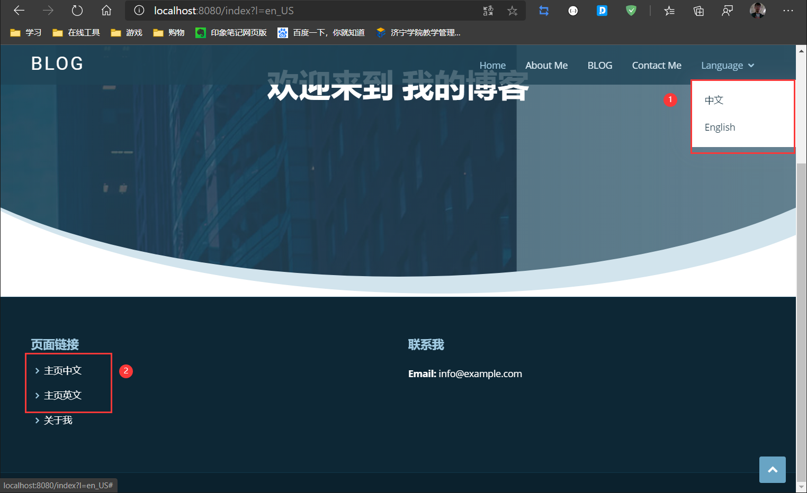

# 实际开发中遇到的问题

**在进行国际化的过程中，发现一个问题：切换语言之后点击另一个语言的链接点不动了，页面没有反应**

经过

实际测试，这是前端bug

图中的1就是bug产生点

进行中英文切换的时候，假如路径相同而参数不同，页面切换不了，比如：`/index?l=en_US`和`/index/zh_CN`

但是路径不同的时候就可以切换，比如：`/index?en_US`和`/index.html?en_US`

但是在2上就没有这个问题，比如`/index?l=en_US`和`/index/zh_CN`都可以生效

-----

