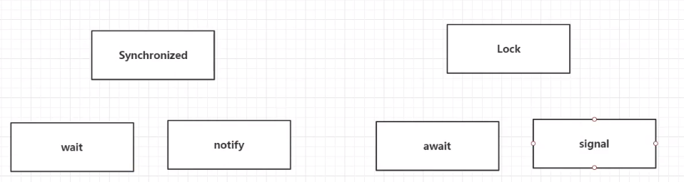

# 多线程基础


## 线程简介

`Java.Thread`


**什么是多任务**

多任务看起来是多个任务都在做，但是其实同一个时间都在做一件事情，只不过切换的非常快


**普通方法和多线程**


**程序，进程，线程**

操作系统中运行的程序都是进程

一个进程中存在多个线程


**Process与Thread**

- 程序是指令和程序的有序集合，其本身没有任何运行的含义，是一个静态的概念
- 进程则是执行程序的一次执行过程，他是一个动态的概念，是系统资源分配的单位
- 一个进程中存在多个线程，至少有一个线程。
- 线程是CPU调度和执行的单位


很多多线程是模拟出来的，真正的多线程是指有多个cpu，如服务器。

> 如果是模拟出来的多线程，在同一个cpu下面，在同一个时间点，cpu只可以执行一个代码，因为切换的很快，所以就有同时执行的错觉

> - 线程就是独立的执行路径
> - 在程序运行时，即使没有自己创建线程，后台也会有多个线程,如主线程, gc线程
> - main()称之为主线程,为系统的入口，用于执行整个程序
> - 在一个进程中，如果开辟了多个线程，线程的运行由调度器安排调度,调度器是与操作系统紧密相关的，先后顺序是不能人为的干预的
> - ==对同一份资源操作时，会存在资源抢夺的问题，需要加入并发控制==
> - ==线程会带来额外的开销==，如cpu调度时间，并发控制开销
> - ==每个线程在自己的工作内存交互，内存控制不当会造成数据不一致==

## 线程实现

### 三种方法

三种：`Thread，Runnable，Callable`

1. 继承`Thread`类，重写`run`方法并开启它
2. 实现`Runnable`接口
3. 实现`Callable`接口（重要）


### Thread

```java
/*
* 1. 继承Thread
* 2. 重写Run
* 3. 调用start
* */
public class ThreadDemo1 extends Thread{
    @Override
    public void run() {
        for (int i = 0; i < 200; i++) {
            System.out.println("thread的run方法执行了...");
        }
    }


    //主线程执行
    public static void main(String[] args) {

        ThreadDemo1 thread = new ThreadDemo1();
        
        thread.start();
        
        for (int i = 0; i < 1000; i++) {
            System.out.println("主线程执行");
        }
        
    }
}
```

> 线程开启之后不一定立刻执行，由CPU调度


### 实现Runnable

```java
/*
* 1. 实现Runnable
* 2. 重写run方法
* 3. 执行线程需要丢入runnable接口的实现类
* 4. 调用start
* */
public class RunnableDemo1 implements Runnable{
    @Override
    public void run() {
        for (int i = 0; i < 200; i++) {
            System.out.println("thread的run方法执行了...");
        }
    }


    //主线程执行
    public static void main(String[] args) {

        RunnableDemo1 runnable = new RunnableDemo1();

        Thread thread = new Thread(runnable);

        thread.start();

        for (int i = 0; i < 1000; i++) {
            System.out.println("main方法执行...");
        }

    }
}
```

> 对比实现Runnable和继承Thread，推荐实现Runnable，因为java是单继承


### 实现Callable

```java
/*
* 1. 实现Callable接口，需要返回值类型
* 2. 重写call方法，需要抛出异常
* 3. 创建目标对象
* 4. 创建执行任务
* 5. 提交执行
* 6. 获取结果
* 7. 关闭服务
* */
public class CallableDemo1 implements Callable<Boolean> {//这里的泛型是Boolean

    private String name;

    public CallableDemo1(String name) {
        this.name = name;
    }

    @Override
    public Boolean call() throws Exception {
        System.out.println("call方法执行："+name);
        return true;//永远返回true
    }


    public static void main(String[] args) {

        //新建了三个callable
        CallableDemo1 callable1 = new CallableDemo1("callable1");
        CallableDemo1 callable2 = new CallableDemo1("callable2");
        CallableDemo1 callable3 = new CallableDemo1("callable3");

        // 创建执行服务，创建了一个线程池，里面有3个线程
        ExecutorService service = Executors.newFixedThreadPool(3);

        //把三个callable提交执行
        Future<Boolean> submit1 = service.submit(callable1);
        Future<Boolean> submit2 = service.submit(callable2);
        Future<Boolean> submit3 = service.submit(callable3);

        //获得结果
        try {
            Boolean result1 = submit1.get();
            Boolean result2 = submit2.get();
            Boolean result3 = submit3.get();
        } catch (InterruptedException e) {
            e.printStackTrace();
        } catch (ExecutionException e) {
            e.printStackTrace();
        }

        //关闭服务
        service.shutdown();
    }

}
```


## 静态代理

我们以结婚为例子，作为静态代理的例子

```java
package com.bean.proxy;

//代理对象和真实对象都要实现一个接口
interface Marry{
    void HappyMarry();
}

//真实对象
class Man implements Marry{

    @Override
    public void HappyMarry() {
        System.out.println("男方结婚");
    }
}

//代理对象，婚庆公司
class WeddingCompany implements Marry{

    //代理的目标，真实对象
    private Marry target;

    public WeddingCompany(Marry target) {
        this.target = target;
    }

    @Override
    public void HappyMarry() {
        before();
        //实现真实对象的代理
        target.HappyMarry();
        after();
    }

    private void before(){
        System.out.println("结婚之前布置现场");
    }

    private void after(){
        System.out.println("结婚之后收钱");
    }
}

public class StaticProxy {
    public static void main(String[] args) {
        Man man = new Man();
        WeddingCompany weddingCompany = new WeddingCompany(man);
        weddingCompany.HappyMarry();
    }

}
```

> 1. 真实对象和代理对象都要实现同一个接口
> 2. 代理对象要代理真实角色
>
> 好处：
>
> 1. 代理对象可以做真实对象做不了的
> 2. 真实对象专注于自己的事情


## Lambda

**为什么要使用lambda**

- 避免匿名内部类定义过多
- 可以让代码觉得简洁
- 去掉了没有意义的代码


**函数式接口**

假如一个接口只包含一个抽象方法，那么就叫做函数式接口


函数式接口可以实现Lambda

---

```java
public class LambdaDemo1{

    public static void main(String[] args) {
        ILike like = ()->System.out.println("输出");
    }
}

interface ILike{
    void show();
}
```

```java
package com.bean.lambda;

public class LambdaDemo1{

    public static void main(String[] args) {
        ILike like = ()->{
            System.out.println("输出");
            System.out.println("另一句输出");
        };
    }
}

interface ILike{
    void show();
}	
```

```java
public class LambdaDemo1{

    public static void main(String[] args) {
        ILike like = i->System.out.println("输出"+i);
    }
}

interface ILike{
    void show(int i);
}
```

```java
public class LambdaDemo1{

    public static void main(String[] args) {
        ILike like = (i,s)->System.out.println("输出"+i+s);
    }
}

interface ILike{
    void show(int i,String s);
}
```


## 线程状态

### 线程的五大状态


### 线程方法

| 方法                           | 说明                                                         |
| ------------------------------ | ------------------------------------------------------------ |
| setPriority(int newPriority)   | 更改线程的优先级                                             |
| static void sleep(long millis) | 在指定的毫秒数内让当前正在执行的线程休眠                     |
| void join()                    | 等待该线程终止                                               |
| static void yield()            | 中断线程，不推荐使用<br/>推荐使用一个`boolean flag`，让线程自己停下 |
| boolean isAlive()              | 测试线程是否存活                                             |


#### 线程停止

```java
public class StopDemo implements Runnable {

    //设置一个标志位
    boolean flag = true;

    @Override
    public void run() {
        int i = 0;
        while (flag){
            System.out.println(i+ "");
            i++;
        }
    }

    public void stop(){
        flag = false;
    }

    public static void main(String[] args) {
        StopDemo stop = new StopDemo();

        new Thread(stop).start();

        for (int i = 0; i < 1000000; i++) {
            if (i==900000){
                stop.stop();
            }
        }

    }
}
```


#### 线程休眠

```java
public class SleepDemo implements Runnable{
    @Override
    public void run() {
        for (int i = 0; i < 10; i++) {
            System.out.println(i+"");
            if (i== 5){
                try {
                    Thread.sleep(3000);//线程休眠
                } catch (InterruptedException e) {
                    e.printStackTrace();
                }
            }
        }
    }

    public static void main(String[] args) {
        SleepDemo sleep = new SleepDemo();
        new Thread(sleep).start();
    }
}
```

> 线程休眠可以模拟网络延时，放大问题

> 每一个对象都有一个锁，但是sleep不会释放锁


#### 线程礼让

>  让当前执行的线程停止，但是不阻塞
>
> 礼让不一定成功，看cpu

```java
public class YiledDemo {
    public static void main(String[] args) {
        MyYield yield = new MyYield();
        //第二个参数：给线程起名字
        new Thread(yield,"A").start();
        new Thread(yield,"B").start();
    }
}

class MyYield implements Runnable{

    @Override
    public void run() {
    	//Thread.currentThread().getName()：获取线程名字
        System.out.println(Thread.currentThread().getName()+"线程开始执行");
        Thread.yield();//礼让
        System.out.println(Thread.currentThread().getName()+"线程停止执行");
    }
}
```


#### 线程强制执行

>  通俗讲就是插队

```java

public class JoinDemo implements Runnable {
    @Override
    public void run() {
        for (int i = 0; i < 10; i++) {
            System.out.println("线程vip插队");
        }
    }

    public static void main(String[] args) {
        JoinDemo join = new JoinDemo();
        Thread thread = new Thread(join);
        thread.start();

        for (int i = 0; i < 50; i++) {
            if (i==20){
                try {
                    thread.join();//等待thread插队
                } catch (InterruptedException e) {
                    e.printStackTrace();
                }
            }
            System.out.println("main"+i);
        }
    }
}
```

> 注意，Join可以保证vip这个线程先走完


#### 线程状态观测

`Thread.State`

- Thread.State.New：尚未启动
- Thread.State.Runnable：在JVM中执行
- Thread.State.Block：阻塞
- Thread.State.Waiting：等待另一个线程执行动作
- Thread.State.Timed_Waiting：等待另一个线程指定动作达到指定的事件
- Thread.State.Terminated：退出的线程

> 死亡的线程不能再启动了，所以线程只能启动一次

```java
Thread.State state = thread.getState();
```


### 线程的优先级

JAVA提供一个线程调度器来监控程序中启动后进入就绪状态的所有线程，线程调度器按照优先级决定应该调用哪个线程来执行


**线程的优先级用数字来显示，范围从1~10**

- Thread.MIN_PRIORITY=1
- Thread.MAX_PRIORITY=10
- Thread.NORM_PRIORITY=5


**以下方式改变线程或者获取线程的优先级**

- getPriority()
- setPriority(int xxx)

> 主线程是默认优先级


```java
//测试线程优先级
public class PriorityDemo1 extends Thread{

    public static void main(String[] args) {
        //主线程是默认优先级
        System.out.println(Thread.currentThread().getName()+"-->"+Thread.currentThread().getPriority());    //main-->5

        MyPriority priority = new MyPriority();

        Thread thread1 = new Thread(priority);
        Thread thread2 = new Thread(priority);
        Thread thread3 = new Thread(priority);
        Thread thread4 = new Thread(priority);
        Thread thread5 = new Thread(priority);
        Thread thread6 = new Thread(priority);
        Thread thread7 = new Thread(priority);


        thread1.start();        //Thread-0-->5

        thread2.setPriority(1);     //Thread-1-->1
        thread2.start();

        thread3.setPriority(4);     //Thread-2-->4
        thread3.start();

        thread4.setPriority(Thread.MAX_PRIORITY);   //Thread-3-->10
        thread4.start();

    /*
        main-->5
        Thread-3-->10
        Thread-0-->5
        Thread-2-->4
        Thread-1-->1
     */

    }

}

class MyPriority implements Runnable {

    @Override
    public void run() {
        System.out.println(Thread.currentThread().getName()+"-->"+Thread.currentThread().getPriority());
    }
}
```

> 注意了，其实并不是优先级高的时候就一定先跑，只不过是提高了先跑的概率
>
> cpu也有可能先调用优先级低的，这种情况叫做性能倒置，不过一般不会出现

> 而且要注意，要先设置优先级，然后在启动


### 守护线程

线程分为==用户线程==和==守护线程==

- 虚拟机必须保证用户线程执行完毕
- 虚拟机不用等待守护线程执行完毕
- 守护线程如：后台记录操作日志，监控内存，垃圾回收等等

```java
public class GuardDemo {
    public static void main(String[] args) {
        Guard guard = new Guard();

        User user = new User();


        Thread userThread = new Thread(user);  //默认都是用户线程

        Thread guardThread = new Thread(guard); //默认都是用户线程
        guardThread.setDaemon(true);    //设置为守护线程，默认都是用户线程

        guardThread.start();
        userThread.start();
    }
}

class Guard implements Runnable{

    @Override
    public void run() {
        while (true){
            System.out.println("守护线程");
        }
    }
}


class User implements Runnable{

    @Override
    public void run() {
        for (int i = 0; i < 10; i++) {
            System.out.println("用户线程");
        }
    }
}
```


## 线程同步

- 并发：多个线程操作同一个资源

  > 比如10000去抢一张票，两个银行同时去取钱
  >
  > 对于并发问题，我们需要用到对象的等待池去排队

- 队列和锁

  > 形成队列之后，我们也要保证同一个资源在同一时间只有一个线程可以访问，这个时候我们就需要用到锁，来保证资源的访问
  >
  > 我们在之前在讲解==sleep==说过，每个对象都拥有一把锁，而sleep不会释放锁

> 也就是说，解决并发问题安全性需要两步：
>
> 1. 多个线程形成队列
> 2. 资源上锁

----

在访问的时候假如锁机制：==synchronized==，当一个线程获得对象的排它锁，独占资源，其余线程必须等待，使用之后释放锁即可

存在以下问题：

- 一个线程持有锁会导致其他所有需要此锁的线程挂起，效率变低了
- 多线程竞争下，加锁和释放锁会导致比较多的上下文切换和调度延时，引起性能问题
- 如果一个优先级高的线程等待一个线程优先级低的线程释放锁，那么会导致优先级倒置，引起性能问题


### 不安全例子


- 买票

```java
//线程不安全
public class UnSafeDemo {

    public static void main(String[] args) {
        BuyTicket buyTicket = new BuyTicket();

        new Thread(buyTicket,"A").start();
        new Thread(buyTicket,"B").start();
        new Thread(buyTicket,"C").start();
    }
}

class BuyTicket implements Runnable{

    private int ticket = 10;//10张票
    private boolean flag = true;
    @Override
    public void run() {
        //买票
        while (flag){
            buy();
        }
    }

    private void buy(){
        if (ticket<=0){
            flag =false;
            return;
        }

        try {
            Thread.sleep(100);//模拟延时，增大问题发生率
        } catch (InterruptedException e) {
            e.printStackTrace();
        }
        //买票
        System.out.println(Thread.currentThread().getName()+"-->"+ticket--);
    }
}
```

> 每个线程都有自己的工作内存开销，内存控制不当会导致数据不一致
>
> 在这个例子里，有可能会导致抢到了同一张票的情况，甚至可能会有抢到了负数的情况


- 银行取钱

```java
//两个人去银行取钱
public class UnSafeDemo2 {
    public static void main(String[] args) {
        Account account = new Account(100,"基金");

        Drawing man = new Drawing(account,50,"男方");
        Drawing women = new Drawing(account,100,"女方");

        man.start();
        women.start();
        /*
        基金余额为：0
        基金余额为：-50
        女方手里的钱：100
        男方手里的钱：50
         */
    }
}

//账户
class Account{
    int money;  //余额
    String name;//卡号

    public Account(int money, String name) {
        this.money = money;
        this.name = name;
    }
}

//银行，模拟取款
class Drawing extends Thread{
    Account account;//账户
    int drawingMoney;//取了多少钱
    int nowMoney;   //现在手里有多少钱

    public Drawing(Account account,int drawingMoney,String name){
        super(name);//给Thread起名字
        this.account = account;
        this.drawingMoney = drawingMoney;
    }

    @Override
    public void run() {
        //判断有钱么
        if (account.money-drawingMoney<0){
            System.out.println(Thread.currentThread().getName()+"：钱不够");
            return;
        }

        //模拟延时
        try {
            Thread.sleep(1000);
        } catch (InterruptedException e) {
            e.printStackTrace();
        }

        //卡内余额
        account.money = account.money-drawingMoney;
        //手中的钱
        nowMoney = nowMoney+drawingMoney;

        System.out.println(account.name+"余额为："+account.money);
        System.out.println(this.getName()+"手里的钱："+nowMoney);
    }
}
```


- 集合

```java
//线程不安全的集合
public class UnSafeList {
    public static void main(String[] args) {
        List<String> lists = new ArrayList<>();

        for (int i = 0; i < 10000; i++) {
            new Thread(()->{
               lists.add(Thread.currentThread().getName());
            }).start();
        }
        try {
            Thread.sleep(3000);
        } catch (InterruptedException e) {
            e.printStackTrace();
        }

        System.out.println(lists.size());   //9997
    }
}
```

> 集合是不安全的
>
> 集合不安全的原因在于：线程的内存都是各自的，我们会发现每一个线程都有自己的内存，但是线程操作的都是一个资源
>
> 对于每一个线程来说，所看到的资源是全部的，但是程序不知道还会有其他线程来操作资源
>
> 所以就会出现这种问题
>
> 归根结底的问题就是：==线程在自己的工作内存进行交互==


### 同步方法和同步代码块

由于我们可以通过`private`关键字来保证数据对象只能被方法访问，所以我们只需要对方法提出一套机制，这套机制就是==synchronized==关键字，它包括两种用法：

**同步方法**

类似：`public synchronized void method(int args){}`，只需要在方法上加上==synchronized==即可

>  synchronized方法访问控制对`对象`的访问
> ==每一个对象对应一把锁==
>
> 每一个==synchronized==方法都必须获得该方法的对象的锁才可以执行，否则线程就会被阻塞
>
> 方法一但执行，就独占该锁，直到方法返回才释放锁，后面被阻塞的线程才可以获得这个锁，继续执行

> 缺陷：若将一个大的方法声明为==synchronized==，将会影响效率

> 缺陷：
>
> 我们知道，只读代码其实并不需要加锁，但是修改代码需要加锁
>
> 如果我们使用同步方法，那么只读代码也会被加上锁，影响效率


我们对上面不安全的例子进行修改，比如修改买票的例子：

```java
public class UnSafeDemo {

    public static void main(String[] args) {
        BuyTicket buyTicket = new BuyTicket();

        new Thread(buyTicket,"A").start();
        new Thread(buyTicket,"B").start();
        new Thread(buyTicket,"C").start();
    }
}

class BuyTicket implements Runnable{

    private int ticket = 10;
    private boolean flag = true;
    @Override
    public void run() {
        while (flag){
            buy();
        }
    }

    private synchronized void buy(){    //我们只需要在修改的方法上加上同步标签，将这个方法改为同步方法
        if (ticket<=0){
            flag =false;
            return;
        }

        try {
            Thread.sleep(100);
        } catch (InterruptedException e) {
            e.printStackTrace();
        }

        System.out.println(Thread.currentThread().getName()+"-->"+ticket--);
    }
}
```

> 加上了同步代码块之后，实现了
>
> 1. 排队
> 2. 锁
>
> 这样实现了同步代码块的锁定
>
> 但是我们注意，这个锁的意思是锁定了一个对象，因为每一个对象都有一把锁
>
> 我们加上了同步标签锁定的是这一个对象，但是假如拥有了多个对象，这个同步方法就没用了
>
> 看下面的例子：

```java
public class UnSafeDemo2 {
    public static void main(String[] args) {
        Account account = new Account(100,"基金");

        Drawing man = new Drawing(account,50,"男方");
        Drawing women = new Drawing(account,100,"女方");

        man.start();
        women.start();
    }
}


class Account{
    int money;  
    String name;

    public Account(int money, String name) {
        this.money = money;
        this.name = name;
    }
}


class Drawing extends Thread{
    Account account;
    int drawingMoney;
    int nowMoney;   

    public Drawing(Account account,int drawingMoney,String name){
        super(name);
        this.account = account;
        this.drawingMoney = drawingMoney;
    }

    @Override
    public synchronized void run() {

        if (account.money-drawingMoney<0){
            System.out.println(Thread.currentThread().getName()+"：钱不够");
            return;
        }


        try {
            Thread.sleep(1000);
        } catch (InterruptedException e) {
            e.printStackTrace();
        }


        account.money = account.money-drawingMoney;

        nowMoney = nowMoney+drawingMoney;

        System.out.println(account.name+"余额为："+account.money);
        System.out.println(this.getName()+"手里的钱："+nowMoney);
    }
}
```

> 如果你去运行这个代码，你会发现：
>
> 这个同步方法好像没有用

> 分析：
>
> 我们锁定的是Run方法，而run方法对应的对象是Drawing对象，所以我们操作的锁其实是==Drawing==的锁
>
> 但是我们增删改的对象并不是==Drawing==对象，而是Account对象
>
> 所以同步方法没用了


**同步代码块**

对于上面的问题，我们可以使用同步代码块来进行实现同步

同步代码块：`synchronized(obj){}`

>  其中obj称为同步监视器
>
> - obj可以为任何对象，但是推荐使用==共享资源==作为同步监视器
> - 同步方法中无需指定同步监视器，因为同步方法的同步监视器就是==this==这个对象本身，或者是==class==

- 同步监视器的执行过程
  1. 第一个线程访问，锁定同步监视器，执行其中代码
  2. 第二个线程访问，发现同步监视器被锁定，无法访问
  3. 第一个线程访问完毕，解锁同步监视器
  4. 第二个线程访问，锁定同步监视器，执行其中代码


例子，还是上面那个银行取钱的案例

```java
public class UnSafeDemo2 {
    public static void main(String[] args) {
        Account account = new Account(100,"基金");

        Drawing man = new Drawing(account,50,"男方");
        Drawing women = new Drawing(account,100,"女方");

        man.start();
        women.start();
    }
}


class Account{
    int money;
    String name;

    public Account(int money, String name) {
        this.money = money;
        this.name = name;
    }
}


class Drawing extends Thread{
    Account account;
    int drawingMoney;
    int nowMoney;

    public Drawing(Account account,int drawingMoney,String name){
        super(name);
        this.account = account;
        this.drawingMoney = drawingMoney;
    }

    @Override
    public void run() {

       synchronized (account){
           if (account.money-drawingMoney<0){
               System.out.println(Thread.currentThread().getName()+"：钱不够");
               return;
           }


           try {
               Thread.sleep(1000);
           } catch (InterruptedException e) {
               e.printStackTrace();
           }


           account.money = account.money-drawingMoney;

           nowMoney = nowMoney+drawingMoney;

           System.out.println(account.name+"余额为："+account.money);
           System.out.println(this.getName()+"手里的钱："+nowMoney);
       }
    }
}
```

> 成功了
>
> 我们锁定的是==公共资源==，这里的公共资源其实就是account
>
> 或者可以这样认为：我们进行增删改的对象是account，但是我们执行的方法是run，run对应的对象不是增删改所对应的对象，所以使用同步代码块，锁住公共资源

---

### CopyOnWriteArrayList


首先看下面一段代码：

```java
import java.util.concurrent.CopyOnWriteArrayList;

public class TestJUC {

    public static void main(String[] args) {
        CopyOnWriteArrayList<String> list = new CopyOnWriteArrayList<String>();

        for (int i = 0; i < 10000; i++) {
            new Thread(()->{
               list.add(Thread.currentThread().getName());
            }).start();
        }
        try {
            Thread.sleep(3000);
        } catch (InterruptedException e) {
            e.printStackTrace();
        }
        System.out.println(list.size());
    }
}
```

> 运行完成之后发现：这个是线程安全的


点进源码看一下：


----

### 死锁


线程只有获取完整的资源才可以运行，但是现在多个线程平分了这些共享资源

线程占有着自己的资源，并且都等待着其他的线程释放另外的资源，因为资源不完全，这些线程全部都不能执行

这种情况叫做==死锁==


多个线程互相抱着对方需要的资源，然后形成僵持


某一个同步块同时拥有==两个以上对象的锁==时，就可能发生死锁现象


```java
public class DeadLock {
    public static void main(String[] args) {
        Makeup girl1 = new Makeup(0,"grilA");
        Makeup girl2 = new Makeup(1,"girlB");


        girl1.start();
        girl2.start();
    }

}


//口红
class Lipstick{

}

//镜子
class Mirror{

}

class Makeup extends Thread{

    //使用static来保证只有一份
    static Lipstick lipstick = new Lipstick();
    static Mirror mirror = new Mirror();

    int choice;//选择
    String girlName;

    Makeup(int choice,String girlName){
        this.choice = choice;
        this.girlName =girlName;
    }


    @Override
    public void run() {
        //化妆
        try {
            makeup();
        } catch (InterruptedException e) {
            e.printStackTrace();
        }
    }

    //化妆需要互相持有对方的锁，就是需要拿到对方的资源
    private void makeup() throws InterruptedException {
        if (choice==0){
            synchronized (lipstick){//获得口红的锁
                System.out.println(girlName+"获得口红的锁");
                Thread.sleep(1000);
                synchronized (mirror){//1秒钟之后想要获得镜子的锁
                    System.out.println(girlName+"获得镜子的锁");
                }
            }
        }else {
            synchronized (mirror){//获得镜子的锁
                System.out.println(girlName+"获得镜子的锁");
                Thread.sleep(2000);
                synchronized (lipstick){//2秒钟之后想要获得口红的锁
                    System.out.println(girlName+"获得口红的锁");
                }
            }
        }
    }
}
```

> 这样的话，程序卡住了，因为这样会导致死锁
>
> 这是因为：
>
> - A和B都想要对方的锁
> - A和B都没有释放锁的途径
>
> 所以会产生死锁

> 我们知道，A和B想要对方的锁没有关系，但是==一定要让A和B有释放锁的途径==，否则只是期待资源而不释放资源，早晚会产生死锁的现象
>
> 我们这么改：

```java
public class DeadLock {
    public static void main(String[] args) {
        Makeup girl1 = new Makeup(0,"grilA");
        Makeup girl2 = new Makeup(1,"girlB");


        girl1.start();
        girl2.start();
    }

}


//口红
class Lipstick{

}

//镜子
class Mirror{

}

class Makeup extends Thread{

    //使用static来保证只有一份
    static Lipstick lipstick = new Lipstick();
    static Mirror mirror = new Mirror();

    int choice;//选择
    String girlName;

    Makeup(int choice,String girlName){
        this.choice = choice;
        this.girlName =girlName;
    }


    @Override
    public void run() {
        //化妆
        try {
            makeup();
        } catch (InterruptedException e) {
            e.printStackTrace();
        }
    }

    //化妆需要互相持有对方的锁，就是需要拿到对方的资源
    private void makeup() throws InterruptedException {
        if (choice==0){
            synchronized (lipstick){//获得口红的锁
                System.out.println(girlName+"获得口红的锁");
                Thread.sleep(1000);
            }
            synchronized (mirror){//1秒钟之后想要获得镜子的锁
                System.out.println(girlName+"获得镜子的锁");
            }
        }else {
            synchronized (mirror){//获得镜子的锁
                System.out.println(girlName+"获得镜子的锁");
                Thread.sleep(2000);
            }
            synchronized (lipstick){//2秒钟之后想要获得口红的锁
                System.out.println(girlName+"获得口红的锁");
            }
        }
    }
}
```

> 这个办法就是把里面的同步代码块放到了外面，这样虽然A和B还是期望对方的锁，但是A和B都有释放锁的途径
>
> 得不到锁，在代码执行完之后还是会释放锁


产生死锁的四个必要条件：

- 互斥条件：一个资源每次只能被一个进程使用
- 请求与保持：一个进程因为请求资源而被阻塞时，对已经获得的资源保持不放
- 不剥夺条件：进程已获得的资源，在未使用完之前，不能强行剥夺
- 循环等待条件：若干进程形成一种头尾相接的循环等待资源关系

> 这四个条件只要剥夺一条，就会破开死锁的局面
>
> 而往往比较容易破开的条件就是请求与保持条件


### Lock

从`JDK5.0`开始，JAVA提供了一个更加强大的线程同步机制：通过显式定义同步锁对象来实现同步。Lock对象充当同步锁


==java.util.concurrent.locks.Lock==`接口`是控制多个线程对共享资源访问的工具

锁提供了对共享资源的独占访问，每次只能有一个线程对Lock对象加锁，线程开始访问共享资源之前应该先获得Lock对象


==ReentrantLock==类实现了Lock（==可重用锁==），它拥有与`synchronized`相同的并发性和内存语义，在实现线程安全的控制中，比较常用的是==ReentrantLock==，可以显示加锁，释放锁


```java
public class LockDemo {
    public static void main(String[] args) {
        TestLock testLock = new TestLock();

        new Thread(testLock).start();
        new Thread(testLock).start();
        new Thread(testLock).start();
    }
}


class TestLock implements Runnable{

    //定义Lock锁
    private final ReentrantLock lock = new ReentrantLock();

    int ticket = 10;

    @Override
    public void run() {
        while (true){
            lock.lock();//加锁

            try {
                if (ticket>0){
                    try {
                        Thread.sleep(1000);
                    } catch (InterruptedException e) {
                        e.printStackTrace();
                    }
                    System.out.println(ticket--);
                }else {
                    break;
                }
            } finally {
                lock.unlock();
            }
        }
    }
}
```


**Synchronized与Lock对比**

**Lock**

1. 是显示锁（手动开启和关闭锁，不要忘记关闭）

2. 只有代码块锁
3. JVM将花费较少的时间来调度线程，性能更好，并且有更好的扩展性（子类更多）


**Synchronized**

1. 是隐式锁，出了作用域自动释放

2. 有代码块锁和方法锁


优先级：Lock>同步代码块>同步方法块

----

## 线程通信


### 生产者和消费者模式

> 生产者和消费者并不是一个模式，而是一个问题，不是23中设计模式之一


生产者是一个线程

消费者是一个线程


生产者生产产品放到仓库，消费者从仓库中取走消费


仓库中只可以存放一个产品

如果仓库中没有产品，则生产者将产品放入仓库，直到仓库中的产品被消费者取走为止才可以继续生产

如果仓库中存在产品，消费者可以从仓库取走产品，如果仓库中没有产品则一直等待


> 这是一个线程同步问题
>
> 生产者和消费者共享同一个资源，消费者和生产者共享同一个资源，而且这两者之间相互依赖，互为条件


在生产者和消费者问题中，仅有`synchronized`是不够的

- `synchronized`可以阻止并发更新同一个资源，实现同步
- 但是不可以用来实现不同线程之间的通信


JAVA提供了几个方法来解决线程中的通信问题

| 方法名               | 作用                                                         |
| -------------------- | ------------------------------------------------------------ |
| `wait()`             | 表示线程会一直等待，直到其他线程通知，`sleep`不会释放锁，但是`wait()`会释放锁 |
| `wait(long timeout)` | 指定等待的毫秒数                                             |
| `notify()`           | 唤醒一个处于等待状态的线程                                   |
| `notifyAll()`        | 唤醒同一个对象上所有调用`wait()`方法的线程，优先级高的线程优先调度 |

> 注意：都是使用==Object==类的方法，都==只能在同步方法或者同步代码块中使用==
>
> 否则会抛出异常`IlllegalMonitorStateException`


解决方式

1. 做一个缓冲区，生产者将生产好的数据放入缓冲区，消费者从缓冲区拿取数据（管程法）
2. 做一个标志`flag`（信号灯法）

----

### 管程法

```java
//生产者，消费者，产品，缓冲区，
public class Tube {
    public static void main(String[] args) {

        Synchro synchro = new Synchro();

        new Productor(synchro).start();
        new Consumer(synchro).start();
    }
}

//生产者
class Productor extends Thread{

    Synchro container = new Synchro();

    Productor(Synchro container){
        this.container = container;
    }

    @Override
    public void run() {
        //生产
        for (int i = 0; i < 20; i++) {
            container.push(new Chiken(i));
            System.out.println("生产了第"+i+"只鸡");
        }
    }
}

//消费者
class Consumer extends Thread{

    Synchro container = new Synchro();

    Consumer(Synchro container){
        this.container = container;
    }

    @Override
    public void run() {
        for (int i = 0; i < 20; i++) {
            container.pop();
            System.out.println("消费了第"+i+"只鸡");
        }
    }
}

//产品
class Chiken{
    int id;//产品编号

    public Chiken(int id) {
        this.id = id;
    }
}


//缓冲区
class Synchro{
    //容器大小
    Chiken[] chikens = new Chiken[10];

    int count = 0;//容器计数器

    //生产者放入产品
    public synchronized void push(Chiken chiken){
        //假如容器满了，那么等待消费者消费
        if (count==chikens.length){
            try {
                this.wait();
            } catch (InterruptedException e) {
                e.printStackTrace();
            }
        }
        //假如容器没有满，那么就需要丢入产品
        chikens[count] = chiken;
        count++;
        //通知消费者消费
        this.notifyAll();
    }


    //消费者消费产品
    public synchronized Chiken pop(){

        //假如没有鸡，等待生产者生产
        if (count==0){
            try {
                this.wait();
            } catch (InterruptedException e) {
                e.printStackTrace();
            }
        }

        //假如可以消费
        count--;
        Chiken chiken = chikens[count];

        //通知生产者生产
        this.notifyAll();
        
        return chiken;
    }
}
```

> 生产者只管生产
>
> 消费者只管消费
>
> 而缓冲区内协调生产和消费

### 信号灯法

```java
//信号灯法一般使用标志位
public class Flag {
    public static void main(String[] args) {
        TV tv = new TV();
        new Player(tv).start();
        new Watcher(tv).start();
    }
}


//生产者
class Player extends Thread{
    TV tv;

    public Player(TV tv){
        this.tv = tv;
    }

    @Override
    public void run() {
        for (int i = 0; i < 20; i++) {
            if (i%2==0){
                this.tv.play("节目");
            }else {
                this.tv.play("广告");
            }
        }
    }
}

//消费者
class Watcher extends Thread{
    TV tv;

    public Watcher(TV tv){
        this.tv = tv;
    }

    @Override
    public void run() {
        for (int i = 0; i < 20; i++) {
            tv.watch();//观看
        }
    }
}

//产品
class TV{
    //演员表演，观众等待
    //观众观看，演员等待

    //表演的节目
    String voice;

    //标志位
    boolean flag = true;

    //表演
    public synchronized  void play(String voice){
        if (!flag){
            try {
                this.wait();
            } catch (InterruptedException e) {
                e.printStackTrace();
            }
        }
        System.out.println("演员表演了..."+voice);
        //通知观众观看
        this.notifyAll();//通知唤醒
        this.voice = voice;
        this.flag = !this.flag;
    }

    //观看
    public synchronized void watch(){
        if (flag){
            try {
                this.wait();
            } catch (InterruptedException e) {
                e.printStackTrace();
            }
        }
        System.out.println("观看了："+voice);

        this.notifyAll();//唤醒演员
        this.flag = !this.flag;
    }
}
```

> 演员只管表演
>
> 观众只管看
>
> TV作为标志位来协调

----

## 线程池


我们之前经常创建和销毁线程，对性能影响很大


假如我们提前创建好多个线程，放入线程池中，用的时候直接用，用完之后放回线程池

好处：

- 减少了创建新线程的事件，提高响应速度
- 重复利用线程池中的线程，降低资源消耗
- 便于线程管理
  - `corePoolSize`：核心池的大小
  - `maximumPoolSize`：最大线程数
  - `keepAliveTime`：线程没有任务时最多保持多长时间会终止


JDK5提供了真正关于线程池相关的API：`ExecutorService`，`Executors`

- `ExecutorService`：真正的线程池接口，常见子类`ThreadPoolExecutor`
  - `void execute(Runnable command)`：执行任务/命令，没有返回值，一般用来执行`Runnable`
  - `<T>Future<T> submit(Callable<T> task)`：执行任务，有返回值，一般用来执行`Callable`
  - `void shutdown()`：关闭线程池


`Executors`：工具类，线程池的工厂类，用于创建并返回不同类型的线程池

----

```java
//测试线程池
public class Pool {
    public static void main(String[] args) {
        //创建服务，创建线程池，10个线程
        ExecutorService service = Executors.newFixedThreadPool(10);

        //放入Runnable里面的实现类
        service.execute(new MyThread());
        service.execute(new MyThread());
        service.execute(new MyThread());
        service.execute(new MyThread());

        //关闭链接
        service.shutdown();
    }

}

class MyThread implements Runnable{

    @Override
    public void run() {
        System.out.println(Thread.currentThread().getName());
    }
}
```

----

-----

# JUC

## 环境准备

1. 打开IDEA，新建一个maven项目

2. 查看

   > 
   >
   > 
   >
   > 


## 什么是JUC

`java.util.concurrent`简称JUC，也就是下面的三个包


----

## 为什么要学习JUC

1. ==JUC面试高频问，所以一定要掌握==

2. 之前使用`Thread`，非常普通的线程类

   `Runnable`，没有返回类型，效率相比于Callable相对较低

3. 之前也学过Lock锁，但是没有深入的系统地学习JUC


==面试的时候：单例模式，排序算法，生产者和消费者，死锁==


----

## 线程和进程

一句话说明线程和进程?

1个进程至少包含1个线程


JAVA默认有几个线程？

2个：Main+GC垃圾回收


**JAVA真的可以开启线程吗?**

JAVA不可以开启线程，如果我们调用底层，我们会发现：

```java
public synchronized void start() {
        /**
         * This method is not invoked for the main method thread or "system"
         * group threads created/set up by the VM. Any new functionality added
         * to this method in the future may have to also be added to the VM.
         *
         * A zero status value corresponds to state "NEW".
         */
        if (threadStatus != 0)
            throw new IllegalThreadStateException();

        /* Notify the group that this thread is about to be started
         * so that it can be added to the group's list of threads
         * and the group's unstarted count can be decremented. */
        group.add(this);

        boolean started = false;
        try {
            start0();
            started = true;
        } finally {
            try {
                if (!started) {
                    group.threadStartFailed(this);
                }
            } catch (Throwable ignore) {
                /* do nothing. If start0 threw a Throwable then
                  it will be passed up the call stack */
            }
        }
    }
```

> 这个start最后调用了一个很诡异的方法`start0()`，这个其实是调用的本地方法，所以JAVA是没有资格直接操作硬件的


**并发和并行**

- 并发：多个线程操作一个资源
  - CPU一核，但是要模拟出来多线程的操作，只能通过快速的交替来模拟这样的效果
  - 一种假象
- 并行：多个人一起行走
  - 多核CPU下面，多个线程可以同时执行

> 并发编程的本质：==充分利用CPU的资源==


```java
public class JUC {
    public static void main(String[] args) {
        //获取cpu的核数
        System.out.println(Runtime.getRuntime().availableProcessors());
    }
}
```

> 获得CPU的核数


**线程有几个状态?**

```java
public enum State {

        NEW,		//新生

        RUNNABLE,	//运行

        BLOCKED,	//阻塞

        WAITING,	//等待，永远等待

        TIMED_WAITING,//超时等待，过时不候

        TERMINATED;	//终止
    }
```

> 6个


**wait和sleep的区别？**

1. 来自不同的类
   - `wait`来自Object
   - `sleep`来自Thread
2. 锁的释放
   - `wait`会释放锁
   - `sleep`不会释放锁
3. 使用范围
   - `wait`：必须要在同步代码块中
   - `sleep`：可以在任何地方使用
4. 是否需要捕获异常
   - `wait`不用(中断异常不算，只要是线程都会有中断异常`InterruptedException`)
   - `sleep`需要捕获异常


## Lock锁

> 我们先聊传统：`synchronized`

```java
public class SaleTicketDemo {
    public static void main(String[] args) {
        new Thread(new MyThread()).start();
    }
}

class MyThread implements Runnable{

    @Override
    public void run() {

    }
}
```

> 以前我们就是这么用的，但是今天开始要推翻


真正的多线程开发中

==线程就是一个单独的资源类，没有任何附属的操作==

```java
public class SaleTicketDemo {
    public static void main(String[] args) {
        //多线程

        //并发：多个线程操作同一个资源类
        Ticket ticket = new Ticket();

        new Thread(()->{
            for (int i = 0; i < 40; i++) {
                ticket.sale();
            }
        },"A").start();        
        
        new Thread(()->{
            for (int i = 0; i < 40; i++) {
                ticket.sale();
            }
        },"B").start();        
        
        new Thread(()->{
            for (int i = 0; i < 40; i++) {
                ticket.sale();
            }
        },"C").start();

    }
}

//这就是资源类，对这个类进行操作叫做真正的OOP编程
//假如在这里集成一个Runnable，这就不叫面向对象了，就变成了一个线程类了，而且耦合性高
class Ticket{
    //属性和方法
    //属性
    private int number = 50;
    //方法，使用同步方法：synchronized
    public synchronized void sale(){
        if (number>0){
            System.out.println(Thread.currentThread().getName() + "-->" + (number--) + "，剩余" + number);
        }
    }
}
```

> 上面是传统方式简单回顾


**下面要用JUC**

`java.util.concurrent.locks`

我们看到有三个接口，其中有一个Lock接口


- `Interface	Lock`，三个实现类
  - `ReentrantLock`：可重用锁（常用）
  - `ReadLock`：读锁
  - `WriteLock`：写锁


我们查看`ReentrantLock`，我们发现这样一段源码

```java
    public ReentrantLock() {
        sync = new NonfairSync();	//new一个新的非公平锁
    }

    public ReentrantLock(boolean fair) {	//ReentrantLock的构造参数
        sync = fair ? new FairSync() : new NonfairSync();
    }
//假如为真，则为公平锁，否则为非公平锁
```

**公平锁和非公平锁**

- 公平锁：十分公平，必须先来后到
- 非公平锁：十分不公平，可以插队（默认）

> 默认为非公平锁，这是因为：
>
> 假如有两个线程，A执行3秒，B执行3小时，B先来的
>
> 假如为公平锁，那么A就要等3个小时


我们使用一下Lock锁，来举一个例子：

```java
import java.util.concurrent.locks.Lock;
import java.util.concurrent.locks.ReentrantLock;

public class SaleTicketDemo2 {
    public static void main(String[] args) {

        Ticket ticket = new Ticket();

        new Thread(()->{ for (int i = 0; i < 40; i++) ticket.sale(); },"A").start();
        
        new Thread(()->{ for (int i = 0; i < 40; i++) ticket.sale(); },"B").start();
        
        new Thread(()->{ for (int i = 0; i < 40; i++) ticket.sale(); },"C").start();

    }
}

//Lock
class Ticket2{

    private int number = 50;

    Lock lock = new ReentrantLock();

    public void sale(){
        lock.lock();

        try {
            if (number>0){
                System.out.println(Thread.currentThread().getName() + "-->" + (number--) + "，剩余" + number);
            }
        } finally {
            lock.unlock();//在finally里面解锁
        }
    }
}
```


**Lock和Synchronized的区别**

1. `Synchronized`是内置的JAVA关键字，而`Lock`是一个Java类

2. `Synchronized`无法判断获取锁的状态，`Lock`可以判断是否获取到了锁

3. `Synchronized`会自动释放锁，而`Lock`必须手动释放。不释放会导致**死锁**

4. `Synchronized`线程1（获得锁），线程2（死死地等待）

   `Lock`就不一定会等待下去：`lock.tryLock()`尝试获取锁，获取不到就算了

5. `Synchronized`可重入锁，不可以中断的，非公平锁

   `Lock`，可重入锁，可以判断锁是否中断，可以自己设置为公平锁或者非公平锁

6. `Synchronized`适合锁少量的代码同步问题，`Lock`适合大量的同步代码


## 生产者和消费者问题

> 这是个大有门道的问题

### 老版方式

#### 线程同步

老版方式：`Synchronized`

```java
/*
线程之间的通信问题：生产者和消费者问题
线程交替执行      A       B   操作同一个变量，num
A num+1
B num-1
 */
public class A {
    public static void main(String[] args) {
        Data data = new Data();

        new Thread(()->{
            for (int i = 0; i < 10; i++) {
                try {
                    data.increment();
                } catch (InterruptedException e) {
                    e.printStackTrace();
                }
            }
        },"A").start();

        new Thread(()->{
            for (int i = 0; i < 10; i++) {
                try {
                    data.decrement();
                } catch (InterruptedException e) {
                    e.printStackTrace();
                }
            }
        },"B").start();
        
/*A=>1    B=>0    A=>1    B=>0    A=>1    B=>0
A=>1    B=>0    A=>1    B=>0    A=>1    B=>0
A=>1    B=>0    A=>1    B=>0    A=>1    B=>0
A=>1    B=>0*/

    }
}

//等待，业务，通知：判断是否要进行等待，如果不等待就干活，干完活就通知另一方
class Data{//数字，资源类

    private int number = 0;

    //+1，对应生产者
    public synchronized void increment() throws InterruptedException {
        if (number!=0){
            //等待
            this.wait();
        }
        number++;
        System.out.println(Thread.currentThread().getName() + "=>" + number);
        //通知其他线程
        this.notifyAll();
    }

    //-1，对应消费者
    public synchronized void decrement() throws InterruptedException {
        if (number==0){
            //等待
            this.wait();
        }
        number--;
        System.out.println(Thread.currentThread().getName() + "=>" + number);
        //通知其他线程
        this.notifyAll();
    }
}
```


---

#### 虚假唤醒

**问题来了：现在只有两个线程，但是我们加到了四个线程，甚至八个线程，结果呢？**

> 我们让A和C加，B和D减

```java
public class A {
    public static void main(String[] args) {
        Data data = new Data();

        new Thread(()->{
            for (int i = 0; i < 5; i++) {
                try {
                    data.increment();
                } catch (InterruptedException e) {
                    e.printStackTrace();
                }
            }
        },"A").start();

        new Thread(()->{
            for (int i = 0; i < 5; i++) {
                try {
                    data.decrement();
                } catch (InterruptedException e) {
                    e.printStackTrace();
                }
            }
        },"B").start();

        new Thread(()->{
            for (int i = 0; i < 5; i++) {
                try {
                    data.increment();
                } catch (InterruptedException e) {
                    e.printStackTrace();
                }
            }
        },"C").start();

        new Thread(()->{
            for (int i = 0; i < 5; i++) {
                try {
                    data.decrement();
                } catch (InterruptedException e) {
                    e.printStackTrace();
                }
            }
        },"D").start();

        /*
            A=>1    B=>0    C=>1    A=>2    C=>3
            B=>2    B=>1    B=>0    C=>1    A=>2
            C=>3    B=>2    C=>3    A=>4    D=>3
            D=>2    D=>1    D=>0    A=>1    D=>0
         */

    }
}

//等待，业务，通知：判断是否要进行等待，如果不等待就干活，干完活就通知另一方
class Data{//数字，资源类

    private int number = 0;

    //+1，对应生产者
    public synchronized void increment() throws InterruptedException {
        if (number!=0){
            //等待
            this.wait();
        }
        number++;
        System.out.println(Thread.currentThread().getName() + "=>" + number);
        //通知其他线程
        this.notifyAll();
    }

    //-1，对应消费者
    public synchronized void decrement() throws InterruptedException {
        if (number==0){
            //等待
            this.wait();
        }
        number--;
        System.out.println(Thread.currentThread().getName() + "=>" + number);
        //通知其他线程
        this.notifyAll();
    }
}
```

> 结果来了，同步凉了


那么为什么会出现这种问题呢？因为用了if判断，有的时候就会出现这种问题，这种问题叫做虚假唤醒

查看jdk文档：`java.lang-->Object-->wait/notify`


> 注意点，这里要防止虚假唤醒
>
> 虚假唤醒就是当一个条件满足时，很多线程都被唤醒了，但是只有部分是有用的唤醒，其余的都是无用功

> 解决方案：条件判断的时候，把==if==改为==while==

```java
public class A {
    public static void main(String[] args) {
        Data data = new Data();

        new Thread(()->{
            for (int i = 0; i < 5; i++) {
                try {
                    data.increment();
                } catch (InterruptedException e) {
                    e.printStackTrace();
                }
            }
        },"A").start();

        new Thread(()->{
            for (int i = 0; i < 5; i++) {
                try {
                    data.decrement();
                } catch (InterruptedException e) {
                    e.printStackTrace();
                }
            }
        },"B").start();

        new Thread(()->{
            for (int i = 0; i < 5; i++) {
                try {
                    data.increment();
                } catch (InterruptedException e) {
                    e.printStackTrace();
                }
            }
        },"C").start();

        new Thread(()->{
            for (int i = 0; i < 5; i++) {
                try {
                    data.decrement();
                } catch (InterruptedException e) {
                    e.printStackTrace();
                }
            }
        },"D").start();


    }
}


class Data{

    private int number = 0;

    public synchronized void increment() throws InterruptedException {
        while (number!=0){  //这里为了防止虚假唤醒，改为使用while

            this.wait();
        }
        number++;
        System.out.println(Thread.currentThread().getName() + "=>" + number);

        this.notifyAll();
    }


    public synchronized void decrement() throws InterruptedException {
        while (number==0){  //这里为了防止虚假唤醒，改为使用while

            this.wait();
        }
        number--;
        System.out.println(Thread.currentThread().getName() + "=>" + number);

        this.notifyAll();
    }
}
```

-----

### JUC方式


####   新老三剑客对应


传统三剑客：`Synchronized，wait，notify`

其中`synchronized`被`Lock`替换了，那么根据逻辑来讲，其余两个也是有替换的


`java.util.concurrent.locks`

- Condition
- Lock
- ReadWriteLock 


那么`Condition`就是配套的三剑客之一，对应老版的`wait`和`notify`


从官方文档我们可以看出来，Condition替代了对象的监视器的方法，原来我们使用wait和notify，现在就要使用Condition


那么对应关系来了：




代码实现一下：

```java
public class B {
    public static void main(String[] args) {
        Data2 data = new Data2();

        new Thread(()->{
            for (int i = 0; i < 5; i++) {
                try {
                    data.increment();
                } catch (InterruptedException e) {
                    e.printStackTrace();
                }
            }
        },"A").start();

        new Thread(()->{
            for (int i = 0; i < 5; i++) {
                try {
                    data.decrement();
                } catch (InterruptedException e) {
                    e.printStackTrace();
                }
            }
        },"B").start();

        new Thread(()->{
            for (int i = 0; i < 5; i++) {
                try {
                    data.increment();
                } catch (InterruptedException e) {
                    e.printStackTrace();
                }
            }
        },"C").start();

        new Thread(()->{
            for (int i = 0; i < 5; i++) {
                try {
                    data.decrement();
                } catch (InterruptedException e) {
                    e.printStackTrace();
                }
            }
        },"D").start();
    }
}

class Data2{

    private int number = 0;

    Lock lock = new ReentrantLock();

    Condition condition = lock.newCondition();//取代了wait和notify

    public void increment() throws InterruptedException {
    	lock.lock();
        try {
            while (number!=0){
                //等待
                condition.await();
            }
            number++;
            System.out.println(Thread.currentThread().getName() + "=>" + number);

            //通知
            condition.signalAll();
        } finally {
            lock.unlock();
        }
    }


    public void decrement() throws InterruptedException {

		lock.lock();
        try {
            while (number==0){
                //等待
                condition.await();
            }
            number--;
            System.out.println(Thread.currentThread().getName() + "=>" + number);
            //通知
            condition.signalAll();
        } finally {
            lock.unlock();
        }
    }
}
```

> 上面这个可以了，但是好像没有什么区别
>
> 那么这个好像和原来的技术没什么区别，那么我为什么要用新技术？


---

#### 精准通知，有序执行

> Condition 新技术可以让线程有序的执行，精准的通知和唤醒线程

```java
import java.util.concurrent.locks.Condition;
import java.util.concurrent.locks.Lock;
import java.util.concurrent.locks.ReentrantLock;

public class C {
    public static void main(String[] args) {
        Data3 data = new Data3();
        new Thread(()->{ for (int i = 0; i < 3; i++) data.printA(); },"A").start();
        new Thread(()->{for (int i = 0; i < 3; i++) data.printB();},"B").start();
        new Thread(()->{for (int i = 0; i < 3; i++) data.printC();},"C").start();
        /*
            A=>A    B=>B    C=>C
            A=>A    B=>B    C=>C
            A=>A    B=>B    C=>C
         */
    }
}

//资源类使用Lock锁，要求A执行完调用B，B执行完调用C，C执行完调用A
class Data3{
    private Lock lock = new ReentrantLock();

    //因为一个同步监视器只能监视一个线程，所以我们使用三个监视器，然后通过监视器来判断我们来唤醒什么
    private Condition condition1 = lock.newCondition();
    private Condition condition2 = lock.newCondition();
    private Condition condition3 = lock.newCondition();

    //我们让number为1的时候执行A，number为2执行B，number为3执行C
    private int number = 1;

    public void printA(){
        lock.lock();
        try {
            //判断是否等待
            while (number!=1){
                //等待
                condition1.await();
            }
            //执行
            System.out.println(Thread.currentThread().getName()+"=>A");
            //通知，唤醒B
            number=2;
            condition2.signal();
        } catch (InterruptedException e) {
            e.printStackTrace();
        } finally {
            lock.unlock();
        }
    }

    public void printB(){
        lock.lock();
        try {
            //判断是否等待
            while (number!=2){
                //等待
                condition2.await();
            }
            //执行
            System.out.println(Thread.currentThread().getName()+"=>B");
            //通知，唤醒B
            number=3;
            condition3.signal();
        } catch (InterruptedException e) {
            e.printStackTrace();
        } finally {
            lock.unlock();
        }
    }

    public void printC(){
        lock.lock();
        try {
            //判断是否等待
            while (number!=3){
                //等待
                condition3.await();
            }
            //执行
            System.out.println(Thread.currentThread().getName()+"=>C");
            //通知，唤醒B
            number=1;
            condition1.signal();
        } catch (InterruptedException e) {
            e.printStackTrace();
        } finally {
            lock.unlock();
        }
    }
}
```

----

## 八锁现象彻底理解锁

**如何判断锁的谁 ？，什么是锁？**


==锁只会锁两个东西：对象，Class模板==


**先发短信还是先打电话？**

八锁其实是八个问题，我们以先发短信还是先打电话作为这个问题，在不同的情况下分析八次


1. 标准情况下，两个线程先打印发短信还是先打印打电话

```java
import java.util.concurrent.TimeUnit;

public class Lock1 {
    public static void main(String[] args) {
        Phone phone = new Phone();

        new Thread(()->{
            phone.sendMessage();
        },"A").start();

        try {
            //公司中使用这个工具类来实现休眠，这里休眠一秒
            TimeUnit.SECONDS.sleep(1);
        } catch (InterruptedException e) {
            e.printStackTrace();
        }

        new Thread(()->{
            phone.call();
        },"B").start();

    }
}


class Phone{

    public synchronized void sendMessage(){
        System.out.println("发短信");
    }

    public synchronized void call(){
        System.out.println("打电话");
    }


}
```

> 这里应该是和先发短信，然后再打电话
>
> 原因不是在于谁先调用的，而是在于谁先获得的==锁==
>
> ==这里的锁是锁住的对象==，而两者都是同一个对象的方法
>
> 所以为了同步，谁先获得锁，谁就先执行
>
> 中间加了那一秒的延迟其实是个陷阱


2. 发短信延迟4秒，谁先执行？

```java
import java.util.concurrent.TimeUnit;

public class Lock2 {
    public static void main(String[] args) {
        Phone2 phone = new Phone2();

        new Thread(()->{
            phone.sendMessage();
        },"A").start();


        new Thread(()->{
            phone.call();
        },"B").start();

    }
}


class Phone2{

    public synchronized void sendMessage(){
        try {
            TimeUnit.SECONDS.sleep(4);
        } catch (InterruptedException e) {
            e.printStackTrace();
        }
        System.out.println("发短信");
    }

    public synchronized void call(){
        System.out.println("打电话");
    }


}
```

> 还是先发短信，然后再打电话
>
> 这个问题和第一个问题没有本质区别，都是考验==锁==的问题
>
> ==锁是锁的对象==，所以两者的锁都是同一把
>
> 谁先获得锁，谁就先执行
>
> 中间停顿的4秒是陷阱


3. 改变一个为普通方法之后，谁先执行？

```java
import java.util.concurrent.TimeUnit;

public class Lock3 {
    public static void main(String[] args) {
        Phone3 phone = new Phone3();

        new Thread(()->{
            phone.sendMessage();
        },"A").start();


        new Thread(()->{
            phone.call();
        },"B").start();

    }
}


class Phone3{

    public synchronized void sendMessage(){
        try {
            TimeUnit.SECONDS.sleep(4);
        } catch (InterruptedException e) {
            e.printStackTrace();
        }
        System.out.println("发短信");
    }

    public void call(){
        System.out.println("打电话");
    }
}
```


> 这个答案是先打电话
>
> ==因为打电话不是一个同步方法，所以不用获取锁==
>
> 这次的延迟不是一个陷阱


4. 两个对象，两个方法，谁先执行

```java
public class Lock4 {
    public static void main(String[] args) {
        Phone4 phone1 = new Phone4();
        Phone4 phone2 = new Phone4();

        new Thread(()->{
            phone1.sendMessage();
        },"A").start();


        new Thread(()->{
            phone2.call();
        },"B").start();

    }
}


class Phone4{

    public synchronized void sendMessage(){
        try {
            TimeUnit.SECONDS.sleep(4);
        } catch (InterruptedException e) {
            e.printStackTrace();
        }
        System.out.println("发短信");
    }

    public synchronized void call(){
        System.out.println("打电话");
    }


}
```

> 这里应该是先打电话
>
> 本质上的问题还是锁
>
> ==这个锁是锁的对象==，所以两个对象的锁并不是同一把
>
> 但是因为发短信延迟了四秒钟，所以先打电话


5. 一个对象，两个静态同步方法，谁先执行？

```java
import java.util.concurrent.TimeUnit;

public class Lock5 {
    public static void main(String[] args) {
        Phone5 phone = new Phone5();

        new Thread(()->{
            phone.sendMessage();
        },"A").start();


        new Thread(()->{
            phone.call();
        },"B").start();

    }
}


class Phone5{

    public static synchronized void sendMessage(){
        try {
            TimeUnit.SECONDS.sleep(4);
        } catch (InterruptedException e) {
            e.printStackTrace();
        }
        System.out.println("发短信");
    }

    public static synchronized void call(){
        System.out.println("打电话");
    }


}
```

> 这个题的答案应该是先执行发短信
>
> 但是如果是按照之前根据同一把锁，锁的对象来回答的话，那么答案不正确
>
> 因为加入了`static`关键字，表明了这是一个静态加载，说明了类一加载就有了
>
> ==所以这个锁的是Class模板，就是`Phone5.class`==，而不是锁的对象
>
> 打电话和发短信虽然争抢的是同一把锁，但是他们争抢的是Class的锁而不是对象的锁


6. 两个对象，两个静态同步方法，谁先执行？

```java
import java.util.concurrent.TimeUnit;

public class Lock6 {
    public static void main(String[] args) {
        Phone6 phone1 = new Phone6();
        Phone6 phone2 = new Phone6();

        new Thread(()->{
            phone1.sendMessage();
        },"A").start();


        new Thread(()->{
            phone2.call();
        },"B").start();

    }
}


class Phone6{

    public static synchronized void sendMessage(){
        try {
            TimeUnit.SECONDS.sleep(4);
        } catch (InterruptedException e) {
            e.printStackTrace();
        }
        System.out.println("发短信");
    }

    public static synchronized void call(){
        System.out.println("打电话");
    }


}
```

> 还是先发短信再打电话
>
> ==因为他们两个争抢的是Class模板的锁，而不是对象的锁==
>
> 所以有几个对象都无所谓
>
> 谁先抢到Class的锁，谁就先执行


7. 一个静态同步方法，一个普通同步方法是，一个对象，谁先执行？

```java
import java.util.concurrent.TimeUnit;

public class Lock8 {
    public static void main(String[] args) {
        Phone7 phone = new Phone7();

        new Thread(()->{
            phone.sendMessage();
        },"A").start();


        new Thread(()->{
            phone.call();
        },"B").start();

    }
}

class Phone7{

    public static synchronized void sendMessage(){
        try {
            TimeUnit.SECONDS.sleep(4);
        } catch (InterruptedException e) {
            e.printStackTrace();
        }
        System.out.println("发短信");
    }

    public synchronized void call(){
        System.out.println("打电话");
    }


}
```

> 应当是先打电话，在发短信
>
> 因为这个问题他们争抢的不是一把锁
>
> 发短信抢的是Class模板锁，打电话争抢的是对象锁
>
> 又因为发短信延迟4秒执行
>
> 所以先执行打电话


8. 两个对象，一个静态同步，一个普通同步，谁先执行？

```java
import java.util.concurrent.TimeUnit;

public class Lock8 {
    public static void main(String[] args) {
        Phone7 phone1 = new Phone7();
        Phone7 phone2 = new Phone7();

        new Thread(()->{
            phone1.sendMessage();
        },"A").start();


        new Thread(()->{
            phone2.call();
        },"B").start();

    }
}


class Phone8{

    public static synchronized void sendMessage(){
        try {
            TimeUnit.SECONDS.sleep(4);
        } catch (InterruptedException e) {
            e.printStackTrace();
        }
        System.out.println("发短信");
    }

    public synchronized void call(){
        System.out.println("打电话");
    }


}
```

> 先打电话，然后发短信
>
> 因为两个争抢的不是一把锁
>
> 又因为发短信慢四秒
>
> 所以先打电话

----

## 集合类不安全

### List不安全的解决


**一个普通的List集合**

```java
public class ListTest {
    public static void main(String[] args) {
        List<String> list = new ArrayList<>();

        //报错了：java.util.ConcurrentModificationException
        for (int i = 1; i <= 10; i++) {
            new Thread(()->{
                list.add(UUID.randomUUID().toString().substring(0,5));
                System.out.println(list);
            },String.valueOf(i)).start();
        }
    }
}
```

> 这个是不安全的，结果就是报错了，报错：`java.util.ConcurrentModificationException`
>
> 并发修改异常


并发下ArrayList是不安全的


**解决方案（普通层面）**

1. 使用`Vector`：`List<String> list = new Vector<>();`

   > 但是`Vector`虽然可行，但是面试不会给高分的，因为Vector比`ArrayList`出现的时间早
   >
   > 那么为什么JDK要出现一个线程不安全的`ArrayList`来替代Vector呢？
   >
   > 肯定是比Vector更加高效，那么现在我回退了版本使用旧技术，简直是自寻死路

2. 通过工具类转换：`Collections`

   ```java
   public class ListTest {
       public static void main(String[] args) {
           List<String> list = Collections.synchronizedList(new ArrayList<>());
   
           //报错了：java.util.ConcurrentModificationException
           for (int i = 1; i <= 10; i++) {
               new Thread(()->{
                   list.add(UUID.randomUUID().toString().substring(0,5));
                   System.out.println(list);
               },String.valueOf(i)).start();
           }
       }
   }
   ```

   > 既然`ArrayList`不安全，那么我们让它变得安全不就行了么？
   >
   > 集合的老大==Collections==，可以帮助我们解决这个问题，进行同步
   >
   > 转变为`Synchronized`
   >
   > 但是其实这个答案和Vector并没有区别，因为Vector也是使用了`Synchronized`


**解决方案（JUC）**

打开jdk文档，翻到`java.util.concurrent`包下，找到对应的class：`CopyOnWriteArrayList`

这个就是JUC下面的解决方案

```java
import java.util.concurrent.CopyOnWriteArrayList;

public class ListTest {
    public static void main(String[] args) {
        List<String> list = new CopyOnWriteArrayList<>();

        //报错了：java.util.ConcurrentModificationException
        for (int i = 1; i <= 10; i++) {
            new Thread(()->{
                list.add(UUID.randomUUID().toString().substring(0,5));
                System.out.println(list);
            },String.valueOf(i)).start();
        }
    }
}
```

> ==CopyOnWrite==：写入时复制，简称==COW==，是计算机程序设计领域的一种优化策略
>
> 有多个线程调用的时候，比如调用list，list是唯一的，在读取的时候是固定的，但是写入的时候不能让他们同时写，因为A写完之后可能B就把A给覆盖了，那么现在就有：在写入的时候复制一份，写完之后交给调用者，这样就在写入的时候避免覆盖，造成数据问题
>
> 这里涉及到一个读写分离的思想


走底层，发现

```java
private transient volatile Object[] array;
```

> 这里又看不懂了，但是下面会讲

---

**那么`CopyOnWriteArrayList`比`Vector`牛逼在哪里**

我们找一下`Vector`的源码

```java
    public synchronized boolean add(E e) {
        modCount++;
        ensureCapacityHelper(elementCount + 1);
        elementData[elementCount++] = e;
        return true;
    }
```

> 我们不可避免的发现了Vector使用了`synchronized`
>
> 这在意料之中


我们再查看`CopyOnWriteArrayList`

```java
    public boolean add(E e) {
        final ReentrantLock lock = this.lock;
        lock.lock();
        try {
            Object[] elements = getArray();
            int len = elements.length;
            Object[] newElements = Arrays.copyOf(elements, len + 1);	//拿过来的时候复制一份
            newElements[len] = e;
            setArray(newElements);	//还回去
            return true;
        } finally {
            lock.unlock();
        }
    }
```

> 我们看到它使用了Lock锁
>
> 其中在拿过来的时候去复制一份
>
> 还回去的时候交给他


**牛逼在就在这里**

----


### Set不安全的解决


> 首先做一个铺垫：List，Set，BlockingQueue
>
> 我们知道有List，Set，但是`BlockingQueue(阻塞队列)`是第一次听，和List,Set同级
>
> 先知道有这个东西就好了

---

Set其实和List没有区别

```java
public class SetTest {
    public static void main(String[] args) {
        Set<String> set = new HashSet<>();

        for (int i = 1; i <= 10; i++) {
            new Thread(()->{
                set.add(UUID.randomUUID().toString().substring(0,5));
                set.forEach(System.out::println);
            }).start();
        }
    }
}
```

> `Exception in thread "Thread-3" java.util.ConcurrentModificationException`
>
> 并发修改异常


**解决方案（类似List）**


1. Set没有类似于Vector这样顶替的方式，所以直接上工具类

   ```java
   public class SetTest {
       public static void main(String[] args) {
   //        Set<String> set = new HashSet<>();
           Set<String> set = Collections.synchronizedSet(new HashSet<>());
   
           for (int i = 1; i <= 10; i++) {
               new Thread(()->{
                   set.add(UUID.randomUUID().toString().substring(0,5));
                   set.forEach(System.out::println);
               }).start();
           }
       }
   }
   ```

   > 通过工具类转为`Synchronized`

2. JUC的解决方法

   ```java
   public class SetTest {
       public static void main(String[] args) {
   //        Set<String> set = new HashSet<>();
   //        Set<String> set = Collections.synchronizedSet(new HashSet<>());
           Set<String> set = new CopyOnWriteArraySet();
   
           for (int i = 1; i <= 10; i++) {
               new Thread(()->{
                   set.add(UUID.randomUUID().toString().substring(0,5));
                   set.forEach(System.out::println);
               }).start();
           }
       }
   }
   ```


----

**Set的底层是什么**

查看HashSet的第层：

```java
    public HashSet() {
        map = new HashMap<>();
    }
```

> 清楚了吧，HashSet的第层其实是new了一个HashMap

但是还没完

```java
    public boolean add(E e) {
        return map.put(e, PRESENT)==null;
    }
```

> 这次看清楚了吧，HashSet的add方法其实就是`hashmap`的put进去的值的key，也就是键
>
> 而这个`PRESENT`
>
> ```java
> private static final Object PRESENT = new Object();
> ```
>
> 随便来了一个Object


==所以HashSet的本质就是HashMap的key，因为key是无法重复的==

所以JDK官方也是够坑爹的

---

### HashMap不安全的解决


首先有两个问题：

```java
        //map是这样用的吗？默认等价于什么？
        Map<String, String> map = new HashMap<>();
```


1. 工作中不用HashMap
2. 默认等价于`new HashMap(16,0.75);`

看到这里我们需要先看一看源码

> ```java
> public HashMap(int initialCapacity, float loadFactor) {
>         if (initialCapacity < 0)
>             throw new IllegalArgumentException("Illegal initial capacity: " +
>                                                initialCapacity);
>         if (initialCapacity > MAXIMUM_CAPACITY)
>             initialCapacity = MAXIMUM_CAPACITY;
>         if (loadFactor <= 0 || Float.isNaN(loadFactor))
>             throw new IllegalArgumentException("Illegal load factor: " +
>                                                loadFactor);
>         this.loadFactor = loadFactor;
>         this.threshold = tableSizeFor(initialCapacity);
>     }
> ```
>
> ```java
>     public HashMap(int initialCapacity) {
>         this(initialCapacity, DEFAULT_LOAD_FACTOR);
>     }
> ```
>
> ```java
>     public HashMap() {
>         this.loadFactor = DEFAULT_LOAD_FACTOR; // all other fields defaulted
>     }
> ```

> 这三个重载其中有两个重载的变量需要重视：
>
> `loadFactor`：加载因子，默认`加载因子0.75`
>
> `initialCapacity`：初始容量，默认`16`,这个16是位运算的16
>
> ```java
> static final int DEFAULT_INITIAL_CAPACITY = 1 << 4; // aka 16
> ```


----

重点是这个不安全

```java
public class MapTest {
    public static void main(String[] args) {
        //map是这样用的吗？默认等价于什么？
        Map<String, String> map = new HashMap<>();
        for (int i = 0; i < 10; i++) {
            new Thread(()->{
                map.put(Thread.currentThread().getName(), UUID.randomUUID().toString().substring(0,5));
                System.out.println(map);
            },String.valueOf(i)).start();
        }
    }
}
```

> `java.util.ConcurrentModificationException`
>
> 并发修改异常


**解决方案**

1. `Collections`

   ```java
   public class MapTest {
       public static void main(String[] args) {
           //map是这样用的吗？默认等价于什么？
           Map<String, String> map = Collections.synchronizedMap(new HashMap<>());
           for (int i = 0; i < 10; i++) {
               new Thread(()->{
                   map.put(Thread.currentThread().getName(), UUID.randomUUID().toString().substring(0,5));
                   System.out.println(map);
               },String.valueOf(i)).start();
           }
       }
   }
   ```

2. JUC中没有CopyOnWritexxx，注意，名字变了，叫做`ConcurrentHashMap`

   

   ```java
   public class MapTest {
       public static void main(String[] args) {
           //map是这样用的吗？默认等价于什么？
           Map<String, String> map = new ConcurrentHashMap();
           for (int i = 0; i < 10; i++) {
               new Thread(()->{
                   map.put(Thread.currentThread().getName(), UUID.randomUUID().toString().substring(0,5));
                   System.out.println(map);
               },String.valueOf(i)).start();
           }
       }
   }
   ```

----

对于`ConcurrentHashMap`，看源码

```java
    public ConcurrentHashMap(int initialCapacity,float loadFactor, int concurrencyLevel) {
        if (!(loadFactor > 0.0f) || initialCapacity < 0 || concurrencyLevel <= 0)
			//假如负载因子>0或者初始化的长度<0或者并发级别<=0，那么就抛出非法异常
            throw new IllegalArgumentException();
        if (initialCapacity < concurrencyLevel)   //假如初始化长度<并发级别
            initialCapacity = concurrencyLevel;   // 令初始化长度=并发级别
        long size = (long)(1.0 + (long)initialCapacity / loadFactor);
        int cap = (size >= (long)MAXIMUM_CAPACITY) ?
            MAXIMUM_CAPACITY : tableSizeFor((int)size);
        this.sizeCtl = cap;
    }
```

---


## Callable

**什么是Callable**

`java.util.concurrent .Interface Callable<V>`

- `Callable`接口类似于`Runnable`  

  然而， `Runnable`不返回结果，也不能抛出被检查的异常

1. `Callable`可以有返回值

2. `Callable`可以抛出异常

3. `Callable`方法不同，Thread中继承的叫做`run()`，Callable中继承的叫做`call()`

   ```java
   @FunctionalInterface
   public interface Callable<V> {
       V call() throws Exception;
   }
   ```

   > 泛型就是返回值


现在有一个问题：

Thread没法直接启动Callable

因为Thread只能直接和Runnable挂上钩，但是没法和Callable挂上钩，从源码中可以看出

```java
    public Thread(Runnable target) {
        init(null, target, "Thread-" + nextThreadNum(), 0);
    }
```


 那么我们知道了，因为Callable没法直接和Thread挂上钩，但是如果我们想办法，把Callable和Runnable挂上钩，那么不就间接的实现目的了么？


java也是这么想的


`java.lang.Runnable`中有


我们查看FutureTask这个Runnable的实现类


> 我们看到了，构造方法可以和Runnable挂上关系，也可以和Callable挂上关系


所以结果清晰明了：

Callable勾搭上了FutureTask，而FutureTask是Runnable的实现类，而Runnable和Thread有关系

这就完美的实现了Callable<————>Thread

`new Thread(()->{new FutureTask<V>(Callable)}).start()`

所以Thread就可以启动Callable了

```java
import java.util.concurrent.Callable;
import java.util.concurrent.ExecutionException;
import java.util.concurrent.FutureTask;

public class CallableTest {
    public static void main(String[] args) throws ExecutionException, InterruptedException {
        FutureTask futureTask = new FutureTask(new MyThread());
        new Thread(futureTask,"A").start();

        Integer i = (Integer)futureTask.get();

        System.out.println(i);
    }
}

class MyThread implements Callable<Integer> {
    @Override
    public Integer call() throws Exception {
        System.out.println("call()");
        return 123123;
    }
}
```


> 注意点：
>
> `futureTask.get()`这个方法可能会造成阻塞，结果可能会阻塞
>
> 所以一般我们有两种解决方案：
>
> 1. 放到最后一行
> 2. 异步通信

> 注意点，假如我们启用两个线程：
>
> ```java
> public class CallableTest {
>     public static void main(String[] args) throws ExecutionException, InterruptedException {
>         FutureTask futureTask = new FutureTask(new MyThread());
>         new Thread(futureTask,"A").start();
>         new Thread(futureTask,"B").start();
> 
>         Integer i = (Integer)futureTask.get();
> 
>         System.out.println(i);
>     }
> }
> 
> class MyThread implements Callable<Integer> {
>     @Override
>     public Integer call() throws Exception {
>         System.out.println("call()");
>         return 123123;
>     }
> }
> ```
>
> 结果却是：
>
> call()
> 123123
>
> 这个说明结果有缓存，这是一个小坑

---

## 常用的辅助类

`java.util.concurrent`

### CountDownLatch

> 减法计数器，两个方法

- `countDownLatch.countDown()`：每当有一个线程执行一次，减法计数器减一（计数）
- `countDownLatch.await()`：等待计数器归零，才能执行这行代码之后的代码（拦截器）

```java
import java.util.concurrent.CountDownLatch;

public class CountDownLatchDemo {
    public static void main(String[] args) {
        //假设我们设置计数器为6
        CountDownLatch countDownLatch = new CountDownLatch(6);

        for (int i = 0; i < 6; i++) {
            final int temp = i;
            new Thread(()->{
                System.out.println("这是第"+temp+"个");    //这里要注意了，因为lambda最终是new了一个接口，所以不能直接操作i
                countDownLatch.countDown();//计数器减一
            },String.valueOf(i)).start();
        }
        try {
            countDownLatch.await(); //这里是等待计数器归零之后才可以执行后面的代码
        } catch (InterruptedException e) {
            e.printStackTrace();
        }
        System.out.println("计数器归零");
    }
}
```

### CyclicBarrier

> 加法计数器，两个方法
>
> 两个构造函数，其中一个构造函数的作用是指定好计数器的个数，并且指定在达到计数器的个数的时候执行的线程

- `cyclicBarrier.await()`：等待线程执行完毕之后执行后面的方法

```java
import java.util.concurrent.BrokenBarrierException;
import java.util.concurrent.CyclicBarrier;

public class CyclicBarrierDemo {
    public static void main(String[] args) {
        CyclicBarrier cyclicBarrier = new CyclicBarrier(7,()->{
            System.out.println("执行后来的线程");//当七个线程都执行的时候，那么就开始执行这个线程
        });

        for (int i = 0; i < 7; i++) {
            int temp = i+1;
            new Thread(()->{
                System.out.println("这里是第"+temp+"个线程");
                try {
                    cyclicBarrier.await();//等待7个线程
                } catch (InterruptedException e) {
                    e.printStackTrace();
                } catch (BrokenBarrierException e) {
                    e.printStackTrace();
                }
            }).start();
        }
    }
}
```

> 假如它要传递多余七个线程，但是其实达不到这个数量，那么程序就会卡在这里

### Semaphore

>  信号量，让线程可以等待，让线程在有限的情况下有秩序的执行，限流可以使用
>
> 就像抢车位，假如有6辆车，三个车位，那就需要抢车位


- `acquire()`：得到，假设得不到那么等待信号量被释放位置
- `release()`：释放当前的信号量，唤醒等待的线程 


```java
import java.util.concurrent.Semaphore;
import java.util.concurrent.TimeUnit;

public class SemaphoreDemo {
    public static void main(String[] args) {
        //信号量，这里可以理解为车位
        Semaphore semaphore = new Semaphore(3);

        //有6个线程需要争抢
        for (int i = 1; i <= 6; i++) {
            new Thread(()->{
                try {
                    semaphore.acquire();//得到
                    System.out.println(Thread.currentThread().getName()+"得到");
                    TimeUnit.SECONDS.sleep(2);//模拟线程操作，休息两秒钟
                } catch (InterruptedException e) {
                    e.printStackTrace();
                }finally {
                    semaphore.release();//释放
                }
            },String.valueOf(i)).start();
        }
    }
}
```

----

## ReadWriteLock

> 读写锁，`java.util.concurrent`


为了提高工作的效率，读写锁规定：读取可以由多个线程读取，写则只能有一个线程去写

- `writeLock()`：写锁，也称独占锁
  - `lock()`
  - `unlock()`
- `readLock()`：读锁，也称共享锁
  - `lock()`
  - `unlock()`

```java
import java.util.HashMap;
import java.util.Map;
import java.util.concurrent.locks.ReadWriteLock;
import java.util.concurrent.locks.ReentrantReadWriteLock;

public class ReadWriteLockDemo {
    public static void main(String[] args) {

        MyCache cache = new MyCache();

        for (int i = 0; i < 5; i++) {
            final int temp = i+1;
            new Thread(()->{
                cache.put(temp+"",temp+"");
            },String.valueOf(temp)).start();
        }

        for (int i = 0; i < 5; i++) {
            final int temp = i+1;
            new Thread(()->{
                cache.get(temp+"");
            },String.valueOf(temp)).start();
        }

    }
}

//自定义缓存
class MyCache{
    private volatile Map<String,Object> map = new HashMap<>();

    //这个是读写锁，可以实现更加细粒度的操作，就是读取可以多线程操作，写入只能一个线程
    private ReadWriteLock readWriteLock = new ReentrantReadWriteLock();

    //写
    public void put(String key,Object value){
        readWriteLock.writeLock().lock();//加了一把写锁，更加细粒度的划分了读锁和写锁
        try {
            System.out.println(Thread.currentThread().getName()+"写入"+key);
            map.put(key,value);
            System.out.println(Thread.currentThread().getName()+"写入ok");
        } catch (Exception e) {
            e.printStackTrace();
        } finally {
            readWriteLock.writeLock().unlock();//解锁
        }
    }

    //读
    public void get(String key){
        readWriteLock.readLock().lock();    //读取锁
        try {
            System.out.println(Thread.currentThread().getName()+"读取"+key);
            Object o = map.get(key);
            System.out.println(Thread.currentThread().getName()+"读取ok");
        } catch (Exception e) {
            e.printStackTrace();
        } finally {
            readWriteLock.readLock().unlock();//写入锁
        }
    }
}
```

----

## 阻塞队列

> BlockingQueue：`java.util.concurrent`

阻塞队列由两个词构成

- 阻塞

- 队列

> 队列分为：写，读
>
> 如果队列是满的，要写东西必须阻塞等待取出
>
> 如果队列是空的，要取东西必须阻塞等待生产


阻塞队列并不是新东西，他也是Collection的子类

阻塞队列属于队列家族，属于庞大分支的一小部分


**我们什么时候使用BlockingQueue**

线程池，多线程并发处理

----

### 学会使用队列

添加，移除

**四组API**

1. 抛出异常
2. 不抛出异常
3. 阻塞等待
4. 超时等待

| 方式       | 有返回值，抛出异常 | 有返回值，不抛出异常 | 阻塞等待 | 超时等待      |
| ---------- | ------------------ | -------------------- | -------- | ------------- |
| 添加       | add                | offer                | put      | offer（重载） |
| 移除       | remove             | poll                 | take     | poll（重载）  |
| 判断队列首 | element            | peek                 | null     | null          |

- 抛出异常

```java
import java.util.concurrent.ArrayBlockingQueue;

public class BlockQueueDemo {
    public static void main(String[] args) {
        test1();
        test2();
    }

    //抛出异常
    public static void test1(){

        //队列的大小设为3
        ArrayBlockingQueue blockingQueue = new ArrayBlockingQueue(3);
        System.out.println(blockingQueue.add("A"));	//true
        System.out.println(blockingQueue.add("B"));//true
        System.out.println(blockingQueue.add("C"));//true

        //查看队首
        System.out.println(blockingQueue.element());    //A

        //因为队列大小为3，所以添加第四个，这里我们需要的API是抛出异常的API：java.lang.IllegalStateException: Queue full
        System.out.println(blockingQueue.add("D"));
    }


    //抛出异常
    public static void test2(){

        //队列的大小设为3
        ArrayBlockingQueue blockingQueue = new ArrayBlockingQueue(3);

        //直接取出元素，因为什么也没有，所以不能取出，这里我们使用的是抛出异常的API：java.util.NoSuchElementException
        System.out.println(blockingQueue.remove());
    }
}
```

- 有返回值，不抛出异常

```java
public class BlockQueueDemo {
    public static void main(String[] args) {
        test3();
        test4();
    }

    //返回值
    public static void test3(){

        //队列的大小设为3
        ArrayBlockingQueue blockingQueue = new ArrayBlockingQueue(3);


        System.out.println(blockingQueue.offer("A"));//true
        System.out.println(blockingQueue.offer("B"));//true
        System.out.println(blockingQueue.offer("C"));//true

        System.out.println(blockingQueue.peek());   //查看队首：A

        //不抛出异常，有返回值
        System.out.println(blockingQueue.offer("D"));//false
    }

    //有返回值
    public static void test4(){

        //队列的大小设为3
        ArrayBlockingQueue blockingQueue = new ArrayBlockingQueue(3);

        System.out.println(blockingQueue.poll());   //null
    }
}
```

- 一直阻塞等待（put进去没有返回值）

```java
public class BlockQueueDemo {
    public static void main(String[] args) throws InterruptedException {
//        test5();
        test6();
    }

    //阻塞（一直等待）
    public static void test5() throws InterruptedException {

        //队列的大小设为3
        ArrayBlockingQueue blockingQueue = new ArrayBlockingQueue(3);


        blockingQueue.put("A");
        blockingQueue.put("B");
        blockingQueue.put("C");

        //一直等待
        blockingQueue.put("D");
    }

    //阻塞（一直等待）
    public static void test6() throws InterruptedException {

        //队列的大小设为3
        ArrayBlockingQueue blockingQueue = new ArrayBlockingQueue(3);

        System.out.println(blockingQueue.take());   //一直等待
    }
}
```

- 超时退出

```java
public class BlockQueueDemo {
    public static void main(String[] args) throws InterruptedException {
        test7();
        test8();
    }

    //阻塞（超时等待）
    public static void test7() throws InterruptedException {

        //队列的大小设为3
        ArrayBlockingQueue blockingQueue = new ArrayBlockingQueue(3);


        blockingQueue.offer("A");
        blockingQueue.offer("B");
        blockingQueue.offer("C");

        //超时等待
        blockingQueue.offer("D", 2,TimeUnit.SECONDS);
    }

    //阻塞（超时等待）
    public static void test8() throws InterruptedException {

        //队列的大小设为3
        ArrayBlockingQueue blockingQueue = new ArrayBlockingQueue(3);

        System.out.println(blockingQueue.poll(2,TimeUnit.SECONDS));   //null
    }
}

```

----

### 同步队列

> SynchronouseQueue：`java.util.concurrent`
>
> 只能存储一个元素，进去一个元素必须等待取出来之后才能往里面存另一个元素
>
> 所以同步队列和其他的阻塞队列是不一样的

```java
import java.util.concurrent.BlockingQueue;
import java.util.concurrent.SynchronousQueue;
import java.util.concurrent.TimeUnit;

public class SynchronousQueueDemo {
    public static void main(String[] args) {
        //同步队列
        BlockingQueue<String> synchronousQueue = new SynchronousQueue<String>();

        new Thread(()->{
            try {
                System.out.println(Thread.currentThread().getName()+"-->put 1");
                synchronousQueue.put("1");

                System.out.println(Thread.currentThread().getName()+"-->put 2");
                synchronousQueue.put("2");

                System.out.println(Thread.currentThread().getName()+"-->put 3");
                synchronousQueue.put("3");
            } catch (InterruptedException e) {
                e.printStackTrace();
            }
        }).start();

        new Thread(()->{
            try {
                //为了保证上面的插入完了，这里等待三秒
                TimeUnit.SECONDS.sleep(3);
                System.out.println(Thread.currentThread().getName()+"-->get 1");
                synchronousQueue.take();

                TimeUnit.SECONDS.sleep(3);
                System.out.println(Thread.currentThread().getName()+"-->get 2");
                synchronousQueue.take();

                TimeUnit.SECONDS.sleep(3);
                System.out.println(Thread.currentThread().getName()+"-->get 3");
                synchronousQueue.take();
            } catch (InterruptedException e) {
                e.printStackTrace();
            }
        }).start();
    }
}
/*
Thread-0-->put 1
Thread-1-->get 1
Thread-0-->put 2
Thread-1-->get 2
Thread-0-->put 3
Thread-1-->get 3
*/
```

----

## 线程池

==线程池的东西：三大方法，七大参数，四种拒绝策略==

> 池化技术：事先准备好一些资源，有人要用，就来我这里拿，用完之后还给我

程序的运行，本质：占用系统的资源！

优化资源的使用！=> 池化技术

线程池、连接池、内存池、对象池等等都是池


线程池的好处：

1. 降低资源的消耗
2. 提高响应的速度
3. 方便管理

==线程复用，可以控制最大并发数，管理线程==

----


----

### **三大方法**

```java
import java.util.concurrent.Executors;

public class PoolDemo {
    public static void main(String[] args) {
        Executors.newSingleThreadExecutor();//线程池只有单个线程
        Executors.newFixedThreadPool(5);//创建一个固定的线程池大小
        Executors.newCachedThreadPool();//可伸缩的线程池，遇强则强
    }
}
```


使用线程池的使用案例

```java
import java.util.concurrent.ExecutorService;
import java.util.concurrent.Executors;

public class PoolDemo {
    public static void main(String[] args) {
//        ExecutorService threadPool = Executors.newSingleThreadExecutor();//线程池只有单个线程
//        ExecutorService threadPool =  Executors.newFixedThreadPool(5);//创建一个固定的线程池大小
        ExecutorService threadPool =  Executors.newCachedThreadPool();//可伸缩的线程池，遇强则强

        //new Thread(()->{}).start();这个是以前我们创建的线程，但是从今天开始，要使用线程池来创建
        //execute()里面也是一个Runnable
        try {
            for (int i = 0; i < 10; i++)    threadPool.execute(()->System.out.println(Thread.currentThread().getName()+"   ok"));
        } catch (Exception e) {
            e.printStackTrace();
        } finally {
            threadPool.shutdown();//注意，最后要关闭线程池
        }
    }
}
```

> 从上面的例子中分析：
>
> 第一个单个线程中，10个语句只有一条线程执行
>
> 第二个线程中，10个语句最多有第5条线程执行，也就是说最多到了5条线程同时执行
>
> 第三个线程中，10个语句最多有第10条线程执行，也就是说10条线程同时执行了，所以只要你CPU可以撑住，想多少就多少

----

### 七大参数

源码分析：

```java
    public static ExecutorService newSingleThreadExecutor() {
        return new FinalizableDelegatedExecutorService
            (new ThreadPoolExecutor(1, 1,
                                    0L, TimeUnit.MILLISECONDS,
                                    new LinkedBlockingQueue<Runnable>()));
    }

    public static ExecutorService newFixedThreadPool(int nThreads) {
        return new ThreadPoolExecutor(nThreads, nThreads,
                                      0L, TimeUnit.MILLISECONDS,
                                      new LinkedBlockingQueue<Runnable>());
    }

    public static ExecutorService newCachedThreadPool() {
        return new ThreadPoolExecutor(0, Integer.MAX_VALUE,
                                      60L, TimeUnit.SECONDS,
                                      new SynchronousQueue<Runnable>());
    }
```

> 观察这三个线程，我们发现他们三个本质都是调用的`new ThreadPoolExecutor`


**七大参数**：

```java
    public ThreadPoolExecutor(int corePoolSize,	//核心线程池大小
                              int maximumPoolSize,	//最大核心线程池大小
                              long keepAliveTime,	//没有人调用则超时释放
                              TimeUnit unit,	//超时单位
                              BlockingQueue<Runnable> workQueue,	//阻塞队列
                              ThreadFactory threadFactory,	//线程工厂，创建线程的，一般不用动
                              RejectedExecutionHandler handler) {	//拒绝策略
        if (corePoolSize < 0 ||
            maximumPoolSize <= 0 ||
            maximumPoolSize < corePoolSize ||
            keepAliveTime < 0)
            throw new IllegalArgumentException();
        if (workQueue == null || threadFactory == null || handler == null)
            throw new NullPointerException();
        this.acc = System.getSecurityManager() == null ?
                null :
                AccessController.getContext();
        this.corePoolSize = corePoolSize;
        this.maximumPoolSize = maximumPoolSize;
        this.workQueue = workQueue;
        this.keepAliveTime = unit.toNanos(keepAliveTime);
        this.threadFactory = threadFactory;
        this.handler = handler;
    }
```

> 我们找到了这样的源码，这里有七个参数


看完了这个我们再去分析一下上面的三个线程池

```java
    public static ExecutorService newSingleThreadExecutor() {
        return new FinalizableDelegatedExecutorService
            (new ThreadPoolExecutor(1, 1,	//核心线程为1，共有1个线程
                                    0L, TimeUnit.MILLISECONDS,
                                    new LinkedBlockingQueue<Runnable>()));
    }

    public static ExecutorService newFixedThreadPool(int nThreads) {
        return new ThreadPoolExecutor(nThreads, nThreads,	//核心线程和线程总数都由外界传过来，比如我们刚才的5
                                      0L, TimeUnit.MILLISECONDS,
                                      new LinkedBlockingQueue<Runnable>());
    }

    public static ExecutorService newCachedThreadPool() {	
        return new ThreadPoolExecutor(0, Integer.MAX_VALUE,	//核心线程为0，但是最大线程可以有Integer.MAX_VALUE：21亿
                                      60L, TimeUnit.SECONDS,
                                      new SynchronousQueue<Runnable>());
    }
```

> 如果我们使用缓存机制的线程池，电脑一定会爆出OOM
>
> 这样我们就知道了为什么阿里巴巴强制不允许使用`Executors`来创建，而是通过`ThreadPoolExecutor`
>
> 因为可能会因为内存过大导致溢出
>
> 

---

### 线程池的形象解释

在生活中，我们会遇到银行排队的情况


假设现在银行中有5个窗口，候客区中有三个座位


平常人不多的时候银行窗口并不是全都开着，比如只开着两个窗口，剩下三个窗口

> 

如上图所示，假如现在开着的窗口已经满了，又来了一个人，那么就只能到候客区中坐下等待银行办理


但是假如银行中开着的窗口满了，而候客区也满了，但是还在进人

> 

这个时候另外三个候选窗口就要开启了


但是假如全部的窗口都满了，候客区也满了，又进来一个人

> 
>
> 那么这个人要么走，要么等着，这就是一个策略，这就是拒绝策略


综上，银行全部的窗口就是总线程，一直开着的窗口就是核心线程，候客区就是阻塞队列，全部的位置满了之后对再进来的人的处理策略就是拒绝策略


处理到了最后，`所有人，或者只有剩下的两个主线程的还没有`都处理完了，等待了一段时间之后，还没有更多的人来处理，那么剩下的3，4，5这三个银行端口就关闭，等待下一次开启

这个部分就叫做超时等待

----

### 四种拒绝策略

| 名称                  | 拒绝策略                                                 |
| --------------------- | -------------------------------------------------------- |
| `AbortPolicy`         | 抛出异常                                                 |
| `CallerRunsPolicy`    | 回去执行，比如main线程到了新线程，那么就回到main线程执行 |
| `DiscardOldestPolicy` | 尝试去和最早的线程竞争，竞争失败任务则不执行             |
| `DiscardPolicy`       | 不会抛出异常，但是任务不执行                             |


---

### 不使用Executors创建线程池的方法


```java
import java.util.concurrent.*;

public class PoolDemo {
    public static void main(String[] args) {
        ExecutorService threadPool
                = new ThreadPoolExecutor(
                        2,  //核心线程池
                5,  //最大线程池
                3,  //超时等待时间
                TimeUnit.SECONDS,   //时间单位
                new LinkedBlockingDeque<>(3),   //阻塞队列
                Executors.defaultThreadFactory(),   //默认的创建工厂，一般不改变
                new ThreadPoolExecutor.AbortPolicy()    //拒绝策略，抛出异常
        );
    }
}
```

> `线程<=2`：只使用核心线程
>
> `2<线程<=5`：使用核心线程+阻塞队列，2个线程运行，3个线程等待
>
> `5<线程<=8`：使用全部线程+阻塞队列，5个线程运行，3个线程等待，最大承载
>
> `线程>8`：使用全部线程+阻塞队列+抛出异常，5个线程运行，3个线程等待，其余线程执行拒绝策略

---

### 小结和扩展

> 调优：线程池的最大大小如何去设置

#### **最大线程到底该如何定义**

- CPU密集型
- IO密集型


**CPU密集型的写法：**

我们一开始的时候说到的并发和并行中，说到了cpu的核数，假如是12核的cpu，就意味着并发量为12

12条线程同时执行


那么定义为CPU密集型的时候，这个时候我们将最大线程定义为12，就可以确保电脑的利用率达到最好

我们可以使用：`Runtime.getRuntime().availableProcessors()`获取CPU的核数


**IO密集型的写法：**

一个程序有15个大型任务，IO十分占用资源，那么我们至少留15个线程执行任务，在这种情况下只要比它大就可以了

一般情况下设置为IO任务的两倍。这里是30

----

## 四大函数式接口

**函数式接口**


四大函数式接口（基本）：`java.util.function`

Function，Predicate，Consumer，Supplier

> 
>
> 其余的都是组合式接口

> `@FunctionalInterface`：函数式接口
>
> 只有一个方法的接口，比如Runnable，比如`foreach()`的参数就是一个消费者类型的函数式接口
>
> ```java
> public void forEach(Consumer<? super E> action) {}
> ```
>
> ```java
> @FunctionalInterface
> public interface Consumer<T> {}
> ```
>
> 函数式接口在java中超级多，在新版本的第层大量应用

----

- Function：函数型接口

```java
@FunctionalInterface
public interface Function<T, R> {
    R apply(T t);

    default <V> Function<V, R> compose(Function<? super V, ? extends T> before) {
        Objects.requireNonNull(before);
        return (V v) -> apply(before.apply(v));
    }

    default <V> Function<T, V> andThen(Function<? super R, ? extends V> after) {
        Objects.requireNonNull(after);
        return (T t) -> after.apply(apply(t));
    }

    static <T> Function<T, T> identity() {
        return t -> t;
    }
}
```

使用：

```java
        Function<String, String> function = new Function<String, String>() {
            @Override
            public String apply(String s) {
                return s;
            }
        };
//简化后：Function<String, String> function = str-> {return str;};
```

> 函数式接口：有一个输入参数，有一个输出


- Predicate：断定型接口

```java
@FunctionalInterface
public interface Predicate<T> {

    boolean test(T t);

    default Predicate<T> and(Predicate<? super T> other) {
        Objects.requireNonNull(other);
        return (t) -> test(t) && other.test(t);
    }

    default Predicate<T> negate() {
        return (t) -> !test(t);
    }

    default Predicate<T> or(Predicate<? super T> other) {
        Objects.requireNonNull(other);
        return (t) -> test(t) || other.test(t);
    }

    static <T> Predicate<T> isEqual(Object targetRef) {
        return (null == targetRef)
                ? Objects::isNull
                : object -> targetRef.equals(object);
    }
}
```

使用：

```java
        Predicate<String> predicate = new Predicate<String>() {
            @Override
            public boolean test(String s) {
                return s.isEmpty();
            }
        };
//简化后：Predicate<String> predicate =s -> {return s.isEmpty();};
```

> 断定型接口，有一个输入参数，返回值只能是布尔值


- Consumer：消费型接口

```java
@FunctionalInterface
public interface Consumer<T> {

    void accept(T t);

    default Consumer<T> andThen(Consumer<? super T> after) {
        Objects.requireNonNull(after);
        return (T t) -> { accept(t); after.accept(t); };
    }
}
```

使用：

```java
        Consumer<String> consumer = new Consumer<String>() {
            @Override
            public void accept(String s) {
                System.out.println(s);      
            }
        };
//Consumer<String> consumer = s-> System.out.println(s);
```

> 消费型接口：只有输入，没有返回值


- Supplier：供给型接口

```java
@FunctionalInterface
public interface Supplier<T> {

    T get();
}
```

使用：

```java
        Supplier<String> supplier = new Supplier<String>() {
            @Override
            public String get() {
                return "str";
            }
        };
//Supplier<String> supplier =()->{return "str";};	
```

> 供给型接口：只有输出，没有输入

---

## Stream流计算

### 什么是Stream流计算

> 存储+计算

`java.util.Stream`

我们的存储使用集合，MySQL等等

计算现在交给流来做

```java
@Data
@AllArgsConstructor
@NoArgsConstructor
public class User {
    private int id;
    private String name;
    private int age;
}
```

```java
/*
* 题目要求：一分钟之内完成此题，而且只能用一行代码实现！
* 现在有5个用户，筛选：
* 1. ID必须为偶数
* 2. 年龄必须大于23岁
* 3. 用户名字转为大写
* 4. 用户名字母倒着排序
* 5. 只输出一个用户
* */
public class Test {
    public static void main(String[] args) {
        User u1 = new User(1, "a", 21);
        User u2 = new User(2, "b", 22);
        User u3 = new User(3, "c", 23);
        User u4 = new User(4, "d", 24);
        User u5 = new User(5, "e", 25);

        List<User> list = Arrays.asList(u1, u2, u3, u4, u5);
    }
}
```

> 最后我们输出的应当是D


### 使用流进行计算

查看jdk：`java.util.stream`

- `stream()`：将集合转换为流
- `filter()`：过滤，传入断定型接口，假如为true则保留，为false过滤掉
- `map()`：转换，传入函数型接口，可以自由地对参数进行转换
- `sorted()`：排序，默认为正序，可传入函数式接口使用`compare()`进行倒序排序
- `limit()`：分页
- `foreach()`：可以传入消费型函数式接口，一般用于遍历

```java
/*
* 题目要求：一分钟之内完成此题，而且只能用一行代码实现！
* 现在有5个用户，筛选：
* 1. ID必须为偶数
* 2. 年龄必须大于23岁
* 3. 用户名字转为大写
* 4. 用户名字母倒着排序
* 5. 只输出一个用户
* */
public class Test {
    public static void main(String[] args) {
        User u1 = new User(1, "a", 21);
        User u2 = new User(2, "b", 22);
        User u3 = new User(3, "c", 23);
        User u4 = new User(4, "d", 24);
        User u5 = new User(5, "e", 25);

        List<User> list = Arrays.asList(u1, u2, u3, u4, u5);
        list.stream()
                .filter(u->{return u.getId()%2==0;})    //选取偶数
                .filter(u->{return u.getAge()>23;})     //年龄必须大于23岁
                .map(u->{return u.getName().toUpperCase();})    //用户名转大写
                .sorted((uu1,uu2)->{return uu2.compareTo(uu1);})    //倒序排序
                .forEach(System.out::println);
    }
}
```

---

## ForkJoin

**什么是ForkJoin**

中文名字叫做分支合并

ForkJoin在JDK7的时候出现，并行执行任务，提高效率


---

**什么时候使用ForkJoin**

==大数据量的时候==

----

**ForkJoin特点**：工作窃取

==A，B维护着双端队列==

假如A线程有4个任务，B线程也有4个任务

A线程还没执行完人物，但是B线程已经执行完任务了

这个时候B线程会==从另一头==把A线程的人物拿过来执行，不让B线程去等待

这就叫==工作窃取==


---

**ForkJoin的操作**

`java.util.concurrent`

ForkJoin分为两步操作：Fork，Join


1. ForkJoinPool执行

2. 计算任务forkjointask执行：`forkjoinPool.execute(ForkJoinTask task)`

   > execute：同步提交
   >
   > submit：异步提交

   > ForkJoinTask
   >
   > - RecursiveAction：递归事件，没有返回值
   > - RecursiveTask：递归任务，有返回值
   >
   > 

3. 计算类继承`ForkJoinTask`

----

- ForkJoinTask

```java
import java.util.concurrent.RecursiveTask;

public class ForkJoinDemo extends RecursiveTask<Long> {

    private Long start; //开始
    private Long end;   //结束

    private Long temp = 10000L;  //临界值，高于临界值使用forkjoin，小于临界值用普通方法

    public ForkJoinDemo(Long start, Long end) {
        this.start = start;
        this.end = end;
    }

    //计算
    @Override
    protected Long compute() {

        if ((end-start)<temp){
            Long sum = 0L;
            for (Long i = start; i <= end; i++) {
                sum+=i;
            }
            return sum;
        }else {//forkjoin
            long middle = (start + end) / 2;    //中间值，使用中间值将这个任务分为两个小任务

            ForkJoinDemo task1 = new ForkJoinDemo(start, middle);   //前半段的任务
            task1.fork();//把任务压入队列

            ForkJoinDemo task2 = new ForkJoinDemo(middle+1, end);   //后半段的任务，注意这里是middle+1
            task2.fork();//把任务压入队列

            return task1.join() + task2.join(); //获得结果

        }
    }
}
```

- Test

```java
import java.util.concurrent.ExecutionException;
import java.util.concurrent.ForkJoinPool;
import java.util.concurrent.ForkJoinTask;
import java.util.stream.LongStream;

public class Test {
    public static void main(String[] args) throws ExecutionException, InterruptedException {
//        test1();//sum=500000000500000000时间：8296
//        test2();//sum=500000000500000000，时间：6227，这里效率还可以更高，他可以把临界值调整一下，我们这里使用的是1000L，但是如果修改之后还可以更快
        test3();//sum=500000000500000000，时间：543，使用stream流还是牛逼
    }

    //拿3000块钱的程序员
    public static void test1(){
        long start = System.currentTimeMillis();

        Long sum = 0L;
        for (Long i = 1L; i <= 10_0000_0000L; i++) {
            sum+=i;
        }
        long end = System.currentTimeMillis();
        System.out.println("sum="+sum+"，时间："+(end-start));
    }

    //拿6000块钱的程序员：forkjoin
    public static void test2() throws ExecutionException, InterruptedException {
        long start = System.currentTimeMillis();

        ForkJoinPool forkJoinPool = new ForkJoinPool();
        ForkJoinTask<Long> task = new ForkJoinDemo(1L, 10_0000_0000L);

//        forkJoinPool.execute(task);//执行任务，没有返回值
        ForkJoinTask<Long> submit = forkJoinPool.submit(task);//提交任务，有返回值

        Long sum = submit.get();//需要阻塞等待

        long end = System.currentTimeMillis();
        System.out.println("sum="+sum+"，时间："+(end-start));
    }


    //拿9000块钱的程序员：stream
    public static void test3() throws ExecutionException, InterruptedException {
        long start = System.currentTimeMillis();

        //range()和rangeClose()的选择区间：range左右不包含，rangeClose左开右闭
        long sum = LongStream.rangeClosed(0L, 10_0000_0000L).parallel().reduce(0, Long::sum);

        long end = System.currentTimeMillis();
        System.out.println("sum="+sum+"，时间："+(end-start));
    }
}
```


从上面那个案例中可以看出，真要计算还是要是用stream流，但是forkjoin也是要会用

 

而且我们也知道了流还有LongStream，那么其他的DoubleStream，IntStream等等，没有区别

----

## 异步回调

> Future：设计的初衷就是对未来的某个事件进行建模

`java.util.concurrent`

异步回调说白了就三个：

- 异步执行
- 成功回调
- 失败回调

Future的实现类：CompletableFuture


```java
import java.util.concurrent.CompletableFuture;
import java.util.concurrent.ExecutionException;
import java.util.concurrent.TimeUnit;

//异步调用
public class Demo01 {
    public static void main(String[] args) throws ExecutionException, InterruptedException {


//        resultNull();
        resultNotNull();

    }

    public static void resultNull() throws ExecutionException, InterruptedException {
        //发起一个请求

        //没有返回值的异步回调，注意这里的Void
        CompletableFuture<Void> completedFuture = CompletableFuture.runAsync(()->{
            try {
                TimeUnit.SECONDS.sleep(2);//这里模拟结果执行
            } catch (InterruptedException e) {
                e.printStackTrace();
            }
            System.out.println(Thread.currentThread().getName());
        });
        completedFuture.get();//他要等待completedFuture的结果执行完毕才会得到结果，所以获取执行结果会阻塞
        /*
            上面的这个例子可以理解一下，我们可以把任务放到completedFuture里面去执行
            然后等到我们需要结果的时候只需要执行completedFuture.get();就可以获得相应的结果
         */
    }


    public static void resultNotNull() throws ExecutionException, InterruptedException {
        //有返回值的异步回调
        CompletableFuture<Integer> completableFuture = CompletableFuture.supplyAsync(()->{
            return 1024;
        });


        Integer result = completableFuture
                        .whenComplete((t, u) -> {  //编译成功
                            System.out.println("t=>" + t);//正常的返回结果，这里是1024
                            System.out.println("u=>" + u);//错误信息
                        })
                        .exceptionally((e) -> {    //编译失败
                            System.out.println(e.getMessage());
                            e.printStackTrace();
                            return 233;
                        }).get();//.get()得到结果

        System.out.println(result);
    }
}
```

----

## JMM

> 请你谈谈 Volatile的理解

Volatile是JAVA虚拟机提供**轻量级的同步机制**

1. 保证可见性
2. ==不保证==原子性
3. 禁止指令重排


> 可见性--》JMM

**什么是JMM**

JMM：Java内存模型，这个是不存在的东西，是一种概念，约定


**关于JMM的同步约定**

1. 线程解锁前，必须把共享变量==立刻==刷新到主存

   > 我们知道线程的操作是：将主内存的共享变量复制一份到线程自己的工作内存中
   >
   > 那么线程在解锁之前必须==立刻==把自己工作内存中的值刷新到主存中

2. 线程加锁前：必须读取主存中的最新值到工作内存中

3. 加锁和解锁必须是同一把锁


线程中分为工作内存和主内存

线程工作时会将内存中的数据刷到工作内存中，工作完成之后会将数据再次刷回主内存中


----

**内存交互操作有8种，虚拟机实现必须保证每一个操作都是原子的，不可在分的**

> 对于double和long类型的变量来说，load、store、read和write操作在某些平台上允许例外

- lock     （锁定）：作用于主内存的变量，把一个变量标识为线程独占状态
- unlock （解锁）：作用于主内存的变量，它把一个处于锁定状态的变量释放出来，释放后的变量才可以被其他线程锁定
- read    （读取）：作用于主内存变量，它把一个变量的值从主内存传输到线程的工作内存中，以便随后的load动作使用
- load     （载入）：作用于工作内存的变量，它把read操作从主存中变量放入工作内存中
- use      （使用）：作用于工作内存中的变量，它把工作内存中的变量传输给执行引擎，每当虚拟机遇到一个需要使用到变量的值，就会使用到这个指令
- assign  （赋值）：作用于工作内存中的变量，它把一个从执行引擎中接受到的值放入工作内存的变量副本中
- store    （存储）：作用于主内存中的变量，它把一个从工作内存中一个变量的值传送到主内存中，以便后续的write使用
- write 　（写入）：作用于主内存中的变量，它把store操作从工作内存中得到的变量的值放入主内存的变量中

----

**JMM对这八种指令的使用，制定了如下规则：**

- 不允许read和load、store和write操作之一单独出现。即`使用了read必须load，使用了store必须write`
- 不允许线程丢弃他最近的assign操作，即工作变量的数据改变了之后，必须告知主存
- 不允许一个线程将没有assign的数据从工作内存同步回主内存
- 一个新的变量必须在主内存中诞生，不允许工作内存直接使用一个未被初始化的变量。就是怼变量实施use、store操作之前，必须经过assign和load操作
- 一个变量同一时间只有一个线程能对其进行lock。多次lock后，必须执行相同次数的unlock才能解锁
- 如果对一个变量进行lock操作，会清空所有工作内存中此变量的值，在执行引擎使用这个变量前，必须重新load或assign操作初始化变量的值
- 如果一个变量没有被lock，就不能对其进行unlock操作。也不能unlock一个被其他线程锁住的变量
- 对一个变量进行unlock操作之前，必须把此变量同步回主内存

## Volatile

### 问题

那么现在有一个问题：

线程B修改了值，但是线程A不能及时可见


```java
import java.util.concurrent.TimeUnit;

public class JMMDemo {

    private static boolean flag = true;

    public static void main(String[] args) {

        new Thread(()->{
            while (flag){
            }
        }).start();

        try {
            TimeUnit.SECONDS.sleep(2);
        } catch (InterruptedException e) {
            e.printStackTrace();
        }

        flag = false;
        System.out.println(flag);
    }
}
```

> 如果按照正常的逻辑，这里是应该是当flag = true的时候一直进入while，但是将flag = false
>
> 修改之后结束循环
>
> 但是事实却是当flag输出为False的时候程序还没有结束

----

### Volatile的三大特点

**保证可见性**

对上面的代码进行改造，假如volatile关键字

```java
import java.util.concurrent.TimeUnit;

public class volatileDemo {

    private volatile static boolean flag = true;

    public static void main(String[] args) {

        new Thread(()->{
            while (flag){
            }
        }).start();

        try {
            TimeUnit.SECONDS.sleep(2);
        } catch (InterruptedException e) {
            e.printStackTrace();
        }

        flag = false;
        System.out.println(flag);
    }
}
```

> 当控制台打印出：flag的时候，程序就已经停止


**不保证原子性**

原子性：操作不可分割，要么一起完成，要么不完成

```java
//不保证原子性
public class volatileDemo2 {

    private volatile static int num = 0;

    public static void add(){
        num++;
    }

    public static void main(String[] args) {
        for (int i = 1; i <= 100; i++) {
            new Thread(()->{
                for (int i1 = 0; i1 < 100; i1++) {
                    add();
                }
            }).start();
        }


        while (Thread.activeCount()>2){//假如除了main线程和gc线程之外还有其他的线程
            Thread.yield();//那么就让main线程去礼让其他的线程，让他们跑完
        }

        System.out.println(num);
    }
}
//这次是9907
```

> 我们可以看到了，volatil3不能保证原子操作


我们通过：`javap -c volatileDemo2.class`来将class文件反编译，查询到：


> 1. 获得这个值
> 2. 执行+1
> 3. 写会这个值


**那么不加lock或者synchronized，如何保证原子性操作？**

volatile不可以保证原子操作，那么可以使用lock锁或者synchronized保证原子操作，但是我们要说一个更厉害的：

在`java.util.concurrent.atomic `中，都是原子操作，其中有一个`AtomicInteger`

那么我们对这个程序进行更改

```java
import java.util.concurrent.atomic.AtomicInteger;

//不保证原子性
public class volatileDemo2 {

//    private volatile static int num = 0;
    private volatile static AtomicInteger num = new AtomicInteger();

    public static void add(){
        num.getAndIncrement();//执行+1操作
    }

    public static void main(String[] args) {
        for (int i = 1; i <= 100; i++) {
            new Thread(()->{
                for (int i1 = 0; i1 < 100; i1++) {
                    add();
                }
            }).start();
        }


        while (Thread.activeCount()>2){//假如除了main线程和gc线程之外还有其他的线程
            Thread.yield();//那么就让main线程去礼让其他的线程，让他们跑完
        }

        System.out.println(num);
    }
}
```

> 不论怎么测试，这个就变成了10000，不再变化，说明这才是保证的原子操作


那么为什么`atomic`这么厉害可以保证原子操作？

因为这些类的底层都和操作系统挂钩，在内存中修改值


**禁止指令重排**

指令重排：计算机并不是按照你写的程序进行执行的

从源代码到执行之间的可能性：编译器优化的重排，指令并行可能会重排，内存系统可能会重排

> 案例一：

比如：我写了一个

```java
int x = 1;	//第1步
int y = 2;	//第2步
x = x + 5;	//第3步
y = x * x;	//第4步
```

> 我们期望的是 1234，但是在计算机中可能会被重新排列为2134，1324
>
> 但是不会为4123
>
> 因为不管是2134还是1324都不会对数据产生影响，但是4123会对数据产生影响
>
> ==处理器在考虑指令重排的时候会考虑数据之间的相互依赖==


> 案例二：

但是在多线程下看一个可能造成影响的结果：有 a b x y，这四个默认值都是0

| 线程A | 线程B |
| ----- | ----- |
| x = a | y = b |
| b = 1 | a = 2 |

正常的结果是：x = 0，y =0


但是指令重排之后可能会造成线程A中和线程B中的顺序进行颠倒

| 线程A | 线程B |
| ----- | ----- |
| b = 1 | a = 2 |
| x = a | y = b |

重排之后的诡异结果：x = 2，y = 1

平时的时候是不会出现这种问题的，但是在理论上这个问题是存在的，所以即使这个问题没有出现我们也要预防可能发生的结果


> volatile可以避免指令重排的依仗：

在计算机中存在着一个叫做==内存屏障==的东西

内存屏障的作用：可以保证特定的执行顺序

可以保证某些变量的内存可见性（volatile就是利用这些特性实现了可见性）

volatile就是在他之前和之后都加上了内存屏障


---

## 单例模式

### 饿汉式单例

```java
//饿汉式单例
public class Hungry {
    
    
    private byte[] data1 = new byte[1024*1024];
    private byte[] data2 = new byte[1024*1024];
    private byte[] data3 = new byte[1024*1024];
    private byte[] data4 = new byte[1024*1024];

    private Hungry() {
    }

    //一开始就创建了，可能会浪费空间
    private final static Hungry HUNGRY = new Hungry();
    
    public static Hungry getInstance(){
        return HUNGRY;
    }
}
```

> 单例模式首先要进行构造器私有

----

### 懒汉式单例

```java
//DCL懒汉式单例
public class Lazy {

    public Lazy() {
    }

    private static Lazy lazy;

    public static Lazy getInstance(){
        if (lazy!=null){
            lazy = new Lazy();
        }
        return lazy;
    }
}
```

> 饿汉式单例虽然浪费资源，但是在多线程的情况下貌似是没有问题的，但是懒汉式单例在多线程下可能就出现了问题

```java
//DCL懒汉式单例
public class LazyMan {

    private LazyMan() {
        System.out.println(Thread.currentThread().getName()+"   ok");
    }

    private static LazyMan lazyMan;

    public static LazyMan getInstance(){
        if (lazyMan ==null){
            lazyMan = new LazyMan();
        }
        return lazyMan;
    }

    public static void main(String[] args) {
        for (int i = 0; i < 10; i++) {
            new Thread(()->{
                LazyMan.getInstance();
            }).start();
        }
    }
}
//Thread-2   ok
//Thread-1   ok
//Thread-0   ok
```

> 很明显，多线程下单例是有问题的，构造方法执行了三次，他们拿到的并不是一个，单例模式失败了

---

我们可以使用锁来解决多线程的一个夺取问题

```java
    public static LazyMan getInstance(){
        if (lazyMan ==null){
            synchronized (LazyMan.class){
                if (lazyMan==null){
                    lazyMan = new LazyMan();
                }
            }
        }
        return lazyMan;
    }
```

> 使用==双重检测锁模式==来检测DCL懒汉式单例，我们再次运行，发现没有问题了，从始至终都只有一个`Thread-0   ok`，说明构造方法只执行了一次，单例模式执行Ok


但是这样其实并不保险，因为`lazyMan = new LazyMan()`它不是一个原子性操作，至少要执行三步：

1. 分配内存空间
2. 执行构造方法初始化对象
3. 把对象指向空间

这个时候也有可能出现指令重排的现象，比如改为`132`。

对于多线程模式下者就完蛋了，因为可能A线程执行了13，然后B线程来了，发现`lazyMan!=null`，这个时候直接`return lazyMan`，但是事实上还没有完成构造，这就完蛋了

所以为了防止指令重排，必须加上==volatile==

```java
    private LazyMan() {
        System.out.println(Thread.currentThread().getName()+"   ok");
    }

    private volatile static LazyMan lazyMan;

    public static LazyMan getInstance(){
        if (lazyMan ==null){
            synchronized (LazyMan.class){
                if (lazyMan==null){
                    lazyMan = new LazyMan();
                }
            }
        }
        return lazyMan;
    }
```

> 这才是最终的==双重检测锁==模式

---

### 静态内部类

静态内部类实现

```java
//静态内部类实现
public class Holder {
    private Holder(){}

    public static Holder getInstance(){
        return InnerClass.HOLDER;
    }

    public static class InnerClass{
        private static final Holder HOLDER = new Holder();
    }
}
```

> 静态内部类看起来虽然不错，但是其实并没有什么卵用

-----

### 利用反射破解单例模式

单例模式其实都是不安全的，比如我们现在要破解DCL懒汉式单例

```java
import java.lang.reflect.Constructor;

//懒汉式单例
public class LazyMan {

    private LazyMan() {}

    private volatile static LazyMan lazyMan;

    public static LazyMan getInstance(){
        if (lazyMan ==null){
            synchronized (LazyMan.class){
                if (lazyMan==null){
                    lazyMan = new LazyMan();
                }
            }
        }
        return lazyMan;
    }

    public static void main(String[] args) throws Exception {
        LazyMan lazyMan1 = LazyMan.getInstance();//普通方法获得

        //利用反射破坏单例获得
        Constructor<LazyMan> declaredConstructor = LazyMan.class.getDeclaredConstructor(null);
        declaredConstructor.setAccessible(true);
        LazyMan lazyMan2 = declaredConstructor.newInstance();

        System.out.println(lazyMan1);//com.bean.single.LazyMan@74a14482
        System.out.println(lazyMan2);//com.bean.single.LazyMan@1540e19d

    }
}
```

> 现在看的很清楚了，他们两个不一样，单例被破坏了


解决单例的破坏问题：加锁

```java
//懒汉式单例
public class LazyMan {

    private LazyMan() {
        synchronized (LazyMan.class){
            if (lazyMan!=null){
                throw new RuntimeException("不要使用反射破坏");
            }
        }
    }

    private volatile static LazyMan lazyMan;

    public static LazyMan getInstance(){
        if (lazyMan ==null){
            synchronized (LazyMan.class){
                if (lazyMan==null){
                    lazyMan = new LazyMan();
                }
            }
        }
        return lazyMan;
    }

    public static void main(String[] args) throws Exception {
        LazyMan lazyMan1 = LazyMan.getInstance();//普通方法获得

        //利用反射破坏单例获得
        Constructor<LazyMan> declaredConstructor = LazyMan.class.getDeclaredConstructor(null);
        declaredConstructor.setAccessible(true);
        LazyMan lazyMan2 = declaredConstructor.newInstance();

        System.out.println(lazyMan1);
        System.out.println(lazyMan2);

    }
}
```

> 我们直接在类模板上加了一个锁，普通情况下已经有了`lazyMan`的时候不会执行构造方法，但是现在还是执行了
>
> 说明有人在用反射破坏
>
> 执行之后发现抛出了异常，没有问题`java.lang.RuntimeException: 不要使用反射破坏`
>
> 现在成为了三重检测


虽然这样检测，其实还是可以破坏的

```java
LazyMan lazyMan1 = LazyMan.getInstance();
```

> 我们之前看到的第一个对象是用这种普通方法去创建的，所以会执行构造方法
>
> 但是现在我不用这个方法，我直接不创建这个对象，直接使用方法，那单例模式就又被破坏了

```java
    public static void main(String[] args) throws Exception {
//        LazyMan lazyMan1 = LazyMan.getInstance();//普通方法获得

        //利用反射破坏单例获得
        Constructor<LazyMan> declaredConstructor = LazyMan.class.getDeclaredConstructor(null);
        declaredConstructor.setAccessible(true);

        LazyMan lazyMan1 = declaredConstructor.newInstance();//现在直接不创建对象，直接使用这个方法，那单例完蛋了
        LazyMan lazyMan2 = declaredConstructor.newInstance();

        System.out.println(lazyMan1);//com.bean.single.LazyMan@74a14482
        System.out.println(lazyMan2);//com.bean.single.LazyMan@1540e19d

    }
```


即便是这样，还是有办法来解决的：

使用红绿灯办法，设置一个flag变量，在不知道这个变量的情况下，反射还是不能破坏

```java
//懒汉式单例
public class LazyMan {

    private static boolean flag = false;

    private LazyMan() {
        synchronized (LazyMan.class){
            if (flag==false){
                flag = true;
            }else {
                throw new RuntimeException("不要使用反射破坏");
            }
        }
    }

    private volatile static LazyMan lazyMan;

    public static LazyMan getInstance(){
        if (lazyMan ==null){
            synchronized (LazyMan.class){
                if (lazyMan==null){
                    lazyMan = new LazyMan();
                }
            }
        }
        return lazyMan;
    }

    public static void main(String[] args) throws Exception {
//        LazyMan lazyMan1 = LazyMan.getInstance();//普通方法获得

        //利用反射破坏单例获得
        Constructor<LazyMan> declaredConstructor = LazyMan.class.getDeclaredConstructor(null);
        declaredConstructor.setAccessible(true);

        LazyMan lazyMan1 = declaredConstructor.newInstance();
        LazyMan lazyMan2 = declaredConstructor.newInstance();

        //java.lang.RuntimeException: 不要使用反射破坏
        System.out.println(lazyMan1);
        System.out.println(lazyMan2);

    }
}
```

> 不管是不是要创建对象，构造方法总是要走的，只要一走构造方法，flag就会变为true，然后就可以防止反射被破坏


但是这样依旧不安全，我们可以使用反编译的方式查看这个变量。

```java
    public static void main(String[] args) throws Exception {

        Constructor<LazyMan> declaredConstructor = LazyMan.class.getDeclaredConstructor(null);
        declaredConstructor.setAccessible(true);

        LazyMan lazyMan1 = declaredConstructor.newInstance();


        Field flag = LazyMan.class.getDeclaredField("flag");
        flag.setAccessible(true);
        flag.set(lazyMan1,false);

        LazyMan lazyMan2 = declaredConstructor.newInstance();


        System.out.println(lazyMan1);
        System.out.println(lazyMan2);

    }
```

> 单例又被破坏了


这样还是可以防止的：我们可以使用枚举防止单例被破坏，反射是不能破坏枚举的

```java
public enum  EnumSingle {
    INSTANCE;
    
    public EnumSingle getInstance(){
        return INSTANCE;
    }
}
```

> 我们通过查看它的class文件可以发现它是一个无参构造
>
> ```java
> public enum EnumSingle {
>     INSTANCE;
> 
>     private EnumSingle() {
>     }
> 
>     public EnumSingle getInstance() {
>         return INSTANCE;
>     }
> }
> ```

```java
class Test{
    public static void main(String[] args) throws Exception {
        EnumSingle instance = EnumSingle.INSTANCE;

        Constructor<EnumSingle> declaredConstructor = EnumSingle.class.getDeclaredConstructor(null);
        declaredConstructor.setAccessible(true);
        EnumSingle enumSingle = declaredConstructor.newInstance();
    }
}
```

> `java.lang.NoSuchMethodException: com.bean.single.EnumSingle.<init>()`
>
> 报错了，他说没有这个构造方法
>
> 问题来了，明明有这个构造方法，却说没有，这个说明class文件欺骗了我们，通过反编译`javap -c xxx.class`来查看
>
> 
>
> 发现还是空参方法，说明这个也骗了我们
>
> 
>
> 那么使用专业的工具`jad.exe`，反编译成java文件，查看出来：
>
> 
>
> 构造方法变了，不是空参的构造方法

那就好办了，继续破解 

```java
class Test{
    public static void main(String[] args) throws Exception {
        EnumSingle instance = EnumSingle.INSTANCE;

        Constructor<EnumSingle> declaredConstructor = EnumSingle.class.getDeclaredConstructor(String.class,int.class);
        declaredConstructor.setAccessible(true);
        EnumSingle enumSingle = declaredConstructor.newInstance();
    }
}
```

> 执行，发现错误变了： `Cannot reflectively create enum objects`
>
> 反射不能破坏枚举对象

到此为止，交锋结束了

枚举确实好使

## CAS

> 什么是CAS

==CAS：比较当前内存中的值和主内存中的值，如果这个值是期望的，那么则执行操作，如果不是则一直循环==

```java
import java.util.concurrent.atomic.AtomicInteger;

//CAS：compare and set-->比较并交换
//CAS是CPU的并发原语
public class CASDemo {

    public static void main(String[] args) {
        //之前的AtomicInteger其实就是使用了CAS
        AtomicInteger atomicInteger = new AtomicInteger(2020);

        //期望，更新
        //public final boolean compareAndSet(int expect,int update)
        //如果我期望的值达到了，那么就更新，否则就不更新
        System.out.println(atomicInteger.compareAndSet(2020, 2021));
        System.out.println(atomicInteger.get());//2021

        //再次修改就会修改失败，因为只有2020才能够修改为2021，但是上面已经修改为了2021
        System.out.println(atomicInteger.compareAndSet(2020, 2021));
    }
}
```

---

> Unsafe类 

之前我们使用过AtomicInteger的+1操作，现在来看一下底层

```java
    public final int getAndIncrement() {
        return unsafe.getAndAddInt(this, valueOffset, 1);
    }
    

    private static final Unsafe unsafe = Unsafe.getUnsafe();
    private static final long valueOffset;

    static {
        try {
            valueOffset = unsafe.objectFieldOffset	//获得内存地址偏移值
                (AtomicInteger.class.getDeclaredField("value"));
        } catch (Exception ex) { throw new Error(ex); }
    }

    private volatile int value;	//避免指令重排
```
> unsafe类：
> - Java不可以操作内存
> - Java可以调用c++
> - c++可以操作内存
> 
> 所以这个类是Java的后门，可以通过这个类来操作内存 


> getAndAddInt：当前对象，当前地址偏移值，要增加的值
>
> 所以`var5`就是获取当前对象的地址偏移值，也就是获取内存地址中的值
>
> 
>
> `compareAndSwapInt(var1, var2, var5, var5 + var4)`
>
> 如果当前的地址偏移值还是我期望的那个地址偏移值，那么就让他+v4
>
> 如果==var1+var2==还是期望的那个地址偏移值==var5==，那么就让==var5+var4==
>
> 所以这是一个内存操作，效率非常高


==atomicInteger.getAndIncrement()==所以这是一个标准的==自旋锁==

---

> CAS的优缺点

优点：自带原子性

缺点：

1. 循环会耗时，但是比java强多了
2. 一次性只能保证一个共享变量的原子性
3. ABA问题

---

> CAS：ABA问题（狸猫换太子）

现在有一个资源A = 1，两条线程

线程1期望A=1，要通过CAS修改为2

线程2也期望A=3，要通过CAS修改为3


那么现在：线程2因为操作比较快，将A修改为了3，然后又修改回了1

这个过程，线程1是不知情的，它拿到了资源A，那么这个时候A = 1

这个线程1以为A还是之前那个A，但是其实已经被动过手脚了


这就是ABA问题


**测试**

```java
import java.util.concurrent.atomic.AtomicInteger;

//CAS：compare and set-->比较并交换
//CAS是CPU的并发原语
public class CASDemo {

    public static void main(String[] args) {

        AtomicInteger atomicInteger = new AtomicInteger(2020);
        

        /*==================捣乱的线程==================*/
        System.out.println(atomicInteger.compareAndSet(2020, 2021));
        System.out.println(atomicInteger.get());
        System.out.println(atomicInteger.compareAndSet(2021, 2020));
        System.out.println(atomicInteger.get());

        /*==================期望的线程==================*/
        System.out.println(atomicInteger.compareAndSet(2020, 6666));
        System.out.println(atomicInteger.get());


    }
}
```


对于我们写的SQL，只要写上一把乐观锁，就可以解决这个问题

## 原子引用解决ABA

> 带版本号的原子操作

`java.util.concurrent.atomic.AtomicReference`：原子引用


```java

//CAS：compare and set-->比较并交换
//CAS是CPU的并发原语
public class CASDemo {

    public static void main(String[] args) {

//        AtomicInteger atomicInteger = new AtomicInteger(2020);

        //替换AtomicInteger，使用带有版本号的AtomicStampedReference，有两个参数：期望值，版本号
        /*
            注意，这里的Integer，Integer使用了对象缓存机制，默认范围是-128~127，推荐使用静态工厂方法valueOf获取对象实例，而不是new
            因为valueOf使用缓存，new一定会创建新的对象分配新的内存空间
            因为一开始的默认值是2020，超出了Integer的范围，所以出现了错误

            而且所有相同类型的包装类之间的比较要全部使用equals，这是因为在-128~127之间是从缓存中产生的，在这个区间中会复用已有对象，可以使用==
            但是超过了这个区间就会在堆上产生，并不会复用已有的对象，那么指向的并不是一个，所以会出现问题

           这是一个大坑

            所以泛型如果是一个包装类，就要注意对象的引用问题
         */
        AtomicStampedReference<Integer> atomicStampedReference = new AtomicStampedReference<>(1,1);

        new Thread(()->{

            System.out.println("A1  ==>"+atomicStampedReference.getStamp());//获取版本号
            try {
                TimeUnit.SECONDS.sleep(1);
            } catch (InterruptedException e) {
                e.printStackTrace();
            }
            //期望的值为2020，修改的值为2022。修改值并执行版本号+1
            System.out.println(atomicStampedReference.compareAndSet(1, 2, atomicStampedReference.getStamp(), atomicStampedReference.getStamp() + 1));

            System.out.println("A2  ==>"+atomicStampedReference.getStamp());//获取版本号

            //再把值改回去
            System.out.println(atomicStampedReference.compareAndSet(2, 1, atomicStampedReference.getStamp(), atomicStampedReference.getStamp() + 1));

            System.out.println("A3  ==>"+atomicStampedReference.getStamp());//获取版本号
        },"A").start();

        new Thread(()->{
            System.out.println("B1  ==>"+atomicStampedReference.getStamp());//获取版本号
            try {
                TimeUnit.SECONDS.sleep(2);
            } catch (InterruptedException e) {
                e.printStackTrace();
            }

            System.out.println(atomicStampedReference.compareAndSet(1, 6, atomicStampedReference.getStamp(), atomicStampedReference.getStamp() + 1));

            System.out.println("B2  ==>"+atomicStampedReference.getStamp());
        },"B").start();


    }


}
```


## 锁 

### 公平锁，非公平锁

公平锁：非常公平，一个队列不能插队

非公平锁：可以插队

默认都是非公平


在前面的Lock锁就已经讲过了

### 可重入锁

所有的锁都是可重入锁，也叫递归锁


```java
//可重入锁
public class Demo01 {
    public static void main(String[] args) {

        Phone phone = new Phone();

        new Thread(()->{
            phone.sms();
        },"A").start();

        new Thread(()->{
            phone.sms();
        },"B").start();
    }
}

class Phone{
    public synchronized void sms(){
        System.out.println(Thread.currentThread().getName()+"sms");
        call();//这里也有锁
    }

    public synchronized void call(){
        System.out.println(Thread.currentThread().getName()+"call");
    }
}
/*
Asms
Acall
Bsms
Bcall
*/
```

> 在上面我们可以知道，无论执行多少次，A都会先执行完，然后释放锁
>
> 这里A获得的是两个锁：sms方法和call方法的锁
>
> 这就是可重入锁，A获取了sms的锁之后自动获得call的锁
>
> 使用Lock锁也是一样的结果，本质上是一样的

```java
import java.util.concurrent.locks.Lock;
import java.util.concurrent.locks.ReentrantLock;

//可重入锁
public class Demo02 {
    public static void main(String[] args) {

        Phone phone = new Phone();

        new Thread(()->{
            phone.sms();
        },"A").start();

        new Thread(()->{
            phone.sms();
        },"B").start();
    }
}

class Phone2{
    Lock lock = new ReentrantLock();
    public void sms(){
        lock.lock();//加锁
        try {
            System.out.println(Thread.currentThread().getName()+"sms");
            call();//这里也有锁
        } catch (Exception e) {
            e.printStackTrace();
        } finally {
            lock.unlock();//解锁
        }
    }

    public synchronized void call(){
        lock.lock();    //加锁，注意这里的锁和上面的锁不是同一把锁
        try {
            System.out.println(Thread.currentThread().getName()+"call");
        } catch (Exception e) {
            e.printStackTrace();
        } finally {
            lock.unlock();//解锁，注意这里的锁和上面的锁不是同一把锁
        }
    }
}
```

### 自旋锁

`spinlock`，自旋锁，这种锁会不断循环，直到成功


```java
//自旋锁
public class SpinlockDemo {
    AtomicReference<Thread> atomicReference = new AtomicReference<>();

    //加锁
    public void myLock(){
        Thread thread = Thread.currentThread();//获取当前的线程

        System.out.println(Thread.currentThread().getName()+" ==> mylock");

        //自旋锁，使用CAS，我们的期望值为null，然后设为thread
        //这个CAS操作返回肯定是false，所以我们对他进行取反，让它一直循环
        while (!atomicReference.compareAndSet(null,thread)){

        }
    }

    //解锁
    public void myUnLock(){
        Thread thread = Thread.currentThread();//获取当前的线程

        System.out.println(Thread.currentThread().getName()+"==>myUnLock");

        //加锁自旋，解锁就不需要了
        //我们期望值为thread当前线程，把它置为空
        //以达到lock锁while循环解锁的条件
        atomicReference.compareAndSet(thread,null);
    }
}
```

```java
import java.util.concurrent.TimeUnit;


public class TestSpinLock {
    public static void main(String[] args) {
        //第层使用了自旋锁，使用CAS操作
        SpinlockDemo lock = new SpinlockDemo();

        new Thread(()->{
            lock.myLock();
            try {
                TimeUnit.SECONDS.sleep(5);//休息一下
            } catch (InterruptedException e) {
                e.printStackTrace();
            } finally {
                lock.myUnLock();
            }

        },"T1").start();

        //我们休息一秒钟，保证t1可以先获取到锁
        try {
            TimeUnit.SECONDS.sleep(1);
        } catch (InterruptedException e) {
            e.printStackTrace();
        }

        new Thread(()->{
            lock.myLock();
            try {
                TimeUnit.SECONDS.sleep(1);//t2也休息一下
            } catch (InterruptedException e) {
                e.printStackTrace();
            } finally {
                lock.myUnLock();
            }
        },"T2").start();

    }
}
/*
T1 ==> mylock
T2 ==> mylock
T1==>myUnLock
T2==>myUnLock
 */
```

> 这样答案很明显了
>
> 只有当T1释放了锁之后，T2才有资格释放锁

> 情况是这样的：
>
> t1首先执行了mylock的输出，然后使用了CAS
>
> 然后t2执行了mylock的输出，但是因为CAS正在修改t1，所以t2一直在等待
>
> 然后t1执行了unlock
>
> t2使用了CAS，然后执行了unlock
>
> 如果不信，可以吧lock输出放到while之后，然后再执行一遍看看

### 死锁

**什么是死锁**

死锁就是两个线程互相抢对方的锁


**怎么排除死锁**

> 解决问题

1. 使用 `jps -l`定位进程号

   

2. 使用`jstack 进程号`找到死锁问题

   


面试或者工作中，出现问题可以查看：日志，堆栈信息

