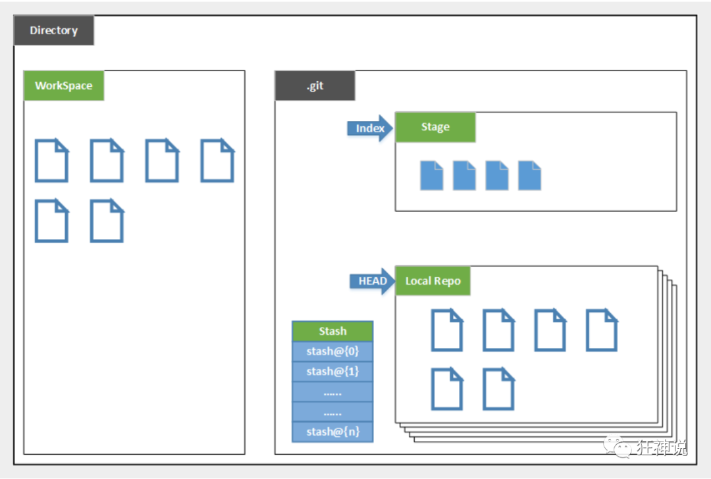
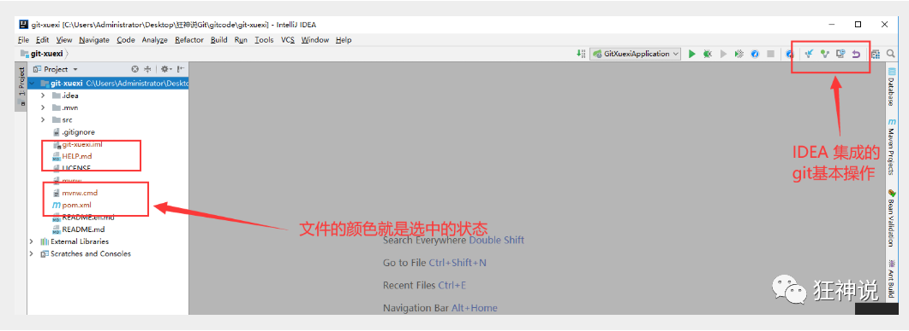
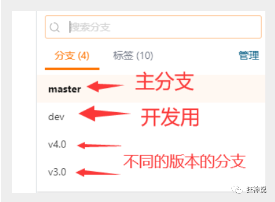

# 版本控制


版本控制是一种在开发中对我们文件，目录，工程等内容的修改历史，方便查看修改历史记录，备份和恢复的技术


# 常见版本控制工具

1. 本地版本控制
2. 集中式版本控制：SVN，只有一个电脑上有全部的代码，在中央服务器
3. 分布式版本控制：Git，每个电脑上都有全部的代码，不会对服务器或者网络损坏造成不能工作


>  Git和SVN区别

SVN是集中式版本控制系统，有中央服务器，工作用的是自己的电脑，所以要从中央服务器获取最新版本然后工作

对联网的要求比较高


GIt是分布式版本控制系统，没有中央服务器，每个人的电脑都是一个完整的版本库。工作的时候不用联网。


**Git是目前世界上最先进的分布式版本控制系统**

---


# Git的历史

Linux有很多的参与者维护，但是绝大部分都花在了提交补丁和保存归档上面（1991-2002）

到了2002年，BitKeeper这个分布式版本控制系统来对其进行赞助

但是Linux中的参与者想要破解研究BitKeeper，所以BitKeeper收回赞助（2005）

然后Linux的开源社区和缔造者Linus Torvald两周开发出了自己的版本控制系统，也就是Git


----

# Git的环境配置


1. 先下载安装Git

2. 下载之后：

   

   


**卸载Git**

1. 删除环境变量
2. 卸载

-----

# 常用的Linux命令

平时一定要多使用这些基础的命令！

1. `cd` : 改变目录。

2. `cd . . `回退到上一个目录，直接cd进入默认目录

3. `pwd` : 显示当前所在的目录路径。

4. `ls(ll)`:  都是列出当前目录中的所有文件，只不过`lsll`比`ls`列出的内容更为详细。

5. `touch` : 新建一个文件 如 `touch index.js` 就会在当前目录下新建一个index.js文件。

6. `rm`:  删除一个文件, `rm index.js` 就会把`index.js`文件删除。

7. `mkdir`:  新建一个目录,就是新建一个文件夹。

8. `rm -r` :  删除一个文件夹, `rm -r src` 删除src目录

```
rm -rf / 切勿在Linux中尝试！删除电脑中全部文件！
```

9. `mv `:移动文件,` mv index.html src` ，`index.html `是我们要移动的文件, `src `是目标文件夹,当然, 这样写,必须保证文件和目标文件夹在同一目录下。

10. `reset `：重新初始化终端/清屏。

11. `clear `清屏。

12. `history `查看命令历史。

13. `help `帮助。

14. `exit `退出。

15. `#`表示注释


----

# Git配置


所有的配置文件，其实都保存在本地！

1. 查看配置` git config -l`

   

   ```properties
   #查看系统config
   git config --system --list
   　　
   #查看当前用户（global）配置
   git config --global  --list
   ```

   > **Git相关的配置文件：**
   >
   > 1. Git\etc\gitconfig  ：Git 安装目录下的 gitconfig ，系统级的配置
   >
   > 2. C:\Users\Administrator\ .gitconfig    只适用于当前登录用户的配置，全局的配置
   >
   > 清空两个文件之后配置就没了

----

**设置用户名与邮箱（用户标识，必要）**


当你安装Git后首先要做的事情是设置你的用户名称和e-mail地址。这是非常重要的，因为每次Git提交都会使用该信息。它被永远的嵌入到了你的提交中：

```properties
git config --global user.name "bean"  #名称
git config --global user.email "xxx@qq.com"   #邮箱
```

只需要做一次这个设置

---

# Git的基本理论

**三个区域**


Git本地有三个工作区域：

- 工作目录（Working Directory）
- 暂存区(Stage/Index)
- 资源库(Repository或Git Directory)。

> 如果在加上`远程的git仓库(Remote Directory)`就可以分为四个工作区域。


文件在这四个区域之间的转换关系如下：


---



- Directory：使用Git管理的一个目录，也就是一个仓库，包含我们的工作空间和Git的管理空间。
- WorkSpace：需要通过Git进行版本控制的目录和文件，这些目录和文件组成了工作空间。
- .git：存放Git管理信息的目录，初始化仓库的时候自动创建。
- Index/Stage：暂存区，或者叫待提交更新区，在提交进入repo之前，我们可以把所有的更新放在暂存区。
- Local Repo：本地仓库，一个存放在本地的版本库；HEAD会只是当前的开发分支（branch）。
- Stash：隐藏，是一个工作状态保存栈，用于保存/恢复WorkSpace中的临时状态。

---

**工作流程**


git的工作流程一般是这样的：

１、在工作目录中添加、修改文件；

２、将需要进行版本管理的文件放入暂存区域；

３、将暂存区域的文件提交到git仓库。

因此，git管理的文件有三种状态：已修改（modified）,已暂存（staged）,已提交(committed)


----

# Git项目搭建


**日常使用只要记住下图6个命令**


- add
- commit
- push
- fetch/clone
- pull
- checkout


**本地仓库搭建**

```properties
# 在当前目录新建一个Git代码库
$ git init
```


**克隆远程仓库到本地**

```properties
# 克隆一个项目和它的整个代码历史(版本信息)
$ git clone [url]  # https://gitee.com/kuangstudy/openclass.git
```

----

# Git文件操作

**文件的四种状态**


- `Untracked`: 未跟踪, 此文件在文件夹中, 但并没有加入到git库, 不参与版本控制. 通过`git add` 状态变为`Staged`.
- `Unmodify`: 文件已经入库, 未修改, 即版本库中的文件快照内容与文件夹中完全一致. 这种类型的文件有两种去处, 如果它被修改, 而变为`Modified`. 如果使用`git rm`移出版本库, 则成为`Untracked`文件
- `Modified`: 文件已修改, 仅仅是修改, 并没有进行其他的操作. 这个文件也有两个去处, 通过`git add`可进入暂存`staged`状态, 使用`git checkout` 则丢弃修改过, 返回到`unmodify`状态, 这个`git checkou`t即从库中取出文件, 覆盖当前修改 !
- `Staged`: 暂存状态. 执行`git commit`则将修改同步到库中, 这时库中的文件和本地文件又变为一致, 文件为`Unmodify`状态. 执行`git reset HEAD filename`取消暂存, 文件状态为`Modified`


```properties
#查看指定文件状态
git status [filename]

#查看所有文件状态
git status

# git add .                  添加所有文件到暂存区
# git commit -m "消息内容"    提交暂存区中的内容到本地仓库 -m 提交信息
```


----

**忽略文件**

有些时候我们不想把某些文件纳入版本控制中，比如数据库文件，临时文件，设计文件等

在主目录下建立`.gitignore`文件，此文件有如下规则：

1. 忽略文件中的空行或以井号（#）开始的行将会被忽略。
2. 可以使用Linux通配符。例如：星号（*）代表任意多个字符，问号（？）代表一个字符，方括号（[abc]）代表可选字符范围，大括号（{string1,string2,...}）代表可选的字符串等。
3. 如果名称的最前面有一个感叹号（!），表示例外规则，将不被忽略。
4. 如果名称的最前面是一个路径分隔符（/），表示要忽略的文件在此目录下，而子目录中的文件不忽略。
5. 如果名称的最后面是一个路径分隔符（/），表示要忽略的是此目录下该名称的子目录，而非文件（默认文件或目录都忽略）。

```properties
#为注释
*.txt        #忽略所有 .txt结尾的文件,这样的话上传就不会被选中！
!lib.txt     #不忽略lib.txt
/TODO        #仅忽略项目根目录下的TODO文件,不包括其它目录的TODO
build/       #忽略build/目录下的所有文件
doc/*.txt    #会忽略 doc/notes.txt 但不包括 doc/server/arch.txt
```

----

# 码云的注册和使用

1. 登陆码云，完善个人信息

2. 绑定本机公钥

   ```properties
   # 进入 C:\Users\Administrator\.ssh 目录
   # 生成公钥，让你填信息不用填，一路回车
   ssh-keygen
   ```

   

3. 将公钥信息`public key`添加到码云账户中即可！

   

----

# IDEA集成GIT

1. 集成Idea




2. 修改文件，使用IDEA操作git。
3. 提交测试

----

# Git分支

分支在GIT中相对较难，分支就是科幻电影里面的平行宇宙，如果两个平行宇宙互不干扰，那对现在的你也没啥影响。不过，在某个时间点，两个平行宇宙合并了，我们就需要处理一些问题了！




```properties
# 列出所有本地分支
git branch

# 列出所有远程分支
git branch -r

# 新建一个分支，但依然停留在当前分支
git branch [branch-name]

# 新建一个分支，并切换到该分支
git checkout -b [branch]

# 合并指定分支到当前分支
$ git merge [branch]

# 删除分支
$ git branch -d [branch-name]

# 删除远程分支
$ git push origin --delete [branch-name]
$ git branch -dr [remote/branch]
```


**IDEA中操作**


> 如果同一个文件在合并分支时都被修改了则会引起冲突：解决的办法是我们可以修改冲突文件后重新提交！选择要保留他的代码还是你的代码！


> master主分支应该非常稳定，用来发布新版本，一般情况下不允许在上面工作，工作一般情况下在新建的dev分支上工作，工作完后，比如上要发布，或者说dev分支代码稳定后可以合并到主分支master上来。