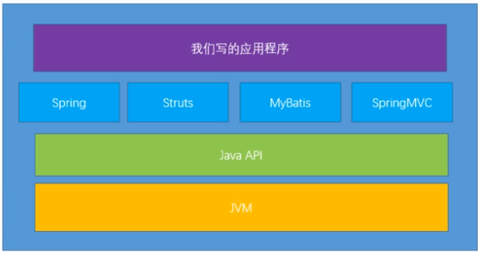
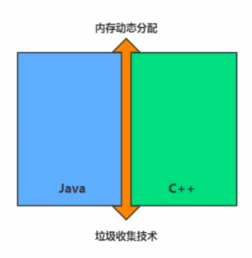
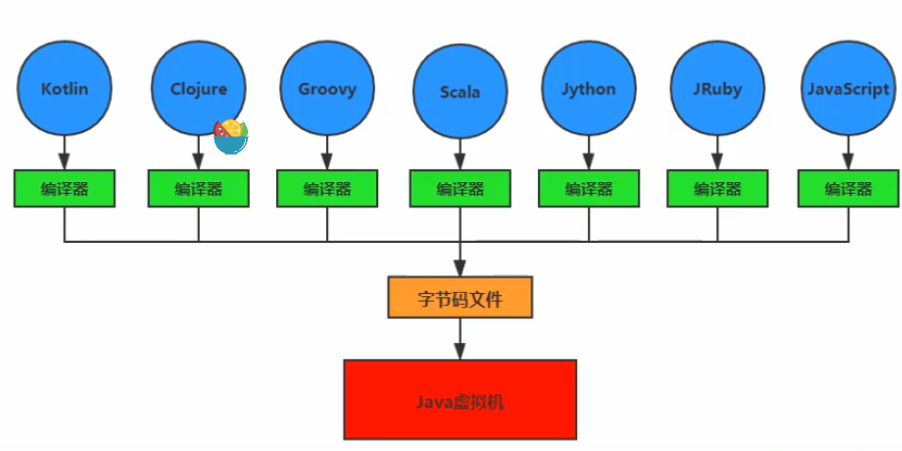

# 前面的话

视频原地址：尚硅谷宋红康JVM：https://www.bilibili.com/video/BV1PJ411n7xZ

**JVM和Java体系结构**

**为什么需要学习JVM**

- 面试的需要
- 中高级程序员的必备技能
- 追求极客精神：垃圾回收算法，JIT，底层原理等等

**Java和C++的对比**

垃圾收集机制为我们打理了很多的繁琐的工作，但是垃圾收集也不是万能的，懂得JVM内部的内存结构，工作机制，是提高设计高扩展性能应用和诊断运行时问题的基础。

---

# Java语言和JVM的简介

Java是目前应用最为广泛的软件开发平台之一。随着Java和Java社区的不断扩大，Java早已不只是一门语言了。它更像是一种平台。

在Java虚拟机上运行的并非只是Java文件，只要各个语言通过他们本身的编译器编译出来的字节码文件符合Java虚拟机的规范即可。

换言之，==Java虚拟机不是对接的Java语言，是对接的规则:字节码文件==。只要字节码文件遵循Java虚拟机的规则，就可以在其上运行。

**字节码**

Java虚拟机可以解释Java字节码文件。但是其实这可以换一个名字：jvm字节码。

因为我们已经讲过了，Java虚拟机不是对接的Java，而是字节码文件，只要规则符合，什么语言都可以。

**如何真正搞懂JVM**

自己动手写一个

# p9未开始