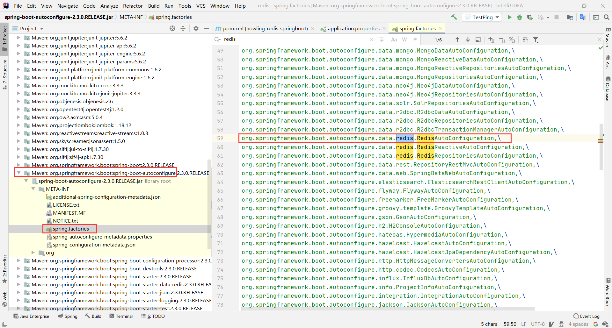
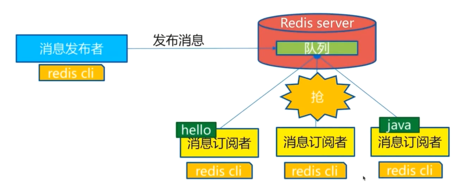

# 前面的话

感谢狂神大佬，本笔记更改于BiliBili狂神说Java：https://space.bilibili.com/95256449

# 1、NOSQL讲解

## 为什么要用NOSQL

我们现在处于大数据时代。大数据的意思：一般的数据库无法进行处理了。


## 演进

> 1、最早期的时候是单机MySQL时代


最早期的时候，90年代，一个基本的访问量不会太大，单机MySQL完全足够，服务器完全没有压力

**弊端**

1. 数据访问量太大，一个服务器承受不住
2. 数据索引太大，一个机器内存放不下
3. 数据量太多，一个机器放不下


> 2、缓存+SQL+垂直拆分，那个时候使用：Memcached（缓存）+MySQL+垂直拆分


网站很多时候都是去读，如果直接去读数据库的时候就十分麻烦，所以减轻服务器压力，直接走缓存

然后MySQL进行垂直拆分，部分写内容，然后同步到其他， 其他读内容


> 3、分库分表+水平拆分（MySQL集群）


> 4、现在


MySQL等关系型数据库不够用了，因为数据量太大，变化太快。

MySQL有的使用它来存储一些比较大的文件，但是如果有一种数据库来专门处理这些数据，MySQL的压力就十分小，研究者中和问题才是未来。


## 为什么要用NoSQL

用户的个人信息，社交网络，地理位置。

用户自己产生的数据,用户日志等等爆发式增长!
这时候我们就需要使用NoSQL数据库的， Nosql可以很好的处理以上的情况!


## 什么是NOSQL

> NOSQL：Not Only SQL：不仅仅是SQL，泛指非关系型数据库

NOSQL在当今互联网发展十分迅速


很多数据类型用户的个人信息，社交网络，地理位置，这些数据类型的存储不需要一个固定的格式，不需要多月的操作就可以横向扩展的。


> NOSQL的特点

1. 方便扩展

2. 大数据量读写高性能（1秒读11万，写8万）

3. 数据类型多样性的（不需要设计数据库，随取随用）

4. 传统关系型数据库(RDBMS)和NOSQL

   ```bash
   `传统的RDBMS`
   - 结构化组织
   - SQL
   - 关系和数据都在单独的表中
   - 数据定义语言
   - 严格的一致性
   - 基础的事务
   - ......
   ```

   ```bash
   `NoSQL`
   - 不仅仅是数据
   - 没有固定的查询语言
   - 键值对存储，列存储，文档存储，图形数据库，....
   - 最终一致性
   - CAP定力和BASE
   - 高性能，高可用，高可扩
   - ......
   ```


> 3V+3高

大数据时代的3V :主要是描述问题的

1. 海量Volume
2. 多样Variety
3. 实时Velocity

大数据时代的3高:主要是对程序的要求

1. 高并发
2. 高可拓
3. 高性能


# 2、阿里巴巴架构演进

阿里巴巴成立于1999年，一开始的时候去国外买的一个PHP的网站


2000（Java）：进入Java时代。


2001-2004（EJB）：使用EJB时代（SLSB，CMP，MDB）


2005-2007（EJB重构），去EJB重构：Spring+iBatis+Webx，Antx


2008-2009（海量数据）：Memcached集群，MySQL+数据切分，分布式存储，Hadoop，KV，CDN


2010（安全，镜像）：安全，镜像，应用服务器升级，秒杀。NoSQL，SSD


2011（敏捷，开放，体验）


```bash
# 1、信息
	MySQL，Oracle

# 2、描述，评论（文字较多）
	文档型数据库，MongoDB
# 3、图片
	分布式文件系统
		- 淘宝：TFS
		- Google：GFS
		- Hadoop：HDFS
		- 阿里云：OSS
# 4、搜索
	- 搜索引擎：Solr，ElasticSearch，ISearch（开发大佬多隆一人开发出ISearch）
# 5、波段信息
	- 内存数据库
	- Redis，Tair，Memacache
```


大型互联网应用问题：

- 数据类型太多
- 数据源太多，经常重构
- 数据要改造


# 3、NOSQL四大分类

**KV键值对**

- 新浪：Redis
- 美团：Redis+Tair
- 阿里，百度：Redis+Memacache

**文档式数据库（bson格式和json一样）**

- MongoDB

  - MongoDB是一个基于分布式文件存储的数据库，c++编写，主要用于处理大量的文档
  - MongoDB是一个介于关系型数据库和非关系型数据中中间的产品

  > 非关系型数据库中最像关系型数据库的

- ConthDB

**列存储数据库**

- HBase
- 分布式文件系统


**图关系数据库**

- Neo4j，infoGrid


>  不是存储图形的，是存储关系的


四者对比

|  分类  |              举例               |                 典型应用场景                 |                 数据模型                  |                            优点                            |                             缺点                             |
| :----: | :-----------------------------: | :------------------------------------------: | :---------------------------------------: | :--------------------------------------------------------: | :----------------------------------------------------------: |
| 键值对 |   Redis Voldemort，Oracle DBD   | 内容缓存，处理大量数据的高访问负载，日志系统 | key指向value的键值对，通常用HashTable实现 |                         查询速度快                         |        数据无结构化，通常只被当做字符串或者二进制数据        |
|   列   |     Cassandra，HBase，Riak      |               分布式的文件系统               |     以列簇式存储,将同一列数据存在一起     |          查询速度快，扩容性强，容易进行分布式扩展          |                         功能相对局限                         |
|  文档  |        CouchDB，MongoDB         |                   WEB应用                    | key-value对应的键值对，Value为结构化数据  | 数据结构要求不严格，不需要向关系型数据库一样预先定义表内容 |               查询性能不高，缺少统一的查询语法               |
|  图形  | Neo4J，InfoGrid，Infinite Graph |   社交网络，推荐系统等。专注于构建关系图谱   |                  图结构                   |                       利用图结构算法                       | 很多时候需要对整个图做计算才能得出需要的信息，不好做分布式的集群 |


# 4、Reids入门

## 概述

### 什么是Redis

Redis：==R==emote ==Di==ctionary ==S==erver：远程字典服务


免费，开源，C语言写的，支持网络，可基于内存和持久化的日志型，key-value的数据库，并支持多种语言


**效率**

1秒读11万，写8万


### Redis能干什么

1. 内存存储，持久化==（RDB，AOP）==
2. 效率高，用于高速缓存
3. 发布订阅
4. 地图信息分析
5. 计时器，计数器
6. ......

> ==数据库==，==缓存==，==消息中间件MQ==

### 特性

1. 多样的数据类型
2. 持久化
3. 集群
4. 事物


1. 文章
2. 官网：https://redis.io/
3. 中文网：https://www.redis.net.cn/
4. GitHub
5. 在线测试：http://try.redis.io/


## 安装

### Windows

1. 下载安装包：https://github.com/MicrosoftArchive/redis/releases
2. 安装
3. 解压到自己的环境目录下
4. 双击运行服务
5. 使用Redis客户端来连接客户端
6. 测试连接：`ping`
7. `set 键 值`
8. `get 键`


> Redis早就没有Windows的了，现在这个是3.0的上古版本

### Linux

1. 下载安装包

2. 丢到服务器上，程序一般放到`/opt`目录下

3. 解压：`tar -zxvf xxx`

4. 进入解压后的文件，可以看到redis的配置文件

5. 执行命令：`yum install gcc-c++`

6. 执行命令：`make`

7. 执行命令：`make install`

8. 默认的路径是`/usr/local/bin`

9. 将`opt/redis/redis.conf`配置复制一份放到自己定义的地方（比如`usr/local/howling`文件夹下），放置配置文件出错导致问题

10. `cp /opt/redis/redis.conf /usr/local/howling`

11. 修改配置文件`howling/redis.conf`，让它默认为后台启动，改为yes，以后我们就用这个配置文件启动

    

12. 启动Redis：`redis-server howling/redis.conf`

13. 连接：`redis-cli -p 6379`

14. 测试：`ping`

15. 关闭服务：`shutdown`

16. 退出：`exit`


> 6.0之后需要升级GCC，否则会出错

> 在服务器上运行命令和在测试网站上的是一样的，没有必要的时候我们就使用测试网站来学习，有需要则去服务器

---

## 测试性能

测试命令：`redis-benchmark`

| 命令 | 描述             | 默认      |
| ---- | ---------------- | --------- |
| -h   | 指定服务器主机名 | localhost |
| -p   | 指定服务器端口   | 6379      |
| -c   | 指定并发连接数   | 50        |
| -n   | 指定请求数       | 10000     |


---

## 基础知识


### 数据库


**数据库命令**


Redis默认有16个数据库，默认使用第0个

- 可以使用`select`进行切换

- 可以使用`DBSIZE`查看数据库大小


- `keys *`查看所有的key

- `get key`：查看key对应值

  ```bash
  127.0.0.1:6379> keys *
  1) "key"
  127.0.0.1:6379> get key
  "name"
  ```

- `flushdb`：清空选中的数据库

  ```bash
  127.0.0.1:6379> flushdb
  OK
  127.0.0.1:6379> keys *
  (empty array)
  ```

- `flushAll`：清除所有数据库


### **Redis是单线程的**


Redis是很快的，它是基于内存操作的，所以CPU不是Redis的性能瓶颈，Redis的瓶颈是机器的内存和网络带宽。

要多线程，那就要切换CPU，但是Redis不是基于CPU的，所以多线程不仅不会有帮助，反而拖后腿。

Redis是C语言写的，不必Memecache差


**Redis为什么单线程还这么快**

1. 误区1：高性能的服务器一定是多线程的
2. 误区2：多线程（CPU上下文切换）一定比单线程效率高

多线程的CPU上下文切换会消耗性能，是一个耗时的操作，对于内存系统来说，单线程（没有上下文切换）就是最快的

多次读写都是在一个CPU的


---

## 五大数据类型

### Redis-key

```bash
# --------------------------------------------------------------------------------------
127.0.0.1:6379> set name howling	# 设置key-value
OK

127.0.0.1:6379> keys *				# 查看当前所有的key
1) "name"
127.0.0.1:6379> get name
"howling"

127.0.0.1:6379> exists name			# 存在断言
(integer) 1
127.0.0.1:6379> move name 1			# 移动数据到指定的数据库
(integer) 1
127.0.0.1:6379> select 1			# 切换到数据库1
OK
127.0.0.1:6379[1]> keys *			
1) "name"

127.0.0.1:6379[1]> expire name 10	# 设置过期时间
(integer) 1
127.0.0.1:6379[1]> ttl name			# 查看当前剩余时间
(integer) 7
# --------------------------------------------------------------------------------------
127.0.0.1:6379[1]> ttl name
(integer) 1
127.0.0.1:6379[1]> ttl name
(integer) -2
127.0.0.1:6379[1]> keys *
(empty array)
127.0.0.1:6379[1]> select 0
OK
127.0.0.1:6379> keys *
(empty array)
127.0.0.1:6379> set name howling
OK
# --------------------------------------------------------------------------------------

127.0.0.1:6379> type name			# 查看当前数据的类型
string
```


### String

```bash
# --------------------------------------------------------------------------------------
127.0.0.1:6379> set name howling	# 设置值
OK
127.0.0.1:6379> append name hello	# 追加值，如果这个key不存在，就相当于设置一个新值
(integer) 12
127.0.0.1:6379> get name			# 获取值
"howlinghello"
127.0.0.1:6379> strlen name 		# 获得字符串长度
(integer) 12
# --------------------------------------------------------------------------------------
```

```bash
# --------------------------------------------------------------------------------------
127.0.0.1:6379> keys *
(empty array)
127.0.0.1:6379> set num 0
OK
127.0.0.1:6379> get num
"0"
# --------------------------------------------------------------------------------------
127.0.0.1:6379> incr num			# 值+1，num++
(integer) 1
127.0.0.1:6379> get num		
"1"
127.0.0.1:6379> decr num			# 值 -1，num--
(integer) 0
127.0.0.1:6379> get num
"0"

127.0.0.1:6379> incrby num 10		# 设置步长，值增加，num+=10
(integer) 10
127.0.0.1:6379> get num
"10"
127.0.0.1:6379> decrby num 5		# 设置步长，值减少，num-=5
(integer) 5
# --------------------------------------------------------------------------------------
127.0.0.1:6379> get num
"5"
```

> 只有类似数字的string才可以执行+1和-1操作


```bash
# --------------------------------------------------------------------------------------
127.0.0.1:6379> keys *
(empty array)
127.0.0.1:6379> set name howling		
OK

127.0.0.1:6379> getrange name 0 2		# 截取字符串
"how"
127.0.0.1:6379> getrange name 0 -1		# 获取全部字符串，等同于 get name
"howling"

127.0.0.1:6379> setrange name 1 xx		# 从指定位置开始，每一个都替换字符串
(integer) 7
127.0.0.1:6379> get name
"hxxling"
# --------------------------------------------------------------------------------------
```

```bash
# --------------------------------------------------------------------------------------
127.0.0.1:6379> keys *
(empty array)
# --------------------------------------------------------------------------------------
127.0.0.1:6379> set name bean
OK
127.0.0.1:6379> setex name 10 howling	# 假如数据存在，仍然设置，并设置过期时间为10秒，set with expire
OK
127.0.0.1:6379> get name
"howling"
127.0.0.1:6379> ttl name
(integer) -2
127.0.0.1:6379> get name
(nil)
# --------------------------------------------------------------------------------------
127.0.0.1:6379> set name howling		
OK
127.0.0.1:6379> setnx name bean			# 假如不存在才设置，set if not exist
(integer) 0
127.0.0.1:6379> get name				# 数据仍然不变
"howling"
127.0.0.1:6379> setnx key bean			# 假如不存在才设置
(integer) 1
127.0.0.1:6379> get key					# 这就是数据不变则设置
"bean"
# --------------------------------------------------------------------------------------
```

```bash
# --------------------------------------------------------------------------------------
127.0.0.1:6379> keys *
(empty array)
127.0.0.1:6379> mset k1 v1 k2 v2 k3 v3		# 批量添加
OK
127.0.0.1:6379> mget k1 k2 k3				# 批量获取
1) "v1"
2) "v2"
3) "v3"
# --------------------------------------------------------------------------------------
127.0.0.1:6379> msetnx k1 vv1 k4 v4			# 想要批量设置，假如不存在的话
(integer) 0
127.0.0.1:6379> mget k1 k4					# k1没有改变，k4没有出现
1) "v1"
2) (nil)

127.0.0.1:6379> mset k4 v4 k5 v5			# 想要批量设置，假如不存在的话
OK
127.0.0.1:6379> mget k4 k5					# 出现了结果
1) "v4"
2) "v5"
# --------------------------------------------------------------------------------------
```

> `msetnx`是一个原子性操作，要么同时成功，要么同时失败


```bash
# --------------------------------------------------------------------------------------
127.0.0.1:6379> set user:1:name howling		# 使用字符串进行一些骚操作
OK
127.0.0.1:6379> set user:1:age 12
OK
127.0.0.1:6379> mget user:1:name user:1:age
1) "howling"
2) "12"
# --------------------------------------------------------------------------------------
```

```bash
# --------------------------------------------------------------------------------------
127.0.0.1:6379> keys *
(empty array)
# --------------------------------------------------------------------------------------
127.0.0.1:6379> getset name bean		# 先get，后set
(nil)
127.0.0.1:6379> get name 
"bean"
127.0.0.1:6379> getset name howling
"bean"
127.0.0.1:6379> get name
"howling"
# --------------------------------------------------------------------------------------
```

> 这是一个组合命令


### List

List是一个基本的数据类型，是列表，可以做一些骚操作。可以做栈，队列


```bash
# --------------------------------------------------------------------------------------
127.0.0.1:6379> keys *
(empty array)
# --------------------------------------------------------------------------------------
127.0.0.1:6379> lpush list 1
(integer) 1
127.0.0.1:6379> lpush list 2
(integer) 2
127.0.0.1:6379> lpush list 3
(integer) 3
127.0.0.1:6379> lrange list 0 -1
1) "3"
2) "2"
3) "1"
# --------------------------------------------------------------------------------------
```

> 发现了，存进去是正着存储的，但是查询的时候是倒着查询的，这就是List默认的存储方式，类似栈的存储


```bash
# --------------------------------------------------------------------------------------
127.0.0.1:6379> rpush list 4		# 存储到列表的右侧
(integer) 4
127.0.0.1:6379> lrange list 0 -1	
1) "3"
2) "2"
3) "1"
4) "4"
# --------------------------------------------------------------------------------------
```

> 重点来了，使用`RPUSH`可以存储到list的右边，然后查询出来的时候添加的就是最后查出来的


==利用以上的存放方式，我们既可以做栈，也可以做队列，其实就相当于双端队列，从那边都可以插值==


```bash
# --------------------------------------------------------------------------------------
127.0.0.1:6379> lrange list 0 -1
1) "3"
2) "2"
3) "1"
4) "4"
# --------------------------------------------------------------------------------------
127.0.0.1:6379> lpop list			# 弹出头部的第一个元素
"3"
# --------------------------------------------------------------------------------------
127.0.0.1:6379> lrange list 0 -1
1) "2"
2) "1"
3) "4"
# --------------------------------------------------------------------------------------
127.0.0.1:6379> rpop list			# 弹出尾部的第一个元素
"4"
# --------------------------------------------------------------------------------------
127.0.0.1:6379> lrange list 0 -1
1) "2"
2) "1"
# --------------------------------------------------------------------------------------
```

```bash
# --------------------------------------------------------------------------------------
127.0.0.1:6379> lrange list 0 -1
1) "2"
2) "1"
127.0.0.1:6379> lindex list 0			# 通过下标获取
"2"
127.0.0.1:6379> lindex list 1
"1"
# --------------------------------------------------------------------------------------
127.0.0.1:6379> rindex list 0			# 没有rindex，所以l代表的是List，不是left
(error) ERR unknown command `rindex`, with args beginning with: `list`, `0`, 
```


```bash
127.0.0.1:6379> keys *
(empty array)

127.0.0.1:6379> lpush list 1 2 2 3 4 4
(integer) 6
127.0.0.1:6379> lrange list 0 -1
1) "4"
2) "4"
3) "3"
4) "2"
5) "2"
6) "1"
# --------------------------------------------------------------------------------------
127.0.0.1:6379> lrem list 1 2 			# 移除list中的 一个 2
(integer) 1
127.0.0.1:6379> lrange list 0 -1		# 发现少了2，还是少了一个
1) "4"
2) "4"
3) "3"
4) "2"
5) "1"
127.0.0.1:6379> lrem list 2 4 			# 移除list中的 两个 4
(integer) 2
127.0.0.1:6379> lrange list 0 -1		# 发现两个4全没了
1) "3"
2) "2"
3) "1"
# --------------------------------------------------------------------------------------
```

```bash
127.0.0.1:6379> flushdb
OK
127.0.0.1:6379> lpush list 1 2 3 4 5 7 8 
(integer) 7
127.0.0.1:6379> lrange list 0 -1
1) "8"
2) "7"
3) "5"
4) "4"
5) "3"
6) "2"
7) "1"
# --------------------------------------------------------------------------------------
127.0.0.1:6379> ltrim list 0 3		# 截取（只保留）下标为0到3的
OK
127.0.0.1:6379> lrange list 0 -1
1) "8"
2) "7"
3) "5"
4) "4"
# --------------------------------------------------------------------------------------
```

```bash
127.0.0.1:6379> flushdb
OK
127.0.0.1:6379> lpush list 0 1 2 3 4
(integer) 5
127.0.0.1:6379> lrange list 0 -1
1) "4"
2) "3"
3) "2"
4) "1"
5) "0"
# --------------------------------------------------------------------------------------
127.0.0.1:6379> rpoplpush list newlist		# 移动最后一个元素到指定列表
"0"
127.0.0.1:6379> lrange list 0 -1
1) "4"
2) "3"
3) "2"
4) "1"
127.0.0.1:6379> lrange newlist 0 -1
1) "0"
# --------------------------------------------------------------------------------------
127.0.0.1:6379> lpoplpush list newlist		# 这个命令没有
(error) ERR unknown command `lpoplpush`, with args beginning with: `list`, `newlist`, 
127.0.0.1:6379> lpoprpush list newlist		# 这个命令没有
(error) ERR unknown command `lpoprpush`, with args beginning with: `list`, `newlist`, 
# --------------------------------------------------------------------------------------
```

```bash
# --------------------------------------------------------------------------------------
127.0.0.1:6379> flushdb
OK
127.0.0.1:6379> lpush list 1 2 3 4 5
(integer) 5
127.0.0.1:6379> lrange list 0 -1
1) "5"
2) "4"
3) "3"
4) "2"
5) "1"
# --------------------------------------------------------------------------------------
127.0.0.1:6379> lset list 0  one		# 更新下标为0的值
OK
# --------------------------------------------------------------------------------------
127.0.0.1:6379> lrange list 0 -1
1) "one"
2) "4"
3) "3"
4) "2"
5) "1"
# --------------------------------------------------------------------------------------
127.0.0.1:6379> lset mylist 0 1			# 没有的列表不能设置
(error) ERR no such key
# --------------------------------------------------------------------------------------
```

```bash
# --------------------------------------------------------------------------------------
127.0.0.1:6379> flushdb
OK
127.0.0.1:6379> lpush list 0 1 2 3
(integer) 4
127.0.0.1:6379> lrange list 0 -1
1) "3"
2) "2"
3) "1"
4) "0"
# --------------------------------------------------------------------------------------
127.0.0.1:6379> linsert list before 1 4		# 插入值到指定值的前面
(integer) 5
127.0.0.1:6379> lrange list 0 -1
1) "3"
2) "2"
3) "4"
4) "1"
5) "0"
# --------------------------------------------------------------------------------------
127.0.0.1:6379> linsert list after 4 5		# 插入值到指定值的后面
(integer) 6
127.0.0.1:6379> lrange list 0 -1
1) "3"
2) "2"
3) "4"
4) "5"
5) "1"
6) "0"
# --------------------------------------------------------------------------------------
```

> 注意，这个插入是根据值插入的，==不是根据下标来插入的==

---

> 小结

- List实际上是一个链表，before Node after
- 如果key不存在，则创建新的链表
- 如果key存在，新增内容
- 如果移除了所有值，是一个空链表，那么也代表不存在
- 两边插入或者改动值，效率最高

---

### Set

```bash
# --------------------------------------------------------------------------------------
127.0.0.1:6379> sadd myset hello			# 添加值
(integer) 1
127.0.0.1:6379> sadd myset world
(integer) 1
127.0.0.1:6379> smembers myset				# 查看所有值
1) "world"
2) "hello"
127.0.0.1:6379> sismember myset hello		#  是否包含
(integer) 1
127.0.0.1:6379> sismember myset hello1
(integer) 0
# --------------------------------------------------------------------------------------
127.0.0.1:6379> sadd myset hello			# 添加重复的元素
(integer) 0
127.0.0.1:6379> smembers myset				# 加不进去
1) "world"
2) "hello"
# --------------------------------------------------------------------------------------
```

```bash
# --------------------------------------------------------------------------------------
127.0.0.1:6379> srem myset hello			# 移除元素
(integer) 1
127.0.0.1:6379> scard myset					# 查看容器内部的值的个数
(integer) 1
127.0.0.1:6379> smembers myset				# 没有了
1) "world"
# --------------------------------------------------------------------------------------
```


```bash
# --------------------------------------------------------------------------------------
127.0.0.1:6379> smembers myset
1) "world"
2) "hello"
# --------------------------------------------------------------------------------------
127.0.0.1:6379> srandmember myset 2		# 随机取两个
1) "world"
2) "hello"
127.0.0.1:6379> srandmember myset 1		# 随机取一个
1) "world"
127.0.0.1:6379> srandmember myset 1
1) "world"
127.0.0.1:6379> srandmember myset 1
1) "hello"
127.0.0.1:6379> srandmember myset		# 不指定默认为1
"world"
# --------------------------------------------------------------------------------------
```

> set是一个无序不重复集合，所以可以利用随机取值


```bash
# --------------------------------------------------------------------------------------
127.0.0.1:6379> smembers myset
1) "hello"
2) "2"
3) "5"
4) "4"
5) "1"
6) "world"
7) "3"
# --------------------------------------------------------------------------------------
127.0.0.1:6379> spop myset			# 随机删除一个元素
"world"
127.0.0.1:6379> spop myset 2		# 随机删除制定个数的元素
1) "5"
2) "4"
# --------------------------------------------------------------------------------------
127.0.0.1:6379> smembers myset
1) "2"
2) "hello"
3) "1"
4) "3"
# --------------------------------------------------------------------------------------
```

```bash
# --------------------------------------------------------------------------------------
127.0.0.1:6379> smembers myset
1) "2"
2) "hello"
3) "1"
4) "3"
# --------------------------------------------------------------------------------------
127.0.0.1:6379> smove myset myset2 hello		# 移动元素到另一个set集合中
(integer) 1
# --------------------------------------------------------------------------------------
127.0.0.1:6379> smembers myset
1) "2"
2) "1"
3) "3"
127.0.0.1:6379> smembers myset2
1) "hello"
# --------------------------------------------------------------------------------------
```

```bash
# --------------------------------------------------------------------------------------
127.0.0.1:6379> smembers set1
1) "1"
2) "2"
3) "3"
4) "4"
127.0.0.1:6379> smembers set2
1) "3"
2) "4"
3) "5"
4) "6"
# --------------------------------------------------------------------------------------
127.0.0.1:6379> sdiff set1 set2			# set1对set2的差集
1) "1"
2) "2"
127.0.0.1:6379> sinter set1 set2		# 两个set的交集
1) "3"
2) "4"
127.0.0.1:6379> sunion set1 set2		# 两个set的并集
1) "1"
2) "2"
3) "3"
4) "4"
5) "5"
6) "6"
# --------------------------------------------------------------------------------------
```

---

### Hash

哈希相等于：key-Map

> 键:Map集合，哈希的值是一个Map集合


```bash
# --------------------------------------------------------------------------------------
127.0.0.1:6379> hset myhash k1 v1					# hash添加元素
(integer) 1
127.0.0.1:6379> hset myhash k2 v2				
(integer) 1
127.0.0.1:6379> hget myhash k1						# hash取值
"v1"
# --------------------------------------------------------------------------------------
127.0.0.1:6379> hmset myhash k3 v3 k4 v4 k5 v5		# 批量存值
OK
127.0.0.1:6379> hmget myhash k1 k2 k3 k4			# 批量取值
1) "v1"
2) "v2"
3) "v3"
4) "v4"
# --------------------------------------------------------------------------------------
127.0.0.1:6379> hgetall myhash						# 获取所有值，我们发现值是以k-v键值对的形式存在的
 1) "k1"
 2) "v1"
 3) "k2"
 4) "v2"
 5) "k3"
 6) "v3"
 7) "k4"
 8) "v4"
 9) "k5"
10) "v5"
# --------------------------------------------------------------------------------------
127.0.0.1:6379> hmset myhash k1 vv1 k6 v6			# 覆盖
OK
127.0.0.1:6379> hgetall myhash						# 覆盖成功
 1) "k1"
 2) "vv1"
 3) "k2"
 4) "v2"
 5) "k3"
 6) "v3"
 7) "k4"
 8) "v4"
 9) "k5"
10) "v5"
11) "k6"
12) "v6"
# --------------------------------------------------------------------------------------
```

```bash
# --------------------------------------------------------------------------------------
127.0.0.1:6379> hgetall myhash
 1) "k1"
 2) "vv1"
 3) "k2"
 4) "v2"
 5) "k3"
 6) "v3"
 7) "k4"
 8) "v4"
 9) "k5"
10) "v5"
11) "k6"
12) "v6"
# --------------------------------------------------------------------------------------
127.0.0.1:6379> hdel myhash k1		# 删除key，对应的value也没了
(integer) 1
# --------------------------------------------------------------------------------------
127.0.0.1:6379> hgetall myhash
 1) "k2"
 2) "v2"
 3) "k3"
 4) "v3"
 5) "k4"
 6) "v4"
 7) "k5"
 8) "v5"
 9) "k6"
10) "v6"
# --------------------------------------------------------------------------------------
127.0.0.1:6379> hlen myhash			# 查看hash的key的长度
(integer) 5
# --------------------------------------------------------------------------------------
```


```bash
# --------------------------------------------------------------------------------------
127.0.0.1:6379> hgetall myhash
 1) "k2"
 2) "v2"
 3) "k3"
 4) "v3"
 5) "k4"
 6) "v4"
 7) "k5"
 8) "v5"
 9) "k6"
10) "v6"
# --------------------------------------------------------------------------------------
127.0.0.1:6379> hkeys myhash			# 获取所有的key
1) "k2"
2) "k3"
3) "k4"
4) "k5"
5) "k6"
127.0.0.1:6379> hvals myhash			# 获取所有的value
1) "v2"
2) "v3"
3) "v4"
4) "v5"
5) "v6"
# --------------------------------------------------------------------------------------
127.0.0.1:6379> hset myhash num 0		# 添加一个整数数值
(integer) 1
127.0.0.1:6379> hincrby myhash num 2	# 增值
(integer) 2
127.0.0.1:6379> hget myhash num			
"2"
127.0.0.1:6379> hincrby myhash num -1	# 减值
(integer) 1
# --------------------------------------------------------------------------------------
127.0.0.1:6379> hdecrby myhash num 1	# 没有decrby
(error) ERR unknown command `hdecrby`, with args beginning with: `myhash`, `num`, `1`, 
```


```bash
# --------------------------------------------------------------------------------------
127.0.0.1:6379> keys *
(empty array)
# --------------------------------------------------------------------------------------
127.0.0.1:6379> hsetnx myhash k1 v1		# 如果不存在，则创建
(integer) 1
# --------------------------------------------------------------------------------------
127.0.0.1:6379> keys *
1) "myhash"
127.0.0.1:6379> hgetall myhash
1) "k1"
2) "v1"
# --------------------------------------------------------------------------------------
127.0.0.1:6379> hsetnx myhash k1 vv1	# 如果不存在，则创建，这里存在，那么结果不变
(integer) 0
# --------------------------------------------------------------------------------------
127.0.0.1:6379> hgetall myhash	
1) "k1"
2) "v1"
# --------------------------------------------------------------------------------------
127.0.0.1:6379> hsetex myhash k1 vv1	#  没有hsetex这个命令
(error) ERR unknown command `hsetex`, with args beginning with: `myhash`, `k1`, `vv1`, 
```


----

### Zset（有序SET）


在set的基础上，新增了一个权重值：

- set：myset  v1
- zset：myzset score v1


```bash
# --------------------------------------------------------------------------------------
127.0.0.1:6379> sadd myset v1 v2 v3				# 传统set添加
(integer) 3
127.0.0.1:6379> smembers myset
1) "v3"
2) "v2"
3) "v1"
127.0.0.1:6379> zadd myzset 1 v1 2 v2 3 v3		#zset添加，有权重
(integer) 3
127.0.0.1:6379> zrange myzset 0 -1				# 获取所有值，发现是按照权重默认从小到大排序的
1) "v1"
2) "v2"
3) "v3"
# --------------------------------------------------------------------------------------
```


```bash
# --------------------------------------------------------------------------------------
127.0.0.1:6379> zrange myzset 0 -1								# 查看所有值
1) "v1"
2) "v2"
3) "v3"
# --------------------------------------------------------------------------------------
127.0.0.1:6379> zrangebyscore myzset -inf +inf					# 权重从无穷小到无穷大排序
1) "v1"
2) "v2"
3) "v3"
# --------------------------------------------------------------------------------------
127.0.0.1:6379> zrangebyscore myzset -inf 2						# 权重从无穷小到2排序，同样无穷小也可以替换成具体的值
1) "v1"
2) "v2"
# --------------------------------------------------------------------------------------
127.0.0.1:6379> zrangebyscore myzset -inf +inf withscores		# 权重从无穷小到无穷大排序，带上权重
1) "v1"
2) "1"
3) "v2"
4) "2"
5) "v3"
6) "3"
# --------------------------------------------------------------------------------------
127.0.0.1:6379> zrangebyscore myzset -inf +inf limit 0 2		# 根据权重分页，从0开始，查出2位
1) "v1"
2) "v2"
# --------------------------------------------------------------------------------------
127.0.0.1:6379> zrangebyscore myzset +inf -inf					# 按照常理来说，应该是可以进行从大到小排序的，但是这个不行
(empty array)
# --------------------------------------------------------------------------------------
```

> 
>
> 我知道为啥不行了，它出来的提示是` min max `，也就是说只支持从小到大排序，这个很不科学

```bash
# --------------------------------------------------------------------------------------
127.0.0.1:6379> zrevrange myzset 0 -1									# 这里默认是从高到低了
1) "v4"
2) "v2"
3) "v1"
# --------------------------------------------------------------------------------------
127.0.0.1:6379> zrevrangebyscore myzset +inf -inf						#  这就可以降序排列了
1) "v4"
2) "v2"
3) "v1"
# --------------------------------------------------------------------------------------
127.0.0.1:6379> zrevrangebyscore myzset +inf -inf withscores limit 0 2	# 还有带权重和分页都可以了
1) "v4"
2) "4"
3) "v2"
4) "2"
# --------------------------------------------------------------------------------------
```

> 
>
> 原来从大到小排列还需要另外的一个命令，还挺坑爹的。。。
>
> 应该是新版本的新变化


```bash
# --------------------------------------------------------------------------------------
127.0.0.1:6379> zrange myzset 0 -1
1) "v1"
2) "v2"
3) "v3"
4) "v4"
# --------------------------------------------------------------------------------------
127.0.0.1:6379> zrem myzset v3			# 移除元素
(integer) 1
127.0.0.1:6379> zrange myzset 0 -1
1) "v1"
2) "v2"
3) "v4"
# --------------------------------------------------------------------------------------
127.0.0.1:6379> zcard myzset			# 获取元素个数
(integer) 3
# --------------------------------------------------------------------------------------
```


```bash
# --------------------------------------------------------------------------------------
127.0.0.1:6379> zrange myzset 0 -1 withscores
 1) "newv1"
 2) "1"
 3) "v1"
 4) "1"
 5) "newv2"
 6) "2"
 7) "v2"
 8) "2"
 9) "newv3"
10) "3"
11) "newvv3"
12) "3"
13) "v4"
14) "4"
# --------------------------------------------------------------------------------------
127.0.0.1:6379> zcount myzset 1 3		# 获取权重1~3之间的数量
(integer) 6
# --------------------------------------------------------------------------------------
```

----

## 三大特殊类型

### geospatial 地理位置

> 城市经纬度测试网址：http://www.jsons.cn/lngcode/


geospatial 可以用来推算地理位置信息，两地之间的举例，附近的人等等...


只有六个命令：

- [GEOADD](http://www.redis.cn/commands/geoadd.html)
- [GEODIST](http://www.redis.cn/commands/geodist.html)
- [GEOHASH](http://www.redis.cn/commands/geohash.html)
- [GEOPOS](http://www.redis.cn/commands/geopos.html)
- [GEORADIUS](http://www.redis.cn/commands/georadius.html)
- [GEORADIUSBYMEMBER](http://www.redis.cn/commands/georadiusbymember.html)


**GEOADD**：添加地理位置(经度，纬度，名称)

```bash
# --------------------------------------------------------------------------------------
127.0.0.1:6379> geoadd china:city 116.405285 39.904989 beijing									# 添加城市
(integer) 1
127.0.0.1:6379> geoadd china:city 121.472644 31.231706 shanghai
(integer) 1
127.0.0.1:6379> geoadd china:city 118.016974 37.383542 binzhou
(integer) 1
127.0.0.1:6379> geoadd china:city 119.461208 35.428588 rizhao 116.587245 35.415393 jining		# 添加多个
(integer) 2
# --------------------------------------------------------------------------------------
```

> 添加了：北京，上海，滨州，日照，济宁
>
> ==规则：两级无法添加==，而且我们一般会下载城市数据利用java程序一键导入
>
> ==规则：有效的纬度从-85.05112878~85.05112878==
>
> ==规则：有效的经度从-180~180==
>
> ==当输入一个超范围的经度或者纬度的时候，返回一个错误==
>
> ==官网写错了，写的是(纬度，经度，名称)，其实应该是经度在纬度之前==


**GEOPOS**：从key里返回所有给定位置的位置

```bash
# --------------------------------------------------------------------------------------
127.0.0.1:6379> geopos china:city beijing shanghai	# 获得给定的经纬度
1) 1) "116.40528291463851929"
   2) "39.9049884229125027"
2) 1) "121.47264629602432251"
   2) "31.23170490709807012"
# --------------------------------------------------------------------------------------
```


**GEODIST**：返回两个给定位置的距离

```bash
# --------------------------------------------------------------------------------------
127.0.0.1:6379> geodist china:city beijing shanghai m		# 米
"1067597.9668"
127.0.0.1:6379> geodist china:city beijing shanghai km		# 千米
"1067.5980"
127.0.0.1:6379> geodist china:city beijing shanghai			# 默认就是米
"1067597.9668"
# --------------------------------------------------------------------------------------
```

> - m：米
>
> - km：千米
>
> - mi：英里
>
> - ft：英尺


**GEORADIUS**：以给定的经纬度为中心，找出某一半径内的元素

```bash
# --------------------------------------------------------------------------------------
127.0.0.1:6379> georadius china:city 110 30 1000 km	# 给定经纬度（110，30），找出半径为1000km内的城市(存在于china:city集合中的)
1) "jining"

127.0.0.1:6379> georadius china:city 110 30 1000 km withdist	# 查看直线距离
1) 1) "jining"
   2) "861.4660"
   
127.0.0.1:6379> georadius china:city 110 30 1000 km withcoord	# 查看经纬度
1) 1) "jining"
   2) 1) "116.58724397420883179"
      2) "35.41539398608729527"

127.0.0.1:6379> georadius china:city 110 30 1000 km count 1		# 只显示一个（如果有很多个的话）
1) "jining"
# --------------------------------------------------------------------------------------
```

> 附近的人，通过半径来查询


**GEORADIUSBYMEMBER**：找出指定范围内的元素，中心点由给定的位置元素决定

```bash
# --------------------------------------------------------------------------------------
127.0.0.1:6379> georadiusbymember china:city beijing 1000 km	# 找出china:city这个集合内的所有根据北京为中心的，1000km的城市
1) "jining"
2) "rizhao"
3) "binzhou"
4) "beijing"
# --------------------------------------------------------------------------------------
```


**GEOHASH**：返回一个或者多个位置元素的GeoHash表示

```bash
# --------------------------------------------------------------------------------------
127.0.0.1:6379> geohash china:city beijing jining
1) "wx4g0b7xrt0"
2) "ww6cmp0jxe0"
# --------------------------------------------------------------------------------------
```

> 返回11个字符串的geohash字符串，将二维的经纬度转换成了一维的字符串，如果越接近，就越近


```bash
127.0.0.1:6379> zrange china:city 0 -1
1) "shanghai"
2) "jining"
3) "rizhao"
4) "binzhou"
5) "beijing"
```

> GEO的底层实现原理其实就是ZSET，我们可以使用ZSET来操作GEO

---

### Hyperloglog

> 基数（不重复的元素），可以接受误差

假如现在有两个数据集

- A：1，3，5，7，8，7
- B：1，3，5，7，8

> A的基数是5，B的基数是5。
>
> 也就是说多个重复数据都算作一个数据

**Hyperloglog**

> `是一种数据结构`
>
> Redis的2.8.9版本更新出来了

是用来做基数统计的

比如现在有一个网站，一个人访问这个网站多次只当做访问了一次


传统的方式可以使用SET来保存用户的ID，因为SET是不允许重复的，当然，并发的时候可能有点误差，但是这点误差我们可以接受

但是假如这种方式保存大量的用户ID，就会比较麻烦，但是我们的目的是为了计数而不是保存用户ID。


那么Hyperloglog占用的内存是固定的，比如要放置2^64^不同的IP，只需要占用12KB内存。如果只看内存，Hyperloglog是首选。

官方说大约有0.81%的错误率，这种错误是可以接受的。


```bash
# --------------------------------------------------------------------------------------
127.0.0.1:6379> PFadd mykey a b c d e f g h i j			# 添加
(integer) 1
127.0.0.1:6379> PFcount mykey							# 计算基数
(integer) 10
# --------------------------------------------------------------------------------------
127.0.0.1:6379> PFadd mykey2 i j z x c v b n m
(integer) 1
127.0.0.1:6379> PFcount mykey2
(integer) 9
# --------------------------------------------------------------------------------------
127.0.0.1:6379> pfmerge mykey3 mykey mykey2				# 将多合并为一个，形成一个新的叫做mykey3
OK
127.0.0.1:6379> PFcount mykey3							# 计算基数
(integer) 15
# --------------------------------------------------------------------------------------
```

> 合并的时候能合并多个


### **BitMap**

> 位存储

==只有两个状态的需求都可以使用BitMaps来解决==，比如打卡，比如用户是否登录，比如活跃或者不活跃，......

> `BitMap位图是一种数据结构`，操作二进制位来记录，只有0和1两个状态

> 效率十分高，比如打卡，一年365天 => 365bit =>46个字节左右

```bash
# --------------------------------------------------------------------------------------
127.0.0.1:6379> setbit sign 0 0		# 第一天没有打卡，填0
(integer) 0
127.0.0.1:6379> setbit sign 1 0 	# 第二天没有打卡，填0
(integer) 0
127.0.0.1:6379> setbit sign 2 0 	# 第三天没有打卡，填0
(integer) 0
127.0.0.1:6379> setbit sign 3 0 	# 第四天没有打卡，填0
(integer) 0
127.0.0.1:6379> setbit sign 3 1		# 第四天的打卡情况管理员给改了，填1
(integer) 1
127.0.0.1:6379> setbit sign 4 1		# 第五天打卡，填1
(integer) 0
# --------------------------------------------------------------------------------------
127.0.0.1:6379> getbit sign 1		# 查看状态
(integer) 0
# --------------------------------------------------------------------------------------
127.0.0.1:6379> bitcount sign		# 统计状态，发现只有两天打卡
(integer) 2
# --------------------------------------------------------------------------------------
```

---

## 事务

### **事务介绍**

在学MySQL事务的时候，我们学过ACID原则。

==Redis单条命令是保持原子性的，但是事务不保证原子性==


事务的本质是一组命令的集合，一个事务中的所有命令都会被序列化，然后顺序执行。

- 一次性（在队列里一次性执行的）
- 顺序性（顺序执行的）
- 排他性（事务执行过程中不允许被干扰）

==Redis没有隔离级别的概念==


### 事务基本命令

Redis的事务

- 开启事务（`multi`）
- 命令入队
- 执行事务（`exec`）

```bash
# --------------------------------------------------------------------------------------
127.0.0.1:6379> multi		# 开启事务
OK
127.0.0.1:6379> set k1 v1	# 命令入队
QUEUED
127.0.0.1:6379> set k2 v2
QUEUED
127.0.0.1:6379> set k3 v3
QUEUED
127.0.0.1:6379> exec		# 事务执行
1) OK
2) OK
3) OK
# --------------------------------------------------------------------------------------
```

>  Redis所有的命令在事务中并没有直接被执行，而是当发起执行命令的时候才会执行


```bash
# --------------------------------------------------------------------------------------
127.0.0.1:6379> flushdb
OK
127.0.0.1:6379> multi		# 开启事务
OK
127.0.0.1:6379> set k1 v1
QUEUED
127.0.0.1:6379> set k2 v2
QUEUED
127.0.0.1:6379> discard		# 放弃事务
OK
127.0.0.1:6379> get k1		# 拿不到，说明没有执行
(nil)
# --------------------------------------------------------------------------------------
```


```bash
# --------------------------------------------------------------------------------------
127.0.0.1:6379> flushdb
OK
127.0.0.1:6379> multi
OK
127.0.0.1:6379> kkk k1		# 语法错误
(error) ERR unknown command `kkk`, with args beginning with: `k1`, 
127.0.0.1:6379> set k1 v1
QUEUED
127.0.0.1:6379> exec		# 发现不能执行
(error) EXECABORT Transaction discarded because of previous errors.
# --------------------------------------------------------------------------------------
```

> 编译型异常，检查的时候有语法错误，直接报错


```bash
# --------------------------------------------------------------------------------------
127.0.0.1:6379> flushdb
OK
127.0.0.1:6379> multi
OK
127.0.0.1:6379> set k1 v1
QUEUED
127.0.0.1:6379> incr k1			# 出现了逻辑错误，但是仍然入队了
QUEUED
127.0.0.1:6379> set k2 v2
QUEUED
127.0.0.1:6379> get k2
QUEUED
127.0.0.1:6379> exec
1) OK
2) (error) ERR value is not an integer or out of range	# 这一条没有执行，其他的都执行了
3) OK
4) "v2"
# --------------------------------------------------------------------------------------
```

>  运行时异常，（假如有一个语句有逻辑异常），错误会抛出异常，但是其他命令会执行，这是说明没有原子性


### 锁：Redis可以实现乐观锁

- 悲观锁：认为什么时候都会出现问题，什么时候都会加锁

- 乐观锁：认为什么时候都不会出现问题，都不会上锁。在更新数据的时候去判断一下version来判断在此期间是否有人改动过数据


**乐观锁使用**

1. 获取version
2. 更新的时候比较version

```bash
# --------------------------------------------------------------------------------------
127.0.0.1:6379> mget money out
1) "1000"
2) "0"
127.0.0.1:6379> watch money			# 获取moeny的值，相当于在java中获取version的版本
OK
127.0.0.1:6379> multi
OK
127.0.0.1:6379> decrby money 100
QUEUED
127.0.0.1:6379> incrby out 100
QUEUED
127.0.0.1:6379> exec				# 没有任何意外的时候没有什么问题
1) (integer) 900
2) (integer) 100
# --------------------------------------------------------------------------------------
```

> 在没有任何意外的时候，就不会出现什么问题
>
> ==注意，watch money就相当于在Java中获取version版本==
>
> ==在执行成功后，会自动执行unwatch释放监视==


> 出现意外的时候就容易出问题
>
> 这里模拟的是两个线程之间的争抢问题
>
> ==注意最后的第五步，执行线程失败的时候要手动进行unwatch释放监视==
>
> ==等到下一次的时候，继续watch money，获取最新的version==

---

# Jedis

## 什么是Jedis

Jedis是一个Java操作Redis的中间件，是官方推荐的工具


## 开始

1. 建立一个空项目

   

   

2. 建立一个Maven模块

   

3. 在project上配置版本，modules上配置版本，在Settings上改变JavaCompile

   

   

   

4. 导入依赖

   ```xml
       <dependencies>
           <!-- https://mvnrepository.com/artifact/redis.clients/jedis -->
           <dependency>
               <groupId>redis.clients</groupId>
               <artifactId>jedis</artifactId>
               <version>3.3.0</version>
           </dependency>
   
           <!--alibaba fastjson-->
           <dependency>
               <groupId>com.alibaba</groupId>
               <artifactId>fastjson</artifactId>
               <version>1.2.68</version>
           </dependency>
       </dependencies>
   ```

5. 编码测试，连接数据库

   ```java
   package com.howling;
   
   import redis.clients.jedis.Jedis;
   
   public class TestPing {
       public static void main(String[] args) {
           //1. new Jedis
           Jedis jedis = new Jedis("localhost",6379);
   
           //2. 测试连接，这里直接连接本地Redis即可
           System.out.println(jedis.ping());//PONG
   
       }
   }
   ```


## 常用的API

> 举几个例子，要看全部的去看上面

```java
package com.howling;

import redis.clients.jedis.Jedis;

public class TestPing {
    public static void main(String[] args) {
        Jedis jedis = new Jedis("localhost",6379);

        jedis.flushAll();

        //判断是否存在：false
        System.out.println("判断是否存在："+jedis.exists("username"));

        //新增username:howling：OK
        System.out.println("新增username:howling："+jedis.set("username","howling"));
        //新增password:howlingPassword：OK
        System.out.println("新增password:howlingPassword："+jedis.set("password", "howlingPassword"));

        //取值：howling
        System.out.println("取值："+jedis.get("username"));

        //系统所有的key：[password, username]
        System.out.println("系统所有的key："+jedis.keys("*"));

        //判断值的类型：string
        System.out.println("判断值的类型："+jedis.type("username"));

        //set随机返回值：username
        System.out.println("set随机返回值："+jedis.randomKey());

        //重命名key：OK
        System.out.println("重命名key："+jedis.rename("username", "name"));

        //重命名后取值：howling
        System.out.println("重命名后取值："+jedis.get("name"));

        //根据索引取值：OK
        System.out.println("根据索引取值："+jedis.select(0));

        //返回数据库中的key：2
        System.out.println("返回数据库中的key："+jedis.dbSize());

        jedis.flushDB();
    }
}
```

---

# SpringBoot整合

SpringBoot所有的数据操作都封装在SpringData里面，像JPA，JDBC，MongoDB，Redis等等。。

SpringData也是和SpringBoot齐名的项目


## 环境搭建

1. 打开之前的空项目

2. 新建一个新的SpringBoot模块

   

3. 说明，在SpringBootd的1.x之后，Redis环境中Jedis被替换成了Lettuce

   > 区别：
   >
   > - Jedis：采用的直连，多个线程操作的话不安全，想要避免不安全就要使用JedisPool连接池，更像BIO模式
   > - Lettuce：第层采用Netty，实例可以在多个线程中共享，不存在线程不安全的情况，更像NIO模式

4. SpringBoot的配置

   

   > SpringBoot的所有配置类都有一个自动配置类xxxAutoConfig
   >
   > 自动配置类都会绑定一个properties配置文件
   
5. 源码分析

   ```java
   
   @EnableConfigurationProperties({RedisProperties.class})
   @Import({LettuceConnectionConfiguration.class, JedisConnectionConfiguration.class})
   public class RedisAutoConfiguration {
   	
   	//Template，使用这个可以快速上手
       @Bean
       @ConditionalOnMissingBean(name = {"redisTemplate"})
       public RedisTemplate<Object, Object> redisTemplate(RedisConnectionFactory redisConnectionFactory) throws UnknownHostException {
           RedisTemplate<Object, Object> template = new RedisTemplate();
           template.setConnectionFactory(redisConnectionFactory);
           return template;
       }
   	
   	//因为String是最常使用的，所以单独列出了一个StringTemplate
       @Bean
       @ConditionalOnMissingBean
       public StringRedisTemplate stringRedisTemplate(RedisConnectionFactory redisConnectionFactory) throws UnknownHostException {
           StringRedisTemplate template = new StringRedisTemplate();
           template.setConnectionFactory(redisConnectionFactory);
           return template;
       }
   }
   ```

6. 配置

   ```properties
   # SpringBoot的所有配置类都有一个自动配置类xxxAutoConfig，RedisAutoConfiguration
   # 自动配置类都会绑定一个properties配置文件，RedisProperties
   
   spring.redis.host=localhost
   spring.redis.port=6379
   ```

   

## 整合测试

```java
package com.howling;

import org.junit.jupiter.api.Test;
import org.springframework.beans.factory.annotation.Autowired;
import org.springframework.boot.test.context.SpringBootTest;
import org.springframework.data.redis.connection.RedisConnection;
import org.springframework.data.redis.core.*;

@SpringBootTest
class HowlingRedisSpringbootApplicationTests {

    @Autowired
    private RedisTemplate redisTemplate;

    @Test
    void contextLoads() {
        
        /**操作各种数据类型
         * ListOperations list = redisTemplate.opsForList();
         * SetOperations set = redisTemplate.opsForSet();
         * ZSetOperations zSetOperations = redisTemplate.opsForZSet();
         * HashOperations hash = redisTemplate.opsForHash();
         * GeoOperations geo = redisTemplate.opsForGeo();
         */

        /**通过数据类型操作他们自己的东西
         * ValueOperations opsValue = redisTemplate.opsForValue();
         * opsValue.set("k1","v1");
         * opsValue.append("k1","v");
         */

        /**常用的操作也提出来了，比如事务和基本的增删改查
         * redisTemplate.multi();
         * redisTemplate.discard();
         * redisTemplate.exec();
         */

        /**获取连接对象，然后清除数据库
         * RedisConnection connection = redisTemplate.getConnectionFactory().getConnection();
         * connection.flushDb();
         * connection.flushAll();
         */
    }

}
```


## 自定义Template（固定模板）

```java

@EnableConfigurationProperties({RedisProperties.class})
@Import({LettuceConnectionConfiguration.class, JedisConnectionConfiguration.class})
public class RedisAutoConfiguration {
	
    @Bean
    @ConditionalOnMissingBean(name = {"redisTemplate"})
    public RedisTemplate<Object, Object> redisTemplate(RedisConnectionFactory redisConnectionFactory) throws UnknownHostException {
        RedisTemplate<Object, Object> template = new RedisTemplate();
        template.setConnectionFactory(redisConnectionFactory);
        return template;
    }

    @Bean
    @ConditionalOnMissingBean
    public StringRedisTemplate stringRedisTemplate(RedisConnectionFactory redisConnectionFactory) throws UnknownHostException {
        StringRedisTemplate template = new StringRedisTemplate();
        template.setConnectionFactory(redisConnectionFactory);
        return template;
    }
}
```

> 我们发现在Template上面有一个注解：`ConditionalOnMissingBean`
>
> 这个注解的意思是当没有这个方法的时候，这个方法起效。
>
> 通俗点就是说当我们自己配置了Template之后，这个就没用了


下面我们自己来配置一个Template

```java
package com.howling.config;

import com.fasterxml.jackson.annotation.JsonAutoDetect;
import com.fasterxml.jackson.annotation.PropertyAccessor;
import com.fasterxml.jackson.databind.ObjectMapper;
import org.springframework.context.annotation.Bean;
import org.springframework.context.annotation.Configuration;
import org.springframework.data.redis.connection.RedisConnectionFactory;
import org.springframework.data.redis.core.RedisTemplate;
import org.springframework.data.redis.serializer.Jackson2JsonRedisSerializer;
import org.springframework.data.redis.serializer.StringRedisSerializer;

import java.net.UnknownHostException;

@Configuration
public class RedisConfig {


    //基础部分和它的是差不多的
    @Bean
    public RedisTemplate<String, Object> redisTemplate(RedisConnectionFactory redisConnectionFactory) throws UnknownHostException {
        RedisTemplate<String, Object> template = new RedisTemplate();
        template.setConnectionFactory(redisConnectionFactory);
        /*------------------------上面的是原来的------------------------*/

        /*配置具体的序列化方式，因为对象不序列化是不能存储到Redis中的*/
        //默认使用的是JDK的序列，但是我们不想使用JDK的序列
        Jackson2JsonRedisSerializer<Object> serializer = new Jackson2JsonRedisSerializer<Object>(Object.class);

        //Json的序列化
        ObjectMapper mapper = new ObjectMapper();
        mapper.setVisibility(PropertyAccessor.ALL, JsonAutoDetect.Visibility.ANY);
        mapper.enableDefaultTyping(ObjectMapper.DefaultTyping.NON_FINAL);
        serializer.setObjectMapper(mapper);
        //String的序列化
        StringRedisSerializer stringRedisSerializer = new StringRedisSerializer();


        //所有的key采用String的序列化方式
        template.setKeySerializer(stringRedisSerializer);
        //所有的value序列化方式采用jackson
        template.setValueSerializer(serializer);

        //hash采用String的序列化方式
        template.setHashKeySerializer(stringRedisSerializer);
        //hash的value序列化采用jackson
        template.setHashValueSerializer(serializer);

        template.afterPropertiesSet();

        /*------------------------下面的是原来的------------------------*/
        return template;
    }
}
```

> 上面的就是固定模板

---

## 自定义RedisUtils（固定模板）

> `redisTemplate`是我们自己写的

```java
package com.howling.utils;

import org.springframework.beans.factory.annotation.Autowired;
import org.springframework.data.redis.core.RedisTemplate;
import org.springframework.stereotype.Component;
import org.springframework.util.CollectionUtils;

import java.util.List;
import java.util.Map;
import java.util.Set;
import java.util.concurrent.TimeUnit;

// 在我们真实的分发中，或者你们在公司，一般都可以看到一个公司自己封装RedisUtil
@Component
public final class RedisUtil {

    @Autowired
    private RedisTemplate<String, Object> redisTemplate;

    // =============================common============================

    /**
     * 指定缓存失效时间
     *
     * @param key  键
     * @param time 时间(秒)
     */
    public boolean expire(String key, long time) {
        try {
            if (time > 0) {
                redisTemplate.expire(key, time, TimeUnit.SECONDS);
            }
            return true;
        } catch (Exception e) {
            e.printStackTrace();
            return false;
        }
    }

    /**
     * 根据key 获取过期时间
     *
     * @param key 键 不能为null
     * @return 时间(秒) 返回0代表为永久有效
     */
    public long getExpire(String key) {
        return redisTemplate.getExpire(key, TimeUnit.SECONDS);
    }


    /**
     * 判断key是否存在
     *
     * @param key 键
     * @return true 存在 false不存在
     */
    public boolean hasKey(String key) {
        try {
            return redisTemplate.hasKey(key);
        } catch (Exception e) {
            e.printStackTrace();
            return false;
        }
    }


    /**
     * 删除缓存
     *
     * @param key 可以传一个值 或多个
     */
    @SuppressWarnings("unchecked")
    public void del(String... key) {
        if (key != null && key.length > 0) {
            if (key.length == 1) {
                redisTemplate.delete(key[0]);
            } else {
                redisTemplate.delete(CollectionUtils.arrayToList(key));
            }
        }
    }


    // ============================String=============================

    /**
     * 普通缓存获取
     *
     * @param key 键
     * @return 值
     */
    public Object get(String key) {
        return key == null ? null : redisTemplate.opsForValue().get(key);
    }

    /**
     * 普通缓存放入
     *
     * @param key   键
     * @param value 值
     * @return true成功 false失败
     */

    public boolean set(String key, Object value) {
        try {
            redisTemplate.opsForValue().set(key, value);
            return true;
        } catch (Exception e) {
            e.printStackTrace();
            return false;
        }
    }


    /**
     * 普通缓存放入并设置时间
     *
     * @param key   键
     * @param value 值
     * @param time  时间(秒) time要大于0 如果time小于等于0 将设置无限期
     * @return true成功 false 失败
     */

    public boolean set(String key, Object value, long time) {
        try {
            if (time > 0) {
                redisTemplate.opsForValue().set(key, value, time, TimeUnit.SECONDS);
            } else {
                set(key, value);
            }
            return true;
        } catch (Exception e) {
            e.printStackTrace();
            return false;
        }
    }


    /**
     * 递增
     *
     * @param key   键
     * @param delta 要增加几(大于0)
     */
    public long incr(String key, long delta) {
        if (delta < 0) {
            throw new RuntimeException("递增因子必须大于0");
        }
        return redisTemplate.opsForValue().increment(key, delta);
    }


    /**
     * 递减
     *
     * @param key   键
     * @param delta 要减少几(小于0)
     */
    public long decr(String key, long delta) {
        if (delta < 0) {
            throw new RuntimeException("递减因子必须大于0");
        }
        return redisTemplate.opsForValue().increment(key, -delta);
    }


    // ================================Map=================================

    /**
     * HashGet
     *
     * @param key  键 不能为null
     * @param item 项 不能为null
     */
    public Object hget(String key, String item) {
        return redisTemplate.opsForHash().get(key, item);
    }

    /**
     * 获取hashKey对应的所有键值
     *
     * @param key 键
     * @return 对应的多个键值
     */
    public Map<Object, Object> hmget(String key) {
        return redisTemplate.opsForHash().entries(key);
    }

    /**
     * HashSet
     *
     * @param key 键
     * @param map 对应多个键值
     */
    public boolean hmset(String key, Map<String, Object> map) {
        try {
            redisTemplate.opsForHash().putAll(key, map);
            return true;
        } catch (Exception e) {
            e.printStackTrace();
            return false;
        }
    }


    /**
     * HashSet 并设置时间
     *
     * @param key  键
     * @param map  对应多个键值
     * @param time 时间(秒)
     * @return true成功 false失败
     */
    public boolean hmset(String key, Map<String, Object> map, long time) {
        try {
            redisTemplate.opsForHash().putAll(key, map);
            if (time > 0) {
                expire(key, time);
            }
            return true;
        } catch (Exception e) {
            e.printStackTrace();
            return false;
        }
    }


    /**
     * 向一张hash表中放入数据,如果不存在将创建
     *
     * @param key   键
     * @param item  项
     * @param value 值
     * @return true 成功 false失败
     */
    public boolean hset(String key, String item, Object value) {
        try {
            redisTemplate.opsForHash().put(key, item, value);
            return true;
        } catch (Exception e) {
            e.printStackTrace();
            return false;
        }
    }

    /**
     * 向一张hash表中放入数据,如果不存在将创建
     *
     * @param key   键
     * @param item  项
     * @param value 值
     * @param time  时间(秒) 注意:如果已存在的hash表有时间,这里将会替换原有的时间
     * @return true 成功 false失败
     */
    public boolean hset(String key, String item, Object value, long time) {
        try {
            redisTemplate.opsForHash().put(key, item, value);
            if (time > 0) {
                expire(key, time);
            }
            return true;
        } catch (Exception e) {
            e.printStackTrace();
            return false;
        }
    }


    /**
     * 删除hash表中的值
     *
     * @param key  键 不能为null
     * @param item 项 可以使多个 不能为null
     */
    public void hdel(String key, Object... item) {
        redisTemplate.opsForHash().delete(key, item);
    }


    /**
     * 判断hash表中是否有该项的值
     *
     * @param key  键 不能为null
     * @param item 项 不能为null
     * @return true 存在 false不存在
     */
    public boolean hHasKey(String key, String item) {
        return redisTemplate.opsForHash().hasKey(key, item);
    }


    /**
     * hash递增 如果不存在,就会创建一个 并把新增后的值返回
     *
     * @param key  键
     * @param item 项
     * @param by   要增加几(大于0)
     */
    public double hincr(String key, String item, double by) {
        return redisTemplate.opsForHash().increment(key, item, by);
    }


    /**
     * hash递减
     *
     * @param key  键
     * @param item 项
     * @param by   要减少记(小于0)
     */
    public double hdecr(String key, String item, double by) {
        return redisTemplate.opsForHash().increment(key, item, -by);
    }


    // ============================set=============================

    /**
     * 根据key获取Set中的所有值
     *
     * @param key 键
     */
    public Set<Object> sGet(String key) {
        try {
            return redisTemplate.opsForSet().members(key);
        } catch (Exception e) {
            e.printStackTrace();
            return null;
        }
    }


    /**
     * 根据value从一个set中查询,是否存在
     *
     * @param key   键
     * @param value 值
     * @return true 存在 false不存在
     */
    public boolean sHasKey(String key, Object value) {
        try {
            return redisTemplate.opsForSet().isMember(key, value);
        } catch (Exception e) {
            e.printStackTrace();
            return false;
        }
    }


    /**
     * 将数据放入set缓存
     *
     * @param key    键
     * @param values 值 可以是多个
     * @return 成功个数
     */
    public long sSet(String key, Object... values) {
        try {
            return redisTemplate.opsForSet().add(key, values);
        } catch (Exception e) {
            e.printStackTrace();
            return 0;
        }
    }


    /**
     * 将set数据放入缓存
     *
     * @param key    键
     * @param time   时间(秒)
     * @param values 值 可以是多个
     * @return 成功个数
     */
    public long sSetAndTime(String key, long time, Object... values) {
        try {
            Long count = redisTemplate.opsForSet().add(key, values);
            if (time > 0)
                expire(key, time);
            return count;
        } catch (Exception e) {
            e.printStackTrace();
            return 0;
        }
    }


    /**
     * 获取set缓存的长度
     *
     * @param key 键
     */
    public long sGetSetSize(String key) {
        try {
            return redisTemplate.opsForSet().size(key);
        } catch (Exception e) {
            e.printStackTrace();
            return 0;
        }
    }


    /**
     * 移除值为value的
     *
     * @param key    键
     * @param values 值 可以是多个
     * @return 移除的个数
     */

    public long setRemove(String key, Object... values) {
        try {
            Long count = redisTemplate.opsForSet().remove(key, values);
            return count;
        } catch (Exception e) {
            e.printStackTrace();
            return 0;
        }
    }

    // ===============================list=================================

    /**
     * 获取list缓存的内容
     *
     * @param key   键
     * @param start 开始
     * @param end   结束 0 到 -1代表所有值
     */
    public List<Object> lGet(String key, long start, long end) {
        try {
            return redisTemplate.opsForList().range(key, start, end);
        } catch (Exception e) {
            e.printStackTrace();
            return null;
        }
    }


    /**
     * 获取list缓存的长度
     *
     * @param key 键
     */
    public long lGetListSize(String key) {
        try {
            return redisTemplate.opsForList().size(key);
        } catch (Exception e) {
            e.printStackTrace();
            return 0;
        }
    }


    /**
     * 通过索引 获取list中的值
     *
     * @param key   键
     * @param index 索引 index>=0时， 0 表头，1 第二个元素，依次类推；index<0时，-1，表尾，-2倒数第二个元素，依次类推
     */
    public Object lGetIndex(String key, long index) {
        try {
            return redisTemplate.opsForList().index(key, index);
        } catch (Exception e) {
            e.printStackTrace();
            return null;
        }
    }


    /**
     * 将list放入缓存
     *
     * @param key   键
     * @param value 值
     */
    public boolean lSet(String key, Object value) {
        try {
            redisTemplate.opsForList().rightPush(key, value);
            return true;
        } catch (Exception e) {
            e.printStackTrace();
            return false;
        }
    }


    /**
     * 将list放入缓存
     *
     * @param key   键
     * @param value 值
     * @param time  时间(秒)
     */
    public boolean lSet(String key, Object value, long time) {
        try {
            redisTemplate.opsForList().rightPush(key, value);
            if (time > 0)
                expire(key, time);
            return true;
        } catch (Exception e) {
            e.printStackTrace();
            return false;
        }

    }


    /**
     * 将list放入缓存
     *
     * @param key   键
     * @param value 值
     * @return
     */
    public boolean lSet(String key, List<Object> value) {
        try {
            redisTemplate.opsForList().rightPushAll(key, value);
            return true;
        } catch (Exception e) {
            e.printStackTrace();
            return false;
        }

    }


    /**
     * 将list放入缓存
     *
     * @param key   键
     * @param value 值
     * @param time  时间(秒)
     * @return
     */
    public boolean lSet(String key, List<Object> value, long time) {
        try {
            redisTemplate.opsForList().rightPushAll(key, value);
            if (time > 0)
                expire(key, time);
            return true;
        } catch (Exception e) {
            e.printStackTrace();
            return false;
        }
    }

    /**
     * 根据索引修改list中的某条数据
     *
     * @param key   键
     * @param index 索引
     * @param value 值
     * @return
     */

    public boolean lUpdateIndex(String key, long index, Object value) {
        try {
            redisTemplate.opsForList().set(key, index, value);
            return true;
        } catch (Exception e) {
            e.printStackTrace();
            return false;
        }
    }

    /**
     * 移除N个值为value
     *
     * @param key   键
     * @param count 移除多少个
     * @param value 值
     * @return 移除的个数
     */

    public long lRemove(String key, long count, Object value) {
        try {
            Long remove = redisTemplate.opsForList().remove(key, count, value);
            return remove;
        } catch (Exception e) {
            e.printStackTrace();
            return 0;
        }

    }

}
```

---

# Redis.config详解

```bash
# Redis configuration file example.
#
# Note that in order to read the configuration file, Redis must be
# started with the file path as first argument: 为了读取配置文件，必须以文件路径作为第一个参数启动Redis

# redis-server /path/to/redis.conf，这是举一个例子，使用redis-server 配置文件


# units are case insensitive so 1GB 1Gb 1gB are all the same.单位不区分大小写，因此1GB 1Gb 1gB都相同。


################################## INCLUDES 包含###################################

# 通过Include，可以把多个配置文件组合成为一个配置文件
# include /path/to/local.conf
# include /path/to/other.conf

################################## MODULES 模块 #####################################

# 启动的时候使用loadmodule加载模块，如果加载不了redis就会停止启动，可以加载多个模块
# loadmodule /path/to/my_module.so
# loadmodule /path/to/other_module.so

################################## NETWORK 网络 #####################################

# 网络，这里绑定的是本机的地址，说明只能在本地访问
# 可以指定具体的ip地址让其他ip也可以访问，甚至指定一个 *
bind 127.0.0.1

# 受保护模式，开启就好
protected-mode yes

# 指定端口号，可以修改
port 6379


################################# GENERAL 通用 #####################################

# 是否以是守护进程（后台）的方式开启，默认是no，我们改为yes
daemonize yes

# 守护进程管理，一般不用动
supervised no

# 如果以守护进程开启，我们就需要指定一个pid文件
pidfile /var/run/redis_6379.pid

# Specify the server verbosity level.
# This can be one of:
# debug (a lot of information, useful for development/testing)：一般测试和开发
# verbose (many rarely useful info, but not a mess like the debug level)：一般不去看
# notice (moderately verbose, what you want in production probably)：生产环境适用
# warning (only very important / critical messages are logged)：关键信息才会打印
# 日志级别，就是上面：debug，verbose，notice，warning
loglevel notice

# Specify the log file name. Also the empty string can be used to force
# Redis to log on the standard output. Note that if you use standard
# output for logging but daemonize, logs will be sent to /dev/null
# 生成的日志位置文件名
logfile ""

# 数据库的数量，默认16个
databases 16

# 是否显示logo
always-show-logo yes

################################ SNAPSHOTTING 快照 ################################

# 快照，持久化的时候使用，因为redis是内存数据库，如果没有持久化，断电即失
# 在规定的时间内执行了多少次操作会执行持久化到 .rdb，.aof文件

# 900秒至少有1个key进行了修改
save 900 1
# 300秒至少有10个key进行了修改
save 300 10
# 60秒至少有10000个key进行了修改
save 60 10000

# 持久化出错了是否还要继续工作
stop-writes-on-bgsave-error yes

# 是否压缩rdb文件，需要消耗cpu资源
rdbcompression yes

# 默认文件名字
dbfilename dump.rdb

# 保存rdb文件的时候是否校验
rdbchecksum yes

# rdb文件的保存目录
dir ./

################################# REPLICATION 复制，主从复制 #################################

################################## SECURITY 安全 ###################################
# requirepass：设置密码，默认是没有密码的，但是现在我要设置一个密码123456
requirepass 123456
# 这是通过配置文件来设置，更多我们使用命令来设置: config set requirepass 123456，然后登陆：auth 123456
################################### CLIENTS 限制 ####################################

# 最大客户端的数量
# maxclients 10000
############################## MEMORY MANAGEMENT 内存 ################################

# Redis配置的最大内存
# maxmemory <bytes>

# 内存达到上限的处理策略：
    # 移除一些过期的key
    # 报错
    # ...
# maxmemory-policy noeviction

############################## APPEND ONLY MODE AOF配置 ###############################
# 默认不开启AOF，使用RDB持久化
appendonly no

# 持久化的文件名字
appendfilename "appendonly.aof"

# appendfsync always    # 每次修改都会同步
# appendfsync no        # 不会同步，操作系统自己同步数据，最快的
appendfsync everysec    # 每秒同步一次，非常快，但是有可能丢失这一秒的数据

# 重写的规则，是否使用appendfsync重写，默认是no，可以保证数据的安全性
no-appendfsync-on-rewrite no

# 重写的一些规则，重写的一个基本点是100，最大值为64M
auto-aof-rewrite-percentage 100
auto-aof-rewrite-min-size 64mb
```

> 工作中，一些小小的配置就可以让给你脱颖而出

---

# Redis持久化

==Redis是内存数据库，如果不保存到内存中，就会断电即失==

## RDB（Redis DataBase）

> 在指定的时间间隔内将内存中的数据集快照写入磁盘，也就是行话里说的Snapshot快照

> 恢复时将快照直接读取到内存中


> Redis会单独创建出一个fork子进程来进行持久化。
>
> 会先将数据写入到一个临时文件中，待持久化过程都结束了，再用这个临时文件替换上次持久化的文件。
>
> 整个过程中，主进程是不进行任何IO操作的，这就确保了极高的性能。


> 如果需要大规模的数据恢复，且对于数据行的完整性不是非常敏感，那么RDB方式要比AOF的更加高效。
>
> RDB的缺点是最后一次持久化的数据有可能会丢失。


> 一般情况下就是RDB，因为RDB比AOF更加高效


> ==rdb保存的文件是dump.rdb==

```bash
################################ SNAPSHOTTING 快照 ################################

# 快照，持久化的时候使用，因为redis是内存数据库，如果没有持久化，断电即失
# 在规定的时间内执行了多少次操作会执行持久化到 .rdb，.aof文件

# 900秒至少有1个key进行了修改
save 900 1
# 300秒至少有10个key进行了修改
save 300 10
# 60秒至少有10000个key进行了修改
save 60 10000

# 持久化出错了是否还要继续工作
stop-writes-on-bgsave-error yes

# 是否压缩rdb文件，需要消耗cpu资源
rdbcompression yes

# 默认文件名字
dbfilename dump.rdb

# 保存rdb文件的时候是否校验
rdbchecksum yes

# rdb文件的保存目录
dir ./
```


> RDB的触发规则：生成一个rdb文件

1. save规则满足情况下
2. `flushall`命令执行之后
3. 退出redis的时候


> 恢复rbd文件：只需要将rdb文件放到redis启动目录下即可，redis在进行配置文件启动的时候会自动检测rdb文件

```bash
127.0.0.1:6379> config get dir
1) "dir"
2) "/usr/local/bin/bean-config"
```

> 只要在`"/usr/local/bin/bean-config"`下存在rdb文件，那么就会自动读取


优点：

1. 适合大规模的数据恢复
2. 对于数据完整性的要求不高

缺点

1. 需要一定的时间间隔,如果Redis意外宕机了，最后一次的保存就没了
2. 需要一定的CPU资源

## AOF（Append Only File）

> 将我们的所有命令都记录下来，恢复的时候重新执行一次命令

AOF保存的是`appendonly.aof`文件

```bash
############################## APPEND ONLY MODE AOF配置 ###############################
# 默认不开启AOF，使用RDB持久化
appendonly no

# 持久化的文件名字
appendfilename "appendonly.aof"

# appendfsync always    # 每次修改都会同步
# appendfsync no        # 不会同步，操作系统自己同步数据，最快的
appendfsync everysec    # 每秒同步一次，非常快，但是有可能丢失这一秒的数据

# 重写的规则，是否使用appendfsync重写，默认是no，可以保证数据的安全性
no-appendfsync-on-rewrite no

# 重写的一些规则，重写的一个基本点是100，最大值为64M
auto-aof-rewrite-percentage 100
auto-aof-rewrite-min-size 64mb
```


> 默认是不开启的，要开启将`appendonly no`设置为yes，然后重启Redis


> 我们的所有命令都在`appendonly.aof`下，假如文件出错，那么Redis启动不起来


> 那么我们使用`redis-check-aof`进行修复，使用`reids-check-aof fix appendonly.aof`
>
> 


优点：

1. 默认每秒修改都同步，可能会丢失最后一秒的数据
2. 每次修改都同步，文件的完整性会更好
3. 从不同步，效率最高

缺点：

1. 相对于数据文件来说，RDB远远小于AOF，修复的速度也比RDB慢
2. AOF的IO操作决定了运行效率也要比RDB慢

> 所以默认是RDB

> 重写规则：
>
> ```bash
> # 重写的一些规则，重写的一个基本点是100，最大值为64M
> auto-aof-rewrite-percentage 100
> auto-aof-rewrite-min-size 64mb
> ```
>
> 如果AOF文件大于64M，会有一个新的进程来将文件进行重写

----

# Redis发布订阅

Redis发布订阅是一种==消息通信模式==，发送者（pub）发送信息，订阅者（sub）接收信息


Redis客户端可以订阅任意的数量的频道



---


- `subscribe 频道`：订阅一个或者多个频道

- `publish 频道 消息`：发送消息

- `punsubscribe 频道`：退订所有给定模式的频道

  

# Redis主从复制

## 起步

### 概念

主从复制，指的是将一台Redis服务器的数据复制到其他的Redis服务器中，前者称为主节点(Master)，后者称为从节点(Slave)。

数据的复制是单向的，只能从主节点复制到从节点，Master以写为主，Slave以读为主。


默认情况下，每台Reid服务器都是主节点，而且一个主节点可以有多个从节点或者没有节点，但是一个从节点只能有一个主节点。


**主节点的复制作用包括**

- 数据冗余：主从复制实现了数据的热备份，是持久化之外的一种数据冗余方式。
- 故障恢复：当主节点出现问题时，可以有从节点提供服务，实现快速的故障恢复，实际上是一种服务的冗余
- 负载均衡：在主从复制的基础上，配合读写分离，可以由主节点提供写服务，从节点提供读服务，分担服务器负载，通过多个从节点分担读负载，可以大大提高Redis服务器的并发量
- 高可用基石：除了上述作用之外，主从复制还是哨兵和集群能够实施的基础，所以说主从复制是Redis高可用的基础


一般来说，要想将Redis运用在工程项目中，只是使用一台Redis是远远不够的，原因如下：

1. 从结构上，一台Redis服务器会发生单点故障，并且一台服务器需要处理所有的请求负载，压力较大
2. 从容量上，单个Redis服务器内存容量有限，就算一台Redis服务器内存容量为256G，也不能将所有的内存用于Redis存储内存，一般来说，==单台Redis最大使用内存应当不超过20G==


电商网站上的商品，一般都是一次上传，无数次浏览的，也就是多读少写


### 环境配置

> 只需要配置从库，而不用配置主库，因为Redis默认就是主库

1. 查看当前库的信息

   ```bash
   127.0.0.1:6379> info replication							# 查看当前库的信息
   # Replication
   role:master													# 角色：master
   connected_slaves:0											# 从机：0	
   master_replid:c5e9e28bf54f700f466dd708fffce9045468fb14
   master_replid2:0000000000000000000000000000000000000000
   master_repl_offset:0
   master_repl_meaningful_offset:0
   second_repl_offset:-1
   repl_backlog_active:0
   repl_backlog_size:1048576
   repl_backlog_first_byte_offset:0
   repl_backlog_histlen:0
   127.0.0.1:6379> 
   ```

2. 新开三个窗口，现在一共有四台窗口，其中三台作为服务器（1主两从），一台用于测试

3. 复制配置文件，每个配置文件对应一个Redis服务器

   ```bash
   [root@BEAN bean-config]# cp redis.conf redis79.conf
   [root@BEAN bean-config]# cp redis.conf redis80.conf
   [root@BEAN bean-config]# cp redis.conf redis81.conf
   [root@BEAN bean-config]# clear
   [root@BEAN bean-config]# ls
   dump.rdb  redis79.conf  redis80.conf  redis81.conf  redis.conf
   
   ```

4. 分别修改配置文件，这里举一个例子：

   ```bash
   daemonize yes					# 后台启动
   port 6379						# 端口号
   pidfile /var/run/redis_6379.pid		# pid文件指定
   logfile "6379.log"					# 日志名字
   dbfilename dump6379.rdb				# RDB文件名字
   ```

5. 分别根据79，80，81三个配置文件启动Redis服务器

   


### 一主二从集群搭建

==默认情况下，每一台服务器都是主节点==


配置从机，认老大，让79成为主机，80和81成为从机


```bash
127.0.0.1:6380> slaveof localhost 6379
```

> 认老大，当前主机下的6379


---

真实的主从配置应该是从配置文件中修改的，这样的配置是永久的，我们通过命令行配置是暂时的

```bash
################################# REPLICATION #################################

# replicaof 主机ip 主机端口号
# replicaof <masterip> <masterport>

# 主机如果有密码，配置上主机的密码
# masterauth <master-password>
```

---

### 细节


> 从机不能写，只能读。
>
> 

> 主机中的所有数据都会被从机保存
>
> 


> 主机宕机之后：
>
> 1. 从机不会丢失主机，仍然可以读取
> 2. 从机不会改变，这是说从机中不会选中一个从机变为新的主机，也就是说在主机宕机期间只能读不能写
> 3. 当主机再次上线之后，一切照旧

> 当从机宕机之后：
>
> 1. 主机和另外的从机没有影响
> 2. 如果使用命令行配置的从机，在重新启动之后不会成为从机
> 3. 如果使用配置文件配置的从机，在重新启动之后还是从机
> 4. 从机宕机然后上线之后，如果是从机，那么会立刻同步主机的数据到从机，不用担心从机在宕机期间的数据丢失

> 当新增一个新的从机之后：
>
> 1. 主机会立刻同步所有的数据到从机


> 复制原理：
>
> - ==全量复制==：将所有数据同步过去
> - ==增量复制==：同步变化的数据
>
> 从机启动成功，连接到主机的时候发送一个同步请求。
>
> 主机接受到请求，启动后台的存盘进程，同时收集所有接收到的用于修改数据集的命令
>
> ==在后台进程执行完毕之后，主机将传送整个数据文件到从机，并完成一次完全同步==
>
> ==只要是重新连接到主机，就会执行一次全量复制==

---

## 宕机后手动配置主机

如果主机断开了连接，我们可以使用`slaveof no one`来手动指定一个新的从机来当主机，但是那么就会出现一个问题：

问题是两个从机连接的都是主机，即使主机A崩了，另一个成为了主机B，另一个从机连接的也是主机A

所以我们连接的时候就要注意一下

以前我们是这样的：


要是用上面的模式，我们就要这样：


就是这样的：


那么我们再重复一下主机宕机，6380顶上的情况：


> ==这个时候，真正的主节点回来之后，也没有用，主节点已经换了==

---

## 哨兵（Sentinel）

### 概述

==自动选取老大==

> 首先，Redis提供了哨兵的命令，但是哨兵是一个独立的进程，所以还要开另一个进程。
>
> 作为进程，它会独立运行。
>
> 其原理是通过哨兵发送命令，等待Redis服务器响应，从而监控运行的多个Redis实例


但是有时候哨兵死了就又出问题了，所以一般我们会给哨兵也配置一个集群


> 所以一旦配置哨兵模式，起步就是两个集群，六个进程

假设哨兵1检测到了master不可用，不会立刻进行选举，可能是因为是哨兵1主观认为不可用，这称为**主观下线**

然后会通知哨兵2和哨兵3，由他们检测结果，假如后面的检测到了不可用，并且数量达到了一定程度，哨兵就会进行一次投票，结果有一个哨兵发起，进行failover（故障转移）。

切换成功后，通过发布订阅模式，切换监控的服务器，这个过程为**客观下线**

---

### 使用

必须使用一主二从的配置方式，不能使用链路的配置方式

1. 编写配置文件：（必须是这个名字）

   ```bash
   [root@BEAN bean-config]# vim sentinel.conf	# 必须叫sentinel.conf
   ```

   ```bash
   sentinel monitor myredis 127.0.0.1 6379 1 # vim的文件
   ```

   > - `sentinel monitor`：设置哨兵监视
   > - `myredis`：随便取个名字
   > - `127.0.0.1 6379`：监视的ip-端口号
   > - `1`：主机挂掉之后投票

   > 哨兵的配置有很多，但是这个是最核心，也是最基本的配置

2. 启动哨兵

```bash
[root@BEAN bean-config]# redis-sentinel sentinel.conf 		# 启动哨兵
32034:X 28 May 2020 17:01:06.042 # oO0OoO0OoO0Oo Redis is starting oO0OoO0OoO0Oo
32034:X 28 May 2020 17:01:06.042 # Redis version=6.0.3, bits=64, commit=00000000, modified=0, pid=32034, just started
32034:X 28 May 2020 17:01:06.042 # Configuration loaded
                _._                                                  
           _.-``__ ''-._                                             
      _.-``    `.  `_.  ''-._           Redis 6.0.3 (00000000/0) 64 bit
  .-`` .-```.  ```\/    _.,_ ''-._                                   
 (    '      ,       .-`  | `,    )     Running in sentinel mode
 |`-._`-...-` __...-.``-._|'` _.-'|     Port: 26379
 |    `-._   `._    /     _.-'    |     PID: 32034
  `-._    `-._  `-./  _.-'    _.-'                                   
 |`-._`-._    `-.__.-'    _.-'_.-'|                                  
 |    `-._`-._        _.-'_.-'    |           http://redis.io        
  `-._    `-._`-.__.-'_.-'    _.-'                                   
 |`-._`-._    `-.__.-'    _.-'_.-'|                                  
 |    `-._`-._        _.-'_.-'    |                                  
  `-._    `-._`-.__.-'_.-'    _.-'                                   
      `-._    `-.__.-'    _.-'                                       
          `-._        _.-'                                           
              `-.__.-'                                               

32034:X 28 May 2020 17:01:06.043 # WARNING: The TCP backlog setting of 511 cannot be enforced because /proc/sys/net/core/somaxconn is set to the lower value of 128.
32034:X 28 May 2020 17:01:06.044 # Sentinel ID is 2e459e8f59c3188bf3c4bfe10d0d3c3733c1bd86
32034:X 28 May 2020 17:01:06.044 # +monitor master myredis 127.0.0.1 6379 quorum 1
# 监视到了两个从机
32034:X 28 May 2020 17:01:06.044 * +slave slave 127.0.0.1:6380 127.0.0.1 6380 @ myredis 127.0.0.1 6379
32034:X 28 May 2020 17:01:06.047 * +slave slave 127.0.0.1:6381 127.0.0.1 6381 @ myredis 127.0.0.1 6379
```

3. 关闭主机

   

4. 查看哨兵

   

5. 查看从机

   

6. 旧主机再重新上线

   

   

---

### 哨兵模式的优缺点

优点

1. 哨兵集群，基于主从复制模式，所有的主从配置优点全有
2. 主从可以切换，故障可以转移，系统的可用性就会更好
3. 哨兵模式就是主从模式的升级，手动到自动更加健壮


缺点

1. Redis不好在线扩容，集群容量一旦达到上限，在线扩容就十分麻烦
2. 实现哨兵模式的配置十分麻烦，里面有很多选择

### 哨兵的全部配置

```bash
# Example sentinel.conf

# 哨兵sentinel实例运行的端口 默认26379
port 26379

# 哨兵sentinel的工作目录
dir /tmp

# 哨兵sentinel监控的redis主节点的 ip port
# master-name 可以自己命名的主节点名字 只能由字母A-z、数字0-9 、这三个字符".-_"组成。
# quorum 配置多少个sentinel哨兵统一认为master主节点失联 那么这时客观上认为主节点失联了
# sentinel monitor <master-name> <ip> <redis-port> <quorum>
sentinel monitor mymaster 127.0.0.1 6379 2

# 当在Redis实例中开启了requirepass foobared 授权密码 这样所有连接Redis实例的客户端都要提供密码
# 设置哨兵sentinel 连接主从的密码 注意必须为主从设置一样的验证密码
# sentinel auth-pass <master-name> <password>
sentinel auth-pass mymaster MySUPER--secret-0123passw0rd

# 指定多少毫秒之后 主节点没有应答哨兵sentinel 此时 哨兵主观上认为主节点下线 默认30秒
# sentinel down-after-milliseconds <master-name> <milliseconds>
sentinel down-after-milliseconds mymaster 30000

# 这个配置项指定了在发生failover主备切换时最多可以有多少个slave同时对新的master进行同步
# 这个数字越小，完成failover所需的时间就越长
# 但是如果这个数字越大，就意味着越多的slave因为replication而不可用。
# 可以通过将这个值设为 1 来保证每次只有一个slave 处于不能处理命令请求的状态。
# sentinel parallel-syncs <master-name> <numslaves>
sentinel parallel-syncs mymaster 1

# 故障转移的超时时间 failover-timeout 可以用在以下这些方面：
#1. 同一个sentinel对同一个master两次failover之间的间隔时间。
#2. 当一个slave从一个错误的master那里同步数据开始计算时间。直到slave被纠正为向正确的master那里同步数据时。
#3.当想要取消一个正在进行的failover所需要的时间。
#4.当进行failover时，配置所有slaves指向新的master所需的最大时间。
# 不过，即使过了这个超时，slaves依然会被正确配置为指向master，但是就不按parallel-syncs所配置的规则来了
# 默认三分钟
# sentinel failover-timeout <master-name> <milliseconds>
sentinel failover-timeout mymaster 180000

# SCRIPTS EXECUTION
#配置当某一事件发生时所需要执行的脚本，可以通过脚本来通知管理员，例如当系统运行不正常时发邮件通知相关人员。
#对于脚本的运行结果有以下规则：
#若脚本执行后返回1，那么该脚本稍后将会被再次执行，重复次数目前默认为10
#若脚本执行后返回2，或者比2更高的一个返回值，脚本将不会重复执行。
#如果脚本在执行过程中由于收到系统中断信号被终止了，则同返回值为1时的行为相同。
#一个脚本的最大执行时间为60s，如果超过这个时间，脚本将会被一个SIGKILL信号终止，之后重新执行。

#通知型脚本:当sentinel有任何警告级别的事件发生时（比如说redis实例的主观失效和客观失效等等），将会去调用这个脚本
# 这时这个脚本应该通过邮件，SMS等方式去通知系统管理员关于系统不正常运行的信息。
# 调用该脚本时，将传给脚本两个参数，一个是事件的类型，一个是事件的描述。
# 如果sentinel.conf配置文件中配置了这个脚本路径，那么必须保证这个脚本存在于这个路径，并且是可执行的，否则sentinel无法正常启动成功。
#通知脚本
# shell编程
# sentinel notification-script <master-name> <script-path>
sentinel notification-script mymaster /var/redis/notify.sh

# 客户端重新配置主节点参数脚本
# 当一个master由于failover而发生改变时，这个脚本将会被调用，通知相关的客户端关于master地址已经发生改变的信息。
# 以下参数将会在调用脚本时传给脚本:
# <master-name> <role> <state> <from-ip> <from-port> <to-ip> <to-port>
# 目前<state>总是“failover”,
# <role>是“leader”或者“observer”中的一个。
# 参数 from-ip, from-port, to-ip, to-port是用来和旧的master和新的master(即旧的slave)通信的
# 这个脚本应该是通用的，能被多次调用，不是针对性的。
# sentinel client-reconfig-script <master-name> <script-path>
sentinel client-reconfig-script mymaster /var/redis/reconfig.sh # 一般都是由运维来配置！
```


----

# Redis缓存穿透，缓存击穿和缓存雪崩

## 缓存穿透（查不到）

缓存穿透很简单，假如用户想要查询一个信息，是先通过缓存去查看，假如缓存没有，才去数据库查看。


假设这个时候，缓存和数据库都没有，那么会一直向数据库查询信息。这就是缓存穿透


假如有大量的这种请求，去攻击你的服务器，那么服务器肯定撑不住。


> 解决方案

**布隆过滤器**

布隆过滤器是一种数据结构，对所有可能查询的参数以hash形式存储，在控制层先进行校验，不符合则丢弃，从而避免了对底层存储系统的查询压力。


**缓存空对象**

不使用过滤器的话，那么假如有用户查询这个数据，直接在缓存中添加一个空对象，那么从缓存中查询出来的就是空。

不过空对象太多的话，也会产生问题


## 缓存击穿（查询太多）

缓存穿透和缓存击穿听起来很像，但是不是一回事。

缓存击穿是指一个key非常热点，不停地在扛着大并发，大并发集中对着一个点进行访问，当这个key在失效的瞬间，持续的大并发就会击破缓存，直接请求数据库。

在这个瞬间，因为缓存过期的原因，会同时访问数据库来请求最新的数据，并且回写缓存，会导致数据库压力瞬间过大甚至过载。


> 解决方案

**设置热点数据永不过期**


**加互斥锁**

使用分布式锁，保证对于每一个信息同时只有一个线程去查询后端服务，其他线程没有获取分布式锁的权限，因此只需要等待即可

这种方式将压力转移到了分布式锁，因此对分布式锁的考验十分大

## 缓存雪崩

缓存雪崩指的是在某一个时间段，缓存集中过期失效。

产生雪崩的原因之一：比如在写的时候，马上要到双十一，这时候商品比较集中地放入了缓存（假设一小时）

那么到了凌晨一点钟的时候，这批商品的缓存都过期了，而对于这波商品的访问查询全都落到了数据库上，对于数据库而言，就会产生周期性的压力波峰，于是所有的请求都会达到存储层，存储层的调用会暴增，造成存储层也会挂掉的情况。


产生雪崩的原因之二：假设Redis集群断电了，访问全都砸在了数据库上


> 解决方案

**Redis高可用**

多设几台Redis，一台挂掉之后还能用其他的顶上，其实就是搭建集群

（异地多活）

**服务降级**

SpringCloud的服务降级

**数据预热**

在正式的部署之前，先把可能的数据先预热一遍，这样部分可能大量访问的数据就会加载到缓存中。在即将发生大并发访问前手动触发加载缓存不同的key，设置不同的过期时间，尽量让缓存失效的时间点均匀。

