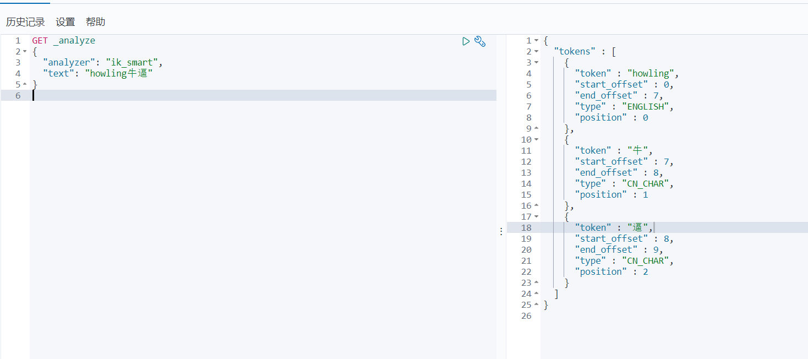
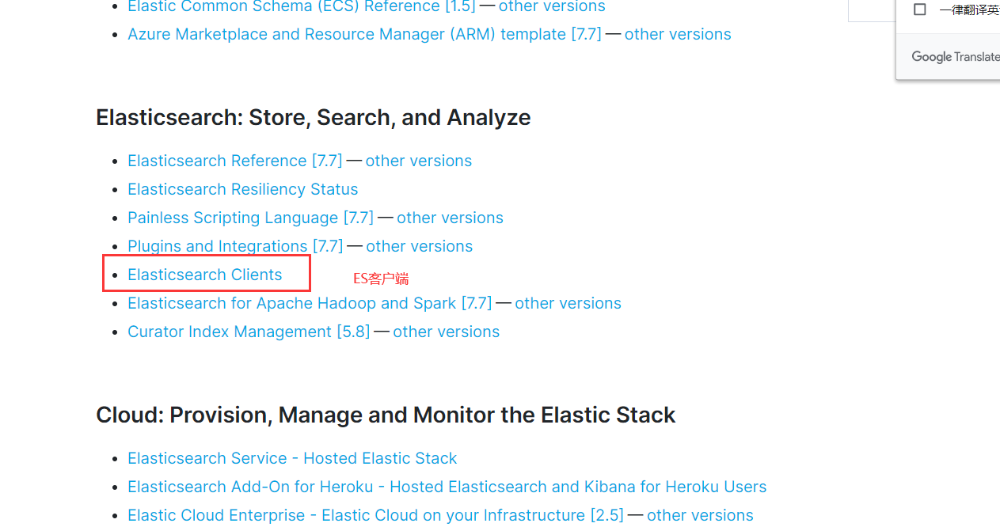
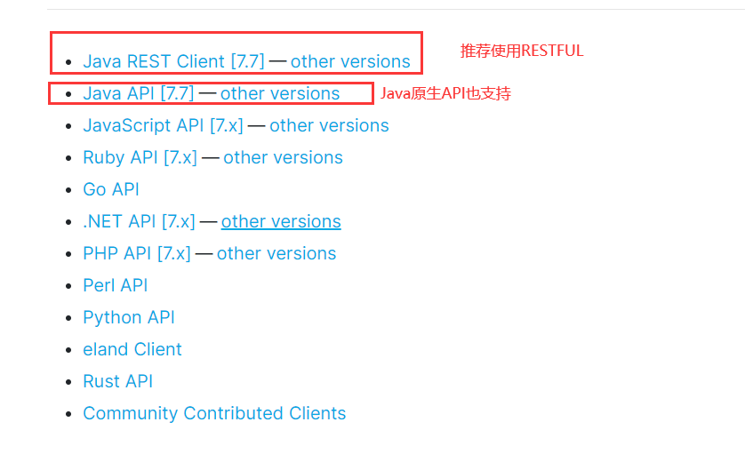
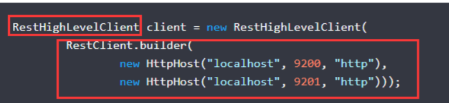

# 前面的话

本笔记出自狂神说：https://www.bilibili.com/video/BV17a4y1x7zq?p=13


# 前言

1998年9月4日，Google公司在美国硅谷成立。正如大家所知，它是一家做搜索引擎起家的公司。


无独有偶，一位名叫`Doug Cutting`的美国工程师，也迷上了搜索引擎。他做了一个用于文本搜索的函数库（姑且理解为软件的功能组件），命名为==Lucene==。


Lucene是用JAVA写成的，目标是为各种中小型应用软件加入==全文检索==功能。因为好用而且==开源==，非常受程序员们的欢迎。


> Lucene 是一套信息检索工具包！ jar包！ ==不包含 搜索引擎系统==
>
> 包含的：索引结构，读写索引的工具，排序，搜索规则.... 工具类


**Lucene 和 ElasticSearch 关系**

- ElasticSearch 是基于 Lucene 做了一些封装和增强（我们上手是十分简单！）


# ElasticSearch概述

Elaticsearch，简称为es， es是一个==开源==的==高扩展的分布式全文检索引擎==，它可以==近乎实时的存储、检索数据==；本身扩展性很好，可以扩展到上百台服务器，处理PB级别（大数据时代）的数据。es也使用


Java开发并使用Lucene作为其核心来实现所有索引和搜索的功能，但是它的目的是通过简单的RESTfulAPI来隐藏Lucene的复杂性，从而让全文搜索变得简单。


据国际权威的数据库产品评测机构DB Engines的统计，在2016年1月，ElasticSearch已超过Solr等，成为排名第一的搜索引擎类应用


# ES和Solr的比较

## **Elasticsearch简介**

Elasticsearch是一个==实时分布式搜索和分析引擎==。它让你以前所未有的速度处理大数据成为可能。


它用于==全文搜索、结构化搜索、分析==以及将这三者混合使用


通过简单的==RESTful API==来隐藏Lucene的复杂性，从而让全文搜索变得简单

## Solr简介

Solr 是==Apache下的一个顶级开源项目==，采用Java开发，它是基于Lucene的全文搜索服务器。


Solr提供了比Lucene更为丰富的查询语言，同时实现了==可配置、可扩展，并对索引、搜索性能进行了优化==


## 两者对比

| Solr                               | ES                                         |
| ---------------------------------- | ------------------------------------------ |
| 支持Json，Xml，CS                  | 仅支持Json                                 |
| 安装稍微复杂                       | 开箱即用                                   |
| 利用Zookeeper进行分布式管理        | 自身带有分布式协调管理功能                 |
| 提供的功能更多                     | 更注重核心功能，更多功能以第三方插件提供   |
| 查询快，更新索引慢                 | 建立索引快，查询慢（实时性查询快）         |
| 基于传统搜索应用的有力解决方案     | 新兴的实时搜索                             |
| 比较成熟，用户更多，开发者社区更大 | 相对开发维护者较少，更新太快，学习成本较高 |


# ELK

ELK是==Elasticsearch、Logstash、Kibana==三大开源框架首字母大写简称。市面上也被成为==Elastic Stack==


**Logstash是ELK的中央数据流引擎**

> 用于从不同目标（文件/数据存储/MQ）收集的不同格式数据，经过过滤后支持输出到不同目的地：
>
> - 文件
> - MQ
> - redis
> - elasticsearch
> - kafka


**Kibana**

可以将elasticsearch的数据通过友好的页面展示出来，提供实时分析的功能。


> 市面上很多开发只要提到ELK能够一致说出它是一个日志分析架构技术栈总称。
>
> 但实际上ELK不仅仅适用于日志分析，它还可以支持其它任何数据分析和收集的场景，日志分析和收集只是更具有代表性。

# ES安装

官网：https://www.elastic.co/


## windows下：解压即用

1. 文件目录

```bash
bin 启动文件
config 配置文件
	log4j2 日志配置文件
	jvm.options java 虚拟机相关的配置
	elasticsearch.yml elasticsearch 的配置文件！ 默认 9200 端口！ 跨域！
lib 相关jar包
logs 日志！
modules 功能模块
plugins 插件！
```

2. 启动，访问9200


## Windows下安装可视化界面

1. 需要前端环境，比如nodejs等

2. 下载地址：https://github.com/mobz/elasticsearch-head/

   ```bash
   npm install
   ```

3. 启动，访问9100

   ```bash
   npm run start
   ```

   

4. 连接测试，发现有一个跨域问题，访问不到ES，那么我们配置ES

   ```bash
   http.cors.enabled: true
   http.cors.allow-origin: "*"
   ```

   

5. 重启ES服务，测试连接

   

---

# 安装Kibana

==注意，Kibana要和ES的版本一致，否则会出大问题==

1. 官网：https://www.elastic.co/cn/kibana

2. 好消息是解压即可，坏消息是解压要半小时

3. 启动测试

   

4. 访问5601，出现了界面

5. 汉化：默认是英文版的，但是Kibana有中文版的，只需要配置即可：`zh-CN`

   

6. 配置完成之后再次重启，进入5601

   

---

# ES核心概念

1. 索引：数据库，非常多文档的集合
2. 字段类型：整型，浮点型，.....
3. 文档：一条条的数据，Json格式

**物理设计：**

ES在后台将==每一个索引划分为多个分片==，==每一个分片可以在集群中的不同服务器之间迁移==。

如果没有集群配置，那么一个人就是一个集群，默认集群名字是elasticsearch


**逻辑设计：**

我们寻找文档，可以通过：索引-->类型-->文档ID来找到它


**倒排索引**

假设现在有两个文档：

```bash
Study every day, good good up to forever # 文档1包含的内容
To forever, study every day, good good up # 文档2包含的内容
```

现在将每一个词条抽出来，然后创建一个不重复的排序列表，这就是倒排索引

| term    | doc_1 | doc_2 |
| ------- | ----- | ----- |
| Study   | ✔     | x     |
| To      | ✖     | ✔     |
| every   | ✔     | ✔     |
| forever | ✔     | ✔     |
| day     | ✔     | ✔     |
| student | ✖     | ✔     |
| good    | ✔     | ✔     |
| to      | ✔     | ✖     |
| up      | ✔     | ✔     |

那么我们现在想要根据倒排索引查询：to forever

| term    | doc_1 | doc_2 |
| ------- | ----- | ----- |
| to      | ✔     | ✖     |
| forever | ✔     | ✔     |

那么两个文档都能匹配到，但是doc_1匹配度（权重）更高，所以默认按照权重排序的话，doc_1在前面。


再看另外的实例：


假如我要查找python，不会到文档4去查找，因为倒排索引文档中根本就没有。


**索引**

当我们想要创建索引时：


在刚才的物理设计中我们说过，一个索引有多个分片，每一个分片都可以在集群内中的不同服务器中进行转移。


现在引入另外一个概念：节点。

一个节点是一个ES进程，节点可以有多个索引。

默认的，如果你创建索引，那么==索引将会有五个分片==（如上图），这五个分片又称主分片。

==每一个主分片都会有一个副本==，副本又称复制分片。


但是主分片和复制分片不会在同一个节点内，这样做的原因是：

假如有一个节点挂掉了，数据也不会丢失。


==事实上，一个分片是一个Luncene索引，包含倒排索引的文件目录==


上图就是一个集群中的多节点。我们可以看到索引的主分片和复制分片不在同一个节点内。


---

# IK分词器插件

## 什么是IK分词器

分词器有很多种，ES内置的有很多，但是专为中文分词还真没有几个。

IK分词器，专为中文分词。

## 安装

1. 下载：https://github.com/medcl/elasticsearch-analysis-ik

2. 下载完成之后，放到ES插件中即可，会自动读取

   

3. 重启观察ES，发现被加载了

   

## 使用

IK分词器有两种使用方式：


**最小切分**


**最细粒度划分**


> 这么一看可能还不太清楚，那就说清楚点：
>
> - 最小切分：按照一个词一个词地拆分，拆成最小的==词语==。
> - 最细粒度划分：==不管是词还是字==，只要在字典里的，那就拆。


## 配置字典


经过上面的基本使用，那么问题来了：词典在哪呢？


这就是词典的路径，如果要添加词典，那么就要打开这个文件，添加自己的词典


举个例子，我输入`howling牛逼`，但是并没有这个词




下面我自己定义一个词典，然后重新启动ES


在启动的过程中，发现IK分词器插入了一个自己配置的字典：


下面再次请求


> 有了

---

# ES的Rest请求说明

| method | 例子                               | 描述                   |
| ------ | ---------------------------------- | ---------------------- |
| PUT    | `索引名字/类型名字/文档id`         | 创建文档（指定id）     |
| POST   | `索引名字/类型名字`                | 创建文档（随机指定id） |
| POST   | `索引名字/类型名字/文档id/_update` | 修改文档               |
| DELETE | `索引名字/类型名字/文档id`         | 删除文档               |
| GET    | `索引名字/类型名字/文档id`         | 通过文档id查询文档     |
| POST   | `索引名字/类型名字/_search`        | 查询所有数据           |

> ==注意，REST全部都要大写==


## **PUT**

> PUT创建

```json
PUT /test2/_doc/1
{
  "name": "howling",
  "age": 3
}
```


> 看这里，警告说不推荐使用类型，这是因为类型在以后的ES中将会废弃，以后的默认类型就是`_doc`，我们听官方的
>
> 


## **POST**

> POST创建

```json
POST /test1/_doc
{
  "name": "howling",
  "age": 3
}
```


> POST修改

```json
POST /test1/_doc/wl6mX3IBMWmBNnUPxx_8/_update
{
  "doc": {
    "name": "bean",
    "age": 113
  }
}
```


> POST查询

```json
POST test4/_doc/_search
```


## **DELETE**

> DELETE删除文档

```json
DELETE test1/_doc/wl6mX3IBMWmBNnUPxx_8
```


## GET

> GET获取文档

```json
GET /test4/_doc/1
```


---

## 修改使用POST和PUT的比较

未修改之前：


**原来的方法就是使用PUT来修改**

```json
PUT test4/_doc/1
{
  "name": "bean"
}
```


> `age`给改没了


**现在的方法是使用POST来修改**

> 复原数据，再来一次

```json
POST test4/_doc/1/_update
{
  "doc": {
    "name": "bean"
  }
}
```


> 发现`age`没有变


==所以现在我们通常使用POST来进行修改，虽然写法上有些复杂，但是数据不会丢失==

---

# ES创建索引规则

在上面，索引规则是自动添加的，可以截个图看一下：


> 从这张图可以看出来，在我们没有指定索引的情况下，ES可以根据我们输入的数据自动推算


**索引类型**

- 字符串：text，keyword
- 数值：byte，short，integer，long，double，float，half_float，scaled_float
- 日期：date
- 布尔：boolean
- 二进制：binary
- 等

> 其中有一些类型的区别我们需要探讨一下，后面会讲到

**我们也可以手动指定索引类型**

> 我们可以看到，在上面的图中，有一个mappings，指定了类型，这里也是mappings

```json
PUT /test2
{
  "mappings": {
    "properties": {
      "name": {
        "type": "text"
      },
      "age": {
        "type": "long"
      },
      "birthday": {
        "type": "date"
      }
    }
  }
}
```

> ==注意，我只是指定到了索引的类型，而没有指定到类型或者是某一个文档==


> 可以通过GET命令查看
>
> 

---

# 复杂搜索


## 前言

我们之前在REST请求的时候曾经有过搜索，根据ID的最简单搜索，但是我们当然不限于此

我们知道，其实大部分时间都在和查询打交道，所以查询是重点。


接下来请看查询的骚操作

- 排序查询
- 分页查询
- 高亮查询
- 模糊查询
- 精准查询
- 多条件查询
- 多参数匹配查询

## 查询

### term和match，keyword和text的分析对比

在开始之前，我先在文档里面放入四个数据：


下面使用这四条数据来进行两组的说明

#### **term和match**

- term：用于精确匹配
- match：用于分词匹配

> 这样说可能有点不太好理解，那就用通俗点的说：
>
> term只能查一个词，match能查多个词。

> 原因在于：term是直接进行倒排索引的方式查询的，而match是通过分词的方式查询的

> 倒排索引的方式一下只能查询一个词语。
>
> 分词查询是先分词，然后在查询

理论很清晰了，下面来看例子

**term**

```json
GET /test1/_search
{
  "query": {
    "term": {
      "name": "howling"
    }
  }
}
```


> 查询单个词还不错

```json
GET /test1/_search
{
  "query": {
    "term": {
      "name": "howling bean"
    }
  }
}
```


> 查多个词查不到，原因已经讲过了，倒排索引一次只能查询一个


**match**

```json
GET /test1/_search
{
  "query": {
    "match": {
      "name": "howling bean"
    }
  }
}
```


> 四个都查出来了

```json
GET /test1/_search
{
  "query": {
    "match": {
      "name": "howling"
    }
  }
}
```


> 查询单个更是不在话下


#### keyword和text

- keyword：不能被拆分
- text：可以被拆分

> 这么说吧，keyword可以被分词器拆分，而text不可以被分词器拆分

> 在细致点：
>
> - keyword可以看成是一个字
> - 而text可以看成是一句话
>
> 所以keyword不可以被拆分的意思是，只要有了keyword属性，那么这个属性就相当于一个字，一个字还想怎么被分词器解析呢？
>
> text可以看成一句话，所以一句话可以被分词器解析的

> 那么就又印出来一个新的操作：
>
> keyword既然可以被看成一个字，那么在term上就可以解析了，因为倒排索引显然可以查询一个字

下面来看一组对比：

**term**

```bash
GET /test1/_search
{
  "query": {
    "term": {
      "tags": "a b"
    }
  }
}
```


**match**

```json
GET /test1/_search
{
  "query": {
    "match": {
      "tags": "a b"
    }
  }
}
```


> 注意match，假如是使用了分词器解析的时候，tags明显可以被分成`a`，`b`，`ab`等词语
>
> 但是现在只是查询出了一个，所以说明没有被分词器解析到

#### 我非要让term查询多个词语

这个说明就像标题，我非要让term查询多个词语怎么办呢？

没有办法，但是我们可以进行多次查询。

使用`terms`，我们可以指定多个词语来进行多次倒排索引的查询，结果一起返回

```bash
GET /test1/_search
{
  "query": {
    "terms": {
      "name": ["howling","bean"]
    }
  }
}
```


---

### 布尔值查询（多条件匹配）

#### 前言

bool查询：

- must：等同于and，所有条件都要符合
- should：等同于or，只要符合一个条件即可
- must_not：等同于not，取反
- filter：过滤器
- gte：大于等于
- lte：小于等于
- gt：大于
- lt：小于

#### **must，should，must_not**

**must**

```json
GET /test1/_search
{
  "query": {
    "bool": {
      "must": [
        {
          "match": {"name": "howling"}
        },
        {
          "match": {"tags": "b"}
        }
      ]
    }
  }
}
```


**should**

```json
GET /test1/_search
{
  "query": {
    "bool": {
      "should": [
        {
          "match": {"name": "howling"}
        },
        {
          "match": {"tags": "b"}
        }
      ]
    }
  }
}
```


**must_not**

```json
GET /test1/_search
{
  "query": {
    "bool": {
      "must_not": [
        {
          "match": {"name": "howling"}
        },
        {
          "match": {"tags": "b"}
        }
      ]
    }
  }
}
```


---

#### filter，gt，lt，gte，lte

一个例子足够

```json
GET /test1/_search
{
  "query": {
    "bool": {
      "must": [
        {
          "match": {"name": "howling"}
        }
      ],
      "filter": [
        {
          "range": {
            "age": {
              "gt": 10,
              "lt": 20
            }
          }
        }
      ]
    }
  }
}
```


## 一条件多参数匹配

其实前面已经见过了

```bash
GET /test1/_search
{
  "query": {
    "match": {
      "name": "howling bean"
    }
  }
} 
```


> 空格隔开，代表一个条件多个参数，这个时候可以使用分词器解析

## 排序

==排序警告：原本我们的排序是使用权重排序的，一旦自定义排序之后，权重就失效了==

排序：`order`

```json
GET /test1/_search
{
  "query": {
    "match": {
      "name": "howling"
    }
  },
  "sort": [
    {
      "tags": {
        "order": "asc"
      }
    }
  ]
}
```

> 根据tags来排序，ASC和DESC应该不用说了


## 分页

`分页：from-size`

- from：从第几个数据开始
- size：显示几条数据

```json
GET /test1/_search
{
  "query": {
    "match": {
      "name": "howling"
    }
  },
  "from": 0,
  "size": 1
}
```


## 高亮

高亮：`highlight`

```json
GET /test1/_search
{
  "query": {
    "match": {
      "name": "howling bean"
    }
  },
  "highlight": {
    "fields": {
      "name": {}
    }
  }
} 
```


> 看到标签了么，这就是给前端加上的高亮


**自定义高亮**

```json
GET /test1/_search
{
  "query": {
    "match": {
      "name": "howling"
    }
  },
  "highlight": {
    "pre_tags": "<p style='color:red'>", 
    "post_tags": "</p>", 
    "fields": {
      "name": {}
    }
  }
} 
```


> 这是自定义高亮
>
> 注意我这里有一个细节：查询的时候查询的是howling，那么bean就是没有带上标签

---

# SpringBoot集成ES

一切从官方文档开始：https://www.elastic.co/guide/index.html






1. 找到依赖

   ```xml
   <dependency>
       <groupId>org.elasticsearch.client</groupId>
       <artifactId>elasticsearch-rest-high-level-client</artifactId>
       <version>7.6.2</version>
   </dependency>
   ```

2. 找对象

   

   

   > 用完别忘了关闭

3. 保证依赖一致

   

   

4. 源码中提供对象

   


1. 依赖

   ```xml
       <properties>
           <java.version>1.8</java.version>
   
           <!--手动更改es版本-->
           <elasticsearch.version>7.6.1</elasticsearch.version>
       </properties>
   ```

   ```xml
           <!-- https://mvnrepository.com/artifact/com.alibaba/fastjson -->
           <dependency>
               <groupId>com.alibaba</groupId>
               <artifactId>fastjson</artifactId>
               <version>1.2.68</version>
           </dependency>
           <dependency>
               <groupId>org.springframework.boot</groupId>
               <artifactId>spring-boot-starter-data-elasticsearch</artifactId>
           </dependency>
   ```

   

2. 配置

   ```java
   package com.bean.config;
   
   
   import org.apache.http.HttpHost;
   import org.elasticsearch.client.RestClient;
   import org.elasticsearch.client.RestHighLevelClient;
   import org.springframework.context.annotation.Bean;
   import org.springframework.context.annotation.Configuration;
   
   @Configuration
   public class ElasticSearchClientConfig {
   
       @Bean
       public RestHighLevelClient restHighLevelClient() {
           RestHighLevelClient client = new RestHighLevelClient(
                   RestClient.builder(
                           //localhost，es的端口，连接方式
                           new HttpHost("localhost", 9200, "http")
                   )
           );
           return client;
       }
   
   }
   ```

3. 弄一个简单的对象

   ```java
   package com.bean.pojo;
   
   
   import lombok.AllArgsConstructor;
   import lombok.Data;
   import lombok.NoArgsConstructor;
   import lombok.experimental.Accessors;
   import org.springframework.stereotype.Component;
   
   @AllArgsConstructor
   @NoArgsConstructor
   @Data
   @Accessors(chain = true)
   @Component
   public class User {
   
       private String name;
       private int age;
   }
   ```

4. 尝试API

   ```java
   package com.bean;
   
   
   import com.alibaba.fastjson.JSON;
   import com.bean.pojo.User;
   import org.apache.lucene.util.QueryBuilder;
   import org.elasticsearch.action.admin.indices.delete.DeleteIndexRequest;
   import org.elasticsearch.action.bulk.BulkRequest;
   import org.elasticsearch.action.bulk.BulkResponse;
   import org.elasticsearch.action.delete.DeleteRequest;
   import org.elasticsearch.action.delete.DeleteResponse;
   import org.elasticsearch.action.get.GetRequest;
   import org.elasticsearch.action.get.GetResponse;
   import org.elasticsearch.action.index.IndexRequest;
   import org.elasticsearch.action.index.IndexResponse;
   import org.elasticsearch.action.search.SearchRequest;
   import org.elasticsearch.action.search.SearchResponse;
   import org.elasticsearch.action.support.master.AcknowledgedResponse;
   import org.elasticsearch.action.update.UpdateRequest;
   import org.elasticsearch.action.update.UpdateResponse;
   import org.elasticsearch.client.IndicesClient;
   import org.elasticsearch.client.RequestOptions;
   import org.elasticsearch.client.RestHighLevelClient;
   import org.elasticsearch.client.indices.CreateIndexRequest;
   import org.elasticsearch.client.indices.CreateIndexResponse;
   import org.elasticsearch.client.indices.GetIndexRequest;
   import org.elasticsearch.common.unit.TimeValue;
   import org.elasticsearch.common.xcontent.XContentType;
   import org.elasticsearch.index.get.GetResult;
   import org.elasticsearch.index.query.MatchAllQueryBuilder;
   import org.elasticsearch.index.query.QueryBuilders;
   import org.elasticsearch.index.query.TermQueryBuilder;
   import org.elasticsearch.search.SearchHit;
   import org.elasticsearch.search.builder.SearchSourceBuilder;
   import org.junit.jupiter.api.Test;
   import org.springframework.beans.factory.annotation.Autowired;
   import org.springframework.beans.factory.annotation.Qualifier;
   import org.springframework.boot.test.context.SpringBootTest;
   
   import java.io.IOException;
   import java.util.ArrayList;
   import java.util.List;
   import java.util.concurrent.TimeUnit;
   
   @SpringBootTest
   class EsApplicationTests {
   
       @Autowired
       @Qualifier("restHighLevelClient")
       private RestHighLevelClient client;
   
       //创建索引
       @Test
       void createIndex() throws IOException {
           //创建一个请求，请求包含创建的索引
           CreateIndexRequest request = new CreateIndexRequest("bean_test");
   
           //这个indicesClinet包含了所有东西
           IndicesClient indices = client.indices();
   
           //创建索引，把请求给他，请求设置就使用默认的就好
           CreateIndexResponse createIndexResponse = indices.create(request, RequestOptions.DEFAULT);
   
           //打印一下看看什么东西:org.elasticsearch.client.indices.CreateIndexResponse@8a7f4660
           System.out.println(createIndexResponse);
       }
   
       //查看索引是否存在
       @Test
       void isExistIndex() throws IOException {
           //创建一个请求，请求包含创建的索引
   
           GetIndexRequest request = new GetIndexRequest("bean_test");
   
           IndicesClient indices = client.indices();
   
           boolean exists = indices.exists(request, RequestOptions.DEFAULT);
   
           System.out.println(exists);
       }
   
       //删除索引
       @Test
       void deleteIndex() throws IOException {
           DeleteIndexRequest request = new DeleteIndexRequest("bean_test");
   
           AcknowledgedResponse delete = client.indices().delete(request, RequestOptions.DEFAULT);
   
           //查看是否删除成功
           System.out.println(delete.isAcknowledged());
       }
   
       //插入文档
       @Test
       void indexDocument() throws IOException {
           User user = new User("bean", 10);
   
           //规则： put/bean_test/1
           IndexRequest request = new IndexRequest("bean_test");
           request.id("1");
           //设置超时时间为1s
           request.timeout(TimeValue.timeValueSeconds(1));
   
           //将数据放入json
           request.source(JSON.toJSONString(user), XContentType.JSON);
   
           //发送数据，获得相应
           IndexResponse response = client.index(request, RequestOptions.DEFAULT);
   
           System.out.println(request.toString());//返回索引信息：index {[bean_test][_doc][1], source[{"age":10,"name":"bean"}]}
   
           System.out.println(response.status());//返回当前的状态：CREATED
   
       }
   
   
       //文档是否存在
       @Test
       void existDocument() throws IOException {
           GetRequest request = new GetRequest("bean_test", "1");
   
           boolean exists = client.exists(request, RequestOptions.DEFAULT);
   
           System.out.println(exists);
       }
   
       //获得文档的具体信息
       @Test
       void getDocument() throws IOException {
           GetRequest request = new GetRequest("bean_test", "1");
   
           GetResponse getResponse = client.get(request, RequestOptions.DEFAULT);
   
           //打印文档内容：{"age":10,"name":"bean"}
           System.out.println(getResponse.getSourceAsString());
   
           //返回的全部的内容：{"_index":"bean_test","_type":"_doc","_id":"1","_version":2,"_seq_no":1,"_primary_term":1,"found":true,"_source":{"age":10,"name":"bean"}}
           System.out.println(getResponse);
       }
   
       //更新文档
       @Test
       void updateDocument() throws IOException {
           UpdateRequest request = new UpdateRequest("bean_test", "1");
   
           User user = new User("豌豆", 22);
   
           UpdateRequest doc = request.doc(JSON.toJSONString(user), XContentType.JSON);
   
           UpdateResponse updateResponse = client.update(request, RequestOptions.DEFAULT);
   
           //OK
           System.out.println(updateResponse.status());
   
       }
   
       //删除文档
       @Test
       void deleteDocument() throws IOException {
   
           DeleteRequest request = new DeleteRequest("bean_test", "1");
   
           DeleteResponse deleteResponse = client.delete(request, RequestOptions.DEFAULT);
   
           //OK
           System.out.println(deleteResponse.status());
   
       }
   
       //批量请求
       @Test
       void testBulkRequest() throws IOException {
           BulkRequest bulkRequest = new BulkRequest();
   
           List<User> list = new ArrayList<>();
           list.add(new User("bean1", 3));
           list.add(new User("bean2", 3));
           list.add(new User("bean3", 3));
           list.add(new User("bean4", 3));
           list.add(new User("bean5", 3));
           list.add(new User("bean6", 3));
   
           for (int i = 0; i < list.size(); i++) {
               bulkRequest.add(
                       new IndexRequest("bean_test")
                               .id("" + (i + 1))
                               .source(JSON.toJSONString(list.get(i)), XContentType.JSON)
               );
           }
   
           BulkResponse bulk = client.bulk(bulkRequest, RequestOptions.DEFAULT);
           System.out.println(bulk.hasFailures());//false，但是false代表的是成功
       }
   
   
       //查询
       @Test
       void search() throws IOException {
           SearchRequest request = new SearchRequest("bean_test");
   
           //利用这个搜索构建器可以构建出所有的查询条件，我们的原生所有的搜索条件都在这里
           SearchSourceBuilder builder = new SearchSourceBuilder();
   
   
           //比如我要使用高亮：builder.highlighter()
           //比如说我要分页：builder.from()，builder.size()
           //排序：builder.sort()
   
           //虽然所有的条件都在这里，但是有些需要一些构造器，比如query就需要一个query的builder
           //下面使用query作为一个例子：可以使用queryBuilders这个工具类进行快速匹配
   
   
   //        MatchAllQueryBuilder queryBuilder = QueryBuilders.matchAllQuery();
           TermQueryBuilder queryBuilder = QueryBuilders.termQuery("name", "bean1");
           //查询
           builder.query(queryBuilder);
   
           //设置超时时间
           builder.timeout(new TimeValue(60, TimeUnit.SECONDS));
   
           //将搜索构建起放到请求里面
           request.source(builder);
           //执行
           SearchResponse search = client.search(request, RequestOptions.DEFAULT);
   
           //在之前我们就说过，hits里面都是具体的信息
           /*
               {
                   "fragment":true,
                   "hits":
                       [
                           {
                               "fields":{},
                               "fragment":false,
                               "highlightFields":{},
                               "id":"1",
                               "matchedQueries":[],
                               "primaryTerm":0,
                               "rawSortValues":[],
                               "score":1.540445,
                               "seqNo":-2,
                               "sortValues":[],
                               "sourceAsMap":{"name":"bean1","age":3},
                               "sourceAsString":"{\"age\":3,\"name\":\"bean1\"}",
                               "sourceRef":{"fragment":true},
                               "type":"_doc",
                               "version":-1
                           }
                       ],
                   "maxScore":1.540445,
                   "totalHits":{"relation":"EQUAL_TO","value":1}
               }
            */
           System.out.println(JSON.toJSONString(search.getHits()));
   
           System.out.println("==========================");
   
           ////{name=bean1, age=3}
           for (SearchHit hit : search.getHits().getHits()) {
               System.out.println(hit.getSourceAsMap());
           }
       }
   }
   ```

   


# 爬虫练习

找京东的页面

1. 依赖

   ```xml
           <dependency>
               <groupId>org.springframework.boot</groupId>
               <artifactId>spring-boot-starter-data-elasticsearch</artifactId>
           </dependency>
   
   
           <!-- https://mvnrepository.com/artifact/org.jsoup/jsoup -->
           <dependency>
               <groupId>org.jsoup</groupId>
               <artifactId>jsoup</artifactId>
               <version>1.11.3</version>
           </dependency>
   ```

2. pojo，对应名字，价格，图片

   ```java
   package com.bean.pojo;
   
   
   import lombok.AllArgsConstructor;
   import lombok.Data;
   import lombok.NoArgsConstructor;
   import lombok.experimental.Accessors;
   
   @Data
   @AllArgsConstructor
   @NoArgsConstructor
   @Accessors(chain = true)
   public class Content {
   
       private String name;
       private String price;
       private String img;
   }
   ```

3. Util

   ```java
   package com.bean.utils;
   
   import com.bean.pojo.Content;
   import org.jsoup.Jsoup;
   import org.jsoup.nodes.Document;
   import org.jsoup.nodes.Element;
   import org.jsoup.select.Elements;
   
   import java.io.IOException;
   import java.net.URL;
   import java.util.ArrayList;
   import java.util.List;
   
   public class JsoupUtil {
   
       public static List<Content> getMessage(String keyword) throws IOException {
   
           String url = "https://search.jd.com/Search?keyword="+keyword+"&enc=utf-8";
   
           List<Content> contents = new ArrayList<>();
   
   
           //返回的json
           Document document = Jsoup.parse(new URL(url), 3000);
   
           //获取所有的产品列表
           Element elements = document.getElementById("J_goodsList");
           //获取所有的li
           Elements li = elements.getElementsByTag("li");
   
           for (Element element : li) {
               //获取对应的图片
               String img = element.getElementsByTag("img").get(0).attr("src");
               //获取对应的价格
               String price = element.getElementsByClass("p-price").get(0).text();
               //获取对应的名称
               String name = element.getElementsByClass("p-name").get(0).getElementsByTag("em").text();
   
               contents.add(new Content(name,price,img));
           }
           return contents;
       }
   }
   ```

4. 测试

   ```java
   package com.bean;
   
   import com.bean.pojo.Content;
   import com.bean.utils.JsoupUtil;
   import org.jsoup.Jsoup;
   import org.jsoup.nodes.Document;
   import org.jsoup.nodes.Element;
   import org.jsoup.select.Elements;
   import org.junit.jupiter.api.Test;
   import org.springframework.boot.test.context.SpringBootTest;
   
   import java.io.IOException;
   import java.net.MalformedURLException;
   import java.net.URL;
   import java.util.List;
   
   @SpringBootTest
   class EsjdApplicationTests {
   
       @Test
       void contextLoads() throws IOException {
   
           List<Content> message = JsoupUtil.getMessage("你好");
   
           message.forEach(System.out::println);
       }
   
   }
   ```

   