# 前言

- 参考BiliBili 尚硅谷：https://www.bilibili.com/video/BV1LK411s7RX

- 官网：http://shardingsphere.apache.org/index_zh.html


# Apache ShardingSphere

## **概念**

- `Apache ShardingSphere`，于2020年4月16日成为Apache的顶级开源项目

- 轻量级框架，定位为关系型数据库中间件，可以理解为高级JDBC，完全兼容各种ORM框架和任何实现JDBC规范的数据库

- 由三个单位组成：

  - JDBC
  - Proxy
  - Sidecar（孵化中）

  > 我们主要学习前两个

----

## **拆分**


### **为什么要知道拆分**

在学习之前，首先要了解一些概念：水平拆分，垂直拆分

那么，为什么要学习拆分？


> 我们必须要解决数据量逐渐增大的问题。
>
> 随着数据量的增大，单个数据库的表已经难以做到超高的性能，这个时候瓶颈就出现了
>
> 虽然可以利用增加服务器的方式来进行短暂的缓解，但其实是治标不治本。所以这个时候拆分应运而生

> 拆分的本质其实就是数据分散


### **水平拆分**

`水平拆分分为数据库的水平拆分和数据表的水平拆分`

拆分的本质就是将一个数据库和数据表的`结构`，复制一份，然后根据对应的规则决定分散到那个数据库中的那个数据表中

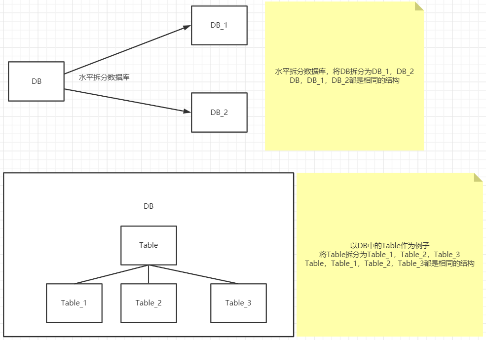

> 按照数据表举例子，我想要将id能够被2整除的放到数据表1中，将id不能整除的放到数据表2中


### **垂直拆分**

`垂直拆分就是根据功能，将数据库/表拆分为不同的分数据库/表`

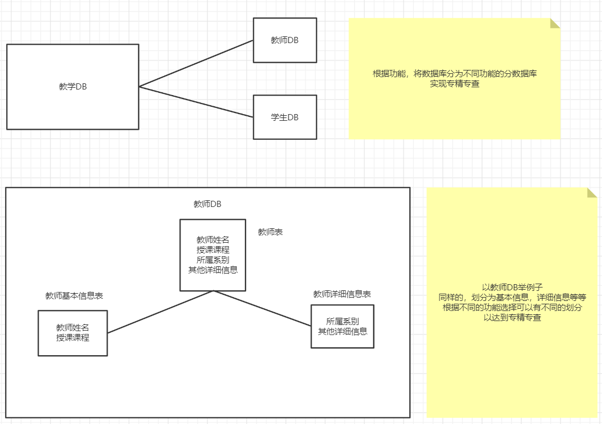

> 可能对于这个垂直拆分还有疑问，举个例子：
>
> 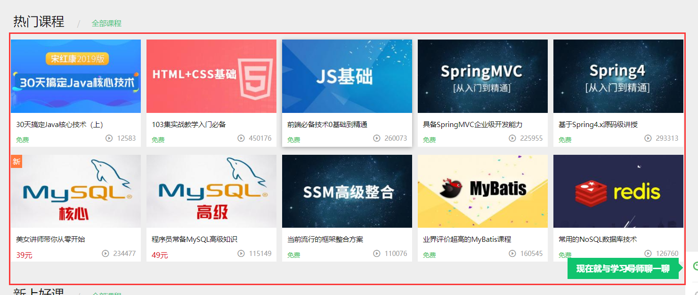
>
> 在上面的图中，只显示了课程的基本信息：名字，图片，价格，播放量等
>
> 但是只要随便点进去一个课程，则会显示出其他的具体信息：
>
> 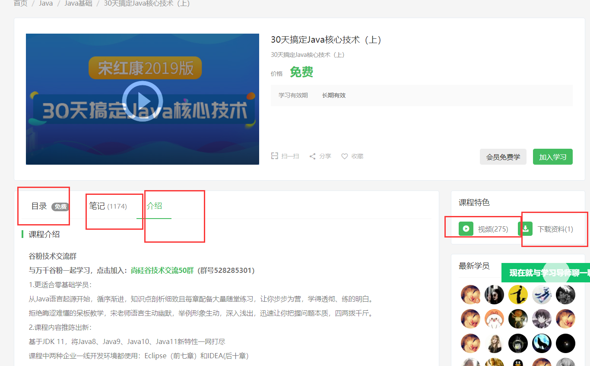
>
> 目录，笔记，介绍，视频，下载资料，等等...
>
> 一开始查看的时候肯定没有必要把这些详细的信息都列出来，但是点击查看具体的信息的时候就有必要了
>
> 如果使用垂直拆分，就可以做到专精专用

---

### **垂直拆分和水平拆分应该在什么时候使用**

这样讲，垂直拆分的话，应该在一开始设计数据库，设计表结构的时候就应该想好怎么办。

但是水平拆分不应该在数据量刚刚开始增大的时候就考虑。


应该先去想一下有没有其他的解决方案，比如缓存，读写分离，集群等等。

直到最后，才应该去考虑水平拆分的问题。


因为水平拆分虽然可以缓解数据量增大的问题，但是同样也存在问题：

1. 数据库和表联合查询的时候带来的问题，不在同一台服务器上应该如何查询
2. 数据源不一致的问题，不在同一台服务器上，应该如何解决这个问题

---

## Sharding-JDBC

### **概念**

我们首先来学习JDBC

- 开源的，轻量级的Java框架
- 增强版的JDBC
- 支持任何基于JDBC的ORM框架，如：JPA，Mybatis，Hibernate，Spring JDBC Template，JDBC
- 支持任何第三方的数据库连接池，如：DBCP，C3P0，Druid
- 支持任何实现JDBC的数据库，如：MySQL，Oracle，SQLServer等


ShardingJDBC并不是做分库分表，分库分表的结构应该是有我们自己来设计，ShardingJDBC的作用是`数据分发，读写分离`


### **水平分表**

#### **搭建环境**

1. 技术：SpringBoot+MybatisPlus+ShardingJDBC+Druid

2. 新建SpringBoot项目

3. 依赖

   ```xml
           <dependency>
               <groupId>mysql</groupId>
               <artifactId>mysql-connector-java</artifactId>
           </dependency>
   
           <dependency>
               <groupId>com.alibaba</groupId>
               <artifactId>druid</artifactId>
               <version>1.1.22</version>
           </dependency>
   
           <dependency>
               <groupId>com.baomidou</groupId>
               <artifactId>mybatis-plus-boot-starter</artifactId>
               <version>3.0.5</version>
           </dependency>
   
           <dependency>
               <groupId>org.apache.shardingsphere</groupId>
               <artifactId>sharding-jdbc-spring-boot-starter</artifactId>
               <version>4.1.1</version>
           </dependency>
   
           <dependency>
               <groupId>org.projectlombok</groupId>
               <artifactId>lombok</artifactId>
           </dependency>
   ```

4. 按照水平分表的方式创建数据库和表

   ```mysql
   create database course_db;
   
   use course_db;
   
   create table course_1(
       cid bigint(20) primary key,# 注意这不能写自增之类的
       cname varchar(50) not null,
       user_id bigint(20) not null ,
       cstatus varchar(10) not null
   );
   
   create table course_2(
       cid bigint(20) primary key,# 注意这不能写自增之类的
       cname varchar(50) not null,
       user_id bigint(20) not null ,
       cstatus varchar(10) not null
   );
   ```

   > 

5. 新建实体类

   ```java
   package com.howling.pojo;
   
   import lombok.Data;
   import lombok.experimental.Accessors;
   
   @Data
   @Accessors(chain = true)
   public class Course {
   
       private Long cid;
       private String cname;
       private Long userId;
       private String cstatus;
   }
   ```

6. 新建mapper

   ```java
   package com.howling.mapper;
   
   import com.baomidou.mybatisplus.core.mapper.BaseMapper;
   import com.howling.pojo.Course;
   import org.springframework.stereotype.Repository;
   
   @Repository
   public interface CourseMapper extends BaseMapper<Course> {
   }
   ```

7. 启动类

   ```java
   package com.howling;
   
   import org.mybatis.spring.annotation.MapperScan;
   import org.springframework.boot.SpringApplication;
   import org.springframework.boot.autoconfigure.SpringBootApplication;
   
   @MapperScan("com.howling.mapper")
   @SpringBootApplication
   public class ShardingjdbcApplication {
   
       public static void main(String[] args) {
           SpringApplication.run(ShardingjdbcApplication.class, args);
       }
   }
   ```

8. 编写配置文件

   ```properties
   # ------------------------------------------------------------------------------------------------
   # 给数据源起个别名，假如有多个数据源要用逗号隔开
   spring.shardingsphere.datasource.names=m1
   
   # 让一个实体类对应两张表(因为两张表的结构式一样的)
   spring.main.allow-bean-definition-overriding=true
   # ------------------------------------------------------------------------------------------------
   
   
   
   
   
   
   # ------------------------------------------------------------------------------------------------
   # 下面都是配置数据源m1的配置
   
   # 配置连接池的类型，我们选择德鲁伊
   spring.shardingsphere.datasource.m1.type=com.alibaba.druid.pool.DruidDataSource
   # 配置驱动
   spring.shardingsphere.datasource.m1.driver-class-name=com.mysql.cj.jdbc.Driver
   # 配置数据库的url
   spring.shardingsphere.datasource.m1.url=jdbc:mysql://localhost:3306/course_db?serverTimezone=Asia/Shanghai
   spring.shardingsphere.datasource.m1.username=root
   spring.shardingsphere.datasource.m1.password=root
   # ------------------------------------------------------------------------------------------------
   
   
   
   
   
   
   
   
   # ------------------------------------------------------------------------------------------------
   # 下面就是策略配置
   
   # xxx.course.xxx = xxx，其中course自己起一个名字，代表着规则
   # $->{...},代表着库/表的分布情况，比如ds$->{0..1}.t_order$->{0..1}代表着从数据库ds0和ds1中取得表t_order0和t_order1
   # 我们这里写的是m1.course_$->{1..2},代表着从m1数据库里的course_1和course_2表
   spring.shardingsphere.sharding.tables.course.actual-data-nodes=m1.course_$->{1..2}
   
   # 配置表里面的主键
   spring.shardingsphere.sharding.tables.course.key-generator.column=cid
   # 配置表中的主键的生成策略，这里SNOWFLAKE是雪花算法
   spring.shardingsphere.sharding.tables.course.key-generator.type=SNOWFLAKE
   
   # 指定分片策略按照什么来进行判断，这里我们选择使用主键来进行判断
   spring.shardingsphere.sharding.tables.course.table-strategy.inline.sharding-column=cid
   # 指定分片策略，这里我们指定  course_->{cid % 2+1}，cid%2+1就是算法，比如cid为2，那么cid%2+1=1，拼接上course_就是course_1表
   spring.shardingsphere.sharding.tables.course.table-strategy.inline.algorithm-expression=course_$->{cid%2 +1}
   # ------------------------------------------------------------------------------------------------
   
   
   
   
   
   
   
   # ------------------------------------------------------------------------------------------------
   # 打开SQL输出日志
   spring.shardingsphere.props.sql.show=true
   # ------------------------------------------------------------------------------------------------
   ```

   > 官方地址：
   >
   > 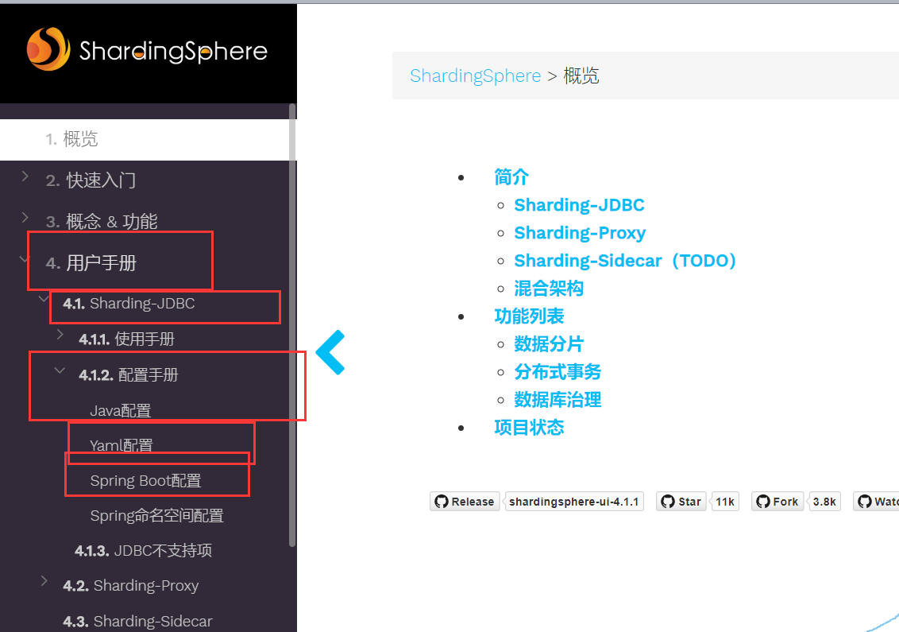

----

#### **起步**

编写测试代码


测试添加一个：

```java
package com.howling;

import com.howling.mapper.CourseMapper;
import com.howling.pojo.Course;
import org.junit.jupiter.api.Test;
import org.springframework.beans.factory.annotation.Autowired;
import org.springframework.boot.test.context.SpringBootTest;

@SpringBootTest
class ShardingjdbcApplicationTests {


    @Autowired
    private CourseMapper mapper;

    @Test
    void addCourse() {
        mapper.insert(new Course().setCname("Java").setUserId(100L).setCstatus("Normal"));
    }

}
```

> 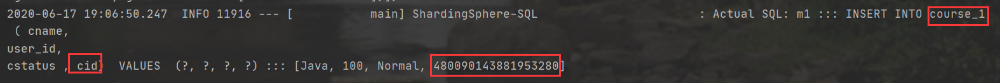
>
> 可以看到现在操作的是course_1这个表，我们打开看一下：
>
> 
>
> 果然course_1里面有东西，但是course_2里面没有


尝试多次添加

```java
package com.howling;

import com.howling.mapper.CourseMapper;
import com.howling.pojo.Course;
import org.junit.jupiter.api.Test;
import org.springframework.beans.factory.annotation.Autowired;
import org.springframework.boot.test.context.SpringBootTest;

@SpringBootTest
class ShardingjdbcApplicationTests {


    @Autowired
    private CourseMapper mapper;

    @Test
    void addCourse() {
        for (int i = 0; i < 9; i++) {
            mapper.insert(new Course().setCname("Java"+i).setUserId(100L).setCstatus("Normal"+i));
        }

    }

}
```

> 查看一下最后数据库中的内容
>
> 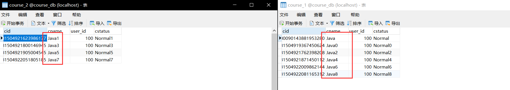
>
> 可以看到，全部都是根据算法来的，所以我们想要是否均匀分布全看雪花算法怎么给我们值。


尝试一下随意在两个数据表中取得一个值，查询

```java
package com.howling;

import com.baomidou.mybatisplus.core.conditions.query.QueryWrapper;
import com.howling.mapper.CourseMapper;
import com.howling.pojo.Course;
import org.junit.jupiter.api.Test;
import org.springframework.beans.factory.annotation.Autowired;
import org.springframework.boot.test.context.SpringBootTest;

@SpringBootTest
class ShardingjdbcApplicationTests {


    @Autowired
    private CourseMapper mapper;

    @Test
    void selectCourse() {
        QueryWrapper<Course> wrapper = new QueryWrapper<>();

        wrapper.eq("cid",481504921623986177L);

        System.out.println(mapper.selectOne(wrapper));

    }

}
```

> 关键是查看最后出来的查询语句
>
> 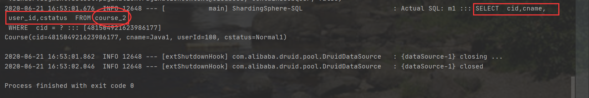
>
> 所以非常完美

---

### 水平分库

#### 搭建环境

1. 创建两个数据库为例子：`edu_db_1`，`edu_db_2`

2. 分别在两个数据库中分别新建两张表：`course_1`，`course_2`

   ```mysql
   create DATABASE edu_db_1;
   use edu_db_1;
   
   create table course_1(
       cid bigint(20) primary key,# 注意这不能写自增之类的
       cname varchar(50) not null,
       user_id bigint(20) not null ,
       cstatus varchar(10) not null
   );
   
   create table course_2(
       cid bigint(20) primary key,# 注意这不能写自增之类的
       cname varchar(50) not null,
       user_id bigint(20) not null ,
       cstatus varchar(10) not null
   );
   
   #----------------------------------------------------------
   
   create DATABASE edu_db_2;
   use edu_db_2;
   
   create table course_1(
       cid bigint(20) primary key,# 注意这不能写自增之类的
       cname varchar(50) not null,
       user_id bigint(20) not null ,
       cstatus varchar(10) not null
   );
   
   create table course_2(
       cid bigint(20) primary key,# 注意这不能写自增之类的
       cname varchar(50) not null,
       user_id bigint(20) not null ,
       cstatus varchar(10) not null
   );
   ```

   > 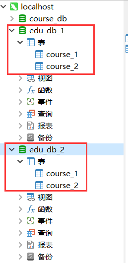
   >
   > 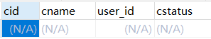

3. 约定这样一种规则

   1. `userid`为偶数，则添加到`edu_db_1`中，奇数则添加到`edu_db_2`中
   2. 若`cid`为偶数，则添加到`course_1`中，奇数则添加到`course_2`中

   ```properties
   # ------------------------------------------------------------------------------------------------
   # 再加一个数据库，叫m0，对应的就是user_db
   spring.shardingsphere.datasource.names=m1,m2,m0
   
   # 让一个实体类对应两张表
   spring.main.allow-bean-definition-overriding=true
   # ------------------------------------------------------------------------------------------------
   
   
   
   
   
   
   # ------------------------------------------------------------------------------------------------
   # 下面都是配置数据源m1的配置
   
   # 配置连接池的类型，我们选择德鲁伊
   spring.shardingsphere.datasource.m1.type=com.alibaba.druid.pool.DruidDataSource
   # 配置驱动
   spring.shardingsphere.datasource.m1.driver-class-name=com.mysql.cj.jdbc.Driver
   # 配置数据库的url
   spring.shardingsphere.datasource.m1.url=jdbc:mysql://localhost:3306/edu_db_1?serverTimezone=Asia/Shanghai
   spring.shardingsphere.datasource.m1.username=root
   spring.shardingsphere.datasource.m1.password=root
   
   
   
   
   # 下面都是配置数据源m2的配置
   
   # 配置连接池的类型，我们选择德鲁伊
   spring.shardingsphere.datasource.m2.type=com.alibaba.druid.pool.DruidDataSource
   # 配置驱动
   spring.shardingsphere.datasource.m2.driver-class-name=com.mysql.cj.jdbc.Driver
   # 配置数据库的url
   spring.shardingsphere.datasource.m2.url=jdbc:mysql://localhost:3306/edu_db_2?serverTimezone=Asia/Shanghai
   spring.shardingsphere.datasource.m2.username=root
   spring.shardingsphere.datasource.m2.password=root
   
   
   # 下面都是配置数据源m0的配置
   
   # 配置连接池的类型，我们选择德鲁伊
   spring.shardingsphere.datasource.m0.type=com.alibaba.druid.pool.DruidDataSource
   # 配置驱动
   spring.shardingsphere.datasource.m0.driver-class-name=com.mysql.cj.jdbc.Driver
   # 配置数据库的url
   spring.shardingsphere.datasource.m0.url=jdbc:mysql://localhost:3306/user_db?serverTimezone=Asia/Shanghai
   spring.shardingsphere.datasource.m0.username=root
   spring.shardingsphere.datasource.m0.password=root
   # ------------------------------------------------------------------------------------------------
   
   
   
   
   
   
   
   
   # ------------------------------------------------------------------------------------------------
   spring.shardingsphere.sharding.tables.course.actual-data-nodes=m$->{1..2}.course_$->{1..2}
   spring.shardingsphere.sharding.tables.course.key-generator.column=cid
   spring.shardingsphere.sharding.tables.course.key-generator.type=SNOWFLAKE
   spring.shardingsphere.sharding.tables.course.table-strategy.inline.sharding-column=cid
   spring.shardingsphere.sharding.tables.course.table-strategy.inline.algorithm-expression=course_$->{cid%2 +1}
   spring.shardingsphere.sharding.tables.course.database-strategy.inline.sharding-column=user_id
   spring.shardingsphere.sharding.tables.course.database-strategy.inline.algorithm-expression=m$->{user_id % 2+1}
   
   
   
   
   
   
   # 专库专表的策略配置，配置user_db里的t_user
   # 指定数据源，就一个
   spring.shardingsphere.sharding.tables.t_user.actual-data-nodes=m0.t_user
   # 配置主键
   spring.shardingsphere.sharding.tables.t_user.key-generator.column=user_id
   # 指定算法
   spring.shardingsphere.sharding.tables.t_user.key-generator.type=SNOWFLAKE
   # 设定分片的检测值
   spring.shardingsphere.sharding.tables.t_user.table-strategy.inline.sharding-column=user_id
   # 指定分片策略
   spring.shardingsphere.sharding.tables.t_user.table-strategy.inline.algorithm-expression=t_user
   # ------------------------------------------------------------------------------------------------
   
   
   
   
   
   
   
   
   
   # ------------------------------------------------------------------------------------------------
   # 打开SQL输出日志
   spring.shardingsphere.props.sql.show=true
   # ------------------------------------------------------------------------------------------------
   ```

   

   

#### 起步

添加

```java
package com.howling;

import com.baomidou.mybatisplus.core.conditions.query.QueryWrapper;
import com.howling.mapper.CourseMapper;
import com.howling.pojo.Course;
import org.junit.jupiter.api.Test;
import org.springframework.beans.factory.annotation.Autowired;
import org.springframework.boot.test.context.SpringBootTest;

@SpringBootTest
class ShardingjdbcApplicationTests {

    @Autowired
    private CourseMapper mapper;

    @Test
    void addCourse() {
        /*
            分析一下这个代码：
                1. 因为UserId为100L，所以是偶数，根据分片策略，应该添加到edu_db_1中
                2. 假如cid为偶数，则添加到edu_db_1中的course1中，为奇数则添加到edu_db_1中的course2中
         */

        mapper.insert(new Course().setCname("Java").setUserId(100L).setCstatus("Normal"));

    }
}
```

> 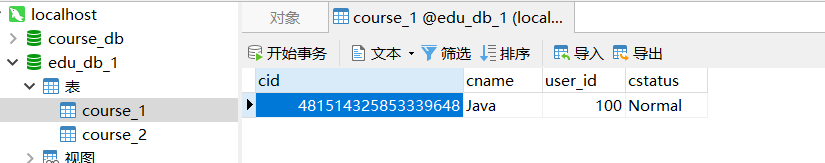
>
> 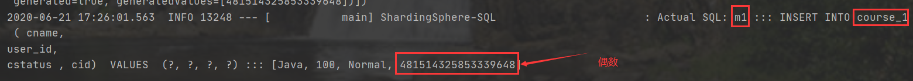


查询

```java
    @Test
    void selectCourse() {
        QueryWrapper<Course> wrapper = new QueryWrapper<>();

        wrapper.eq("cid",481514325853339648L);
        wrapper.eq("user_id",100);

        System.out.println(mapper.selectOne(wrapper));

    }
```

> 因为是分到了两个不同的数据库中，所以也需要user_id的内容
>
> 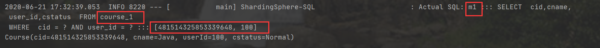

----

### 垂直切分

我们之前已经聊过这个概念了，简单来说就是专库专表


```mysql
create DATABASE user_db;
use user_db;

create TABLE t_user(
	user_id BIGINT(20) PRIMARY KEY,
	username VARCHAR(100) NOT NULL,
	ustatus VARCHAR(50) NOT NULL
);
```

> 专库专表，`user_db`是用户数据库，`t_user`是用户表
>
> 我们操作用户的时候就操作到了专门的表


```java
package com.howling.pojo;

import com.baomidou.mybatisplus.annotation.TableName;
import lombok.Data;
import lombok.experimental.Accessors;

@Data
@Accessors(chain = true)
@TableName("t_user")//注意这里，数据库里的表是叫t_user，不是user
public class User {

    private Long userId;
    private String username;
    private String ustatus;
}
```


```java
package com.howling.mapper;

import com.baomidou.mybatisplus.core.mapper.BaseMapper;
import com.howling.pojo.User;
import org.springframework.stereotype.Repository;

@Repository
public interface UserMapper extends BaseMapper<User> {}
```


```properties
# ------------------------------------------------------------------------------------------------
# 再加一个数据库，叫m0，对应的就是user_db
spring.shardingsphere.datasource.names=m1,m2,m0

# 让一个实体类对应两张表
spring.main.allow-bean-definition-overriding=true
# ------------------------------------------------------------------------------------------------


# ------------------------------------------------------------------------------------------------
# 下面都是配置数据源m1的配置

# 配置连接池的类型，我们选择德鲁伊
spring.shardingsphere.datasource.m1.type=com.alibaba.druid.pool.DruidDataSource
# 配置驱动
spring.shardingsphere.datasource.m1.driver-class-name=com.mysql.cj.jdbc.Driver
# 配置数据库的url
spring.shardingsphere.datasource.m1.url=jdbc:mysql://localhost:3306/edu_db_1?serverTimezone=Asia/Shanghai
spring.shardingsphere.datasource.m1.username=root
spring.shardingsphere.datasource.m1.password=root


# 下面都是配置数据源m2的配置

# 配置连接池的类型，我们选择德鲁伊
spring.shardingsphere.datasource.m2.type=com.alibaba.druid.pool.DruidDataSource
# 配置驱动
spring.shardingsphere.datasource.m2.driver-class-name=com.mysql.cj.jdbc.Driver
# 配置数据库的url
spring.shardingsphere.datasource.m2.url=jdbc:mysql://localhost:3306/edu_db_2?serverTimezone=Asia/Shanghai
spring.shardingsphere.datasource.m2.username=root
spring.shardingsphere.datasource.m2.password=root


# 下面都是配置数据源m0的配置

# 配置连接池的类型，我们选择德鲁伊
spring.shardingsphere.datasource.m0.type=com.alibaba.druid.pool.DruidDataSource
# 配置驱动
spring.shardingsphere.datasource.m0.driver-class-name=com.mysql.cj.jdbc.Driver
# 配置数据库的url
spring.shardingsphere.datasource.m0.url=jdbc:mysql://localhost:3306/user_db?serverTimezone=Asia/Shanghai
spring.shardingsphere.datasource.m0.username=root
spring.shardingsphere.datasource.m0.password=root
# ------------------------------------------------------------------------------------------------


# ------------------------------------------------------------------------------------------------

spring.shardingsphere.sharding.tables.course.actual-data-nodes=m$->{1..2}.course_$->{1..2}
spring.shardingsphere.sharding.tables.course.key-generator.column=cid
spring.shardingsphere.sharding.tables.course.key-generator.type=SNOWFLAKE
spring.shardingsphere.sharding.tables.course.table-strategy.inline.sharding-column=cid
spring.shardingsphere.sharding.tables.course.table-strategy.inline.algorithm-expression=course_$->{cid%2 +1}
spring.shardingsphere.sharding.tables.course.database-strategy.inline.sharding-column=user_id
spring.shardingsphere.sharding.tables.course.database-strategy.inline.algorithm-expression=m$->{user_id % 2+1}


# 专库专表的策略配置，配置user_db里的t_user
spring.shardingsphere.sharding.tables.t_user.actual-data-nodes=m0.t_user
spring.shardingsphere.sharding.tables.t_user.key-generator.column=user_id
spring.shardingsphere.sharding.tables.t_user.key-generator.type=SNOWFLAKE
spring.shardingsphere.sharding.tables.t_user.table-strategy.inline.sharding-column=user_id
spring.shardingsphere.sharding.tables.t_user.table-strategy.inline.algorithm-expression=t_user
# ------------------------------------------------------------------------------------------------


# ------------------------------------------------------------------------------------------------
# 打开SQL输出日志
spring.shardingsphere.props.sql.show=true
# ------------------------------------------------------------------------------------------------
```


添加测试

```java
package com.howling;

import com.baomidou.mybatisplus.core.conditions.query.QueryWrapper;
import com.howling.mapper.CourseMapper;
import com.howling.mapper.UserMapper;
import com.howling.pojo.Course;
import com.howling.pojo.User;
import org.junit.jupiter.api.Test;
import org.springframework.beans.factory.annotation.Autowired;
import org.springframework.boot.test.context.SpringBootTest;

@SpringBootTest
class ShardingjdbcApplicationTests {


    @Autowired
    private UserMapper mapper;

    @Test
    public void add(){
        User user = new User().setUsername("Lucy").setUstatus("A");

        mapper.insert(user);
    }
}
```

> 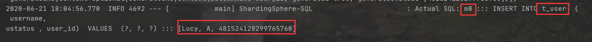
>
> 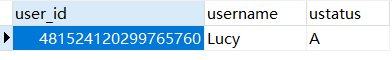

---

### 公共表

公共表中的内容一般不会做改变，但是需要经常关联。比如某个人的状态信息。

在每一个数据库中创建出相同结构的公共表，当公共表修改时，所有公共表的所有数据都会进行修改


1. 现在有三个数据库：`edu_db_1`，`edu_db_2`，`user_db`

2. 在多个数据库中都创建相同结构的表（公共表）

   ```mysql
   use edu_db_1;
   create table t_udict(
   	dictid BIGINT(20) PRIMARY KEY,
   	ustatus VARCHAR(100) NOT NULL,
   	uvalue VARCHAR(100) NOT NULL
   );
   
   
   use edu_db_2;
   create table t_udict(
   	dictid BIGINT(20) PRIMARY KEY,
   	ustatus VARCHAR(100) NOT NULL,
   	uvalue VARCHAR(100) NOT NULL
   );
   
   
   
   use user_db;
   create table t_udict(
   	dictid BIGINT(20) PRIMARY KEY,
   	ustatus VARCHAR(100) NOT NULL,
   	uvalue VARCHAR(100) NOT NULL
   );
   ```

   > 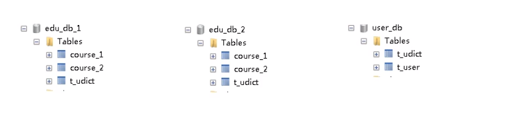

3. 配置文件中配置公共表

   ```properties
   # ------------------------------------------------------------------------------------------------
   spring.shardingsphere.datasource.names=m1,m2,m0
   spring.main.allow-bean-definition-overriding=true
   # ------------------------------------------------------------------------------------------------
   
   
   
   
   
   
   # ------------------------------------------------------------------------------------------------
   spring.shardingsphere.datasource.m1.type=com.alibaba.druid.pool.DruidDataSource
   spring.shardingsphere.datasource.m1.driver-class-name=com.mysql.cj.jdbc.Driver
   spring.shardingsphere.datasource.m1.url=jdbc:mysql://localhost:3306/edu_db_1?serverTimezone=Asia/Shanghai
   spring.shardingsphere.datasource.m1.username=root
   spring.shardingsphere.datasource.m1.password=root
   
   
   
   spring.shardingsphere.datasource.m2.type=com.alibaba.druid.pool.DruidDataSource
   spring.shardingsphere.datasource.m2.driver-class-name=com.mysql.cj.jdbc.Driver
   spring.shardingsphere.datasource.m2.url=jdbc:mysql://localhost:3306/edu_db_2?serverTimezone=Asia/Shanghai
   spring.shardingsphere.datasource.m2.username=root
   spring.shardingsphere.datasource.m2.password=root
   
   
   spring.shardingsphere.datasource.m0.type=com.alibaba.druid.pool.DruidDataSource
   spring.shardingsphere.datasource.m0.driver-class-name=com.mysql.cj.jdbc.Driver
   spring.shardingsphere.datasource.m0.url=jdbc:mysql://localhost:3306/user_db?serverTimezone=Asia/Shanghai
   spring.shardingsphere.datasource.m0.username=root
   spring.shardingsphere.datasource.m0.password=root
   # ------------------------------------------------------------------------------------------------
   
   
   
   
   
   
   
   
   # ------------------------------------------------------------------------------------------------
   
   # 配置公共表
   spring.shardingsphere.sharding.broadcast-tables=t_udict
   # 指定主键
   spring.shardingsphere.sharding.tables.t_udict.key-generator.column=dictid
   # 指定算法
   spring.shardingsphere.sharding.tables.t_udict.key-generator.type=SNOWFLAKE
   
   
   spring.shardingsphere.sharding.tables.course.actual-data-nodes=m$->{1..2}.course_$->{1..2}
   spring.shardingsphere.sharding.tables.course.key-generator.column=cid
   spring.shardingsphere.sharding.tables.course.key-generator.type=SNOWFLAKE
   spring.shardingsphere.sharding.tables.course.table-strategy.inline.sharding-column=cid
   spring.shardingsphere.sharding.tables.course.table-strategy.inline.algorithm-expression=course_$->{cid%2 +1}
   spring.shardingsphere.sharding.tables.course.database-strategy.inline.sharding-column=user_id
   spring.shardingsphere.sharding.tables.course.database-strategy.inline.algorithm-expression=m$->{user_id % 2+1}
   
   
   spring.shardingsphere.sharding.tables.t_user.actual-data-nodes=m0.t_user
   spring.shardingsphere.sharding.tables.t_user.key-generator.column=user_id
   spring.shardingsphere.sharding.tables.t_user.key-generator.type=SNOWFLAKE
   spring.shardingsphere.sharding.tables.t_user.table-strategy.inline.sharding-column=user_id
   spring.shardingsphere.sharding.tables.t_user.table-strategy.inline.algorithm-expression=t_user
   # ------------------------------------------------------------------------------------------------
   
   
   
   
   
   
   
   
   
   # ------------------------------------------------------------------------------------------------
   spring.shardingsphere.props.sql.show=true
   # ------------------------------------------------------------------------------------------------
   ```

4. 测试代码

   ```java
   package com.howling.pojo;
   
   import com.baomidou.mybatisplus.annotation.TableName;
   import lombok.Data;
   import lombok.experimental.Accessors;
   
   @Data
   @Accessors(chain = true)
   @TableName("t_udict")
   public class Udict {
   
       private Long dictid;
       private String ustatus;
       private String uvalue;
   }
   ```

   ```java
   package com.howling.mapper;
   
   import com.baomidou.mybatisplus.core.mapper.BaseMapper;
   import com.howling.pojo.Udict;
   import org.springframework.stereotype.Repository;
   
   @Repository
   public interface UdictMapper extends BaseMapper<Udict> {}
   ```

   ```java
   package com.howling;
   
   import com.baomidou.mybatisplus.core.conditions.query.QueryWrapper;
   import com.howling.mapper.UdictMapper;
   import com.howling.pojo.Udict;
   import org.junit.jupiter.api.Test;
   import org.springframework.beans.factory.annotation.Autowired;
   import org.springframework.boot.test.context.SpringBootTest;
   
   @SpringBootTest
   class ShardingjdbcApplicationTests {
   
   
       @Autowired
       private UdictMapper mapper;
   
       @Test
       public void add(){
          mapper.insert(new Udict().setUstatus("A").setUvalue("启用"));
       }
   }
   ```

   > 公共表修改的时候，会同时向多个数据源中修改数据
   >
   > 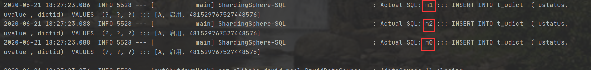
   >
   > 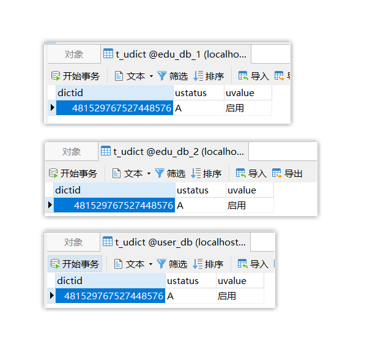

   删除

   ```java
   package com.howling;
   
   import com.baomidou.mybatisplus.core.conditions.query.QueryWrapper;
   import com.howling.mapper.UdictMapper;
   import com.howling.pojo.Udict;
   import org.junit.jupiter.api.Test;
   import org.springframework.beans.factory.annotation.Autowired;
   import org.springframework.boot.test.context.SpringBootTest;
   
   @SpringBootTest
   class ShardingjdbcApplicationTests {
   
   
       @Autowired
       private UdictMapper mapper;
   
       @Test
       public void delete(){
           QueryWrapper<Udict> wrapper = new QueryWrapper<>();
           wrapper.eq("dictid",481529767527448576L);
           mapper.delete(wrapper);
       }
   }
   ```

   > 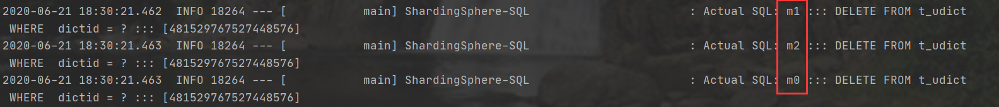

---

## 读写分离

### 概念

`概念`

为了保证数据库产品的稳定性，很多数据库拥有`双机热备`功能

就是说，第一台数据库服务器对外提供增删改查的生产服务器，而第二台服务器主要进行读的操作。

==原理：让主数据库(master)处理事务性增删改的操作，从而令从数据库(slave)处理查询操作==
==主数据库和从数据库的数据要同步==

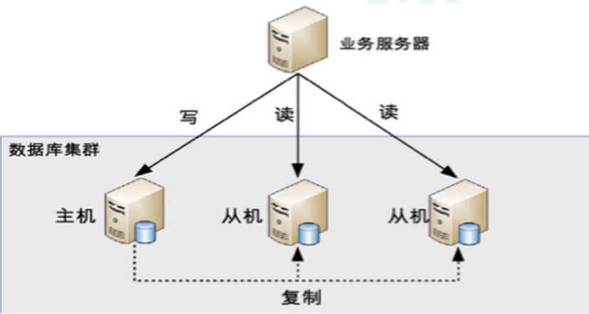

我们可以实现一主一从，一主多从，多主多从的效果


`原理`

以一主一从为例：

1. 在主服务器中开启`binlog`日志功能，就是记录增删改的操作
2. 在从服务器实时监控`binlog`日志的变化，读取日志并且读取，这样就实现了数据的同步

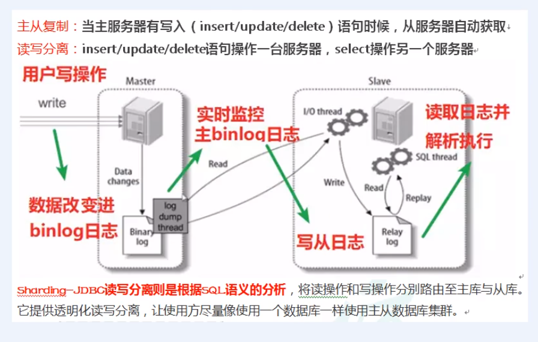


ShardingJDBC则不同，它是通过SQL语义的分析

- 假如有增删改的操作，会将命令路由到主数据库中

- 假如有查询的操作，会将命令路由到从数据库中

==ShardingJDBC不会去做数据同步，数据同步是由MySQL做到的==

### MySQL配置读写分离

MySQL配置读写分离是一个比较固定的套路


1. 新增MySQL实例


### Sharding-JDBC操作

