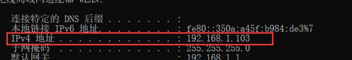

# 环境需求：需要Java，Android，MySQL


# 完整版

- school.apk：打包生成的APK

- school.sql：SQL文件

- school-0.0.1-SNAPSHOT.jar：jar包

- SpringBoot.zip：后台项目源码

- school.zip：安卓项目源码


1. 打开MySQL，执行 `school.sql` 文件
2.  修改SpringBoot的配置，自己修改用户名，密码，端口号，默认为：用户名： `root `，密码：`root` ，端口： `80`
3. 如果用户名和密码都相同，可以直接运行 jar 包，然后在命令行执行命令： `java -jar school-0.0.1-SNAPSHOT.jar`
4. 修改AndroidStudio中，本地路径的配置`app\src\main\java\com\howling\fragments\othersFragments\LoginFragment.java`

```java
    //登录
    private View.OnClickListener login() {
        return v->{

            String username = binding.username.getText().toString().trim();
            String password = binding.password.getText().toString().trim();

            if (username!=null&&password!=null){

                String JsonAll = HttpUtils
                		//修改这里
                        .async("http://192.168.1.105/login")
                        .addBodyPara("username", username)
                        .addBodyPara("password", password).post().getResult().getBody().toString();

                System.out.println("-------------------------------");
                System.out.println(JsonAll);
                SharedPreferences preferences = getContext().getSharedPreferences("user", Context.MODE_PRIVATE);
                SharedPreferences.Editor edit = preferences.edit();
                edit.putString("user",JsonAll);
                edit.apply();

                NavController controller = Navigation.findNavController(getActivity(), R.id.mainFragment);
                controller.navigateUp();
            }
        };
    }
}
```

> 修改方式：
>
> 1. 打开命令行，输入`ipconfig`查看本地网址，如：
>
>    
>
> 2. 将地址改为自己的，比如：`http://192.168.1.103/login`

5. 执行以上几步之后，开始测试
   1.  假如在模拟器上测试，可以直接测试，但是有可能会在登陆的时候卡出去，这是模拟器的BUG
   2. 在真机上进行测试，一定要让电脑开热点，手机连接，不然地址不同，登陆不进去
   3.  一定要在登陆之后测试二维码功能，否则会闪退


# 懒人版

如果不想搭建MySQL服务的话，可以直接在完整版跳到第四步，这里的网址修改为`howling.top/login`

> 1.  这是我的服务器地址，测试会保留一段时间，不过保留多长时间不确定，如果不行，有可能我给停了
> 2. 服务器无论输入任何用户名和密码都可以，返回的用户名字是用户名
> 3. 无论输入什么用户名，用户头像只有一张

