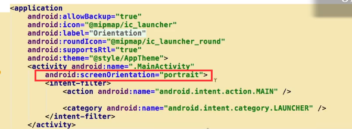
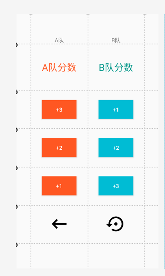
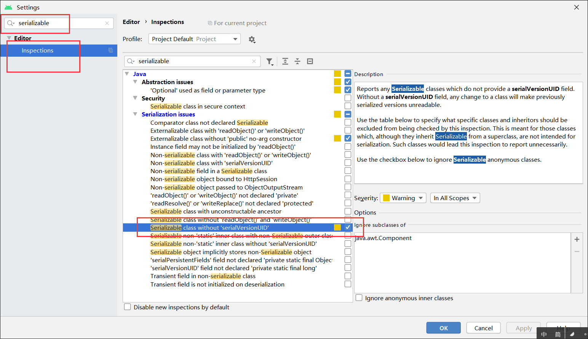
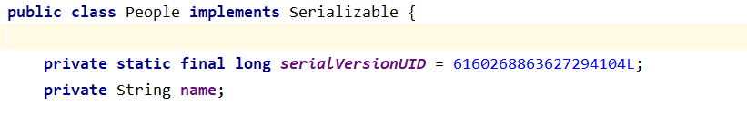

# 安卓基础

## 国际化

我们只需要在`strings.xml`文件中，进入到设计模式，然后加入中文选项即可


然后在中文的地方写入对应的字符


这样就可以实现随着系统语言的切换而切换了

---

上面就是最基础的文本国际化，如果想要进行页面的定制国际化，自行百度

## 屏幕旋转

在`ConstaintLayout`布局中，我们知道可以使用约束器的方式来决定按钮的位置，但是有一个要点就是约束器只有当四个方向都约束之后，当屏幕旋转之后才会在屏幕上的对应位置出现


但是假如在屏幕上的约束只约束了一般，那么就会出现问题，导致旋转之后和设计图上和屏幕位置不同


----

如果要让屏幕旋转之后不改变为旋转之后的内容，那么就在`Manifests`里面改变代码



这样就不会出现问题了


---

水平和竖直的不同布局


**水平**

水平的话没有这么多讲究，直接一个分割线下去，然后在各自的内容区域直接加入即可


**竖直**

竖直的专门布局：创建横版副本


那么在layout下面就出现了一个新的文件


新的横版副本：


对比：


这里还要注意一个事实：

当屏幕翻转之后，其实`activity`的生命周期是经历了毁灭然后重新创建的，也就是说当屏幕翻转之后用户数据会销毁，如果不保存，则不会存在


那么应该如何存储呢？

```java
public class MainActivity extends AppCompatActivity {

    /*
    * onCreate(Bundle savedInstanceState)
    *   Bundle savedInstanceState：存储着屏幕翻转之前存储在onSaveInstanceState里面的东西
    * */
    @Override
    protected void onCreate(Bundle savedInstanceState) {
        super.onCreate(savedInstanceState);
        setContentView(R.layout.activity_main);

        /*假如不为空，那么就说明了屏幕经历过翻转，里面存在值*/
        if (savedInstanceState!=null){
            String key = savedInstanceState.getString("Key");
        }
    }

    /*
    * 在屏幕翻转之前将数值存储，Bundle outState
    * 注意这里onSaveInstanceState函数不止一个，我们选择这一个就可以
    * */
    @Override
    protected void onSaveInstanceState(@NonNull Bundle outState) {
        super.onSaveInstanceState(outState);
        //存储数据
        outState.putString("Key","Value");

    }
}
```


----

# Kotlin

变量：var

常量：val

```kotlin
var number:Int = 0//定义了一个变量number，类型为Int，初始值为0
//如果有初始化，那么类型甚至可以不用谢，比如：
var number = 0
```


```kotlin
package com.example.kotlindemo

import androidx.appcompat.app.AppCompatActivity
import android.os.Bundle
import kotlinx.android.synthetic.main.activity_main.*

class MainActivity : AppCompatActivity() {

    override fun onCreate(savedInstanceState: Bundle?) {
        super.onCreate(savedInstanceState)
        setContentView(R.layout.activity_main)

        var numer = 0

        //使用Kotlin之后不用写findViewById了
        textView.text = "0"

        
        //这里类似lambda，但是又不是
        add.setOnClickListener{
            textView.setText((++numer).toString())
        }

        minus.setOnClickListener{
            textView.setText((--numer).toString())
        }

    }
}
```


```kotlin
//使用:来进行继承，同时()表示了构造函数
class MyViewModel:ViewModel() {

    val number:MutableLiveData<Int>
    
    //对number的初始化方式1
    init {
        number = MutableLiveData();
        number.value=0
    }

}
```

```kotlin
//使用:来进行继承，同时()表示了构造函数
class MyViewModel:ViewModel() {

    //对number初始化方式2，it指的是number
    val number:MutableLiveData<Int> by lazy { MutableLiveData<Int>().also { it.value=0 } }

}
```

> 两种方式有区别，第一种是立刻初始化
>
> 第二种是懒加载，按需初始化


```kotlin
//使用:来进行继承，同时()表示了构造函数
class MyViewModel:ViewModel() {

    //对number初始化方式2，it指的是number
    val number:MutableLiveData<Int> by lazy { MutableLiveData<Int>().also { it.value=0 } }


    //fun：函数，kotlin里面的函数和class平级，可以出现在任何地方
    fun modifyNumber(anumber:Int){
        //nu,ber.value?.plus(anumber)-->判断number.value是否为空，空则不执行，不为空则执行后面的语句
        number.value = number.value?.plus(anumber)
    }

}
```


```java
package com.example.kotlindemo

import androidx.appcompat.app.AppCompatActivity
import android.os.Bundle
import androidx.lifecycle.Observer
import androidx.lifecycle.ViewModel
import androidx.lifecycle.ViewModelProvider
import kotlinx.android.synthetic.main.activity_main.*

class MainActivity : AppCompatActivity() {

    override fun onCreate(savedInstanceState: Bundle?) {
        super.onCreate(savedInstanceState)
        setContentView(R.layout.activity_main)


        var viewModel = ViewModelProvider(this, ViewModelProvider.AndroidViewModelFactory.getInstance(application)).get(MyViewModel::class.java)

        var numer = 0

        //使用Kotlin之后不用写findViewById了
        textView.text = "0"


        viewModel.number.observe(this, Observer { textView.text=it.toString() })

        //这里类似lambda，但是又不是
        add.setOnClickListener{
            viewModel.modifyNumber(1)
        }

        minus.setOnClickListener{
            viewModel.modifyNumber(-1)
        }

    }
}
```


---

# JetPack

JetPack最早是在2018年的大会上出现的，现在的定位是比较高的

JetPack可以帮助开发者快速高效的开发出应用


JetPack分为四个模块：基础，架构，行为，界面


## ViewModel

### 介绍

ViewModel是JetPack里面的一个内容，属于`Architecture`里面的内容


顾名思义，作用是把数据从视图里面独立出来单独管理，从而使控制器(Activity或者Fragment)变得更加简单


ViewModel的职责应该是用来管理界面的数据，而数据的获取也不应当放到ViewModel里面


除此之外还有一个特性，就是当Activity被摧毁的时候让数据不会丢失


比如对于我们的屏幕翻转之后，数据是不会丢失的，那么我们就不用使用`onSaveInstanceState`来进行手动存储了


那么ViewModel配合的组件还有一个叫做`LiveData`的东西，两者配合将会实现对数据的监听


ViewModel还可以配合Room(使用SQLite的中间件)来进行数据的存储


所以ViewModel是非常有用的

----

### 起步

创建一个新的项目，因为要是用Jetpack这个库，所以要勾选上


但是在android最新版，默认已经勾选上了这个库，所以不用担心


布局


新建一个类叫做`MyViewModel`，为了省力，就直接声明为public，继承`ViewModel`

```java
import androidx.lifecycle.ViewModel;

public class MyViewModel extends ViewModel {

    public int number = 0;
}
```


`MainActivity`

```java
package com.bean;

import androidx.appcompat.app.AppCompatActivity;
import androidx.lifecycle.ViewModelProvider;

import android.os.Bundle;
import android.view.View;
import android.widget.Button;
import android.widget.TextView;

public class MainActivity extends AppCompatActivity {

    MyViewModel viewModel;
    TextView viewModelText;
    Button addOne,addTwo;
    @Override
    protected void onCreate(Bundle savedInstanceState) {
        super.onCreate(savedInstanceState);
        setContentView(R.layout.activity_main);

        viewModelText = findViewById(R.id.viewModel);
        addOne = findViewById(R.id.addOne);
        addTwo = findViewById(R.id.addTwo);

        //工厂模式生成一个新的viewModel
        ViewModelProvider.Factory factory = ViewModelProvider.AndroidViewModelFactory.getInstance(getApplication());

		//第一个参数的意思是在什么范围内，这里传递的activity，就是在这个activity里面
        ViewModelProvider viewModelProvider = new ViewModelProvider(this,factory);

        viewModel = viewModelProvider.get(MyViewModel.class);

        //我们的ViewModel会自动将数值存储，屏幕翻转之后会直接取得
        viewModelText.setText(String.valueOf(viewModel.number));

        addOne.setOnClickListener(new View.OnClickListener() {
            @Override
            public void onClick(View v) {
                viewModel.number++;
                viewModelText.setText(viewModel.number+"");
            }
        });

        addTwo.setOnClickListener(new View.OnClickListener() {
            @Override
            public void onClick(View v) {
                viewModel.number+=2;
                viewModelText.setText(viewModel.number+"");
            }
        });

    }
}
```

---

## LiveData

### 介绍

LiveData也是属于架构部分的

LiveData的作用是：在底层数据库更改的时候通知视图，使其动态更新

### 起步

在开始之前首先介绍一下矢量图：

矢量图是在Android 5.0之后出现的，它的特点就是可以任意放大不会产生锯齿，而且比较小，特别适合于做我们界面上的图标

Android中有不少的矢量图图标，常见的用户界面的应该都有了


选择之后会出现在`drawable`目录下


新建一个项目：`LiveDataDemo`


我们这次要是用`ImageButton`，更加的好看一点，所以选择一个矢量图


这个矢量图是一个xml文件，在drawable中


再来一个


最终布局


新建一个类：

```java
package com.bean;

import androidx.lifecycle.MutableLiveData;
import androidx.lifecycle.ViewModel;

public class ViewModelWithLiveData extends ViewModel {

    //类型为MutableLiveData，泛型为Integer
    private MutableLiveData<Integer> likedNumber;

    public MutableLiveData<Integer> getLikedNumber() {

        if (likedNumber==null){
            likedNumber = new MutableLiveData<>();
            likedNumber.setValue(0);
        }

        return likedNumber;
    }

    public void addLikedNumber(int n){
        likedNumber.setValue(likedNumber.getValue()+n);
    }
}
```

> `LiveData`之所以可以通过数据的改变进行界面的刷新，就是通过`likedNumber.setValue`来实现的

```java
package com.bean;

import androidx.appcompat.app.AppCompatActivity;
import androidx.lifecycle.Observer;
import androidx.lifecycle.ViewModelProvider;

import android.os.Bundle;
import android.view.View;
import android.widget.ImageButton;
import android.widget.TextView;

public class MainActivity extends AppCompatActivity {

    ViewModelWithLiveData viewModel;
    TextView textView;
    ImageButton imageButtonLeft,imageButtonRight;

    @Override
    protected void onCreate(Bundle savedInstanceState) {
        super.onCreate(savedInstanceState);
        setContentView(R.layout.activity_main);

        textView = findViewById(R.id.textView);
        imageButtonLeft = findViewById(R.id.imageButtonLeft);
        imageButtonRight = findViewById(R.id.imageButtonRight);


        ViewModelProvider.Factory factory = ViewModelProvider.AndroidViewModelFactory.getInstance(getApplication());
        ViewModelProvider viewModelProvider = new ViewModelProvider(this,factory);
        viewModel = viewModelProvider.get(ViewModelWithLiveData.class);


        imageButtonLeft.setOnClickListener(new View.OnClickListener() {
            @Override
            public void onClick(View v) {
                viewModel.addLikedNumber(1);
            }
        });

        imageButtonRight.setOnClickListener(new View.OnClickListener() {
            @Override
            public void onClick(View v) {
                viewModel.addLikedNumber(-1);
            }
        });


        //这里是非常重要的一句话，这里是用来监听likedNumber数据，因为可以使用getLikedNumber获得就可以使用这个来监听
        //observe：观察
        viewModel.getLikedNumber().observe(this, new Observer<Integer>() {
            @Override
            public void onChanged(Integer integer) {
                //如果发生改变，那么就将这个数据改变
                textView.setText(String.valueOf(integer));
            }
        });

    }
}
```


----

## DataBinding

### 介绍

DataBinding也是架构方面的内容

数据绑定是以声明方式将可观察数据绑定到界面元素，简单来说是将控制器进一步地精简，以实现

Controller和ViewGroup不再有直接的联系，而是通过DataBinding来进行同步


那么这样就形成了：

ViewModel：管理数据

Controller：控制逻辑

ViewGroup：管理界面

DataBinding：实现数据的绑定

-----

### 起步

新建一个项目，叫做`DataBindingDemo`

页面


新建一个类：`MyViewModel`

```java
package com.bean;

import androidx.lifecycle.MutableLiveData;
import androidx.lifecycle.ViewModel;

public class MyViewModel extends ViewModel {
    private MutableLiveData<Integer> number;

    public MutableLiveData<Integer> getNumber() {
        if (number==null){
            number = new MutableLiveData<>();
            number.setValue(0);
        }
        return number;
    }

    public void add(){
        number.setValue(number.getValue()+1);
    }
}
```


那么以前，我们是这么做的：

```java
package com.bean;

import androidx.appcompat.app.AppCompatActivity;
import androidx.lifecycle.Observer;
import androidx.lifecycle.ViewModelProvider;

import android.os.Bundle;
import android.view.View;
import android.widget.Button;
import android.widget.TextView;

public class MainActivity extends AppCompatActivity {

    TextView textView;
    Button button;
    private MyViewModel viewModel;
    @Override
    protected void onCreate(Bundle savedInstanceState) {
        super.onCreate(savedInstanceState);
        setContentView(R.layout.activity_main);

        textView = findViewById(R.id.text);
        button = findViewById(R.id.button);

        ViewModelProvider.Factory factory = ViewModelProvider.AndroidViewModelFactory.getInstance(getApplication());
        ViewModelProvider viewModelProvider = new ViewModelProvider(this,factory);
        viewModel = new ViewModelProvider(
                    this,
                            ViewModelProvider.AndroidViewModelFactory.getInstance(getApplication())
                    ).get(MyViewModel.class);

        button.setOnClickListener(new View.OnClickListener() {
            @Override
            public void onClick(View v) {
                viewModel.add();
            }
        });


        viewModel.getNumber().observe(this, new Observer<Integer>() {
            @Override
            public void onChanged(Integer integer) {
                textView.setText(String.valueOf(integer));
            }
        });
    }
}
```

> 这里有缺点：
>
> 每次都要重新进行`findViewById`

---

使用`DataBinding`

在`build.gradle(Module:app)`里面加上`databinding`

```js
apply plugin: 'com.android.application'

android {
    compileSdkVersion 29
    buildToolsVersion "29.0.2"

    defaultConfig {
        applicationId "com.bean"
        minSdkVersion 21
        targetSdkVersion 29
        versionCode 1
        versionName "1.0"

        testInstrumentationRunner "androidx.test.runner.AndroidJUnitRunner"

        /*这里就是dataBinding，而且注意是enabled不是enable*/
        dataBinding{
            enabled true
        }
    }

    buildTypes {
        release {
            minifyEnabled false
            proguardFiles getDefaultProguardFile('proguard-android-optimize.txt'), 'proguard-rules.pro'
        }
    }

}

dependencies {
    implementation fileTree(dir: 'libs', include: ['*.jar'])

    implementation 'androidx.appcompat:appcompat:1.1.0'
    implementation 'androidx.constraintlayout:constraintlayout:1.1.3'
    testImplementation 'junit:junit:4.12'
    androidTestImplementation 'androidx.test.ext:junit:1.1.1'
    androidTestImplementation 'androidx.test.espresso:espresso-core:3.2.0'
}

```

> 写完之后同步，然后到xml中


> 我们会发现有一个黄色的小灯泡，然后有一个转换的字样，点击之后就变成了

```xml
<?xml version="1.0" encoding="utf-8"?>
<!--第一个就是在外层增加了一个layout-->
<layout xmlns:android="http://schemas.android.com/apk/res/android"
    xmlns:app="http://schemas.android.com/apk/res-auto"
    xmlns:tools="http://schemas.android.com/tools">

    <!--第二个就是添加了这对标签叫做data-->
    <data>
    </data>

    <androidx.constraintlayout.widget.ConstraintLayout
        android:layout_width="match_parent"
        android:layout_height="match_parent"
        tools:context=".MainActivity">

        <TextView
            android:id="@+id/text"
            android:layout_width="wrap_content"
            android:layout_height="wrap_content"
            android:text="Hello World!"
            android:textSize="30dp"
            app:layout_constraintBottom_toBottomOf="parent"
            app:layout_constraintLeft_toLeftOf="parent"
            app:layout_constraintRight_toRightOf="parent"
            app:layout_constraintTop_toTopOf="parent"
            app:layout_constraintVertical_bias="0.196" />

        <Button
            android:id="@+id/button"
            android:layout_width="wrap_content"
            android:layout_height="wrap_content"
            android:text="Button"
            app:layout_constraintBottom_toBottomOf="parent"
            app:layout_constraintEnd_toEndOf="parent"
            app:layout_constraintStart_toStartOf="parent"
            app:layout_constraintTop_toTopOf="parent" />

    </androidx.constraintlayout.widget.ConstraintLayout>
</layout>
```

> 这样会增加了两对标签：
>
> 1. 在最外层增加了layout
> 2. 增加了标签data

> 这样之后，Android会自动帮我们创建一个类型的类，名字就是`layout`的名字+Binding，比如：`ActivityMainBinding`
>
> 那么这个布局文件对应的就是`MainActivity`，那么我们对其进行改造

----

改造第一步：消除`findViewById`，将xml中的对象绑定到代码中

```java
package com.bean;

import androidx.appcompat.app.AppCompatActivity;
import androidx.databinding.DataBindingUtil;
import androidx.lifecycle.Observer;
import androidx.lifecycle.ViewModelProvider;

import android.os.Bundle;
import android.view.View;
import android.widget.Button;
import android.widget.TextView;

import com.bean.databinding.ActivityMainBinding;

public class MainActivity extends AppCompatActivity {

    //下面的这些需要绑定的变量就不需要了
//    TextView textView;
//    Button button;
    private MyViewModel viewModel;


    //注意这个是和对应的布局文件对应的
    ActivityMainBinding binding;

    @Override
    protected void onCreate(Bundle savedInstanceState) {
        super.onCreate(savedInstanceState);

//        setContentView(R.layout.activity_main);   注意，这句话就不需要了，因为这句话是绑定布局文件的
        //我们把绑定布局文件换成这句话，其中DataBindingUtil是一个工具类
        binding = DataBindingUtil.setContentView(this,R.layout.activity_main);

        //不用绑定了，我们今后使用binding.id这样的方式来访问布局，比如：binding.button
//        textView = findViewById(R.id.text);
//        button = findViewById(R.id.button);


        ViewModelProvider.Factory factory = ViewModelProvider.AndroidViewModelFactory.getInstance(getApplication());
        ViewModelProvider viewModelProvider = new ViewModelProvider(this,factory);
        viewModel = new ViewModelProvider(
                    this,
                            ViewModelProvider.AndroidViewModelFactory.getInstance(getApplication())
                    ).get(MyViewModel.class);

        binding.button.setOnClickListener(new View.OnClickListener() {
            @Override
            public void onClick(View v) {
                viewModel.add();
            }
        });


        viewModel.getNumber().observe(this, new Observer<Integer>() {
            @Override
            public void onChanged(Integer integer) {
                binding.text.setText(String.valueOf(integer));
            }
        });
    }
}
```


改造第二步：消除复杂的监听事件函数，将代码反向绑定到xml布局中

```xml
<?xml version="1.0" encoding="utf-8"?>
<!--第一个就是在外层增加了一个layout-->
<layout xmlns:android="http://schemas.android.com/apk/res/android"
    xmlns:app="http://schemas.android.com/apk/res-auto"
    xmlns:tools="http://schemas.android.com/tools">

    <!--第二个就是添加了这对标签叫做data
        注意这里用于反向绑定
    -->
    <data>
        <!--我们定义一个variable，名字随便取，类型就是我们需要改变的类型-->
        <variable
            name="data"
            type="com.bean.MyViewModel" />
    </data>

    <androidx.constraintlayout.widget.ConstraintLayout
        android:layout_width="match_parent"
        android:layout_height="match_parent"
        tools:context=".MainActivity">

        <!--注意这里的text，我们改为了@{String.valueOf(data.number)}，也就是我们需要的值
            因为data为com.bean.MyViewModel，所以其实就是com.bean.MyViewModel.number
        -->
        <TextView
            android:id="@+id/text"
            android:layout_width="wrap_content"
            android:layout_height="wrap_content"
            android:text="@{String.valueOf(data.number)}"
            android:textSize="30dp"
            app:layout_constraintBottom_toBottomOf="parent"
            app:layout_constraintLeft_toLeftOf="parent"
            app:layout_constraintRight_toRightOf="parent"
            app:layout_constraintTop_toTopOf="parent"
            app:layout_constraintVertical_bias="0.196" />

        <!--
            这里注意了，我们的onclick功能点击之后会执行
            android:onClick="@{()->data.add()}"
            也就是执行lambda表达式，这里应该很清楚了
        -->
        <Button
            android:id="@+id/button"
            android:layout_width="wrap_content"
            android:layout_height="wrap_content"
            android:text="Button"
            android:onClick="@{()->data.add()}"
            app:layout_constraintBottom_toBottomOf="parent"
            app:layout_constraintEnd_toEndOf="parent"
            app:layout_constraintStart_toStartOf="parent"
            app:layout_constraintTop_toTopOf="parent" />

    </androidx.constraintlayout.widget.ConstraintLayout>
</layout>
```

```java
package com.bean;

import androidx.appcompat.app.AppCompatActivity;
import androidx.databinding.DataBindingUtil;
import androidx.lifecycle.Observer;
import androidx.lifecycle.ViewModelProvider;

import android.os.Bundle;
import android.view.View;
import android.widget.Button;
import android.widget.TextView;

import com.bean.databinding.ActivityMainBinding;

public class MainActivity extends AppCompatActivity {

    //下面的这些需要绑定的变量就不需要了
//    TextView textView;
//    Button button;
    private MyViewModel viewModel;


    //注意这个是和对应的布局文件对应的
    ActivityMainBinding binding;

    @Override
    protected void onCreate(Bundle savedInstanceState) {
        super.onCreate(savedInstanceState);

//        setContentView(R.layout.activity_main);   注意，这句话就不需要了，因为这句话是绑定布局文件的
        //我们把绑定布局文件换成这句话，其中DataBindingUtil是一个工具类
        binding = DataBindingUtil.setContentView(this,R.layout.activity_main);

        //不用绑定了，我们今后使用binding.id这样的方式来访问布局，比如：binding.button
//        textView = findViewById(R.id.text);
//        button = findViewById(R.id.button);


        ViewModelProvider.Factory factory = ViewModelProvider.AndroidViewModelFactory.getInstance(getApplication());
        ViewModelProvider viewModelProvider = new ViewModelProvider(this,factory);
        
        viewModel = new ViewModelProvider(
                    this,
                            ViewModelProvider.AndroidViewModelFactory.getInstance(getApplication())
                    ).get(MyViewModel.class);

        //这里不需要了，在xml中的onclick中写了
//        binding.button.setOnClickListener(new View.OnClickListener() {
//            @Override
//            public void onClick(View v) {
//                viewModel.add();
//            }
//        });


        //这里也需要改变
//        viewModel.getNumber().observe(this, new Observer<Integer>() {
//            @Override
//            public void onChanged(Integer integer) {
//                binding.text.setText(String.valueOf(integer));
//            }
//        });
        //这里需要改为binding.setData(viewModel)
        //setData的意思是因为我们在xml中的data写了一个变量叫做data，所以叫做setData
        //那么类型是com.bean.MyViewModel，我们就把这个类型传入进去
        binding.setData(viewModel);
        binding.setLifecycleOwner(this);//这句也不能少
    }
}
```

> 这里我们惊奇的发现，竟然在代码中连数据访问也不用了，直接使用回绑的方式就够用了
>
> 或者上面viewModel的那三句可以为：
>
> `viewModel = new ViewModelProvider.NewInstanceFactory().create(MyViewModel.class);`
>
> 但是假如使用这种方式的时候，不能保存数据
>
> 也就是说比如当我们横屏的时候，数据不会进行保存

---

最终结果：

```xml
<?xml version="1.0" encoding="utf-8"?>
<layout xmlns:android="http://schemas.android.com/apk/res/android"
    xmlns:app="http://schemas.android.com/apk/res-auto"
    xmlns:tools="http://schemas.android.com/tools">
    <data>
        <variable
            name="data"
            type="com.bean.MyViewModel" />
    </data>

    <androidx.constraintlayout.widget.ConstraintLayout
        android:layout_width="match_parent"
        android:layout_height="match_parent"
        tools:context=".MainActivity">
        <TextView
            android:id="@+id/text"
            android:layout_width="wrap_content"
            android:layout_height="wrap_content"
            android:text="@{String.valueOf(data.number)}"
            android:textSize="30dp"
            app:layout_constraintBottom_toBottomOf="parent"
            app:layout_constraintLeft_toLeftOf="parent"
            app:layout_constraintRight_toRightOf="parent"
            app:layout_constraintTop_toTopOf="parent"
            app:layout_constraintVertical_bias="0.196" />
        <Button
            android:id="@+id/button"
            android:layout_width="wrap_content"
            android:layout_height="wrap_content"
            android:text="Button"
            android:onClick="@{()->data.add()}"
            app:layout_constraintBottom_toBottomOf="parent"
            app:layout_constraintEnd_toEndOf="parent"
            app:layout_constraintStart_toStartOf="parent"
            app:layout_constraintTop_toTopOf="parent" />

    </androidx.constraintlayout.widget.ConstraintLayout>
</layout>
```

```java
package com.bean;

import androidx.appcompat.app.AppCompatActivity;
import androidx.databinding.DataBindingUtil;
import androidx.lifecycle.Observer;
import androidx.lifecycle.ViewModelProvider;

import android.os.Bundle;
import android.view.View;
import android.widget.Button;
import android.widget.TextView;

import com.bean.databinding.ActivityMainBinding;

public class MainActivity extends AppCompatActivity {
    private MyViewModel viewModel;

    ActivityMainBinding binding;

    @Override
    protected void onCreate(Bundle savedInstanceState) {
        super.onCreate(savedInstanceState);
        binding = DataBindingUtil.setContentView(this,R.layout.activity_main);

        viewModel = new ViewModelProvider(
                    		this,
                            ViewModelProvider.AndroidViewModelFactory.getInstance(getApplication())
                    ).get(MyViewModel.class);


        binding.setData(viewModel);
        binding.setLifecycleOwner(this);//这句也不能少,这句是自我的监听，不加这个数据是不会被观察到的
    }
}
```

> 我们最后的程序就精简到这种程度了


## 发展

一开始


在安卓中的Controller和ViewGroup，UIData里面就是存放着一些数据，比如String，int等等

然后UIData通过references改变View

当数据改变时重复这个过程


后来


> 我们使用ViewModel将UIData这部分独立出来，更加的独立了


这样还是不够，那么继续：


我们使用ViewModel+LiveData的结构进行数据的切换

LiveData有一个好处就是：当数据进行改变的时候我们使用LiveData可以对数据进行观察并自动刷新界面的数据


经历了LiveData，我们再次进化


通过DataBinding进行数据绑定，类似VUE的双向绑定

---

## 阶段练习：篮球比赛计分器

这节我们要做一个篮球比赛计分器，作为练习

我们要将前面讲到的所有东西都放在这一个程序中作为练习：

- ViewModel
- Screen Orientation
- LiveData
- Localization
- DataBinding
- Vector Drawable


----

1. 新建项目`BasketballScorer`

2. 引入`databinding`

   ```js
       defaultConfig {
           applicationId "com.bean"
           minSdkVersion 21
           targetSdkVersion 29
           versionCode 1
           versionName "1.0"
   
           testInstrumentationRunner "androidx.test.runner.AndroidJUnitRunner"
           //引入dataBinding
           dataBinding{
               enabled true
           }
       }
   ```

3. xml布局

   

   

4. 新建类`MyViewModel`

   ```java
   package com.bean;
   
   import androidx.lifecycle.MutableLiveData;
   import androidx.lifecycle.ViewModel;
   
   public class MyViewModel extends ViewModel {
       private MutableLiveData<Integer> ANumber,BNumber;
   
       public MutableLiveData<Integer> getANumber() {
           if (ANumber==null){
               ANumber = new MutableLiveData<>();
               ANumber.setValue(0);
           }
           return ANumber;
       }
   
       public MutableLiveData<Integer> getBNumber() {
           if (BNumber==null){
               BNumber = new MutableLiveData<>();
               BNumber.setValue(0);
           }
           return BNumber;
       }
   
       public void addANumber(int number){
           ANumber.setValue(ANumber.getValue()+number);
       }
   
       public void addBNumber(int number){
           BNumber.setValue(BNumber.getValue()+number);
       }
   }
   ```

5. xml代码（只放出垂直布局）

   ```xml
   <?xml version="1.0" encoding="utf-8"?>
   <layout xmlns:android="http://schemas.android.com/apk/res/android"
       xmlns:app="http://schemas.android.com/apk/res-auto"
       xmlns:tools="http://schemas.android.com/tools">
   
       <data>
           <variable
               name="data"
               type="com.bean.MyViewModel" />
       </data>
   
       <androidx.constraintlayout.widget.ConstraintLayout
           android:layout_width="match_parent"
           android:layout_height="match_parent"
           tools:context=".MainActivity">
   
           <TextView
               android:id="@+id/textA"
               android:layout_width="wrap_content"
               android:layout_height="wrap_content"
               android:text="@string/textA"
               app:layout_constraintBottom_toTopOf="@+id/guideline"
               app:layout_constraintEnd_toStartOf="@+id/guideline6"
               app:layout_constraintLeft_toLeftOf="parent"
               app:layout_constraintRight_toRightOf="parent"
               app:layout_constraintStart_toStartOf="@+id/guideline3"
               app:layout_constraintTop_toTopOf="parent"
               app:layout_constraintVertical_bias="1.0" />
   
           <androidx.constraintlayout.widget.Guideline
               android:id="@+id/guideline"
               android:layout_width="wrap_content"
               android:layout_height="wrap_content"
               android:orientation="horizontal"
               app:layout_constraintGuide_percent="0.1171875" />
   
           <androidx.constraintlayout.widget.Guideline
               android:id="@+id/guideline2"
               android:layout_width="wrap_content"
               android:layout_height="wrap_content"
               android:orientation="horizontal"
               app:layout_constraintGuide_percent="0.9" />
   
           <androidx.constraintlayout.widget.Guideline
               android:id="@+id/guideline3"
               android:layout_width="wrap_content"
               android:layout_height="wrap_content"
               android:orientation="vertical"
               app:layout_constraintGuide_percent="0.1" />
   
           <androidx.constraintlayout.widget.Guideline
               android:id="@+id/guideline4"
               android:layout_width="wrap_content"
               android:layout_height="wrap_content"
               android:orientation="vertical"
               app:layout_constraintGuide_percent="0.9" />
   
           <TextView
               android:id="@+id/textView"
               android:layout_width="wrap_content"
               android:layout_height="wrap_content"
               android:text="@string/textB"
               app:layout_constraintBottom_toTopOf="@+id/guideline"
               app:layout_constraintEnd_toStartOf="@+id/guideline4"
               app:layout_constraintStart_toStartOf="@+id/guideline6"
               app:layout_constraintTop_toTopOf="parent"
               app:layout_constraintVertical_bias="1.0" />
   
           <androidx.constraintlayout.widget.Guideline
               android:id="@+id/guideline6"
               android:layout_width="wrap_content"
               android:layout_height="wrap_content"
               android:orientation="vertical"
               app:layout_constraintGuide_percent="0.5" />
   
           <androidx.constraintlayout.widget.Guideline
               android:id="@+id/guideline7"
               android:layout_width="wrap_content"
               android:layout_height="wrap_content"
               android:orientation="horizontal"
               app:layout_constraintGuide_percent="0.3" />
   
           <androidx.constraintlayout.widget.Guideline
               android:id="@+id/guideline8"
               android:layout_width="wrap_content"
               android:layout_height="wrap_content"
               android:orientation="horizontal"
               app:layout_constraintGuide_percent="0.45" />
   
           <androidx.constraintlayout.widget.Guideline
               android:id="@+id/guideline9"
               android:layout_width="wrap_content"
               android:layout_height="wrap_content"
               android:orientation="horizontal"
               app:layout_constraintGuide_percent="0.6" />
   
           <androidx.constraintlayout.widget.Guideline
               android:id="@+id/guideline10"
               android:layout_width="wrap_content"
               android:layout_height="wrap_content"
               android:orientation="horizontal"
               app:layout_constraintGuide_percent="0.75" />
   
           <TextView
               android:id="@+id/AScore"
               android:layout_width="wrap_content"
               android:layout_height="wrap_content"
               android:text="@{String.valueOf(data.ANumber)}"
               android:textColor="#FF5722"
               android:textSize="24sp"
               app:layout_constraintBottom_toTopOf="@+id/guideline7"
               app:layout_constraintEnd_toStartOf="@+id/guideline6"
               app:layout_constraintStart_toStartOf="@+id/guideline3"
               app:layout_constraintTop_toBottomOf="@+id/textA" />
   
           <TextView
               android:id="@+id/textView4"
               android:layout_width="wrap_content"
               android:layout_height="wrap_content"
               android:text="@{String.valueOf(data.BNumber)}"
               android:textColor="#009688"
               android:textSize="24sp"
               app:layout_constraintBottom_toTopOf="@+id/guideline7"
               app:layout_constraintEnd_toStartOf="@+id/guideline4"
               app:layout_constraintStart_toStartOf="@+id/guideline6"
               app:layout_constraintTop_toTopOf="@+id/guideline" />
   
           <Button
               android:id="@+id/AAddOne"
               android:layout_width="wrap_content"
               android:layout_height="wrap_content"
               android:background="#FF5722"
               android:text="@string/AddOne"
               android:textColor="#FFFFFF"
               android:onClick="@{()->data.addANumber(1)}"
               app:layout_constraintBottom_toTopOf="@+id/guideline8"
               app:layout_constraintEnd_toStartOf="@+id/guideline6"
               app:layout_constraintStart_toStartOf="@+id/guideline3"
               app:layout_constraintTop_toTopOf="@+id/guideline7" />
   
           <Button
               android:id="@+id/AAddTwo"
               android:layout_width="wrap_content"
               android:layout_height="wrap_content"
               android:background="#FF5722"
               android:text="@string/AddTwo"
               android:textColor="#FFFFFF"
               android:onClick="@{()->data.addANumber(2)}"
               app:layout_constraintBottom_toTopOf="@+id/guideline9"
               app:layout_constraintEnd_toStartOf="@+id/guideline6"
               app:layout_constraintStart_toStartOf="@+id/guideline3"
               app:layout_constraintTop_toTopOf="@+id/guideline8" />
   
           <Button
               android:id="@+id/AAddThree"
               android:layout_width="wrap_content"
               android:layout_height="wrap_content"
               android:background="#FF5722"
               android:text="@string/AddThree"
               android:textColor="#FFFFFF"
               android:onClick="@{()->data.addANumber(3)}"
               app:layout_constraintBottom_toTopOf="@+id/guideline10"
               app:layout_constraintEnd_toStartOf="@+id/guideline6"
               app:layout_constraintStart_toStartOf="@+id/guideline3"
               app:layout_constraintTop_toTopOf="@+id/guideline9" />
   
           <Button
               android:id="@+id/BAddOne"
               android:layout_width="wrap_content"
               android:layout_height="wrap_content"
               android:background="#00BCD4"
               android:text="@string/AddOne"
               android:textColor="#FFFFFF"
               android:onClick="@{()->data.addBNumber(1)}"
               app:layout_constraintBottom_toTopOf="@+id/guideline8"
               app:layout_constraintEnd_toStartOf="@+id/guideline4"
               app:layout_constraintStart_toStartOf="@+id/guideline6"
               app:layout_constraintTop_toTopOf="@+id/guideline7" />
   
           <Button
               android:id="@+id/BAddTwo"
               android:layout_width="wrap_content"
               android:layout_height="wrap_content"
               android:background="#00BCD4"
               android:text="@string/AddTwo"
               android:textColor="#FFFFFF"
               android:onClick="@{()->data.addBNumber(2)}"
               app:layout_constraintBottom_toTopOf="@+id/guideline9"
               app:layout_constraintEnd_toStartOf="@+id/guideline4"
               app:layout_constraintStart_toStartOf="@+id/guideline6"
               app:layout_constraintTop_toTopOf="@+id/guideline8" />
   
           <Button
               android:id="@+id/BAddThree"
               android:layout_width="wrap_content"
               android:layout_height="wrap_content"
               android:background="#00BCD4"
               android:text="@string/AddThree"
               android:textColor="#FFFFFF"
               android:onClick="@{()->data.addBNumber(3)}"
               app:layout_constraintBottom_toTopOf="@+id/guideline10"
               app:layout_constraintEnd_toStartOf="@+id/guideline4"
               app:layout_constraintStart_toStartOf="@+id/guideline6"
               app:layout_constraintTop_toTopOf="@+id/guideline9" />
   
           <ImageButton
               android:id="@+id/reback"
               android:layout_width="wrap_content"
               android:layout_height="wrap_content"
               android:onClick="@{()->data.back()}"
               app:layout_constraintBottom_toTopOf="@+id/guideline2"
               app:layout_constraintEnd_toStartOf="@+id/guideline6"
               app:layout_constraintStart_toStartOf="@+id/guideline3"
               app:layout_constraintTop_toTopOf="@+id/guideline10"
               app:srcCompat="@drawable/reback" />
   
           <ImageButton
               android:id="@+id/imageButton2"
               android:layout_width="wrap_content"
               android:layout_height="wrap_content"
               android:onClick="@{()->data.reback()}"
               app:layout_constraintBottom_toTopOf="@+id/guideline2"
               app:layout_constraintEnd_toStartOf="@+id/guideline4"
               app:layout_constraintStart_toStartOf="@+id/guideline6"
               app:layout_constraintTop_toTopOf="@+id/guideline10"
               app:srcCompat="@drawable/back" />
   
       </androidx.constraintlayout.widget.ConstraintLayout>
   </layout>
   ```

6. 国际化

   

----

## ViewModel SavedState

### 介绍

ViewModel状态保存

虽然ViewModel切出去可以短时间内保存状态，但是如果长时间不使用或者被杀死进程之后，那么状态还是不会被保存

在这个过程中，`onDestory()`方法甚至都不会被调用


所以我们不希望出现这种情况，那么我们需要ViewModel的状态保存

---

### 起步

**前期环境搭建**

1. 搭建项目`ViewModelSavedState`

2. xml视图

   

3. 创建`MyViewModel`

   ```java
   package com.bean;
   
   import androidx.lifecycle.MutableLiveData;
   import androidx.lifecycle.ViewModel;
   
   public class MyViewModel extends ViewModel {
       private MutableLiveData<Integer> number;
   
       public MutableLiveData<Integer> getNumber() {
           if (number==null){
               number = new MutableLiveData<>();
               number.setValue(0);
           }
           return number;
       }
   
       public void add(){
           number.setValue(number.getValue()+1);
       }
   }
   ```

4. 引入dataBinding

   ```js
       defaultConfig {
           applicationId "com.bean"
           minSdkVersion 21
           targetSdkVersion 29
           versionCode 1
           versionName "1.0"
   
           testInstrumentationRunner "androidx.test.runner.AndroidJUnitRunner"
           dataBinding.enabled = true
       }
   ```

5. xml

   ```xml
   <?xml version="1.0" encoding="utf-8"?>
   <layout xmlns:android="http://schemas.android.com/apk/res/android"
       xmlns:app="http://schemas.android.com/apk/res-auto"
       xmlns:tools="http://schemas.android.com/tools">
   
       <data>
           <variable
               name="data"
               type="com.bean.MyViewModel" />
       </data>
   
       <androidx.constraintlayout.widget.ConstraintLayout
           android:layout_width="match_parent"
           android:layout_height="match_parent"
           tools:context=".MainActivity">
   
           <TextView
               android:id="@+id/text"
               android:layout_width="wrap_content"
               android:layout_height="wrap_content"
               android:text="@{String.valueOf(data.getNumber())}"
               android:textSize="24sp"
               app:layout_constraintBottom_toBottomOf="parent"
               app:layout_constraintLeft_toLeftOf="parent"
               app:layout_constraintRight_toRightOf="parent"
               app:layout_constraintTop_toTopOf="parent"
               app:layout_constraintVertical_bias="0.2" />
   
           <Button
               android:id="@+id/button"
               android:layout_width="wrap_content"
               android:layout_height="wrap_content"
               android:text="Button"
               android:textSize="24sp"
               android:onClick="@{()->data.add()}"
               app:layout_constraintBottom_toBottomOf="parent"
               app:layout_constraintEnd_toEndOf="parent"
               app:layout_constraintStart_toStartOf="parent"
               app:layout_constraintTop_toTopOf="parent" />
   
       </androidx.constraintlayout.widget.ConstraintLayout>
   </layout>
   ```

6. `MainActivity`

   ```java
   package com.bean;
   
   import androidx.appcompat.app.AppCompatActivity;
   import androidx.databinding.DataBindingUtil;
   import androidx.lifecycle.ViewModelProvider;
   
   import android.os.Bundle;
   
   import com.bean.databinding.ActivityMainBinding;
   
   public class MainActivity extends AppCompatActivity {
   
       private MyViewModel viewModel;
       private ActivityMainBinding binding;
       @Override
       protected void onCreate(Bundle savedInstanceState) {
           super.onCreate(savedInstanceState);
           binding = DataBindingUtil.setContentView(this,R.layout.activity_main);
   
           viewModel = new ViewModelProvider(
                       this,
                               ViewModelProvider.AndroidViewModelFactory.getInstance(getApplication())
                       ).get(MyViewModel.class);
   
           binding.setData(viewModel);
           binding.setLifecycleOwner(this);
       }
   }
   ```


**进行数据保存**

我们刚才说到，app如果被杀死，内容也是无法保存的，那么现在我们就让这个数据变为能保存的情况

这里是使用我们在一开始就提到过的`onSaveInstance(Bundle outState)`


```java
package com.bean;

import androidx.annotation.NonNull;
import androidx.appcompat.app.AppCompatActivity;
import androidx.databinding.DataBindingUtil;
import androidx.lifecycle.ViewModelProvider;

import android.os.Bundle;

import com.bean.databinding.ActivityMainBinding;

public class MainActivity extends AppCompatActivity {

    private MyViewModel viewModel;
    private ActivityMainBinding binding;

    final static String KEY_NUMBER = "keyNumber";
    @Override
    protected void onCreate(Bundle savedInstanceState) {
        super.onCreate(savedInstanceState);
        binding = DataBindingUtil.setContentView(this,R.layout.activity_main);

        //假如不为空，则取回值
        if (savedInstanceState!=null){
            viewModel.getNumber().setValue(savedInstanceState.getInt(KEY_NUMBER));
        }

        viewModel = new ViewModelProvider(
                    this,
                            ViewModelProvider.AndroidViewModelFactory.getInstance(getApplication())
                    ).get(MyViewModel.class);

        binding.setData(viewModel);
        binding.setLifecycleOwner(this);
    }

    @Override
    protected void onSaveInstanceState(@NonNull Bundle outState) {
        super.onSaveInstanceState(outState);
        //注意这里要使用的是viewModel.getNumber().getValue()
        //如果只是viewModel.getNumber()，返回的是LiveData
        outState.putInt(KEY_NUMBER,viewModel.getNumber().getValue());
    }
}
```


**新方式**

刚才我们的方式是比较老的方式，因为ViewModel自己也提供了另一种方式，所以我们推荐使用新方式

1. 引入依赖

   ```js
   implementation 'androidx.lifecycle:lifecycle-viewmodel-savedstate:2.3.0-alpha01'
   ```

2. 在`MyViewModel`里面添加一个新的构造方法，并进行方法的改造

   ```java
   package com.bean;
   
   import androidx.lifecycle.MutableLiveData;
   import androidx.lifecycle.SavedStateHandle;
   import androidx.lifecycle.ViewModel;
   
   public class MyViewModel extends ViewModel {
   
   //    private MutableLiveData<Integer> number;
   
       private SavedStateHandle handle;
   
       //加入了一个新的构造方法，类似于Bundle，也是键值对形式
       public MyViewModel(SavedStateHandle handle){
           this.handle = handle;
       }
   
       //对这个方法也要进行改造，实际上number可以不要了
       public MutableLiveData<Integer> getNumber() {
   
           //获取原来的number，这里我们查找handle中是否存在这个值，要是没有那么给他一个初始值
           if (!handle.contains(MainActivity.KEY_NUMBER)){
               handle.set(MainActivity.KEY_NUMBER,0);
           }
   
           return handle.getLiveData(MainActivity.KEY_NUMBER);
       }
   
       //这里也要进行改变
       public void add(){
   //        number.setValue(number.getValue()+1);
           getNumber().setValue(getNumber().getValue()+1);
       }
   }
   ```

3. 在MainActivity进行改造

   ```java
   package com.bean;
   
   import androidx.annotation.NonNull;
   import androidx.appcompat.app.AppCompatActivity;
   import androidx.databinding.DataBindingUtil;
   import androidx.lifecycle.SavedStateViewModelFactory;
   import androidx.lifecycle.ViewModelProvider;
   
   import android.os.Bundle;
   
   import com.bean.databinding.ActivityMainBinding;
   
   public class MainActivity extends AppCompatActivity {
   
       private MyViewModel viewModel;
       private ActivityMainBinding binding;
   
       final static String KEY_NUMBER = "keyNumber";
       @Override
       protected void onCreate(Bundle savedInstanceState) {
           super.onCreate(savedInstanceState);
           binding = DataBindingUtil.setContentView(this,R.layout.activity_main);
   
   
   //        viewModel = new ViewModelProvider(
   //                    this,
   //                            ViewModelProvider.AndroidViewModelFactory.getInstance(getApplication())
   //                    ).get(MyViewModel.class);
           //这里也需要改变
           viewModel = new SavedStateViewModelFactory(getApplication(),this).create(MyViewModel.class);
           binding.setData(viewModel);
           binding.setLifecycleOwner(this);
       }
   }
   
   ```


## SharePreferences

### 文件永久性存储

在Android中支持四种文件持久性存储

- Internal File Storage：内部文件存储（app内部，外部不能访问）
- External File Storage：外部文件存储（允许外部访问）
- Shared Preferences：内部存储，但是只允许简单的数据
- Databases：数据库


### 起步

1. 新建项目`SharedPreferenceDemo`

2. 我们在手机上直接运行，然后找到对应的项目文件位置

   data-->data-->项目名称

   

   

----

**不指定名字**

存放：我们使用SharedPreferences，然后再去看

```java
package com.bean;

import androidx.appcompat.app.AppCompatActivity;

import android.content.Context;
import android.content.SharedPreferences;
import android.os.Bundle;

public class MainActivity extends AppCompatActivity {

    @Override
    protected void onCreate(Bundle savedInstanceState) {
        super.onCreate(savedInstanceState);
        setContentView(R.layout.activity_main);

        /*
            1. getSharedPreferences(String name, int mode)：可以指定名称
            2. getPreferences(int mode)：不能自己指定名称，系统会以这个activity的名称来创建一个

            String name：名称
            int mode：类型
                - Context.MODE_PRIVATE：私有类型，只能被应用本身访问
                - Context.MODE_APPEND：检查文件是否存在，存在则追加内容，否则创建新文件
         */
        //获取接口
        SharedPreferences preferences = getPreferences(Context.MODE_PRIVATE);
        //获取sharedPreferences的编辑
        SharedPreferences.Editor editor = preferences.edit();
        //编辑
        editor.putInt("NUMBER",100);
        //提交
        editor.apply();//apply是采用非同步的方式提交，可以避免冲突而commit是同步方式提交，推荐这个
    }
}
```

再次运行，然后刷新这个界面，我们就发现除了一个新的文件夹，里面存放着数据


读取：

```java
package com.bean;

import androidx.appcompat.app.AppCompatActivity;

import android.content.Context;
import android.content.SharedPreferences;
import android.os.Bundle;

public class MainActivity extends AppCompatActivity {

    @Override
    protected void onCreate(Bundle savedInstanceState) {
        super.onCreate(savedInstanceState);
        setContentView(R.layout.activity_main);

        /*
            1. getSharedPreferences(String name, int mode)：可以指定名称
            2. getPreferences(int mode)：不能自己指定名称，系统会以这个activity的名称来创建一个

            String name：名称
            int mode：类型
                - Context.MODE_PRIVATE：私有类型，只能被应用本身访问
                - Context.MODE_APPEND：检查文件是否存在，存在则追加内容，否则创建新文件
         */
        //获取接口
        SharedPreferences preferences = getPreferences(Context.MODE_PRIVATE);
        //获取sharedPreferences的编辑
        SharedPreferences.Editor editor = preferences.edit();
        //编辑
        editor.putInt("NUMBER",100);
        //提交
        editor.apply();//apply是采用非同步的方式提交，可以避免冲突而commit是同步方式提交，推荐这个

        //读取这个值，读取不到就取默认值，这里我们设置为0
        int x = preferences.getInt("NUMBER",0);
    }
}
```

---

**指定名字**

```java
package com.bean;

import androidx.appcompat.app.AppCompatActivity;

import android.content.Context;
import android.content.SharedPreferences;
import android.os.Bundle;

public class MainActivity extends AppCompatActivity {

    @Override
    protected void onCreate(Bundle savedInstanceState) {
        super.onCreate(savedInstanceState);
        setContentView(R.layout.activity_main);

        /*
            1. getSharedPreferences(String name, int mode)：可以指定名称
            2. getPreferences(int mode)：不能自己指定名称，系统会以这个activity的名称来创建一个

            String name：名称
            int mode：类型
                - Context.MODE_PRIVATE：私有类型，只能被应用本身访问
                - Context.MODE_APPEND：检查文件是否存在，存在则追加内容，否则创建新文件
         */
        //获取接口
        SharedPreferences preferences = getSharedPreferences("MY_DATA",Context.MODE_PRIVATE);
        //获取sharedPreferences的编辑
        SharedPreferences.Editor editor = preferences.edit();
        //编辑
        editor.putInt("NUMBER",100);
        //提交
        editor.apply();//apply是采用非同步的方式提交，可以避免冲突而commit是同步方式提交，推荐这个

        //读取这个值，读取不到就取默认值，这里我们设置为0
        int x = preferences.getInt("NUMBER",0);
    }
}
```


----

注意，之所以在Activity中能直接使用`SharedPreferences`，是因为

1. `getSharedPreferences`在`ContextWrapper`里，而`ContextWrapper`继承`Context`
2. `Activity`继承`Context`

所以我们可以得到`SharedPrefereces`


但是假如在外面，没有`Context`，那么该如何访问呢？

只能传递过一个`Context`参数

----

### 数据处理工具

我们专门新建一个数据处理类`MyData`

```java
package com.bean;

import android.content.Context;
import android.content.SharedPreferences;

public class MyData {

    private Context context;


    //通过String资源文件获得名称
    String MY_DATA = context.getResources().getString(R.string.MY_DATA);
    String MY_KEY = context.getResources().getString(R.string.MY_KEY);

    SharedPreferences sharedPreferences = context.getSharedPreferences(MY_DATA,Context.MODE_PRIVATE);

    public MyData(Context context) {
        this.context = context;
    }

    public void save(int number){
        SharedPreferences.Editor edit = sharedPreferences.edit();
        edit.putInt(MY_KEY,number);

        edit.apply();
    }

    public Integer load(){
        Integer defaultValue = context.getResources().getInteger(R.integer.defaultValue);
        return sharedPreferences.getInt(MY_KEY,defaultValue);
    }
}
```

```java
package com.bean;

import androidx.appcompat.app.AppCompatActivity;

import android.content.Context;
import android.content.SharedPreferences;
import android.os.Bundle;

public class MainActivity extends AppCompatActivity {

    @Override
    protected void onCreate(Bundle savedInstanceState) {
        super.onCreate(savedInstanceState);
        setContentView(R.layout.activity_main);

        //注意传递的时候虽然也可以传递this，但是这样不好，有可能导致内存的泄露
        //因为activity会经常销毁创建，比如在屏幕旋转的时候
        //这个时候假如交给了MyData，那么销毁的时候因为MyData还存在，那么会清除不掉
        //那么就会出现了无用的一组数据，内存就泄露了
        //getApplicationContext()是一个全局的引用，是单个的，只要应用程序存在就不会消失，所以比较安全
        MyData data = new MyData(getApplicationContext());

        data.save(1000);
        Integer load = data.load();
    }
}
```

----

## AndroidViewModel

### 介绍

让ViewModel访问全局资源

### 起步

1. 创建一个项目：`ViewModelSharedPreferencesDemo`

2. 引入`dataBinding`

   ```js
       defaultConfig {
           applicationId "com.bean"
           minSdkVersion 21
           targetSdkVersion 29
           versionCode 1
           versionName "1.0"
   
           testInstrumentationRunner "androidx.test.runner.AndroidJUnitRunner"
           dataBinding.enabled = true
       }
   ```

3. 引入`lifecycle-viewmodel-savedstate`

   ```js
   implementation 'androidx.lifecycle:lifecycle-viewmodel-savedstate:2.3.0-alpha01'
   ```

4. xml布局

   

5. 建立`MyViewModel`

----

访问资源方式一：使用Context或者Application，让ViewModel中获得资源

```java
public class MyViewModel extends ViewModel {
    //可以使用Application或者Context，都可以
//    Application application; 那么在MainActivity就是        viewModel.application = getApplication();
    Context context;    //viewModel.context = getApplicationContext();

    void foo(){
        SharedPreferences sharedPreferences = context.getSharedPreferences("KEY",Context.MODE_PRIVATE);
    }
}
```

---

访问资源方式二：继承==AndroidViewModel==

继承AndroidViewModel之后就可以直接使用`getApplication`来得到相应的值了

```java
package com.bean;

import android.app.Application;
import android.content.Context;
import android.content.SharedPreferences;

import androidx.annotation.NonNull;
import androidx.lifecycle.AndroidViewModel;
import androidx.lifecycle.LiveData;
import androidx.lifecycle.SavedStateHandle;
import androidx.lifecycle.ViewModel;

public class MyViewModel extends AndroidViewModel {

    SavedStateHandle handle;

    //集成AndroidViewModel之后创建的方法，本来只有一个application，自己加了一个SavedStateHandle，因为要用
    public MyViewModel(@NonNull Application application, SavedStateHandle handle) {
        super(application);
        this.handle = handle;
        //假如handle里面，没有名称为KEY的值，那么就从SharedPreferences里面拿到
        if (!handle.contains("KEY")){
            load();
        }
    }

    public LiveData<Integer> getNumber(){
        return handle.getLiveData("KEY");
    }

    void load(){

        SharedPreferences sharedPreferences = getApplication().getSharedPreferences("KEY",Context.MODE_PRIVATE);
        handle.set("KEY",sharedPreferences.getInt("KEY",0));
    }

    void save(){
        SharedPreferences sharedPreferences = getApplication().getSharedPreferences("KEY",Context.MODE_PRIVATE);
        SharedPreferences.Editor edit = sharedPreferences.edit();
        edit.putInt("KEY",getNumber().getValue());
        edit.apply();
    }

    public void add(int x){
        handle.set("KEY",getNumber().getValue()+x);
    }
}
```

```xml
<?xml version="1.0" encoding="utf-8"?>
<layout xmlns:android="http://schemas.android.com/apk/res/android"
    xmlns:app="http://schemas.android.com/apk/res-auto"
    xmlns:tools="http://schemas.android.com/tools">

    <data>
        <variable
            name="data"
            type="com.bean.MyViewModel" />
    </data>

    <androidx.constraintlayout.widget.ConstraintLayout
        android:layout_width="match_parent"
        android:layout_height="match_parent"
        tools:context=".MainActivity">

        <TextView
            android:id="@+id/text"
            android:layout_width="wrap_content"
            android:layout_height="wrap_content"
            android:textSize="24sp"
            android:text="@{String.valueOf(data.getNumber())}"
            app:layout_constraintBottom_toBottomOf="parent"
            app:layout_constraintLeft_toLeftOf="parent"
            app:layout_constraintRight_toRightOf="parent"
            app:layout_constraintTop_toTopOf="parent"
            app:layout_constraintVertical_bias="0.33"
            tools:text="100" />

        <Button
            android:id="@+id/buttonLeft"
            android:layout_width="wrap_content"
            android:layout_height="wrap_content"
            android:text="@string/add"
            android:textSize="18sp"
            android:onClick="@{()->data.add(1)}"
            app:layout_constraintBottom_toBottomOf="parent"
            app:layout_constraintEnd_toEndOf="parent"
            app:layout_constraintHorizontal_bias="0.164"
            app:layout_constraintStart_toStartOf="parent"
            app:layout_constraintTop_toTopOf="parent" />

        <Button
            android:id="@+id/buttonRight"
            android:layout_width="wrap_content"
            android:layout_height="wrap_content"
            android:text="@string/minus"
            android:textSize="18sp"
            android:onClick="@{()->data.add(-1)}"
            app:layout_constraintBottom_toBottomOf="parent"
            app:layout_constraintEnd_toEndOf="parent"
            app:layout_constraintHorizontal_bias="0.832"
            app:layout_constraintStart_toStartOf="parent"
            app:layout_constraintTop_toTopOf="parent" />

    </androidx.constraintlayout.widget.ConstraintLayout>
</layout>
```

```java
package com.bean;

import androidx.appcompat.app.AppCompatActivity;
import androidx.databinding.DataBindingUtil;
import androidx.lifecycle.SavedStateViewModelFactory;
import androidx.lifecycle.ViewModelProvider;

import android.os.Bundle;

import com.bean.databinding.ActivityMainBinding;

public class MainActivity extends AppCompatActivity {

    MyViewModel viewModel;
    ActivityMainBinding binding;
    @Override
    protected void onCreate(Bundle savedInstanceState) {
        super.onCreate(savedInstanceState);
//        setContentView(R.layout.activity_main);
        binding = DataBindingUtil.setContentView(this,R.layout.activity_main);

        viewModel = new SavedStateViewModelFactory(getApplication(),this).create(MyViewModel.class);

        binding.setData(viewModel);
        binding.setLifecycleOwner(this);

    }

    @Override
    protected void onPause() {
        super.onPause();
        viewModel.save();
    }
}
```

----

## Navigation

### 介绍

可以切换界面，让页面切换变得更加容易实现


### 起步

要使用Navigation，需要四个方面的内容：

- NavHost：容器，存放每一个界面的，页面可以进来也可以出去
- Fragment：页面，碎片，依存于Activity
- NavController：控制导航的逻辑，切换界面的
- NavGraph：设置导航的路线

----

1. 创建一个新的项目：`NavigationDemo`

2. 创建两个Fragment，`HomeFragment`，`DetailFragment`

3. `HomeFragmentLayout`

   

4. `DetailFragmentLayout`

   

5. 创建Navigation资源文件`my_nav_graph`

   

6. 图像化界面操作这个文件

   

   

   

   

7. 在`activity_main.xml`里设置，设置为`NavHostFragment`

   

   选择是哪个graph

   

8. 给对应的Fragment的按键设定动作

   ```java
   package com.bean;
   
   import android.os.Bundle;
   
   import androidx.annotation.Nullable;
   import androidx.fragment.app.Fragment;
   import androidx.navigation.NavController;
   import androidx.navigation.Navigation;
   
   import android.view.LayoutInflater;
   import android.view.View;
   import android.view.ViewGroup;
   import android.widget.Button;
   
   
   /**
    * A simple {@link Fragment} subclass.
    */
   public class HomeFragment extends Fragment {
   
       public HomeFragment() {
           // Required empty public constructor
       }
   
   
       @Override
       public View onCreateView(LayoutInflater inflater, ViewGroup container,
                                Bundle savedInstanceState) {
           // Inflate the layout for this fragment
           return inflater.inflate(R.layout.fragment_home, container, false);
       }
   
   
       //这里是在onCreateView之后
       @Override
       public void onActivityCreated(@Nullable Bundle savedInstanceState) {
           super.onActivityCreated(savedInstanceState);
           Button button;
           button = getView().findViewById(R.id.button);
   
           //从HomeFragment到DetailFragment
           button.setOnClickListener(v->{
               //首先获取NavController
               NavController controller = Navigation.findNavController(v);
               //然后编辑导航，把对应的导航（刚才的导航条）的id交出去
               controller.navigate(R.id.action_homeFragment_to_detailFragment);
           });
       }
   }
   ```

   ```java
   package com.bean;
   
   import android.os.Bundle;
   
   import androidx.annotation.Nullable;
   import androidx.fragment.app.Fragment;
   import androidx.navigation.Navigation;
   
   import android.view.LayoutInflater;
   import android.view.View;
   import android.view.ViewGroup;
   
   
   /**
    * A simple {@link Fragment} subclass.
    */
   public class DetailFragment extends Fragment {
   
       public DetailFragment() {
           // Required empty public constructor
       }
   
   
       @Override
       public View onCreateView(LayoutInflater inflater, ViewGroup container,
                                Bundle savedInstanceState) {
           // Inflate the layout for this fragment
           return inflater.inflate(R.layout.fragment_detail, container, false);
       }
   
       @Override
       public void onActivityCreated(@Nullable Bundle savedInstanceState) {
           super.onActivityCreated(savedInstanceState);
           //另一个，其实这个和上一个的结果是一样的
           getView().findViewById(R.id.button2).setOnClickListener(Navigation.createNavigateOnClickListener(R.id.action_detailFragment_to_homeFragment));
       }
   }
   ```

   > 这里注意，其实还有一种方式就是不传递导航的id而是传递frgment的id，也是可以进行导航的

9. 做导航箭头（导航箭头属于Activity）

   ```java
   package com.bean;
   
   import androidx.appcompat.app.AppCompatActivity;
   import androidx.navigation.NavController;
   import androidx.navigation.Navigation;
   import androidx.navigation.ui.NavigationUI;
   
   import android.os.Bundle;
   
   public class MainActivity extends AppCompatActivity {
   
   
       NavController controller;
       @Override
       protected void onCreate(Bundle savedInstanceState) {
           super.onCreate(savedInstanceState);
           setContentView(R.layout.activity_main);
   
           //这个重构的参数是：activity，刚才的NavHostFragment的id
   
           controller = Navigation.findNavController(this,R.id.fragment);
           //绘制返回键，第一个是activity，第二个是NavController
           NavigationUI.setupActionBarWithNavController(this,controller);
       }
   
       //重写返回方法
       @Override
       public boolean onSupportNavigateUp() {
           return controller.navigateUp();
       }
   }
   
   ```

---

## Navigation中数据的传递和动画

还是新建一个项目`NavigationDemo2`

创建两个项目：`HomeFragment`，`DetailFragment`


创建一个Navigation资源


在activity_main.xml中设置NavHostFragment

```java
package com.bean;

import android.os.Bundle;

import androidx.annotation.Nullable;
import androidx.fragment.app.Fragment;
import androidx.navigation.Navigation;

import android.view.LayoutInflater;
import android.view.View;
import android.view.ViewGroup;


/**
 * A simple {@link Fragment} subclass.
 */
public class HomeFragment extends Fragment {

    public HomeFragment() {
        // Required empty public constructor
    }


    @Override
    public View onCreateView(LayoutInflater inflater, ViewGroup container,
                             Bundle savedInstanceState) {
        // Inflate the layout for this fragment
        return inflater.inflate(R.layout.fragment_home, container, false);
    }

    @Override
    public void onActivityCreated(@Nullable Bundle savedInstanceState) {
        super.onActivityCreated(savedInstanceState);

        //导航到界面
        getView().findViewById(R.id.button).setOnClickListener(Navigation.createNavigateOnClickListener(R.id.action_homeFragment_to_detailFragment));
    }
}
```

---

### **数据传递**

方式一：图形化操作

> 在对应的Fragment中设置好Argument，并设置默认值


在`DetailFragment中`

```java
package com.bean;

import android.os.Bundle;

import androidx.annotation.Nullable;
import androidx.fragment.app.Fragment;

import android.view.LayoutInflater;
import android.view.View;
import android.view.ViewGroup;
import android.widget.TextView;


/**
 * A simple {@link Fragment} subclass.
 */
public class DetailFragment extends Fragment {

    public DetailFragment() {
        // Required empty public constructor
    }


    @Override
    public View onCreateView(LayoutInflater inflater, ViewGroup container,
                             Bundle savedInstanceState) {
        // Inflate the layout for this fragment
        return inflater.inflate(R.layout.fragment_detail, container, false);
    }

    @Override
    public void onActivityCreated(@Nullable Bundle savedInstanceState) {
        super.onActivityCreated(savedInstanceState);

        //获取方式1
        Bundle bundle = getArguments();
        String name = bundle.getString("name");
        TextView textView = getView().findViewById(R.id.textView);
        textView.setText(name);
    }
}
```

>  在导航上可以对这个方法进行重载，这样传递的参数就是Tom


> 这个的缺点就是只能传递一些静态的值，而不能传递动态的值


方法二：动态传递


> 首先改变一下HomeFragment，在里面加上输入框

```java
package com.bean;

import android.os.Bundle;

import androidx.annotation.Nullable;
import androidx.fragment.app.Fragment;
import androidx.navigation.NavController;
import androidx.navigation.Navigation;

import android.text.TextUtils;
import android.view.LayoutInflater;
import android.view.View;
import android.view.ViewGroup;
import android.widget.EditText;
import android.widget.Toast;


/**
 * A simple {@link Fragment} subclass.
 */
public class HomeFragment extends Fragment {

    public HomeFragment() {
        // Required empty public constructor
    }


    @Override
    public View onCreateView(LayoutInflater inflater, ViewGroup container,
                             Bundle savedInstanceState) {
        // Inflate the layout for this fragment
        return inflater.inflate(R.layout.fragment_home, container, false);
    }

    @Override
    public void onActivityCreated(@Nullable Bundle savedInstanceState) {
        super.onActivityCreated(savedInstanceState);

//        getView().findViewById(R.id.button).setOnClickListener(Navigation.createNavigateOnClickListener(R.id.action_homeFragment_to_detailFragment));
        getView().findViewById(R.id.button).setOnClickListener(v->{
            EditText editText = getView().findViewById(R.id.editText);
            String s = editText.getText().toString();
            if (TextUtils.isEmpty(s)){
                Toast.makeText(getActivity(),"请输入",Toast.LENGTH_SHORT).show();
                return;
            }
            Bundle bundle = new Bundle();
            bundle.putString("name2",s);

            Navigation.findNavController(v).navigate(R.id.action_homeFragment_to_detailFragment,bundle);
        });
    }
}
```

```java
package com.bean;

import android.os.Bundle;

import androidx.annotation.Nullable;
import androidx.fragment.app.Fragment;

import android.view.LayoutInflater;
import android.view.View;
import android.view.ViewGroup;
import android.widget.TextView;


/**
 * A simple {@link Fragment} subclass.
 */
public class DetailFragment extends Fragment {

    public DetailFragment() {
        // Required empty public constructor
    }


    @Override
    public View onCreateView(LayoutInflater inflater, ViewGroup container,
                             Bundle savedInstanceState) {
        // Inflate the layout for this fragment
        return inflater.inflate(R.layout.fragment_detail, container, false);
    }

    @Override
    public void onActivityCreated(@Nullable Bundle savedInstanceState) {
        super.onActivityCreated(savedInstanceState);

        //获取方式1
        Bundle bundle = getArguments();
//        String name = bundle.getString("name");
        String name = bundle.getString("name2");
        TextView textView = getView().findViewById(R.id.textView);
        textView.setText(name);
    }
}
```

---

### 动画效果

制作 `tween animation`，是一种关键帧处理动画

1. 创建一个Animation资源，比如叫做`slide_from_left.xml`

   ```xml
   <?xml version="1.0" encoding="utf-8"?>
   <set xmlns:android="http://schemas.android.com/apk/res/android">
   <!--支持四种
       rotate：旋转
       scale：缩放
       translate：移动
       alpha：透明度
   -->
   
       <!--从左边滑到右边
           fromXDelta：从屏幕左边
           toXDelta：到屏幕正中间
           duration：300毫秒
       -->
       <translate
           android:fromXDelta="-100%"
           android:toXDelta="0%"
           android:duration = "300"/>
   
   
   </set>
   ```

   ```xml
   <?xml version="1.0" encoding="utf-8"?>
   <set xmlns:android="http://schemas.android.com/apk/res/android">
   <!--支持四种
       rotate：旋转
       scale：缩放
       translate：移动
       alpha：透明度
   -->
   
       <!--缩放（这里传递浮点就行，最大为1）
           fromXScale：x轴从0.0
           toXScale：x轴到1.0
           pivotX：缩放的轴心
       -->
       <scale
           android:fromXScale="0.0"
           android:toXScale="1.0"
           android:fromYScale="0.0"
           android:toYScale="1.0"
           android:pivotX="50%"
           android:pivotY="50%"
           android:duration="500"/>
   
   
   </set>
   ```

   > 其实不加轴心更好看

   ```xml
   <?xml version="1.0" encoding="utf-8"?>
   <set xmlns:android="http://schemas.android.com/apk/res/android">
   <!--支持四种
       rotate：旋转
       scale：缩放
       translate：移动
       alpha：透明度
   -->
   
       <!--旋转，旋转用整数-->
       <rotate
           android:fromDegrees="0"
           android:toDegrees="360"
           android:duration="500"/>
   
   </set>
   ```

   > 一个`set`可以放多个动画

2. 在导航里选中

----

## Navigation新的数据传递

上一节我们使用了数据传递，但是其实并不是很好用，这一节使用：

- ViewModel
- LiveData
- Databinding

进行数据的传递


> 其实ViewModel只有一个，所以操作的就是这一个单例，所以才能实现跨页面的传递

### 起步

**搭建环境**

1. 创建一个例子：`NavViewModel`

2. 导入`dataBinding`和`lifecycle-viewmodel-savedstate`

3. 创建两个Fragment：`MasterFragment`，`DetailFragment`

4. 创建一个`ViewModel`

5. 创建导航

6. 两个Fragment的图形

   

   

7. MainActivity中指定`NavHostFragment`

8. MyViewModel

   ```java
   package com.bean;
   
   
   import androidx.lifecycle.MutableLiveData;
   import androidx.lifecycle.ViewModel;
   
   public class MyViewModel extends ViewModel {
   
       private MutableLiveData<Integer> number;
       
       public MutableLiveData<Integer> getNumber(){
           if (number==null){
               number = new MutableLiveData<>();
               number.setValue(0);
           }
           return number;
       }
       
       public void add(int x){
           number.setValue(getNumber().getValue()+x);
       }
   
   }
   ```

   


**起步**

- `MasterFragment`

  ```java
  package com.bean;
  
  import android.os.Bundle;
  
  import androidx.annotation.Nullable;
  import androidx.databinding.DataBindingUtil;
  import androidx.fragment.app.Fragment;
  import androidx.lifecycle.SavedStateViewModelFactory;
  import androidx.lifecycle.ViewModelProvider;
  import androidx.navigation.NavController;
  import androidx.navigation.Navigation;
  
  import android.view.LayoutInflater;
  import android.view.View;
  import android.view.ViewGroup;
  import android.widget.SeekBar;
  
  import com.bean.databinding.FragmentMasterBinding;
  
  
  /**
   * A simple {@link Fragment} subclass.
   */
  public class MasterFragment extends Fragment {
  
      public MasterFragment() {
          // Required empty public constructor
      }
  
  
      @Override
      public View onCreateView(LayoutInflater inflater, ViewGroup container,
                               Bundle savedInstanceState) {
  
          MyViewModel viewModel;
  
          viewModel = new ViewModelProvider(getActivity(),ViewModelProvider.AndroidViewModelFactory.getInstance(getActivity().getApplication())).get(MyViewModel.class);
  
          /*-----------下面是页面跳转---------------*/
          //我们在activity中使用set DataBindingUtil.setContentView()，在这里使用inflate
          FragmentMasterBinding binding = DataBindingUtil.inflate(inflater,R.layout.fragment_master,container,false);
  
          binding.setData(viewModel);
          //交给Activity去托管
          binding.setLifecycleOwner(getActivity());
          binding.toDetail.setOnClickListener(v->{
              NavController controller = Navigation.findNavController(v);
              //这里也不需要bundle了
              controller.navigate(R.id.action_masterFragment_to_detailFragment);
          });
  
          /*-----------下面是滑动条---------------*/
  
          binding.seekBar.setProgress(viewModel.getNumber().getValue());
          binding.seekBar.setOnSeekBarChangeListener(new SeekBar.OnSeekBarChangeListener() {
              @Override
              public void onProgressChanged(SeekBar seekBar, int progress, boolean fromUser) {
                  viewModel.getNumber().setValue(progress);
              }
  
              @Override
              public void onStartTrackingTouch(SeekBar seekBar) {
  
              }
  
              @Override
              public void onStopTrackingTouch(SeekBar seekBar) {
  
              }
          });
  
  
          //返回根节点
          return binding.getRoot();
      }
  
  }
  ```

  ```xml
  <?xml version="1.0" encoding="utf-8"?>
  <layout xmlns:android="http://schemas.android.com/apk/res/android"
      xmlns:app="http://schemas.android.com/apk/res-auto"
      xmlns:tools="http://schemas.android.com/tools">
  
      <data>
          <variable
              name="data"
              type="com.bean.MyViewModel" />
      </data>
  
      <androidx.constraintlayout.widget.ConstraintLayout
          android:layout_width="match_parent"
          android:layout_height="match_parent"
          tools:context=".MasterFragment">
  
          <TextView
              android:id="@+id/masterText"
              android:layout_width="wrap_content"
              android:layout_height="wrap_content"
              android:text="@{String.valueOf(data.number)}"
              android:textSize="30sp"
              app:layout_constraintBottom_toBottomOf="parent"
              app:layout_constraintEnd_toEndOf="parent"
              app:layout_constraintHorizontal_bias="0.488"
              app:layout_constraintStart_toStartOf="parent"
              app:layout_constraintTop_toTopOf="parent"
              app:layout_constraintVertical_bias="0.304" />
  
          <SeekBar
              android:id="@+id/seekBar"
              android:layout_width="match_parent"
              android:layout_height="wrap_content"
              app:layout_constraintBottom_toBottomOf="parent"
              app:layout_constraintEnd_toEndOf="parent"
              app:layout_constraintStart_toStartOf="parent"
              app:layout_constraintTop_toTopOf="parent" />
  
          <Button
              android:id="@+id/toDetail"
              android:layout_width="wrap_content"
              android:layout_height="wrap_content"
              android:text="进入"
              app:layout_constraintBottom_toBottomOf="parent"
              app:layout_constraintEnd_toEndOf="@+id/seekBar"
              app:layout_constraintHorizontal_bias="0.498"
              app:layout_constraintStart_toStartOf="parent"
              app:layout_constraintTop_toTopOf="parent"
              app:layout_constraintVertical_bias="0.66" />
      </androidx.constraintlayout.widget.ConstraintLayout>
  </layout>
  ```

- `DetailFragment`

  ```java
  package com.bean;
  
  import android.os.Bundle;
  
  import androidx.annotation.Nullable;
  import androidx.databinding.DataBindingUtil;
  import androidx.fragment.app.Fragment;
  import androidx.lifecycle.SavedStateViewModelFactory;
  import androidx.lifecycle.ViewModelProvider;
  import androidx.navigation.NavController;
  import androidx.navigation.Navigation;
  
  import android.view.LayoutInflater;
  import android.view.View;
  import android.view.ViewGroup;
  
  import com.bean.databinding.FragmentDetailBinding;
  
  
  /**
   * A simple {@link Fragment} subclass.
   */
  public class DetailFragment extends Fragment {
  
      public DetailFragment() {
          // Required empty public constructor
      }
  
  
      @Override
      public View onCreateView(LayoutInflater inflater, ViewGroup container,
                               Bundle savedInstanceState) {
          MyViewModel viewModel = new ViewModelProvider(getActivity(),ViewModelProvider.AndroidViewModelFactory.getInstance(getActivity().getApplication())).get(MyViewModel.class);
  
          FragmentDetailBinding binding = DataBindingUtil.inflate(inflater,R.layout.fragment_detail,container,false);
          binding.setData(viewModel);
          binding.setLifecycleOwner(getActivity());
  
          binding.toMaster.setOnClickListener(v->{
              NavController controller = Navigation.findNavController(v);
              controller.navigate(R.id.action_detailFragment_to_masterFragment);
          });
  
          return binding.getRoot();
      }
  
      @Override
      public void onActivityCreated(@Nullable Bundle savedInstanceState) {
          super.onActivityCreated(savedInstanceState);
      }
  }
  ```

  ```xml
  <?xml version="1.0" encoding="utf-8"?>
  <layout xmlns:android="http://schemas.android.com/apk/res/android"
      xmlns:app="http://schemas.android.com/apk/res-auto"
      xmlns:tools="http://schemas.android.com/tools">
  
      <data>
  
          <variable
              name="data"
              type="com.bean.MyViewModel" />
      </data>
  
      <androidx.constraintlayout.widget.ConstraintLayout
          android:layout_width="match_parent"
          android:layout_height="match_parent"
          tools:context=".DetailFragment">
  
          <TextView
              android:id="@+id/detailText"
              android:layout_width="wrap_content"
              android:layout_height="wrap_content"
              android:text="@{String.valueOf(data.number)}"
              android:textSize="30sp"
              app:layout_constraintBottom_toBottomOf="parent"
              app:layout_constraintEnd_toEndOf="parent"
              app:layout_constraintHorizontal_bias="0.448"
              app:layout_constraintStart_toStartOf="parent"
              app:layout_constraintTop_toTopOf="parent"
              app:layout_constraintVertical_bias="0.202" />
  
          <Button
              android:id="@+id/addNumber"
              android:layout_width="wrap_content"
              android:layout_height="wrap_content"
              android:onClick="@{()->data.add(1)}"
              android:text="+"
              android:textSize="18sp"
              app:layout_constraintBottom_toBottomOf="parent"
              app:layout_constraintEnd_toStartOf="@+id/minusNumber"
              app:layout_constraintHorizontal_bias="0.5"
              app:layout_constraintStart_toStartOf="parent"
              app:layout_constraintTop_toTopOf="parent"
              app:layout_constraintVertical_bias="0.556" />
  
          <Button
              android:id="@+id/minusNumber"
              android:layout_width="wrap_content"
              android:layout_height="wrap_content"
              android:onClick="@{()->data.add(-1)}"
              android:text="-"
              android:textSize="18sp"
              app:layout_constraintBottom_toBottomOf="@+id/addNumber"
              app:layout_constraintEnd_toEndOf="parent"
              app:layout_constraintHorizontal_bias="0.5"
              app:layout_constraintStart_toEndOf="@+id/addNumber"
              app:layout_constraintTop_toTopOf="@+id/addNumber" />
      </androidx.constraintlayout.widget.ConstraintLayout>
  </layout>
  ```

  ----

## 阶段练习：口算测试

### 需求

现在我们开始阶段练习，有这些需求：

1. 要有三个页面
   1. 一个页面是欢迎页面，带有最高纪录；
   2. 一个页面是题目页面，一道题出完之后出下一道
   3. 一个页面是挑战结算界面
2. 出题页面中的每一道题都是进行`0~20`随机数的加减
3. 出题页面出到10题或者题目答错进入到结算页面
   1. 刷新纪录的时候要带上创造了新纪录xx，显示一种图片
   2. 答题错误并且不刷新纪录的的时候结算界显示另一种图片，并显示此次分数
   3. 通关同1
4. 屏幕翻转时数据不丢失
5. 数据持久化
6. 切换界面时的动画
7. 平板模式

### 开始

建立一个新的项目`MentalArithmeticTest`

引入`lifecycle-viewmodel-savedstate`，`dataBinding`，`VectorAssets`，`动画`

建立Fragment：`HomeFragment`，`SubjectFragment`，`SettlementFragment`

编写导航

在`MainActivity`中指定`NavHostFragment`

编写FragmentLayout

编写ViewModel

编写FragmentXml

编写Fragment代码

----

## LifeCycles

### 介绍

属于架构方面

用于管理生命周期


### 起步

新建项目：`LifeCycle`

新建一个计时器，计时器属于`TextView`的子类，叫做`Chronometer`

- `System.currentTimeMillis()`：UNIX时间，从1970到现在的毫秒数
- `SystemClock.elapsedRealtime()`：手机从上一次启动到现在的毫秒数


如果要使用`Chronometer`，直接拖动一个TextView，然后把TextView改为`Chronometer`

但是今天我们不使用系统自带的，我们要自定义

```java
package com.bean;

import android.content.Context;
import android.os.SystemClock;
import android.util.AttributeSet;
import android.widget.Chronometer;

import androidx.lifecycle.Lifecycle;
import androidx.lifecycle.LifecycleObserver;
import androidx.lifecycle.OnLifecycleEvent;

public class MyChronometer extends Chronometer implements LifecycleObserver {

    private long elapsedTime;

    //因为要是用属性，所以需要attrs
    public MyChronometer(Context context, AttributeSet attrs) {
        super(context, attrs);
    }

    //注解属于LifecycleObserver，生命周期观察者，这个注解相当于onPause生命周期
    @OnLifecycleEvent(Lifecycle.Event.ON_PAUSE)
    private void pauseMeter(){
        //SystemClock.elapsedRealtime：手机上次开机到现在的毫秒数
        //getBase：计时器开始计时的毫秒数
        //这句话的意思是得到当前计时的时间长度
        elapsedTime = SystemClock.elapsedRealtime() - getBase();
        stop();//暂停计时
    }

    @OnLifecycleEvent(Lifecycle.Event.ON_RESUME)
    private void resumeMeter(){
        //设置计时器开始计时的毫秒数
        setBase(SystemClock.elapsedRealtime()-elapsedTime);
        start();//开始计时
    }
}
```

```xml
<?xml version="1.0" encoding="utf-8"?>
<androidx.constraintlayout.widget.ConstraintLayout xmlns:android="http://schemas.android.com/apk/res/android"
    xmlns:app="http://schemas.android.com/apk/res-auto"
    xmlns:tools="http://schemas.android.com/tools"
    android:layout_width="match_parent"
    android:layout_height="match_parent"
    tools:context=".MainActivity">

    <com.bean.MyChronometer
        android:id="@+id/chronometer"
        android:layout_width="wrap_content"
        android:layout_height="wrap_content"
        android:text="Hello World!"
        app:layout_constraintBottom_toBottomOf="parent"
        app:layout_constraintLeft_toLeftOf="parent"
        app:layout_constraintRight_toRightOf="parent"
        app:layout_constraintTop_toTopOf="parent" />

</androidx.constraintlayout.widget.ConstraintLayout>
```

```java
package com.bean;

import androidx.appcompat.app.AppCompatActivity;

import android.os.Bundle;

public class MainActivity extends AppCompatActivity {

    private MyChronometer chronometer;

    @Override
    protected void onCreate(Bundle savedInstanceState) {
        super.onCreate(savedInstanceState);
        setContentView(R.layout.activity_main);
        chronometer = findViewById(R.id.chronometer);
        //设定生命周期的观察者，传递进去LifecycleObserver
        getLifecycle().addObserver(chronometer);
    }
}

```

---

## Room


### 介绍

SQLite数据库的抽象

流畅地访问数据库


---

### 起步

1. 新建项目`RoomBasic`

2. 添加依赖

   ```js
       def room_version = "2.1.0-alpha02"
       implementation "androidx.room:room-runtime:$room_version"
       annotationProcessor "androidx.room:room-compiler:$room_version" // Kotlin 的话用kapt
       // 需要用到相关测试工具的话
       testImplementation "androidx.room:room-testing:$room_version"
   ```
   
3. 添加`dataBinding`

4. 视图

   

5. Word实体类

   ```java
   package com.bean;
   
   import androidx.room.ColumnInfo;
   import androidx.room.Entity;
   import androidx.room.PrimaryKey;
   
   @Entity
   public class Word {
   
       @PrimaryKey(autoGenerate = true)
       private int id;
       @ColumnInfo(name = "word")//指定数据库中叫什么
       private String word;
       @ColumnInfo//默认为变量名
       private String translate;
   
       public Word(String word, String translate) {
           this.word = word;
           this.translate = translate;
       }
   
       public int getId() {
           return id;
       }
   
       public void setId(int id) {
           this.id = id;
       }
   
       public String getWord() {
           return word;
       }
   
       public void setWord(String word) {
           this.word = word;
       }
   
       public String getTranslate() {
           return translate;
       }
   
       public void setTranslate(String translate) {
           this.translate = translate;
       }
   }
   ```

   > 这里既是一个实体类，也是数据库中的一张表

6. 数据库

   ```java
   package com.bean;
   
   
   import android.content.Context;
   
   import androidx.room.Database;
   import androidx.room.Room;
   import androidx.room.RoomDatabase;
   
   //我们运用单例模式将DATABASE变为单例模式
   //entities：数据库表,version：数据库版本
   @Database(entities = {Word.class},version = 1,exportSchema = false)
   public abstract class WordDatabase extends RoomDatabase {
   
       private static WordDatabase INSTANCE;
   
       public static WordDatabase getINSTANCE(Context context){
           if (INSTANCE==null){
               //context，数据库class，数据库名字
               INSTANCE =                                                                                                      Room.databaseBuilder(context.getApplicationContext(),WordDatabase.class,"word_database")                            .build();
           }
           return INSTANCE;
       }
   
       //获取dao
       public abstract WordDao getWordDao();
   }
   ```

7. wordDao

   ```java
   package com.bean;
   
   import androidx.lifecycle.LiveData;
   import androidx.room.Dao;
   import androidx.room.Delete;
   import androidx.room.Insert;
   import androidx.room.Query;
   import androidx.room.Update;
   
   import java.util.List;
   
   @Dao
   public interface WordDao {
   
       @Insert
       void insertWords(Word... words);
   
       @Update
       void updateWords(Word... words);
   
       @Delete
       void deleteWords(Word... word);
   
       @Query("delete from word")
       void deleteAllWords();
   
       //查询语句，使用LiveData对返回结果进行管理
       @Query("select * from word")
       LiveData<List<Word>> getAllWordsLive();
   }
   ```

   > 类似Mybatis，但是这里不用写xml文件，更简单了

8. WordRepository：CRUD库

   > 有了Dao我们就可以对数据库里面的数据进行管理了
   >
   > 根据分离原则，我们要保证对数据的增删改查都放到一个专门的管理类中
   >
   > 一般使用`xxxRepository`来命名

   ```java
   package com.bean;
   
   import android.content.Context;
   import android.os.AsyncTask;
   
   import androidx.lifecycle.LiveData;
   
   import java.util.List;
   
   //用于数据的管理，可以做数据的获取
   class WordRepository {
       private LiveData<List<Word>> allWodsLive;
       private WordDao wordDao;
   
       WordRepository(Context context) {
   
           WordDatabase wordDatabase = WordDatabase.getINSTANCE(context.getApplicationContext());
           wordDao = wordDatabase.getWordDao();
           allWodsLive = wordDao.getAllWordsLive();
       }
   
       LiveData<List<Word>> getAllWodsLive() {
           return allWodsLive;
       }
   
       //插入数据：execute：执行，中间传递参数
       void insertData(Word... words) {
           new InsertAsyncTask(wordDao).execute(words);
       }
   
       //删除所有数据
       void deleteAllData() {
           new DeleteAllAsyncTask(wordDao).execute();
       }
   
       /*---------------下面就是在子线程执行请求---------------*/
       //添加
       static class InsertAsyncTask extends AsyncTask<Word, Void, Void> {
           private WordDao wordDao;
   
           InsertAsyncTask(WordDao wordDao) {
               this.wordDao = wordDao;
           }
   
           //在后台执行的操作
           @Override
           protected Void doInBackground(Word... words) {
               wordDao.insertWords(words);
               return null;
           }
           /*还有几个重载：
            * onPostExecute：任务完成后呼叫，将结果带回主线程
            * onProgressUpdate：当进度更新的时候可以使用这个方法
            * onPreExecute：在后台任务执行之前执行这个操作
            * */
   
       }
   
       //更新
       static class UpdateAsyncTask extends AsyncTask<Word, Void, Void> {
           private WordDao wordDao;
   
           public UpdateAsyncTask(WordDao wordDao) {
               this.wordDao = wordDao;
           }
   
           @Override
           protected Void doInBackground(Word... words) {
               wordDao.updateWords(words);
               return null;
           }
       }
   
       //删除
       static class DeleteAsyncTask extends AsyncTask<Word, Void, Void> {
           private WordDao wordDao;
   
           public DeleteAsyncTask(WordDao wordDao) {
               this.wordDao = wordDao;
           }
   
           @Override
           protected Void doInBackground(Word... words) {
               wordDao.deleteWords(words);
               return null;
           }
       }
   
       //查询
       static class DeleteAllAsyncTask extends AsyncTask<Void, Void, Void> {
           private WordDao wordDao;
   
           DeleteAllAsyncTask(WordDao wordDao) {
               this.wordDao = wordDao;
           }
   
           @Override
           protected Void doInBackground(Void... voids) {
               wordDao.deleteAllWords();
               return null;
           }
       }
   }
   ```

   > 我们发现，这里创建了几个类，用于在子线程中进行各种操作
   >
   > 因为主线程是UI线程，我们不能在主线程中对数据进行操作
   >
   > 而且同时，因为没有使用`RecycleView`，所以我们不写删除或更新某一项的内容，因为不太好写

9. ViewModel

   > ViewModel的作用应该是用来管理界面的数据，而获取数据不应该在ViewModel里实现
   >
   > 所以我们抽出了Repository

   ```java
   package com.bean;
   
   import android.app.Application;
   
   import androidx.annotation.NonNull;
   import androidx.lifecycle.AndroidViewModel;
   import androidx.lifecycle.LiveData;
   
   import java.util.List;
   
   //ViewModel的职责应该是用来管理界面的数据，而数据的获取也不应当放到ViewModel里面
   public class WordViewModel extends AndroidViewModel {
       private WordRepository repository;
   
       public WordViewModel(@NonNull Application application) {
           super(application);
           repository = new WordRepository(application);
       }
   
       LiveData<List<Word>> getAllWodsLive() {
           return repository.getAllWodsLive();
       }
   
       //插入数据
       void insertData(Word... words) {
           repository.insertData(words);
       }
   
       //删除所有数据
       void deleteAllData() {
           repository.deleteAllData();
       }
   
   }
   ```

10. MainActivity

    > MainActivity应该只管和页面进行交互

    ```java
    package com.bean;
    
    import android.os.Build;
    import android.os.Bundle;
    
    import androidx.annotation.RequiresApi;
    import androidx.appcompat.app.AppCompatActivity;
    import androidx.databinding.DataBindingUtil;
    import androidx.lifecycle.ViewModelProvider;
    
    import com.bean.databinding.ActivityMainBinding;
    
    import java.util.List;
    
    //MainActivity应该只和界面进行交互
    public class MainActivity extends AppCompatActivity {
    
        ActivityMainBinding binding;
        WordViewModel wordViewModel;
    
        @Override
        protected void onCreate(Bundle savedInstanceState) {
            super.onCreate(savedInstanceState);
            binding = DataBindingUtil.setContentView(this, R.layout.activity_main);
    
            wordViewModel = new ViewModelProvider(this, ViewModelProvider.AndroidViewModelFactory.getInstance(getApplication())).get(WordViewModel.class);
    
            //使用LiveData对其进行观察，当数据发生改变时切换页面
            wordViewModel.getAllWodsLive().observe(this, this::updateView);
    
            //插入数据
            binding.buttonInsert.setOnClickListener(v -> insertData());
    
            //删除所有数据
            binding.buttonClear.setOnClickListener(v -> deleteAllData());
    
        }
    
        //插入数据
        private void insertData() {
            Word word1 = new Word("hello", "你好");
            Word word2 = new Word("hello", "你好");
            wordViewModel.insertData(word1, word2);
        }
    
        //删除所有数据
        private void deleteAllData() {
            wordViewModel.deleteAllData();
        }
    
        //更新视图
        @RequiresApi(api = Build.VERSION_CODES.N)
        private void updateView(List<Word> words) {
            StringBuilder text = new StringBuilder();
            words.forEach(word -> text.append(word.getId()).append("：").append(word.getWord()).append("-->").append(word.getTranslate()).append("\n"));
            binding.textView.setText(text.toString());
        }
    
    }
    ```

----

## 使用RecyclerView和CardView对界面进行更新

### RecyclerView

#### 介绍

这个肯定不陌生

在之前使用的是ListView

但是现在换成了RecyclerView，这个组件创立之初的目的是回收

中文意思也是可回收的视图


因为我们发现屏幕大小一共就那么大，超出屏幕之外的内容是可以回收的，而下面的会重新出现

提高资源使用效率


#### 起步

我们需要两个东西：

- RecyclerView
- 每一个单元


首先看一下单元


---

- RecyclerViewAdapter：适配器

```java
package com.bean;

import android.content.Intent;
import android.net.Uri;
import android.view.LayoutInflater;
import android.view.View;
import android.view.ViewGroup;
import android.widget.TextView;
import android.widget.Toast;

import androidx.annotation.NonNull;
import androidx.recyclerview.widget.RecyclerView;

import java.util.ArrayList;
import java.util.List;

//创建了一个适配器，注意这里的泛型是我们自定义的ViewHolder
public class MyAdapter extends RecyclerView.Adapter<MyAdapter.MyViewHolder> {

    List<Word> allWords = new ArrayList<>();

    public void setAllWords(List<Word> allWords) {
        this.allWords = allWords;
    }

    @NonNull
    @Override//当创建ViewHolder时调用
    public MyViewHolder onCreateViewHolder(@NonNull ViewGroup parent, int viewType) {
        //创建ViewHolder时，我们要从Layout中加载View
        LayoutInflater inflater = LayoutInflater.from(parent.getContext());
        View item = inflater.inflate(R.layout.ceil_normal,parent,false);
        return new MyViewHolder(item);
    }

    @Override//当RecyclerView和ViewHolder绑定时调用
    public void onBindViewHolder(@NonNull MyViewHolder holder, int position) {
        Word word = allWords.get(position);
        holder.number.setText(String.valueOf(position+1));
        holder.english.setText(String.valueOf(word.getWord()));
        holder.chinese.setText(String.valueOf(word.getTranslate()));
        holder.itemView.setOnClickListener(v->{
            Uri uri = Uri.parse("https://www.baidu.com/");
            //跳转网页时使用ActionView
            Intent intent = new Intent(Intent.ACTION_VIEW);
            intent.setData(uri);
            holder.itemView.getContext().startActivity(intent);
        });
    }

    @Override//返回列表总数据的个数
    public int getItemCount() {
        return allWords.size();
    }

    //个性化ViewHolder，这个ViewHolder是用来管理View的个性化的
    static class MyViewHolder extends RecyclerView.ViewHolder{

        //刚才我们创建了三个TextView
        TextView number,english,chinese;

        public MyViewHolder(@NonNull View itemView) {
            super(itemView);
            number = itemView.findViewById(R.id.number);
            english = itemView.findViewById(R.id.english);
            chinese = itemView.findViewById(R.id.chinese);
        }
    }
}
```

- MainActivity

```java
package com.bean;

import android.os.Build;
import android.os.Bundle;

import androidx.annotation.RequiresApi;
import androidx.appcompat.app.AppCompatActivity;
import androidx.databinding.DataBindingUtil;
import androidx.lifecycle.ViewModelProvider;
import androidx.recyclerview.widget.LinearLayoutManager;

import com.bean.databinding.ActivityMainBinding;

import java.util.List;

//MainActivity应该只和界面进行交互
public class MainActivity extends AppCompatActivity {

    ActivityMainBinding binding;
    WordViewModel wordViewModel;

    //定义好adapter
    MyAdapter adapter;
    @Override
    protected void onCreate(Bundle savedInstanceState) {
        super.onCreate(savedInstanceState);


        binding = DataBindingUtil.setContentView(this, R.layout.activity_main);

        wordViewModel = new ViewModelProvider(this, ViewModelProvider.AndroidViewModelFactory.getInstance(getApplication())).get(WordViewModel.class);

        //给Adapter设置数据
        wordViewModel.getAllWodsLive().observe(this,words -> {
            adapter.setAllWords(words);
            //注意这里，是要通知它去刷新视图
            adapter.notifyDataSetChanged();

        });
        binding.buttonInsert.setOnClickListener(v -> insertData());
        binding.buttonClear.setOnClickListener(v -> deleteAllData());

        //把Adaper初始化
        adapter = new MyAdapter();

        /*
        * 这里注意了，LayoutManager有两种
        * LinearLayoutManager（线性的）和GridLayoutManager（有行列的）
        * 我们要创建的是一个线性的，一维的列表，所以叫做LinearLayoutManager
        * */
        binding.recyclerView.setLayoutManager(new LinearLayoutManager(this));
        //设置Adapter
        binding.recyclerView.setAdapter(adapter);

    }

    private void insertData() {
        Word word1 = new Word("hello", "你好");
        Word word2 = new Word("hello", "你好");
        wordViewModel.insertData(word1, word2);
    }

    private void deleteAllData() {
        wordViewModel.deleteAllData();
    }

}
```


---

### CardView

#### 介绍

就是`CardView`


#### 起步


```java
package com.bean;

import android.content.Intent;
import android.net.Uri;
import android.view.LayoutInflater;
import android.view.View;
import android.view.ViewGroup;
import android.widget.TextView;
import android.widget.Toast;

import androidx.annotation.NonNull;
import androidx.recyclerview.widget.RecyclerView;

import java.util.ArrayList;
import java.util.List;

//创建了一个适配器，注意这里的泛型是我们自定义的ViewHolder
public class MyAdapter extends RecyclerView.Adapter<MyAdapter.MyViewHolder> {

    List<Word> allWords = new ArrayList<>();

    public void setAllWords(List<Word> allWords) {
        this.allWords = allWords;
    }

    @NonNull
    @Override//当创建ViewHolder时调用
    public MyViewHolder onCreateViewHolder(@NonNull ViewGroup parent, int viewType) {
        //创建ViewHolder时，我们要从Layout中加载View
        LayoutInflater inflater = LayoutInflater.from(parent.getContext());
        View item = inflater.inflate(R.layout.ceil_card,parent,false);
        return new MyViewHolder(item);
    }

    @Override//当RecyclerView和ViewHolder绑定时调用
    public void onBindViewHolder(@NonNull MyViewHolder holder, int position) {
        Word word = allWords.get(position);
        holder.number.setText(String.valueOf(position+1));
        holder.english.setText(String.valueOf(word.getWord()));
        holder.chinese.setText(String.valueOf(word.getTranslate()));
        holder.itemView.setOnClickListener(v->{
            Uri uri = Uri.parse("https://www.baidu.com/");
            //跳转网页时使用ActionView
            Intent intent = new Intent(Intent.ACTION_VIEW);
            intent.setData(uri);
            holder.itemView.getContext().startActivity(intent);
        });
    }

    @Override//返回列表总数据的个数
    public int getItemCount() {
        return allWords.size();
    }

    //个性化ViewHolder，这个ViewHolder是用来管理View的个性化的
    static class MyViewHolder extends RecyclerView.ViewHolder{

        //刚才我们创建了三个TextView
        TextView number,english,chinese;

        public MyViewHolder(@NonNull View itemView) {
            super(itemView);
            number = itemView.findViewById(R.id.number);
            english = itemView.findViewById(R.id.english);
            chinese = itemView.findViewById(R.id.chinese);
        }
    }
}
```

> 在Adpter里面我们只需要改动一处，就是改变视图

----

### 点击效果

首先在单个单位xml中设置好clickable


然后在backgroud中设置


> 这是一个波纹状的动画

---

## Room版本迁移

### 介绍

当我们想要改变表中的字段时，需要迁移数据库

### 起步

迁移有这么几种策略：

**添加字段时**

- `fallbackToDestructiveMigration`：破坏式迁移（清空表中所有内容）
- `addMigrations`：使用自定义的迁移策略

**删除字段时**

> SQLite是轻量级的，所以其实并没有删除字段对应的功能，要麻烦一些
>
> 1. 创建一张新的表
> 2. 创建一些你想要的字段
> 3. 把数据复制过去
> 4. 删除原有表
> 5. 把新的表改个名字
>
> 还是使用自定义的迁移策略

---

1. 在原有表中添加字段，添加`getter`和`setter`

   ```java
   package com.bean;
   
   import androidx.room.ColumnInfo;
   import androidx.room.Entity;
   import androidx.room.PrimaryKey;
   
   @Entity
   public class Word {
   
       @PrimaryKey(autoGenerate = true)
       private int id;
       @ColumnInfo(name = "word")
       private String word;
       @ColumnInfo
       private String translate;
   
       //注意这里，这里是新添加的字段，不要忘记getter和setter
       @ColumnInfo
       private boolean foo;
   
       public boolean isFoo() {
           return foo;
       }
   
       public void setFoo(boolean foo) {
           this.foo = foo;
       }
   
       public Word(String word, String translate) {
           this.word = word;
           this.translate = translate;
       }
   
       public int getId() {
           return id;
       }
   
       public void setId(int id) {
           this.id = id;
       }
   
       public String getWord() {
           return word;
       }
   
       public void setWord(String word) {
           this.word = word;
       }
   
       public String getTranslate() {
           return translate;
       }
   
       public void setTranslate(String translate) {
           this.translate = translate;
       }
   }
   ```

2. 升级数据库版本，添加数据库迁移策略

   ```java
   package com.bean;
   
   
   import android.content.Context;
   
   import androidx.annotation.NonNull;
   import androidx.room.Database;
   import androidx.room.Room;
   import androidx.room.RoomDatabase;
   import androidx.room.migration.Migration;
   import androidx.sqlite.db.SupportSQLiteDatabase;
   
   //版本改变了
   @Database(entities = {Word.class},version = 2,exportSchema = false)
   public abstract class WordDatabase extends RoomDatabase {
   
       private static WordDatabase INSTANCE;
   
       public static WordDatabase getINSTANCE(Context context){
           if (INSTANCE==null){
               INSTANCE = Room.databaseBuilder(context.getApplicationContext(),WordDatabase.class,"word_database")
                       .fallbackToDestructiveMigration()//暴力迁移，删除所有原来的数据
                       .addMigrations(MIGRATION_1_2)//自定义迁移策略
                       .build();
           }
           return INSTANCE;
       }
   
   
       public abstract WordDao getWordDao();
   
       //自定义迁移策略，这里注意，要写上迁移时的版本
       static final Migration MIGRATION_1_2 = new Migration(1,2) {
           @Override
           public void migrate(@NonNull SupportSQLiteDatabase database) {
               //这里注意，我们要改变表word，增加一个新的列foo，因为sqlite中没有boolean，都用integer代替，所以我们也要用这个
               database.execSQL("alter table word add column foo integer not null default 1");
           }
       };
   
       //这里写一个删除字段的迁移策略
       static final Migration MIGRATION_2_3 = new Migration(2,3) {
           @Override
           public void migrate(@NonNull SupportSQLiteDatabase database) {
               database.execSQL("create table word_temp (id INTEGER PRIMARY KEY,word TEXT,translate TEXT)");
               
               database.execSQL("insert into word_temp (id,word,translate) select id,word,translate from word");
               
               database.execSQL("drop table word");
               
               database.execSQL("alter table word_temp rename to word");
           }
       };
   }
   ```

---

## 底部导航模板和属性动画

### 底部导航模板

1. 创建一个新的项目：`NavigationBarDemo`

2. 创建好`Vector`

   > 分别引入三个矢量图，用于做底部导航的图标

3. 创建好`meanu`

   > 
   >
   > 
   >
   > 分别更改为：旋转，缩放，移动
   >
   > 同时注意菜单中的id，这个id是要和Navigation中的fragment的id相同的
   >
   > 同时把矢量图给icon装上

4. 创建好`Fragment`

   > 
   >
   > 注意这里的`Fragment`，因为分别属于不同的页面，所以一个页面配置一个`ViewModel`是比较合理的
   >
   > 创建：
   >
   > - `MoveFragment`
   > - `RotationFragment`
   > - `ZoomFragment`

5. 创建好`Navigation`

   > 
   >
   > 注意这里，这里的id要和menu中的id相同
   >
   > 因为没有直接的跳转关系，所以我们没有必要添加导航

6. 在`activity_main.xml`中加入`menu`，`NavHostFragment`

   > 有一个`BottomNavigationView`，是底部导航栏
   >
   > 有一个`NavHostFragment`

   

7. 在`MainActivity`中编写代码

   ```java
   package com.bean;
   
   import androidx.appcompat.app.AppCompatActivity;
   import androidx.navigation.NavController;
   import androidx.navigation.Navigation;
   import androidx.navigation.ui.AppBarConfiguration;
   import androidx.navigation.ui.NavigationUI;
   
   import android.os.Bundle;
   
   import com.google.android.material.bottomnavigation.BottomNavigationView;
   
   public class MainActivity extends AppCompatActivity {
   
       @Override
       protected void onCreate(Bundle savedInstanceState) {
           super.onCreate(savedInstanceState);
           setContentView(R.layout.activity_main);
   
           //fragment的视图跳转控制器
           NavController navController = Navigation.findNavController(this,R.id.fragment);
   
           //底部导航栏
           BottomNavigationView bottomNavigationView = findViewById(R.id.bottomNavigation);
   
           /*
           * 底部导航栏的配置，这里有几种不同的配置
           * navController.getGraph()：从navControlle获得导航图标，左上角带有返回键
           * R.id.zoom,R.id.rotation,R.id.move：直接传递id，左上角没有返回键
           * bottomNavigationView.getMenu()：同传递参数id
           * */
           AppBarConfiguration configuration = new AppBarConfiguration.Builder(bottomNavigationView.getMenu()).build();
           NavigationUI.setupActionBarWithNavController(this,navController,configuration);
           NavigationUI.setupWithNavController(bottomNavigationView,navController);
       }
   }
   ```

### 属性动画

#### 介绍

之前我们使用过资源`Animation`，但是那个只能做一些比较简单的动画

这里我们引入一个全新的动画：`ObjectAnimator`（属性动画）

可以对View的所有参数都可以动画，而且非常灵活


#### 起步

属性动画的具体步骤：

1. 系统通过get方法获得属性值
2. 在时间插值的作用下，变更属性值
3. 调用set方法，将属性值赋予控件


ObjectAnimator四种动画

- Alpha
- Scale
- translate
- rotation


**构造方法中的参数**

属性动画的对象（第一个参数）

属性动画的属性名字（第二个参数）

| Alpha        | 透明度             |
| ------------ | ------------------ |
| TranslationX | X方向位移          |
| TranslationY | Y方向位移          |
| ScaleX       | X方向缩放          |
| ScaleY       | Y方向缩放          |
| Rotation     | 以垂直屏幕方向为轴 |
| RotationX    | 以X轴方向为轴      |
| RotationY    | 以Y轴方向为轴      |

属性动画的改变值（第三个参数，是个可变参数）

> 这个意思是说
>
> 比如：
>
> 如果我设置了旋转为(0,360,0)，那么它会从0旋转到360，然后再到0
>
> 如果是(0,360)，那么会从0到360


具体实现：

1. 旋转

   ```java
     // 旋转360度
                   ObjectAnimator animator1 = ObjectAnimator.ofFloat(tv, "rotation", 0f, 360f);//旋转360度
                   animator1.setRepeatCount(-1);//无限循环
                   //animator1.setDuration(2000);//设置持续时间
                   //animator1.setRepeatCount(1000);//重复次数
                   // animator1.start();//动画开始
   ```

2. 缩放

   ```java
     ObjectAnimator animator = ObjectAnimator.ofFloat(tv, "scaleY", 1, 6, 1);//沿着Y轴放大
                   ObjectAnimator animator2 = ObjectAnimator.ofFloat(tv, "scaleX", 1, 6, 1);//沿着X轴放大
   ```

3. 平移

   ```java
    ObjectAnimator objectAnimator = ObjectAnimator.ofFloat(head, "translationX", 0.0f, 350.0f, 0.0f);//沿着x轴平移
    ObjectAnimator objectAnimator = ObjectAnimator.ofFloat(head, "translationY", 0.0f, 350.0f, 0.0f);//沿着Y轴平移
   ```

4. 动画集合

   ```java
      AnimatorSet bouncer = new AnimatorSet();//创建一个动画集合类
                   bouncer.play(animator).with(animator2);
   			//play:先播放animator with:同时播放animator2 after:在某动画后播放 before:再某动画前播放
   
                   bouncer.setDuration(2000);//持续时间
                   bouncer.start();//开始动画
   ```

5. 灰度

   ```java
    ObjectAnimator objectAnimator = ObjectAnimator.ofFloat(head, "alpha", 1.0f, 0.3f, 1.0F);
   ```


例子：

```java
package com.bean;

import androidx.lifecycle.ViewModelProviders;

import android.animation.ObjectAnimator;
import android.os.Bundle;

import androidx.annotation.NonNull;
import androidx.annotation.Nullable;
import androidx.fragment.app.Fragment;

import android.view.LayoutInflater;
import android.view.View;
import android.view.ViewGroup;
import android.widget.ImageView;

import java.util.Random;

public class RotationFragment extends Fragment {

    private RotationViewModel mViewModel;

    private ImageView imageView;

    public static RotationFragment newInstance() {
        return new RotationFragment();
    }

    @Override
    public View onCreateView(@NonNull LayoutInflater inflater, @Nullable ViewGroup container,
                             @Nullable Bundle savedInstanceState) {
        View view = inflater.inflate(R.layout.rotation_fragment, container, false);

        imageView = view.findViewById(R.id.imageView);
        return view;
    }

    @Override
    public void onActivityCreated(@Nullable Bundle savedInstanceState) {
        super.onActivityCreated(savedInstanceState);
        mViewModel = ViewModelProviders.of(this).get(RotationViewModel.class);

        //创建属性动画，对imageview的rotation属性操作，首先不设置动画
        final ObjectAnimator objectAnimator = ObjectAnimator.ofFloat(imageView,"rotation",0,0);

        objectAnimator.setDuration(500);


        imageView.setOnClickListener(v->{
            //当点击时设置旋转为+100
            objectAnimator.setFloatValues(imageView.getRotation(),imageView.getRotation()+new Random().nextInt(1000)-500,0);
            //开始动画
            objectAnimator.start();
        });

    }

}
```

```java
package com.bean;

import androidx.lifecycle.ViewModelProviders;

import android.animation.ObjectAnimator;
import android.os.Bundle;

import androidx.annotation.NonNull;
import androidx.annotation.Nullable;
import androidx.fragment.app.Fragment;

import android.view.LayoutInflater;
import android.view.View;
import android.view.ViewGroup;
import android.widget.ImageView;

import java.util.Random;

public class MoveFragment extends Fragment {

    private MoveViewModel mViewModel;
    private ImageView imageView;

    public static MoveFragment newInstance() {
        return new MoveFragment();
    }

    @Override
    public View onCreateView(@NonNull LayoutInflater inflater, @Nullable ViewGroup container,
                             @Nullable Bundle savedInstanceState) {
        View view = inflater.inflate(R.layout.move_fragment, container, false);

        imageView = view.findViewById(R.id.imageView);

        return view;
    }

    @Override
    public void onActivityCreated(@Nullable Bundle savedInstanceState) {
        super.onActivityCreated(savedInstanceState);
        mViewModel = ViewModelProviders.of(this).get(MoveViewModel.class);

        ObjectAnimator objectAnimator = ObjectAnimator.ofFloat(imageView,"translationX",0,0);
        ObjectAnimator objectAnimator2 = ObjectAnimator.ofFloat(imageView,"translationY",0,0);

        imageView.setOnClickListener(v->{
            objectAnimator.setFloatValues(imageView.getTranslationX(),imageView.getTranslationX()+(new Random().nextInt(1000)-500),0);
            objectAnimator2.setFloatValues(imageView.getTranslationY(),imageView.getTranslationY()+(new Random().nextInt(1000)-500),0);
            objectAnimator.start();
            objectAnimator2.start();
        });

    }

}
```

```java
package com.bean;

import androidx.lifecycle.ViewModelProviders;

import android.animation.ObjectAnimator;
import android.os.Bundle;

import androidx.annotation.NonNull;
import androidx.annotation.Nullable;
import androidx.fragment.app.Fragment;

import android.view.LayoutInflater;
import android.view.View;
import android.view.ViewGroup;
import android.widget.ImageView;

import java.util.Random;

public class ZoomFragment extends Fragment {

    private ZoomViewModel mViewModel;
    private ImageView imageView;

    public static ZoomFragment newInstance() {
        return new ZoomFragment();
    }

    @Override
    public View onCreateView(@NonNull LayoutInflater inflater, @Nullable ViewGroup container,
                             @Nullable Bundle savedInstanceState) {

        View view = inflater.inflate(R.layout.zoom_fragment, container, false);

        imageView = view.findViewById(R.id.imageView);

        return view;
    }

    @Override
    public void onActivityCreated(@Nullable Bundle savedInstanceState) {
        super.onActivityCreated(savedInstanceState);
        mViewModel = ViewModelProviders.of(this).get(ZoomViewModel.class);

        final ObjectAnimator objectAnimator = ObjectAnimator.ofFloat(imageView,"scaleX",0,0);
        final ObjectAnimator objectAnimator2 = ObjectAnimator.ofFloat(imageView,"scaleY",0,0);
        imageView.setOnClickListener(v->{
            //假如动画没有移动
            if (!objectAnimator.isRunning()){
                Random random = new Random();
                int nextInt = random.nextInt(4);
                float scaleX = imageView.getScaleX();
                float scaleY = imageView.getScaleY();
                objectAnimator.setFloatValues(scaleX,scaleX+(nextInt-2),scaleX);
                objectAnimator2.setFloatValues(scaleY,scaleY+(nextInt-2),scaleY);
                objectAnimator.start();
                objectAnimator2.start();
            }
        });

    }

}
```

----

> 当然，属性动画也可以使用资源的形式，只需要选择`Animator`即可

---

## Pading

### 介绍

分页按需加载数据

### 起步

1. 新建一个项目：`PadingDemo`

2. 我们要引入Pading，同时为了保证数据效果，引入Room管理数据库

   ```js
       def paging_version = '2.1.2'
       implementation "androidx.paging:paging-runtime:$paging_version"
       
       def room_version = "2.1.0-alpha02"
       implementation "androidx.room:room-runtime:$room_version"
       annotationProcessor "androidx.room:room-compiler:$room_version" // Kotlin 的话用kapt
       // 需要用到相关测试工具的话
       testImplementation "androidx.room:room-testing:$room_version"
   ```

3. 编写ReyclerView的单位`word_ceil`布局

   

4. 编写`MainActivity`的布局

   

5. 编写实体类`Word`

   ```java
   package com.example.padingdemo;
   
   import androidx.room.ColumnInfo;
   import androidx.room.Entity;
   import androidx.room.PrimaryKey;
   
   @Entity
   public class Word {
   
       @PrimaryKey(autoGenerate = true)
       private int id;
   
       @ColumnInfo
       private String word;
   
       public Word() {
       }
   
       public Word(int id, String word) {
           this.id = id;
           this.word = word;
       }
   
       public int getId() {
           return id;
       }
   
       public void setId(int id) {
           this.id = id;
       }
   
       public String getWord() {
           return word;
       }
   
       public void setWord(String word) {
           this.word = word;
       }
   }
   ```

6. 编写Dao层`WordDao`

   ```java
   package com.example.padingdemo;
   
   import androidx.paging.DataSource;
   import androidx.room.Dao;
   import androidx.room.Insert;
   import androidx.room.Query;
   
   
   
   @Dao
   public interface WordDao {
   
       @Insert
       void insertWords(Word... words);
   
       @Query("delete from word")
       void clearAllWords();
   
       //注意这里的DataSource属于import androidx.paging.DataSource;是配套的分页组件
       //实现的功能可以分页查询出来
       @Query("select * from word order by id")
       DataSource.Factory<Integer,Word> getWords();
   }
   ```

7. 编写DataBase层`WordDatabase`

   ```java
   package com.example.padingdemo;
   
   import android.content.Context;
   
   import androidx.room.Database;
   import androidx.room.Room;
   import androidx.room.RoomDatabase;
   
   @Database(entities = {Word.class},version = 1,exportSchema = false)
   public abstract class WordDatabase extends RoomDatabase {
       
       private static WordDatabase INSTANCE;
       
       static synchronized WordDatabase getINSTANCE(Context context){
           if (INSTANCE==null){
               INSTANCE = Room.databaseBuilder(context,WordDatabase.class,"word_database").build();
           }
           return INSTANCE;
       }
       
       abstract WordDao getWordDao();
       
   }
   ```

8. 编写RecyclerView的适配器`PadingAdapter`

   ```java
   package com.example.padingdemo;
   
   import android.view.LayoutInflater;
   import android.view.View;
   import android.view.ViewGroup;
   import android.widget.TextView;
   
   import androidx.annotation.NonNull;
   import androidx.paging.PagedListAdapter;
   import androidx.recyclerview.widget.DiffUtil;
   import androidx.recyclerview.widget.RecyclerView;
   
   public class PadingAdapter extends PagedListAdapter<Word, PadingAdapter.MyViewHolder> {
   
   
       //改造一下构造方法
       protected PadingAdapter() {
   
           /**
            * DiffUtil是处理adapter的更新
            * 其功能就是使用old和new来比较两个数据集，得出最小的变化量
            * 也就是说我们不再无脑使用notifyDataSetChanged()
            * 也就是说我们不需要去区别四种调用方式，DiffUtil将会自动调用
            * 回调我们一般就使用DiffUtil.ItemCallback
            */
           super(new DiffUtil.ItemCallback<Word>() {
               //这里需要判断这两个对象是否是同一个对象，其实这里使用id最好因为id有唯一性
               @Override
               public boolean areItemsTheSame(@NonNull Word oldItem, @NonNull Word newItem) {
                   return oldItem.getId()==newItem.getId();
               }
   
               //这里提供了两个对象，需要判断对象的内容是否一致，如果不一直那么就会对列表进行重绘和动画加载，否则不做任何操作
               @Override
               public boolean areContentsTheSame(@NonNull Word oldItem, @NonNull Word newItem) {
                   return oldItem.getWord().equals(newItem.getWord());
               }
           });
       }
   
       @NonNull
       @Override
       public MyViewHolder onCreateViewHolder(@NonNull ViewGroup parent, int viewType) {
           LayoutInflater inflater = LayoutInflater.from(parent.getContext());
           View view = inflater.inflate(R.layout.word_ceil, parent, false);
           return new MyViewHolder(view);
       }
   
       @Override
       public void onBindViewHolder(@NonNull MyViewHolder holder, int position) {
           Word word = getItem(position);
           
           //这里我们发现出了一个判断word是否为空的步骤
           //这是因为我们现在使用的是pading分页加载，有可能会出现容器出现了但是值没有出现的情况
           //所以要加上这层判断
           if (word==null){
               holder.textView.setText("loading...");
           }else {
               holder.textView.setText(String.valueOf(word.getWord()));
           }
       }
   
       static class MyViewHolder extends RecyclerView.ViewHolder{
   
           private TextView textView;
   
           public MyViewHolder(@NonNull View itemView) {
               super(itemView);
               textView = itemView.findViewById(R.id.textView);
           }
       }
   }
   ```

9. 编写CRUD库`WordRepisitory`

   ```java
   package com.example.padingdemo;
   
   import android.content.Context;
   import android.os.AsyncTask;
   
   import androidx.lifecycle.LifecycleOwner;
   import androidx.lifecycle.LiveData;
   import androidx.lifecycle.Observer;
   import androidx.paging.DataSource;
   import androidx.paging.LivePagedListBuilder;
   import androidx.paging.PagedList;
   
   public class WordRepository {
   
       private LiveData<PagedList<Word>> allWordLivePaged;
       private WordDao wordDao;
       
       public WordRepository(Context context, LifecycleOwner lifecycleOwner) {
           WordDatabase database = WordDatabase.getINSTANCE(context);
           wordDao = database.getWordDao();
           //这里的两个值：第一个是数据源，第二个是一次加载多少条数据，这里设置了10条
           allWordLivePaged = new LivePagedListBuilder<>(wordDao.getWords(),10).build();
       }
   
       //获得数据
       public LiveData<PagedList<Word>> getAllWordLivePaged() {
           return allWordLivePaged;
       }
       
       //插入数据
       void insertData(Word... words){
           new InsertAsyncTask(wordDao).execute(words);
       }
       //清空数据
       void  deleteAllData(){
           new DeleteAsyncTask(wordDao).execute();
       }
       
       
       static class InsertAsyncTask extends AsyncTask<Word,Void,Void>{
           private WordDao wordDao;
   
           public InsertAsyncTask(WordDao wordDao) {
               this.wordDao = wordDao;
           }
   
           @Override
           protected Void doInBackground(Word... words) {
               wordDao.insertWords(words);
               return null;
           }
       }
   
       static class DeleteAsyncTask extends AsyncTask<Void,Void,Void>{
           private WordDao wordDao;
   
           public DeleteAsyncTask(WordDao wordDao) {
               this.wordDao = wordDao;
           }
           
           @Override
           protected Void doInBackground(Void... voids) {
               wordDao.clearAllWords();
               return null;
           }
       }
   }
   ```

10. 编写ViewModel层`WordViewModel`

    ```java
    package com.example.padingdemo;
    
    import android.app.Application;
    
    import androidx.annotation.NonNull;
    import androidx.lifecycle.AndroidViewModel;
    import androidx.lifecycle.LifecycleOwner;
    import androidx.lifecycle.LiveData;
    import androidx.paging.PagedList;
    
    import java.util.List;
    
    public class WordViewModel extends AndroidViewModel {
        
        private WordRepository repository;
        
        public WordViewModel(@NonNull Application application, LifecycleOwner lifecycleOwner) {
            super(application);
            repository = new WordRepository(application,lifecycleOwner);
        }
    
        LiveData<PagedList<Word>> getAllWordsLive(){
            return repository.getAllWordLivePaged();
        }
        
        void insertData(Word... words){
            repository.insertData(words);
        }
        
        void deleteAllData(){
            repository.deleteAllData();
        }
    }
    ```

11. 编写`MainActivity`

    ```java
    package com.example.padingdemo;
    
    import androidx.appcompat.app.AppCompatActivity;
    import androidx.lifecycle.Observer;
    import androidx.lifecycle.ViewModelProvider;
    import androidx.paging.PagedList;
    import androidx.recyclerview.widget.DividerItemDecoration;
    import androidx.recyclerview.widget.LinearLayoutManager;
    import androidx.recyclerview.widget.RecyclerView;
    
    import android.app.Application;
    import android.os.Bundle;
    import android.widget.Button;
    
    import java.util.ArrayList;
    import java.util.List;
    
    public class MainActivity extends AppCompatActivity {
        WordViewModel viewModel;
    
        RecyclerView recyclerView;
        PadingAdapter adapter;
    
        Button insert,clear;
    
    
    
        @Override
        protected void onCreate(Bundle savedInstanceState) {
            super.onCreate(savedInstanceState);
            setContentView(R.layout.activity_main);
    
            insert = findViewById(R.id.insert);
            clear = findViewById(R.id.clear);
            recyclerView = findViewById(R.id.recyclerview);
    
            adapter = new PadingAdapter();
            recyclerView.setAdapter(adapter);
            //context，RecyclerView的类型，是否反方向
            recyclerView.setLayoutManager(new LinearLayoutManager(this, LinearLayoutManager.VERTICAL, false));
            //加一个分隔符
            recyclerView.addItemDecoration(new DividerItemDecoration(this, DividerItemDecoration.VERTICAL));
    
            viewModel = new WordViewModel(getApplication(),this);
    
            viewModel.getAllWordsLive().observe(this, words -> {
                adapter.submitList(words);
            });
    
            insert.setOnClickListener(v->{
                Word[] words = new Word[20];
                for (int i = 0; i < 20; i++) {
                    Word word = new Word("Hello");
                    words[i] = word;
                }
                viewModel.insertData(words);
            });
    
            clear.setOnClickListener(v->{
                viewModel.deleteAllData();
            });
        }
    }
    ```

12. 测试

## 序列化

### 介绍

将对象转化为字节序列

序列化之后就可以将其存储到文件，远程数据库，本地数据库等

### 起步

在Android中存在三种序列化的方式

- `Serializable`：JAVA原生方式，傻瓜式实现，但是效率不是很高
- `Parcelable`：Android中的实现，效率更高，适合于进程间的通信
- `XML/JSON`：文本化的方式，可读性极高

#### 使用Serializable

1. 新建项目

2. 创建layout

   

3. 可以序列化的类

   ```java
   package com.bean;
   
   import java.io.Serializable;
   
   //实现这个Serializable接口
   public class People implements Serializable {
   
       private String name;
   
       public People() {
       }
   
       public People(String name) {
           this.name = name;
       }
   
       public String getName() {
           return name;
       }
   
       public void setName(String name) {
           this.name = name;
       }
   }
   ```

4. MainActivity

   ```java
   package com.bean;
   
   import androidx.appcompat.app.AppCompatActivity;
   
   import android.os.Bundle;
   import android.util.Log;
   import android.widget.Button;
   import android.widget.EditText;
   
   import java.io.IOException;
   import java.io.ObjectInputStream;
   import java.io.ObjectOutputStream;
   
   public class MainActivity extends AppCompatActivity {
       EditText editText;
       Button save,load;
       @Override
       protected void onCreate(Bundle savedInstanceState) {
           super.onCreate(savedInstanceState);
           setContentView(R.layout.activity_main);
   
           editText = findViewById(R.id.edit);
           save = findViewById(R.id.save);
           load = findViewById(R.id.load);
   
           save.setOnClickListener(v->{
               String string = editText.getText().toString();
               People people = new People(string);
   
               //使用这个接口对象进行序列化，第一个参数为文件名字，第二个是MODE类型，覆盖或者追加
               try {
                   ObjectOutputStream objectOutputStream = new ObjectOutputStream(openFileOutput("file",MODE_PRIVATE));
                   objectOutputStream.writeObject(people);
                   objectOutputStream.flush();
                   objectOutputStream.close();
               } catch (IOException e) {
                   Log.e("TAG", "onCreate: "+e);
               }
           });
   
           load.setOnClickListener(v->{
               try {
                   ObjectInputStream objectInputStream = new ObjectInputStream(openFileInput("file"));
                   People people = (People) objectInputStream.readObject();
                   objectInputStream.close();
                   editText.setText(String.valueOf(people.getName()));
               } catch (IOException e) {
                   e.printStackTrace();
               } catch (ClassNotFoundException e) {
                   e.printStackTrace();
               }
           });
       }
   }
   ```


> 我们在序列化的时候要尽量提供一个版本号，但是不提供也没事，系统会根据类的结构自动提供
>
> 但是假如我们使用了系统自带的版本号，并且改变这个类的结构之后，它在序列化之后就会生成一个新的版本，那么再读取之前的数据的时候就会出错
>
> 要避免这种问题我们可以自定义版本号，一个Long类型的数据
>
> `IDEA`可以帮助我们自动生成
>
> 
>
> 选中上面的内容之后，我们再写序列化的时候，IDEA会有提示
>
> 
>
> 

----

#### 使用Parcelable

##### 介绍

我们想让一个对象从一个进程传递到另外一个进程的时候，就可以使用这个

##### 起步

1. 新建一个项目`ParcelableDemo`

2. 序列化类

   ```java
   package com.bean;
   
   
   import android.os.Parcel;
   import android.os.Parcelable;
   
   public class People implements Parcelable {
   
   
       /*-------------下面都是继承自Parcelable的，四个方法
           protected People(Parcel in)     //解包时创建对象的方法
           public void writeToParcel(Parcel dest, int flags)    //打包方法
           public int describeContents    //描述，不用管
           public static final Creator<People> CREATOR = new Creator<People>()
           
           还要注意一件事，这些方法的顺序是不能动的
       -------------*/
       private String name;
   
       public People() {
       }
   
       public People(String name) {
           this.name = name;
       }
   
       protected People(Parcel in) {
           name = in.readString();
       }
   
       @Override
       public void writeToParcel(Parcel dest, int flags) {
           dest.writeString(name);
       }
   
       @Override
       public int describeContents() {
           return 0;
       }
   
       public static final Creator<People> CREATOR = new Creator<People>() {
           @Override
           public People createFromParcel(Parcel in) {
               return new People(in);
           }
   
           @Override
           public People[] newArray(int size) {
               return new People[size];
           }
       };
   
       public String getName() {
           return name;
       }
   
       public void setName(String name) {
           this.name = name;
       }
   
   }
   ```

   > 这里还有一件事，我们要点击类名然后进行`alt+enter`，才会出现
   >
   > 

3. 界面

   

4. 创建第二个Activity，并且改界面

   

5. 跳转Activity

   ```java
   package com.bean;
   
   import androidx.appcompat.app.AppCompatActivity;
   import androidx.databinding.DataBindingUtil;
   
   import android.content.Intent;
   import android.os.Bundle;
   import android.widget.Button;
   import android.widget.EditText;
   
   import com.bean.databinding.ActivityMainBinding;
   
   public class MainActivity extends AppCompatActivity {
   
       ActivityMainBinding binding;
       @Override
       protected void onCreate(Bundle savedInstanceState) {
           super.onCreate(savedInstanceState);
           binding = DataBindingUtil.setContentView(this,R.layout.activity_main);
   
   
           binding.save.setOnClickListener(v->{
               String string = binding.edit.getText().toString();
               People people = new People(string);
               Intent intent = new Intent(MainActivity.this,Main2Activity.class);
   
               Bundle bundle = new Bundle();
               bundle.putParcelable("people",people);
   
               intent.putExtra("data",bundle);
   
               startActivity(intent);
           });
       }
   }
   ```

   ```java
   package com.bean;
   
   import androidx.appcompat.app.AppCompatActivity;
   import androidx.databinding.DataBindingUtil;
   
   import android.content.Intent;
   import android.os.Bundle;
   import android.os.Parcelable;
   
   import com.bean.databinding.ActivityMain2Binding;
   
   public class Main2Activity extends AppCompatActivity {
   
       ActivityMain2Binding binding;
   
       @Override
       protected void onCreate(Bundle savedInstanceState) {
           super.onCreate(savedInstanceState);
           binding = DataBindingUtil.setContentView(this,R.layout.activity_main2);
   
           Intent intent = getIntent();
           Bundle bundle = intent.getBundleExtra("data");
           People people = bundle.getParcelable("people");
   
           binding.textView.setText(people.getName().toString());
       }
   }
   ```

6. 改变`Mainifest`，当创建第二个activity的时候，分出一个进程

   ```xml
   <?xml version="1.0" encoding="utf-8"?>
   <manifest xmlns:android="http://schemas.android.com/apk/res/android"
       package="com.bean">
   
       <application
           android:allowBackup="true"
           android:icon="@mipmap/ic_launcher"
           android:label="@string/app_name"
           android:roundIcon="@mipmap/ic_launcher_round"
           android:supportsRtl="true"
           android:theme="@style/AppTheme">
           <!--android:process=":process2"，注意这里的冒号-->
           <activity android:name=".Main2Activity"
               android:process=":process2"></activity>
           <activity android:name=".MainActivity">
               <intent-filter>
                   <action android:name="android.intent.action.MAIN" />
   
                   <category android:name="android.intent.category.LAUNCHER" />
               </intent-filter>
           </activity>
       </application>
   
   </manifest>
   ```

   

---

#### 使用JSON

##### 介绍

JSON的全称是==JavaScript Object Notation==

是一种格式，也是一种用于互联网的脚本语言

可以理解为xml的精简版本

##### 起步

1. 创建JSONDemo

2. 创建JSON文件

   

   

   ```json
   {
     "name": "Jack",
     "age": 20
   }
   ```

3. 创建对应的类

   ```java
   package com.example.jsondemo;
   
   public class Student {
       private String name;
       private int age;
   
       public Student() {
       }
   
       public Student(String name, int age) {
           this.name = name;
           this.age = age;
       }
   
       public String getName() {
           return name;
       }
   
       public void setName(String name) {
           this.name = name;
       }
   
       public int getAge() {
           return age;
       }
   
       public void setAge(int age) {
           this.age = age;
       }
   }
   ```

4. 使用Gson来转换

   ```groovy
   implementation 'com.google.code.gson:gson:2.8.6'
   ```

   ```java
   package com.example.jsondemo;
   
   import androidx.appcompat.app.AppCompatActivity;
   
   import android.os.Bundle;
   
   import com.google.gson.Gson;
   
   public class MainActivity extends AppCompatActivity {
   
       @Override
       protected void onCreate(Bundle savedInstanceState) {
           super.onCreate(savedInstanceState);
           setContentView(R.layout.activity_main);
   
           Gson gson = new Gson();
           /*----------实体类--》json----------*/
           Student student1 = new Student("Jack",20);
           String jsonStudent1 = gson.toJson(student1);
   
           /*----------json--》实体类----------*/
           String jsonStudent = "{\"name\": \"Jack\", \"age\": 20}";
           Student student = gson.fromJson(jsonStudent, Student.class);
       }
   }
   ```

---

**复杂情况下的JSON**

1. 实体类的嵌套

   ```java
   package com.example.jsondemo;
   
   public class Score {
       private int math;
       private int english;
       private int chinese;
   
       public Score() {
       }
   
       public Score(int math, int english, int chinese) {
           this.math = math;
           this.english = english;
           this.chinese = chinese;
       }
   
       public int getMath() {
           return math;
       }
   
       public void setMath(int math) {
           this.math = math;
       }
   
       public int getEnglish() {
           return english;
       }
   
       public void setEnglish(int english) {
           this.english = english;
       }
   
       public int getChinese() {
           return chinese;
       }
   
       public void setChinese(int chinese) {
           this.chinese = chinese;
       }
   }
   ```

   ```java
   package com.example.jsondemo;
   
   public class Student {
       private String name;
       private int age;
       private Score score;
   
       public Student() {
       }
   
       public Student(String name, int age, Score score) {
           this.name = name;
           this.age = age;
           this.score = score;
       }
   
       public String getName() {
           return name;
       }
   
       public void setName(String name) {
           this.name = name;
       }
   
       public int getAge() {
           return age;
       }
   
       public void setAge(int age) {
           this.age = age;
       }
   
       public Score getScore() {
           return score;
       }
   
       public void setScore(Score score) {
           this.score = score;
       }
   }
   ```

   ```java
   package com.example.jsondemo;
   
   import androidx.appcompat.app.AppCompatActivity;
   
   import android.os.Bundle;
   
   import com.google.gson.Gson;
   
   public class MainActivity extends AppCompatActivity {
   
       @Override
       protected void onCreate(Bundle savedInstanceState) {
           super.onCreate(savedInstanceState);
           setContentView(R.layout.activity_main);
   
           Gson gson = new Gson();
   
           /*----------实体类--》json----------*/
           Student student2 = new Student("Tom",19,new Score(90,85,80));
           String jsonStudent2 = gson.toJson(student2);
   
           /*----------json--》实体类----------*/
           String studentJson = "{\"name\": \"Jack\", \"age\": 20, \"score\": {\"Chinese\": 80,\"English\": 85,\"math\": 90}}";
           Student student = gson.fromJson(studentJson, Student.class);
       }
   }
   ```

2. 数组

   ```java
   package com.example.jsondemo;
   
   import androidx.appcompat.app.AppCompatActivity;
   
   import android.os.Bundle;
   
   import com.google.gson.Gson;
   
   public class MainActivity extends AppCompatActivity {
   
       @Override
       protected void onCreate(Bundle savedInstanceState) {
           super.onCreate(savedInstanceState);
           setContentView(R.layout.activity_main);
   
           Gson gson = new Gson();
   
           /*----------实体类--》json----------*/
           Student student1 = new Student("Lisa",19,new Score(100,85,100));
           Student student2 = new Student("Tom",29,new Score(90,85,65));
           Student[] students = {student1,student2};
           String json = gson.toJson(students);
   
           /*----------json--》实体类----------*/
           String jsonStudent = "[{\"age\":19,\"name\":\"Lisa\",\"score\":{\"chinese\":100,\"english\":85,\"math\":100}},{\"age\":29,\"name\":\"Tom\",\"score\":{\"chinese\":65,\"english\":85,\"math\":90}}]";
           Student[] students1 = gson.fromJson(jsonStudent,Student[].class);
       }
   }
   ```

----

**封装为其他的名字**

```java
package com.example.jsondemo;

import com.google.gson.annotations.SerializedName;

public class Score {
    @SerializedName("student_math")
    private int math;
    private int english;
    private int chinese;

}
```

> 这样，math发送出去就是`student_math`

----

## 简易图片画廊

### 说明

通过简易图片画廊学习：

- Http库：Volley
- 图片加载库：Glide
- 动态占位符效果：ShimmerLayout
- 下拉刷新工具：SwipeRefreshLayout

数据来源网站：`https://pixabay.com/`


**架构概述**


----

### 起步

#### Volley

1. 导入

   `implementation 'com.android.volley:volley:1.1.1'`

2. MainActivity

   ```java
   package com.bean;
   
   import androidx.appcompat.app.AppCompatActivity;
   
   import android.os.Bundle;
   import android.util.Log;
   import android.widget.TextView;
   
   import com.android.volley.Request;
   import com.android.volley.RequestQueue;
   import com.android.volley.Response;
   import com.android.volley.VolleyError;
   import com.android.volley.toolbox.StringRequest;
   import com.android.volley.toolbox.Volley;
   
   public class MainActivity extends AppCompatActivity {
   
       TextView textView;
   
       @Override
       protected void onCreate(Bundle savedInstanceState) {
           super.onCreate(savedInstanceState);
           setContentView(R.layout.activity_main);
   
           textView = findViewById(R.id.textview);
   
           RequestQueue queue = Volley.newRequestQueue(this);
   
           //请求类型，请求的网址，成功回调，失败回调
           StringRequest stringRequest = new StringRequest(
                   StringRequest.Method.GET,
                   "https://www.jd.com",
                   new Response.Listener<String>() {
                       @Override
                       public void onResponse(String response) {
                           textView.setText(response);
                       }
                   },
                   new Response.ErrorListener() {
                       @Override
                       public void onErrorResponse(VolleyError error) {
                           Log.e("TAG", "onErrorResponse: "+error );
                       }
                   }
           );
   
           queue.add(stringRequest);
       }
   }
   ```

   > 在实际上写的时候其实应该将`Volley`封装为Singleton单例

---

#### Glide


1. 引入

   ```groovy
       implementation 'com.github.bumptech.glide:glide:4.11.0'
       annotationProcessor 'com.github.bumptech.glide:compiler:4.11.0'
   ```

2. 使用

   ```java
   package com.bean;
   
   import androidx.annotation.Nullable;
   import androidx.appcompat.app.AppCompatActivity;
   
   import android.graphics.drawable.Drawable;
   import android.os.Bundle;
   import android.util.Log;
   import android.widget.ImageView;
   import android.widget.TextView;
   
   import com.android.volley.Request;
   import com.android.volley.RequestQueue;
   import com.android.volley.Response;
   import com.android.volley.VolleyError;
   import com.android.volley.toolbox.StringRequest;
   import com.android.volley.toolbox.Volley;
   import com.bumptech.glide.Glide;
   import com.bumptech.glide.load.DataSource;
   import com.bumptech.glide.load.engine.GlideException;
   import com.bumptech.glide.request.RequestListener;
   import com.bumptech.glide.request.target.Target;
   
   public class MainActivity extends AppCompatActivity {
   
       private ImageView imageView;
   
       @Override
       protected void onCreate(Bundle savedInstanceState) {
           super.onCreate(savedInstanceState);
           setContentView(R.layout.activity_main);
   
           imageView = findViewById(R.id.imageView);
   
           String url = "https://timgsa.baidu.com/timg?image&quality=80&size=b9999_10000&sec=1587984512000&di=34a12c52ca9c65e8cef47a6703216f33&imgtype=0&src=http%3A%2F%2Fa3.att.hudong.com%2F14%2F75%2F01300000164186121366756803686.jpg";
   
   
           Glide.with(this)    //activity
                   .load(url)  //网址
                   .placeholder(R.drawable.ic_launcher_background)//占位符
   //                .centerCrop()//裁剪方式
                   .listener(new RequestListener<Drawable>() {//监听器，失败回调和成功回调
                       
                       @Override
                       public boolean onLoadFailed(@Nullable GlideException e,Object model,
   						Target<Drawable> target, boolean isFirstResource) {
                           return false;
                       }
   
                       @Override
                       public boolean onResourceReady(Drawable resource,Object model,
   					Target<Drawable> target, DataSource dataSource, boolean isFirstResource) {
                           return false;
                       }
                   })
                   .into(imageView);//用什么加载对象
   
   
       }
   }
   ```

> 其他属性：
>
> `.crossFade()`：淡入淡出
>
> `.asGif()`：说明当前加载是一个gif
>
> `.error(R.drawable.default_images_loading)`：加载出错时的代替图
>
> `circleCrop()`：圆形
>
> `centerCrop()`：不动比例，放大填满屏幕
>
> `centerInside()`：不动比例，缩小填满宽
>
> 

---

#### swiperefreshlayout

1. 导入依赖

   `implementation "androidx.swiperefreshlayout:swiperefreshlayout:1.0.0"`

2. 将下拉刷新的东西包裹在`SwiperFreshLayout`中即可实现下拉刷新功能

   

----

### 图片画廊的实现

1. 新建项目，为`Gallery`

2. 导入依赖

   ```groovy
       /*简易图片画廊*/
       //http通信
       implementation 'com.android.volley:volley:1.1.1'
       //下拉刷新
       implementation 'androidx.swiperefreshlayout:swiperefreshlayout:1.0.0'
       //图片加载
       implementation 'com.github.bumptech.glide:glide:4.10.0'
       //viewModel
       implementation 'androidx.lifecycle:lifecycle-viewmodel-savedstate:2.3.0-alpha01'
       //视图导航
       implementation 'androidx.navigation:navigation-fragment-ktx:2.2.2'
       implementation 'androidx.navigation:navigation-ui-ktx:2.2.2'
       //gson
       implementation 'com.google.code.gson:gson:2.8.6'
       //闪动占位符
       implementation 'io.supercharge:shimmerlayout:2.1.0'
       //图片缩放
       implementation 'com.github.chrisbanes.photoview:library:1.2.4'
       //lombok
       implementation 'org.projectlombok:lombok:1.18.12'
   ```

3. 新建两个Fragment：`GalleryFragment`（画廊），`PhotoFragment`（大图）

4. 创建导航

5. 在MainActivity中添加`NavHostFragment`

6. 根据`https://pixabay.com`中api的返回示例来进行编写实体类

   ```json
   {
   	"total": 4692,
   	"totalHits": 500,
   	"hits": [
   	    {
   	        "id": 195893,
   	        "pageURL": "https://pixabay.com/en/blossom-bloom-flower-195893/",
   	        "type": "photo",
   	        "tags": "blossom, bloom, flower",
   	        "previewURL": "https://cdn.pixabay.com/photo/2013/10/15/09/12/flower-195893_150.jpg"
   	        "previewWidth": 150,
   	        "previewHeight": 84,
   	        "webformatURL": "https://pixabay.com/get/35bbf209e13e39d2_640.jpg",
   	        "webformatWidth": 640,
   	        "webformatHeight": 360,
   	        "largeImageURL": "https://pixabay.com/get/ed6a99fd0a76647_1280.jpg",
   	        "fullHDURL": "https://pixabay.com/get/ed6a9369fd0a76647_1920.jpg",
   	        "imageURL": "https://pixabay.com/get/ed6a9364a9fd0a76647.jpg",
   	        "imageWidth": 4000,
   	        "imageHeight": 2250,
   	        "imageSize": 4731420,
   	        "views": 7671,
   	        "downloads": 6439,
   	        "favorites": 1,
   	        "likes": 5,
   	        "comments": 2,
   	        "user_id": 48777,
   	        "user": "Josch13",
   	        "userImageURL": "https://cdn.pixabay.com/user/2013/11/05/02-10-23-764_250x250.jpg",
   	    },
   	    {
   	        "id": 73424,
   	        ...
   	    },
   	    ...
   	]
   	}
   ```

   编写一个实体类`Pixabay`
   
   ```java
   package com.bean;
   
   import java.util.List;
   
   import lombok.AllArgsConstructor;
   import lombok.Data;
   import lombok.NoArgsConstructor;
   import lombok.experimental.Accessors;
   
   @Data
   @AllArgsConstructor
   @NoArgsConstructor
   @Accessors(chain = true)
   public class Pixabay {
   
       private int total;
       private int totalHits;
       private List<Hit> hits;
   
   }
   
   
   @Data
   @AllArgsConstructor
   @NoArgsConstructor
   @Accessors(chain = true)
   class Hit {
       private int id;
       private String previewURL;
       private String largeImageURL;
   }
   ```
   
7. 创建一个Volley的单例

   ```java
   package com.bean;
   
   import android.content.Context;
   
   import com.android.volley.RequestQueue;
   import com.android.volley.toolbox.Volley;
   
   public class VolleySingleton {
   
       private static VolleySingleton INSTANCE;
   
       private VolleySingleton() {
       }
   
       public static VolleySingleton getINSTANCE(){
           if (INSTANCE==null){
               INSTANCE = new VolleySingleton();
           }
           return INSTANCE;
       }
   
       private RequestQueue requestQueue(Context context){
           return Volley.newRequestQueue(context);
       }
   }
   ```

8. 给`GalleryFragment`创建一个`GalleryViewModel`，类型是`AndroidViewModel`，里面是LiveData

   ```java
   package com.bean;
   
   import android.app.Application;
   import android.os.Build;
   import android.util.Log;
   
   import androidx.annotation.NonNull;
   import androidx.annotation.RequiresApi;
   import androidx.lifecycle.AndroidViewModel;
   import androidx.lifecycle.LiveData;
   import androidx.lifecycle.MutableLiveData;
   
   import com.android.volley.Request;
   import com.android.volley.RequestQueue;
   import com.android.volley.Response;
   import com.android.volley.toolbox.StringRequest;
   import com.google.gson.Gson;
   
   import java.util.Arrays;
   import java.util.List;
   import java.util.Random;
   
   public class GalleryViewModel extends AndroidViewModel {
   
       private MutableLiveData<List<Hit>> photoList;
   
       public GalleryViewModel(@NonNull Application application) {
           super(application);
       }
   
       public MutableLiveData<List<Hit>> getPhotoList() {
           if (photoList==null){
               photoList = new MutableLiveData<>();
           }
           return photoList;
       }
   
       public void fetchData(){
   
           StringRequest request = new StringRequest(
                   StringRequest.Method.GET,
                   getUrl(),
                   response->{
                       List<Hit> hits = new Gson().fromJson(response, Pixabay.class).getHits();
                       photoList.setValue(hits);
                   },
                   error -> {
                       Log.d("TAG", "fetchData: "+error.toString());
                   }
           );
   
           VolleySingleton.getINSTANCE().requestQueue(getApplication()).add(request);
       }
   
       private String getUrl() {
           List<String> list = Arrays.asList("cat", "dog", "car", "beauty", "phone", "computer", "flower", "animal");
           return "https://pixabay.com/api/?key=12472743-874dc01dadd26dc44e0801d61&q="+list.get(new Random().nextInt(list.size())) +"&per_page=20";
       }
   }
   ```

   

9. 创建一个RecyerView的单位`ceil`，里面加上一个动态展位符，`ShimmerLayout`

   

10. 给Gallery转换为`SwiperefreshLayout`，并且创建一个`RecyclerView`

11. 给`RecyclerView`写一个Adapter，继承`ListAdadpter`

    ```java
    package com.bean;
    
    import android.graphics.drawable.Drawable;
    import android.os.Bundle;
    import android.view.LayoutInflater;
    import android.view.View;
    import android.view.ViewGroup;
    import android.widget.ImageView;
    
    import androidx.annotation.NonNull;
    import androidx.annotation.Nullable;
    import androidx.navigation.Navigation;
    import androidx.recyclerview.widget.DiffUtil;
    import androidx.recyclerview.widget.ListAdapter;
    import androidx.recyclerview.widget.RecyclerView;
    
    import com.bumptech.glide.Glide;
    import com.bumptech.glide.load.DataSource;
    import com.bumptech.glide.load.engine.GlideException;
    import com.bumptech.glide.request.RequestListener;
    import com.bumptech.glide.request.target.Target;
    
    import io.supercharge.shimmerlayout.ShimmerLayout;
    
    public class GalleryAdapter extends ListAdapter<Hit, GalleryAdapter.MyViewHolder> {
    
    
        protected GalleryAdapter() {
            super(new DiffUtil.ItemCallback<Hit>() {
                @Override
                public boolean areItemsTheSame(@NonNull Hit oldItem, @NonNull Hit newItem) {
                    return oldItem==newItem;
                }
    
                @Override
                public boolean areContentsTheSame(@NonNull Hit oldItem, @NonNull Hit newItem) {
                    return oldItem.getId()==newItem.getId();
                }
            });
        }
    
        @NonNull
        @Override
        public MyViewHolder onCreateViewHolder(@NonNull ViewGroup parent, int viewType) {
    
            LayoutInflater inflater = LayoutInflater.from(parent.getContext());
            View view = inflater.inflate(R.layout.gallery_ceil,parent,false);
    
            MyViewHolder holder = new MyViewHolder(view);
    
            holder.imageView.setOnClickListener(v->{
                Bundle bundle = new Bundle();
                bundle.putString("photo",getItem(holder.getAdapterPosition()).getLargeImageURL());
                Navigation.findNavController(v).navigate(R.id.action_galleryFragment_to_photoFragment,bundle);
            });
    
            return holder;
        }
    
        @Override
        public void onBindViewHolder(@NonNull MyViewHolder holder, int position) {
            holder.shimmerLayout.setShimmerColor(0x55FFFFFF);
            holder.shimmerLayout.setShimmerAngle(0);
            holder.shimmerLayout.startShimmerAnimation();
    
            Glide.with(holder.itemView)
                    .load(getItem(position).getLargeImageURL())
                    .placeholder(R.drawable.ic_launcher_background)
                    .centerInside()
                    .listener(new RequestListener<Drawable>() {
                        @Override
                        public boolean onLoadFailed(@Nullable GlideException e, Object model, Target<Drawable> target, boolean isFirstResource) {
                            return false;
                        }
    
                        @Override
                        public boolean onResourceReady(Drawable resource, Object model, Target<Drawable> target, DataSource dataSource, boolean isFirstResource) {
                            if (holder.shimmerLayout!=null){
                                holder.shimmerLayout.stopShimmerAnimation();
                            }
                            //这里无论成功或者失败都要返回false，否则图片不会加载
                            return false;
                        }
                    })
                    .into(holder.imageView);
        }
    
        static class MyViewHolder extends RecyclerView.ViewHolder {
    
            private ShimmerLayout shimmerLayout;
            private ImageView imageView;
    
            public MyViewHolder(@NonNull View itemView) {
                super(itemView);
                shimmerLayout = itemView.findViewById(R.id.shimmerlayout);
                imageView = itemView.findViewById(R.id.shimmer);
            }
        }
    }
    ```

12. `GalleryFragment`

    ```java
    package com.bean;
    
    import android.os.Bundle;
    
    import androidx.annotation.Nullable;
    import androidx.fragment.app.Fragment;
    import androidx.lifecycle.Observer;
    import androidx.lifecycle.ViewModelProvider;
    import androidx.recyclerview.widget.DividerItemDecoration;
    import androidx.recyclerview.widget.GridLayoutManager;
    import androidx.recyclerview.widget.LinearLayoutManager;
    import androidx.recyclerview.widget.RecyclerView;
    import androidx.swiperefreshlayout.widget.SwipeRefreshLayout;
    
    import android.view.LayoutInflater;
    import android.view.View;
    import android.view.ViewGroup;
    
    import java.util.List;
    
    
    /**
     * A simple {@link Fragment} subclass.
     */
    public class GalleryFragment extends Fragment {
    
        private RecyclerView recyclerView;
        private SwipeRefreshLayout swipeRefreshLayout;
    
        @Override
        public View onCreateView(LayoutInflater inflater, ViewGroup container,
                                 Bundle savedInstanceState) {
            View view = inflater.inflate(R.layout.fragment_gallery, container, false);
    
            recyclerView = view.findViewById(R.id.recyclerview);
            swipeRefreshLayout = view.findViewById(R.id.swipe);
            return view;
        }
    
        @Override
        public void onActivityCreated(@Nullable Bundle savedInstanceState) {
            super.onActivityCreated(savedInstanceState);
    
    
            GalleryAdapter adapter = new GalleryAdapter();
    
            GridLayoutManager layoutManager = new GridLayoutManager(getContext(), 2);
            GalleryViewModel viewModel = new ViewModelProvider(this, new ViewModelProvider.AndroidViewModelFactory(getActivity().getApplication())).get(GalleryViewModel.class);
    
            if (viewModel.getPhotoList().getValue()==null){
                viewModel.fetchData();
            }
    
            viewModel.getPhotoList().observe(getViewLifecycleOwner(), hits -> {
                adapter.submitList(hits);
                swipeRefreshLayout.setRefreshing(false);
            });
    
            recyclerView.setAdapter(adapter);
    
            recyclerView.setLayoutManager(layoutManager);
            //加一个分隔符
            recyclerView.addItemDecoration(new DividerItemDecoration(getContext(), DividerItemDecoration.VERTICAL));
    
            swipeRefreshLayout.setOnRefreshListener(()->{
                viewModel.fetchData();
            });
        }
    }
    ```

13. `PhotoFragment`

    ```java
    package com.bean;
    
    import android.graphics.drawable.Drawable;
    import android.os.Bundle;
    
    import androidx.annotation.Nullable;
    import androidx.fragment.app.Fragment;
    
    import android.view.LayoutInflater;
    import android.view.View;
    import android.view.ViewGroup;
    import android.widget.ImageView;
    
    import com.bumptech.glide.Glide;
    import com.bumptech.glide.load.DataSource;
    import com.bumptech.glide.load.engine.GlideException;
    import com.bumptech.glide.request.RequestListener;
    import com.bumptech.glide.request.target.Target;
    
    import io.supercharge.shimmerlayout.ShimmerLayout;
    import uk.co.senab.photoview.PhotoView;
    
    
    /**
     * A simple {@link Fragment} subclass.
     */
    public class PhotoFragment extends Fragment {
    
        private PhotoView imageView;
        private ShimmerLayout shimmerLayout;
    
        @Override
        public View onCreateView(LayoutInflater inflater, ViewGroup container,
                                 Bundle savedInstanceState) {
            View view = inflater.inflate(R.layout.fragment_photo, container, false);
            imageView = view.findViewById(R.id.imageView);
            shimmerLayout = view.findViewById(R.id.shimmer);
            return view;
        }
    
        @Override
        public void onActivityCreated(@Nullable Bundle savedInstanceState) {
            super.onActivityCreated(savedInstanceState);
            shimmerLayout.setShimmerColor(0x55FFFFFF);
            shimmerLayout.setShimmerAngle(0);
            shimmerLayout.startShimmerAnimation();
            String url = getArguments().getString("photo");
    
            Glide.with(getContext())
                    .load(url)
                    .placeholder(R.drawable.ic_launcher_background)
                    .listener(new RequestListener<Drawable>() {
                        @Override
                        public boolean onLoadFailed(@Nullable GlideException e, Object model, Target<Drawable> target, boolean isFirstResource) {
                            return false;
                        }
    
                        @Override
                        public boolean onResourceReady(Drawable resource, Object model, Target<Drawable> target, DataSource dataSource, boolean isFirstResource) {
                            System.out.println(url);
                            shimmerLayout.stopShimmerAnimation();
                            return false;
                        }
                    })
                    .into(imageView);
        }
    }
    ```

    > 这里的PhotoView是插件加载进来的，可以根据手势进行放大缩小

-----

## ViewPager2

### 介绍

ViewPager2可以实现的功能：顶部导航


> 使用TabLayout+ViewPager2可以达到我们想要的效果
>
> 但是因为这两者其实是两套东西，所以我们需要一个中间键来将两者同步起来，这个中间键属于`Material`

### 起步

1. 首先创建一个项目，名为:`ViewPager2Demo`

2. 导入依赖`viewpager2`和`material`

   ```groovy
   	implementation 'androidx.viewpager2:viewpager2:1.1.0-alpha01'
       implementation 'com.google.android.material:material:1.2.0-alpha06'
   ```

3. 创建三个`Fragment`：`ScaleFragment`，`RotateFragment`，`TranslateFragment`，这三个Fragment里面都放属性动画

4. 创建一个Vector做属性动画图标

5. 三个Fragment都加上ImageView

6. 在主界面加上`TabLayout`，里面放置三个`tabItem`，还要放一个`ViewPager2`，这几个控件的关系是这样的：

   - TabLayout
     - TabItem
     - TabItem
     - TabItem
   - ViewPager2

   > 注意ViewPager2要改为第二代的：`androidx.viewpage2.widget.ViewPager2`

   

7. 给ViewPager2写一个适配器，只需要继承`FragmentStateAdapter`

   > - getItemCount()：有几个页面
   > - createFragment()：每一个位置创建哪个界面

   ```java
   package com.bean;
   
   import androidx.annotation.NonNull;
   import androidx.fragment.app.Fragment;
   import androidx.fragment.app.FragmentActivity;
   import androidx.viewpager2.adapter.FragmentStateAdapter;
   
   public class ViewPager2Adapter extends FragmentStateAdapter {
   
   
       public ViewPager2Adapter(@NonNull FragmentActivity fragmentActivity) {
           super(fragmentActivity);
       }
   
       //每一个位置创建哪个页面
       public Fragment createFragment(int position) {
           
           switch (position){
               case 0:
                   return new RotateFragment();
               case 1:
                   return new ScaleFragment();
               default:
                   return new TranslateFragment();
           }
       }
   
       //有几个页面
       public int getItemCount() {
           return 3;
       }
   }
   ```

   

8. 在`MainActivity`通过`Material`库中的`TabLayoutMediator`实现这样一个功能：上面点击下面换，下面滑动上面变

   > 三个参数：
   >
   > - TabLayout
   > - ViewPager
   > - 配置的策略

   ```java
   package com.bean;
   
   import androidx.appcompat.app.AppCompatActivity;
   import androidx.viewpager2.widget.ViewPager2;
   
   import android.os.Bundle;
   
   import com.google.android.material.tabs.TabLayout;
   import com.google.android.material.tabs.TabLayoutMediator;
   
   public class MainActivity extends AppCompatActivity {
   
       private TabLayout tabLayout;
       private ViewPager2 viewPager2;
   
       @Override
       protected void onCreate(Bundle savedInstanceState) {
           super.onCreate(savedInstanceState);
           setContentView(R.layout.activity_main);
   
           tabLayout = findViewById(R.id.tablayout);
           viewPager2 = findViewById(R.id.viewpager2);
   
           viewPager2.setAdapter(new ViewPager2Adapter(this));
   
           //不要忘记.attach()
           new TabLayoutMediator(tabLayout,viewPager2,(tab,position)->{
               switch (position){
                   case 0:
                       tab.setText("旋转");
                       break;
                   case 1:
                       tab.setText("缩放");
                       break;
                   default:
                       tab.setText("移动");
                       break;
               }
           }).attach();
       }
   }
   ```

   > 到此为止，就实现了滑动和点击的效果，下面就是各个界面之间的动画

9. 参照前面的属性动画

----

### 使用ViewPager2开发滑动图片浏览功能

这个需要基于之前的简易图片画廊项目

因为我们要使用ViewPager2做一个项目，所以PhotoFragment不要了，对应的xml也不要了

1. 新创建一个新的Fragment：PagerPhotoFragment

   在xml中放置`ViewPager2`，`TextView`

2. 在导航中创建一个新的导航

3. 创建一个新的layout文件:`pager_photo_view`，用于填充ViewPager2

   放一张可以放大缩小的photoView

   

4. 给ViewPager2做一个适配器：PagerPhotoListAdapter，继承ListAdapter，仍然需要ViewHolder，DiffCallback

   ```java
   package com.bean;
   
   import android.view.LayoutInflater;
   import android.view.View;
   import android.view.ViewGroup;
   
   import androidx.annotation.NonNull;
   import androidx.recyclerview.widget.DiffUtil;
   import androidx.recyclerview.widget.ListAdapter;
   import androidx.recyclerview.widget.RecyclerView;
   
   import com.bumptech.glide.Glide;
   
   import uk.co.senab.photoview.PhotoView;
   
   public class PagerPhotoListAdapter extends ListAdapter<Hit, PagerPhotoListAdapter.MyViewHolder> {
   
   
   
   
       protected PagerPhotoListAdapter() {
           super(new DiffUtil.ItemCallback<Hit>() {
               @Override
               public boolean areItemsTheSame(@NonNull Hit oldItem, @NonNull Hit newItem) {
                   return oldItem==newItem;
               }
   
               @Override
               public boolean areContentsTheSame(@NonNull Hit oldItem, @NonNull Hit newItem) {
                   return oldItem.getId()==newItem.getId();
               }
           });
       }
   
       @NonNull
       @Override
       public MyViewHolder onCreateViewHolder(@NonNull ViewGroup parent, int viewType) {
   
           LayoutInflater inflater = LayoutInflater.from(parent.getContext());
           View view = inflater.inflate(R.layout.pager_photo_view,parent,false);
           return new MyViewHolder(view);
       }
   
       @Override
       public void onBindViewHolder(@NonNull MyViewHolder holder, int position) {
           Glide.with(holder.itemView)
                   .load(getItem(position).getWebformatURL())
                   .placeholder(R.drawable.ic_launcher_background)
                   .into(holder.photoView);
       }
   
       static class MyViewHolder extends RecyclerView.ViewHolder {
           private PhotoView photoView;
           public MyViewHolder(@NonNull View itemView) {
               super(itemView);
               photoView = itemView.findViewById(R.id.photoview);
           }
       }
   }
   ```

   

5. 注意不要忘记改变`GalleryAdapter`中跳转页面的内容，这个时候传递的Bundle应该是一个List和当前点击的图片位置

   ```java
   package com.bean;
   
   import android.graphics.drawable.Drawable;
   import android.os.Bundle;
   import android.view.LayoutInflater;
   import android.view.View;
   import android.view.ViewGroup;
   import android.widget.ImageView;
   
   import androidx.annotation.NonNull;
   import androidx.annotation.Nullable;
   import androidx.navigation.Navigation;
   import androidx.recyclerview.widget.DiffUtil;
   import androidx.recyclerview.widget.ListAdapter;
   import androidx.recyclerview.widget.RecyclerView;
   
   import com.bumptech.glide.Glide;
   import com.bumptech.glide.load.DataSource;
   import com.bumptech.glide.load.engine.GlideException;
   import com.bumptech.glide.request.RequestListener;
   import com.bumptech.glide.request.target.Target;
   
   import java.util.ArrayList;
   import java.util.Arrays;
   import java.util.List;
   
   import io.supercharge.shimmerlayout.ShimmerLayout;
   
   public class GalleryAdapter extends ListAdapter<Hit, GalleryAdapter.MyViewHolder> {
   
   
       protected GalleryAdapter() {
           super(new DiffUtil.ItemCallback<Hit>() {
               @Override
               public boolean areItemsTheSame(@NonNull Hit oldItem, @NonNull Hit newItem) {
                   return oldItem==newItem;
               }
   
               @Override
               public boolean areContentsTheSame(@NonNull Hit oldItem, @NonNull Hit newItem) {
                   return oldItem.getId()==newItem.getId();
               }
           });
       }
   
       @NonNull
       @Override
       public MyViewHolder onCreateViewHolder(@NonNull ViewGroup parent, int viewType) {
   
           LayoutInflater inflater = LayoutInflater.from(parent.getContext());
           View view = inflater.inflate(R.layout.gallery_ceil,parent,false);
   
           MyViewHolder holder = new MyViewHolder(view);
   
           holder.imageView.setOnClickListener(v->{
               Bundle bundle = new Bundle();
               List<Hit> currentList = getCurrentList();
               bundle.putInt("position",holder.getAdapterPosition());
               bundle.putParcelableArrayList("PhotoList",new ArrayList<>(currentList));
               Navigation.findNavController(v).navigate(R.id.action_galleryFragment_to_pagerPhotoFragment,bundle);
           });
   
           return holder;
       }
   
       @Override
       public void onBindViewHolder(@NonNull MyViewHolder holder, int position) {
           holder.shimmerLayout.setShimmerColor(0x55FFFFFF);
           holder.shimmerLayout.setShimmerAngle(0);
           holder.shimmerLayout.startShimmerAnimation();
   
           Glide.with(holder.itemView)
                   .load(getItem(position).getWebformatURL())
                   .placeholder(R.drawable.ic_launcher_background)
                   .centerInside()
                   .listener(new RequestListener<Drawable>() {
                       @Override
                       public boolean onLoadFailed(@Nullable GlideException e, Object model, Target<Drawable> target, boolean isFirstResource) {
                           return false;
                       }
   
                       @Override
                       public boolean onResourceReady(Drawable resource, Object model, Target<Drawable> target, DataSource dataSource, boolean isFirstResource) {
                           if (holder.shimmerLayout!=null){
                               holder.shimmerLayout.stopShimmerAnimation();
                           }
                           //这里无论成功或者失败都要返回false，否则图片不会加载
                           return false;
                       }
                   })
                   .into(holder.imageView);
       }
   
       static class MyViewHolder extends RecyclerView.ViewHolder {
   
           private ShimmerLayout shimmerLayout;
           private ImageView imageView;
   
           public MyViewHolder(@NonNull View itemView) {
               super(itemView);
               shimmerLayout = itemView.findViewById(R.id.shimmerlayout);
               imageView = itemView.findViewById(R.id.shimmer);
           }
       }
   }
   ```

   

6. 在PagerPhotoFragment中绑定Adater，并且指定当前图片是哪张图片

   ```java
   package com.bean;
   
   import android.os.Bundle;
   
   import androidx.annotation.Nullable;
   import androidx.fragment.app.Fragment;
   import androidx.viewpager2.widget.ViewPager2;
   
   import android.os.Parcelable;
   import android.view.LayoutInflater;
   import android.view.View;
   import android.view.ViewGroup;
   import android.widget.TextView;
   
   import java.util.ArrayList;
   
   import uk.co.senab.photoview.PhotoView;
   
   
   /**
    * A simple {@link Fragment} subclass.
    */
   public class PagerPhotoFragment extends Fragment {
   
       public PagerPhotoFragment() {
           // Required empty public constructor
       }
   
       private ViewPager2 viewPager2;
       private TextView textView;
       @Override
       public View onCreateView(LayoutInflater inflater, ViewGroup container,
                                Bundle savedInstanceState) {
           View view = inflater.inflate(R.layout.fragment_pager_photo, container, false);
   
           viewPager2 = view.findViewById(R.id.viewpager2);
           textView = view.findViewById(R.id.textView);
           return view;
       }
   
       @Override
       public void onActivityCreated(@Nullable Bundle savedInstanceState) {
           super.onActivityCreated(savedInstanceState);
   
           Bundle bundle = getArguments();
   
           //获取list和position
           ArrayList<Hit> photoList = bundle.getParcelableArrayList("PhotoList");
           int position = bundle.getInt("position");
   
           //建立数据源
           PagerPhotoListAdapter adapter = new PagerPhotoListAdapter();
           //设置数据源
           adapter.submitList(photoList);
           //设置adapter
           viewPager2.setAdapter(adapter);
           //设置当前是哪张图片
           viewPager2.setCurrentItem(position,false);
   
   
           textView.setText(position+"/"+photoList.size());
           //当改变视图时，也设置textview
           viewPager2.registerOnPageChangeCallback(new ViewPager2.OnPageChangeCallback() {
               @Override
               public void onPageSelected(int position) {
                   textView.setText(position+"/"+photoList.size());
               }
           });
       }
   
   
   }
   ```

   

7. 为了界面好看，将第一个布局改为交错布局：`StaggerdGridLayoutManager`，注意要改变ImageView的ScaleType

   ```java
   package com.bean;
   
   import android.os.Bundle;
   
   import androidx.annotation.Nullable;
   import androidx.fragment.app.Fragment;
   import androidx.lifecycle.Observer;
   import androidx.lifecycle.ViewModelProvider;
   import androidx.recyclerview.widget.DividerItemDecoration;
   import androidx.recyclerview.widget.GridLayoutManager;
   import androidx.recyclerview.widget.LinearLayoutManager;
   import androidx.recyclerview.widget.RecyclerView;
   import androidx.recyclerview.widget.StaggeredGridLayoutManager;
   import androidx.swiperefreshlayout.widget.SwipeRefreshLayout;
   
   import android.view.LayoutInflater;
   import android.view.View;
   import android.view.ViewGroup;
   
   import java.util.List;
   
   
   /**
    * A simple {@link Fragment} subclass.
    */
   public class GalleryFragment extends Fragment {
   
       private RecyclerView recyclerView;
       private SwipeRefreshLayout swipeRefreshLayout;
   
       @Override
       public View onCreateView(LayoutInflater inflater, ViewGroup container,
                                Bundle savedInstanceState) {
           View view = inflater.inflate(R.layout.fragment_gallery, container, false);
   
           recyclerView = view.findViewById(R.id.recyclerview);
           swipeRefreshLayout = view.findViewById(R.id.swipe);
           return view;
       }
   
       @Override
       public void onActivityCreated(@Nullable Bundle savedInstanceState) {
           super.onActivityCreated(savedInstanceState);
   
   
           GalleryAdapter adapter = new GalleryAdapter();
   
   //       更改为StaggeredGridLayoutManager
           StaggeredGridLayoutManager layoutManager = new StaggeredGridLayoutManager(2, StaggeredGridLayoutManager.VERTICAL);
           GalleryViewModel viewModel = new ViewModelProvider(this, new ViewModelProvider.AndroidViewModelFactory(getActivity().getApplication())).get(GalleryViewModel.class);
   
           if (viewModel.getPhotoList().getValue()==null){
               viewModel.fetchData();
           }
   
           viewModel.getPhotoList().observe(getViewLifecycleOwner(), hits -> {
               adapter.submitList(hits);
               swipeRefreshLayout.setRefreshing(false);
           });
   
           recyclerView.setAdapter(adapter);
   
           recyclerView.setLayoutManager(layoutManager);
           //加一个分隔符
           recyclerView.addItemDecoration(new DividerItemDecoration(getContext(), DividerItemDecoration.VERTICAL));
   
           swipeRefreshLayout.setOnRefreshListener(()->{
               viewModel.fetchData();
           });
       }
   }
   ```

   ---

## 保存图片

还是在上面的ViewPager2更改的画廊里

1. 首先加一张图片，这个图片是下载图片，可以点击的 

2. 添加权限`<uses-permission android:name="android.permission.WRITE_EXTERNAL_STORAGE"/>`

   这个权限是一个危险权限，所以即使你在这里写了，还是不够，需要在代码里打开

   ```java
   public class PagerPhotoFragment extends Fragment {
   
       public PagerPhotoFragment() {
           // Required empty public constructor
       }
   
       private ViewPager2 viewPager2;
       private TextView textView;
       private ImageView download;
   
       ArrayList<Hit> photoList;
       int position;
   
       @Override
       public View onCreateView(LayoutInflater inflater, ViewGroup container,
                                Bundle savedInstanceState) {
           View view = inflater.inflate(R.layout.fragment_pager_photo, container, false);
   
           viewPager2 = view.findViewById(R.id.viewpager2);
           textView = view.findViewById(R.id.textView);
           download = view.findViewById(R.id.download);
           return view;
       }
   
       @Override
       public void onActivityCreated(@Nullable Bundle savedInstanceState) {
           super.onActivityCreated(savedInstanceState);
   
           Bundle bundle = getArguments();
   
           //获取list和position
           photoList = bundle.getParcelableArrayList("PhotoList");
   
           position = bundle.getInt("position");
   
           //建立数据源
           PagerPhotoListAdapter adapter = new PagerPhotoListAdapter();
           //设置数据源
           adapter.submitList(photoList);
           //设置adapter
           viewPager2.setAdapter(adapter);
           //设置当前是哪张图片
           viewPager2.setCurrentItem(position, false);
   
   
           textView.setText(position + "/" + photoList.size());
           //当改变视图时，也设置textview
           viewPager2.registerOnPageChangeCallback(new ViewPager2.OnPageChangeCallback() {
               @Override
               public void onPageSelected(int position) {
                   textView.setText(position + "/" + photoList.size());
               }
           });
   
   
           download.setOnClickListener(v -> {
   
               if (Build.VERSION.SDK_INT < 29 &&
                       ContextCompat.checkSelfPermission(requireContext(),
                               Manifest.permission.WRITE_EXTERNAL_STORAGE) != PackageManager.PERMISSION_GRANTED) {
                   //假如SDK版本在29之前并且系统检测不到这个权限允许了，那么
                   //弹出请求权限的对话框，第一个是权限，第二个是请求码，请求码随便写
                   requestPermissions(new String[]{Manifest.permission.WRITE_EXTERNAL_STORAGE}, 1);
               } else {
                   //假如这个权限已经有了，那么直接存储就好
                   savePhoto();
               }
           });
       }
   
       private void savePhoto() {
   
           //直接将图获取出来，我们需要根据viewholder，是PagerPhotoListAdapter的viewholder里获取出图片
           //获取viewholder我们就需要获取recyclerview，我们知道viewpager2其实也是一个recyclerview
           PagerPhotoListAdapter.MyViewHolder holder = (PagerPhotoListAdapter.MyViewHolder) ((RecyclerView) viewPager2.getChildAt(0)).findViewHolderForAdapterPosition(viewPager2.getCurrentItem());
   
           //然后我们获取photoview，转为bitmap
           Bitmap bitmap = ((BitmapDrawable) holder.getPhotoView().getDrawable()).getBitmap();
   //        设置好bitmap的宽高
           bitmap.setWidth(photoList.get(position).getWebformatWidth());
           bitmap.setHeight(photoList.get(position).getWebformatHeight());
   
   //        在API29之前我们可以这样使用，这里做简化，标题和描述都为空字符串
           if (MediaStore.Images.Media.insertImage(requireContext().getContentResolver(),bitmap,"","")==null){
               Toast.makeText(getContext(), "失败", Toast.LENGTH_SHORT).show();
           }else {
               Toast.makeText(getContext(), "存储成功", Toast.LENGTH_SHORT).show();
           }
   
       }
   
       @Override//请求权限对话框点击之后
       public void onRequestPermissionsResult(int requestCode, @NonNull String[] permissions, @NonNull int[] grantResults) {
           super.onRequestPermissionsResult(requestCode, permissions, grantResults);
           switch (requestCode) {
               //这个requestCode就是我们在刚才自定义的那个请求码，随便写的那个
               case 1:
                   //假如泉休闲申请不为空，而且权限的第一个值（我们的存储）这个权限通过了，那么就存储照片
                   if (grantResults != null && grantResults[0] == PackageManager.PERMISSION_GRANTED) {
                       savePhoto();
                   } else {
                       Toast.makeText(getContext(), "存储失败", Toast.LENGTH_SHORT).show();
                   }
                   break;
           }
       }
   }
   ```

----

# 实战中的问题

## 加载更多

之前我们通过Room+Paging实现了加载更多的例子，但是现在我们不想通过数据库，而是通过网络，或者其他的数据源进行加载。


使用Paging实现加载更多的前提条件：

1. 实现DataSource，也就是自己定义一个数据源。（Room没有定义是因为它自己自带）
2. DataSourceFactory实现，也就是基于工厂模式进行实现DataSource
3. ViewModel和Activity
4. RecyclerView和Adapter

为了方式不明确，我们来看一张GIF：https://img-blog.csdnimg.cn/20190308150144892.gif


实现了以上四步就可以实现加载更多了，现在来依次看：


> 实现一个DataSource

DataSource一般来说可以有三种基类可以继承：

- `PageKeyedDataSource`
- `PositionalDataSource`
- `ItemKeyedDataSource`

三种都可以实现分页加载，这里我们根据`PageKeyedDataSource`进行实现：

```java
package com.howling.dataSource.homeFragment;

import androidx.annotation.NonNull;
import androidx.paging.PageKeyedDataSource;

import com.alibaba.fastjson.JSONArray;
import com.howling.pojo.common.homeFragment.HomeItem;

import java.util.List;

/**
 * 自定义数据源
 */
public class HomeDataSource extends PageKeyedDataSource<Integer, HomeItem> {

    static List<HomeItem> data;
    static {
        data = initData();
    }

    /**
     * 初始化加载
     * @param params
     * @param callback
     */
    public void loadInitial(@NonNull LoadInitialParams<Integer> params, @NonNull LoadInitialCallback<Integer, HomeItem> callback) {
        callback.onResult(data.subList(0,11),1,2);
    }

    /**
     * 加载之前数据
     * @param params
     * @param callback
     */
    public void loadBefore(@NonNull LoadParams<Integer> params, @NonNull LoadCallback<Integer, HomeItem> callback) {

    }

    /**
     * 加载之后数据
     * @param params
     * @param callback
     */
    public void loadAfter(@NonNull LoadParams<Integer> params, @NonNull LoadCallback<Integer, HomeItem> callback) {
        if (params.key+10>data.size()){
            callback.onResult(data.subList(params.key,data.size()),data.size());
        }else {
            callback.onResult(data.subList(params.key,params.key+10),params.key+10);
        }
    }


    /**
     * 加载数据
     * @return 数据
     */
    private static List<HomeItem> initData(){

        String json = "[\n" +
                "  {\n" +
                "    \"avatar\": \"https://upload.jianshu.io/users/upload_avatars/9988193/fc26c109-1ae6-4327-a298-2def343e9cd8.jpg?imageMogr2/auto-orient/strip|imageView2/1/w/180/h/180\",\n" +
                "    \"description\": \"喜食好色的一枚无业游民\",\n" +
                "    \"name\": \"董克平日记\"\n" +
                "  },\n" +
                "  {\n" +
                "    \"avatar\": \"https://upload.jianshu.io/users/upload_avatars/7133325/f4370cf6-cf4d-4839-9b54-87beaa767d48?imageMogr2/auto-orient/strip|imageView2/1/w/180/h/180\",\n" +
                "    \"description\": \"2016年太平洋山脊小径穿越者 2018年...\",\n" +
                "    \"name\": \"Hobbit霍比特人\"\n" +
                "  },\n" +
                "  {\n" +
                "    \"avatar\": \"https://upload.jianshu.io/users/upload_avatars/3343569/6940ee65-036f-4b7a-9935-5915d9b67d14.jpg?imageMogr2/auto-orient/strip|imageView2/1/w/180/h/180\",\n" +
                "    \"description\": \"畅销书作者 / 知乎: 吴晓布 / 微信公众...\",\n" +
                "    \"name\": \"吴晓布\"\n" +
                "  },\n" +
                "  {\n" +
                "    \"avatar\": \"https://upload.jianshu.io/users/upload_avatars/5796592/73837104-47e5-4fe9-a5be-054bd50b06f7.jpg?imageMogr2/auto-orient/strip|imageView2/1/w/180/h/180\",\n" +
                "    \"description\": \"\",\n" +
                "    \"name\": \"乔汉童\"\n" +
                "  },\n" +
                "  {\n" +
                "    \"avatar\": \"https://upload.jianshu.io/users/upload_avatars/14715425/e0668349-8c75-43db-8a9d-c388e5f00d0d.jpg?imageMogr2/auto-orient/strip|imageView2/1/w/180/h/180\",\n" +
                "    \"description\": \"愿意为你解答关于简书钻的一切疑问~ 买简书...\",\n" +
                "    \"name\": \"简书钻首席小管家\"\n" +
                "  },\n" +
                "  {\n" +
                "    \"avatar\": \"https://upload.jianshu.io/users/upload_avatars/301940/189d69dd-af7c-4290-9e2c-89e98acf3603.jpg?imageMogr2/auto-orient/strip|imageView2/1/w/180/h/180\",\n" +
                "    \"description\": \"欢迎关注我的个人公众号：lulu_blog ...\",\n" +
                "    \"name\": \"卢璐说\"\n" +
                "  },\n" +
                "  {\n" +
                "    \"avatar\": \"https://upload.jianshu.io/users/upload_avatars/3730494/4a86a2a7-d5b9-47f1-969a-d8ef4711488b.jpg?imageMogr2/auto-orient/strip|imageView2/1/w/180/h/180\",\n" +
                "    \"description\": \"只有审视观念的各个死角， 才不会让头脑里落...\",\n" +
                "    \"name\": \"格列柯南\"\n" +
                "  },\n" +
                "  {\n" +
                "    \"avatar\": \"https://upload.jianshu.io/users/upload_avatars/7290998/f64f5ef0-def0-4b26-beb3-b9d88f060ba0.jpg?imageMogr2/auto-orient/strip|imageView2/1/w/180/h/180\",\n" +
                "    \"description\": \"资深媒体人，思、史、诗皆是爱好，以业余的态度...\",\n" +
                "    \"name\": \"念远怀人\"\n" +
                "  },\n" +
                "  {\n" +
                "    \"avatar\": \"https://upload.jianshu.io/users/upload_avatars/3136195/484e32c3504a.jpg?imageMogr2/auto-orient/strip|imageView2/1/w/180/h/180\",\n" +
                "    \"description\": \"个人公众号：梅拾樱 个人简介：钱小雅和...\",\n" +
                "    \"name\": \"梅拾璎\"\n" +
                "  },\n" +
                "  {\n" +
                "    \"avatar\": \"https://upload.jianshu.io/users/upload_avatars/7416466/fc1a1a0d-e3c7-4bca-9720-028c5c9914f3.jpg?imageMogr2/auto-orient/strip|imageView2/1/w/180/h/180\",\n" +
                "    \"description\": \"\",\n" +
                "    \"name\": \"老沈1\"\n" +
                "  },\n" +
                "  {\n" +
                "    \"avatar\": \"https://upload.jianshu.io/users/upload_avatars/278/0778727c-c557-4ffb-929c-6ee182a58145.png?imageMogr2/auto-orient/strip|imageView2/1/w/180/h/180\",\n" +
                "    \"description\": \"观韬中茂（上海）律师事务所合伙人 上海市律...\",\n" +
                "    \"name\": \"邓哲\"\n" +
                "  },\n" +
                "  {\n" +
                "    \"avatar\": \"https://upload.jianshu.io/users/upload_avatars/2564926/88bfdbeeb083.jpg?imageMogr2/auto-orient/strip|imageView2/1/w/180/h/180\",\n" +
                "    \"description\": \"一枚假装学术，正经八卦的艺术学硕士，《中...\",\n" +
                "    \"name\": \"王老师八卦美术史\"\n" +
                "  },\n" +
                "  {\n" +
                "    \"avatar\": \"https://upload.jianshu.io/users/upload_avatars/52841/251f5481-67b6-4bf0-86f4-faac9768beb3.jpeg?imageMogr2/auto-orient/strip|imageView2/1/w/180/h/180\",\n" +
                "    \"description\": \"知乎教育负责人 曾任知乎会员产品负责人...\",\n" +
                "    \"name\": \"闫泽华\"\n" +
                "  },\n" +
                "  {\n" +
                "    \"avatar\": \"https://upload.jianshu.io/users/upload_avatars/6652326/ba6106f4-20eb-4735-885d-561083bd4e55.jpg?imageMogr2/auto-orient/strip|imageView2/1/w/180/h/180\",\n" +
                "    \"description\": \"历史票友，业余写手，用微笑的态度写一部严肃的...\",\n" +
                "    \"name\": \"没文化的野狐狸\"\n" +
                "  },\n" +
                "  {\n" +
                "    \"avatar\": \"https://upload.jianshu.io/users/upload_avatars/6305091/dc5b863a-26fc-47df-af32-18177f6cc9ff.jpg?imageMogr2/auto-orient/strip|imageView2/1/w/180/h/180\",\n" +
                "    \"description\": \"名字灵感来自村上春树《海边的卡夫卡》里的那个...\",\n" +
                "    \"name\": \"只有一半影子的人\"\n" +
                "  },\n" +
                "  {\n" +
                "    \"avatar\": \"https://upload.jianshu.io/users/upload_avatars/2558050/7761b285-2805-4534-9870-ba7dcc7538ec.jpg?imageMogr2/auto-orient/strip|imageView2/1/w/180/h/180\",\n" +
                "    \"description\": \"龋龋独行 (๑•॒̀ ູ॒•́๑) 微...\",\n" +
                "    \"name\": \"阿栈\"\n" +
                "  },\n" +
                "  {\n" +
                "    \"avatar\": \"https://upload.jianshu.io/users/upload_avatars/2587459/9f4cfc0f-88b8-420c-b36e-9741e1191644.jpg?imageMogr2/auto-orient/strip|imageView2/1/w/180/h/180\",\n" +
                "    \"description\": \"欢迎大家关注我的个人公众号，定期更新好玩的文...\",\n" +
                "    \"name\": \"穿着prada挤地铁\"\n" +
                "  },\n" +
                "  {\n" +
                "    \"avatar\": \"https://upload.jianshu.io/users/upload_avatars/4263857/34d7b217-7338-48fe-81a1-98367fecdbee.jpg?imageMogr2/auto-orient/strip|imageView2/1/w/180/h/180\",\n" +
                "    \"description\": \"在读文学博士，大学老师。微信号：hwangy...\",\n" +
                "    \"name\": \"王小麦\"\n" +
                "  },\n" +
                "  {\n" +
                "    \"avatar\": \"https://upload.jianshu.io/users/upload_avatars/3950651/acfaa0ce-42fe-424a-b7c8-9a0136fb96ec.jpg?imageMogr2/auto-orient/strip|imageView2/1/w/180/h/180\",\n" +
                "    \"description\": \"文字即生活。公众号：三儿王屿 《海岸故事》...\",\n" +
                "    \"name\": \"三儿王屿\"\n" +
                "  },\n" +
                "  {\n" +
                "    \"avatar\": \"https://upload.jianshu.io/users/upload_avatars/13213889/44b5d4d5-548c-43a6-bbd1-4387e526450e.jpg?imageMogr2/auto-orient/strip|imageView2/1/w/180/h/180\",\n" +
                "    \"description\": \"一只有限写作的无限猴子~ 版权合作事宜请联...\",\n" +
                "    \"name\": \"无限猴子\"\n" +
                "  },\n" +
                "  {\n" +
                "    \"avatar\": \"https://upload.jianshu.io/users/upload_avatars/4287007/b7b9c810-069e-4385-aec7-1823e94ee43d.jpg?imageMogr2/auto-orient/strip|imageView2/1/w/180/h/180\",\n" +
                "    \"description\": \"一枚混迹于博物馆工作的男僧 ，如果你是喜欢...\",\n" +
                "    \"name\": \"晖宗聊绘画\"\n" +
                "  },\n" +
                "  {\n" +
                "    \"avatar\": \"https://upload.jianshu.io/users/upload_avatars/1300228/1169f257-ab3b-44f2-bed2-57282511eb8f.jpg?imageMogr2/auto-orient/strip|imageView2/1/w/180/h/180\",\n" +
                "    \"description\": \"偶然为人\",\n" +
                "    \"name\": \"青冥浩荡不见底\"\n" +
                "  },\n" +
                "  {\n" +
                "    \"avatar\": \"https://upload.jianshu.io/users/upload_avatars/8723996/5b2500d0-9768-4d3e-831c-47526ec444ed.jpeg?imageMogr2/auto-orient/strip|imageView2/1/w/180/h/180\",\n" +
                "    \"description\": \"让光辉散入无语的河中流入苍冥 版权合作...\",\n" +
                "    \"name\": \"旸晓昆\"\n" +
                "  },\n" +
                "  {\n" +
                "    \"avatar\": \"https://upload.jianshu.io/users/upload_avatars/2631077/dc99c361412c?imageMogr2/auto-orient/strip|imageView2/1/w/180/h/180\",\n" +
                "    \"description\": \"欢迎关注“人生教练”专栏，探寻内心的答案，遇...\",\n" +
                "    \"name\": \"木清琳\"\n" +
                "  }\n" +
                "]\n" +
                "\n" +
                "\n";


        List<HomeItem> arrays = JSONArray.parseArray(json, HomeItem.class);

        return arrays;

    }
}
```


> 下面我们来看DataSourceFactory

```java
package com.howling.dataSource.homeFragment;

import androidx.annotation.NonNull;
import androidx.lifecycle.MutableLiveData;
import androidx.paging.DataSource;

import com.howling.pojo.common.homeFragment.HomeItem;

public class HomeDataSourceFactory extends DataSource.Factory<Integer, HomeItem> {

    private MutableLiveData<HomeDataSource> sourceLiveData = new MutableLiveData<>();

    private HomeDataSource dataSource;

    @NonNull
    @Override
    public DataSource<Integer, HomeItem> create() {
		//初始化数据
        dataSource = new HomeDataSource();
		
        sourceLiveData.postValue(dataSource);

        return dataSource;
    }
}
```

> `DataSourceFactory`基本就是一个模板


> ViewModel和Fragment/Active

```java
package com.howling.viewmodel;

import android.content.Context;

import androidx.lifecycle.LiveData;
import androidx.lifecycle.MutableLiveData;
import androidx.lifecycle.ViewModel;
import androidx.paging.DataSource;
import androidx.paging.LivePagedListBuilder;
import androidx.paging.PagedList;

import com.alibaba.fastjson.JSONArray;
import com.howling.dataSource.homeFragment.HomeDataSourceFactory;
import com.howling.pojo.common.homeFragment.HomeItem;

import java.util.List;

public class HomeViewModel extends ViewModel {

    private LiveData<PagedList<HomeItem>> homeItemList;

    private DataSource<Integer,HomeItem> dataSource;

    PagedList.Config config =
            new PagedList.Config.Builder()
            .setPageSize(10)//每次加载的数量
            .setEnablePlaceholders(false)
//这里设置是否设置PagedList中的占位符,如果设置为true,我们的数据数量必须固定,由于网络数据数量不固定,所以设置false
            .setInitialLoadSizeHint(10)//初始化几条数据
            .setPrefetchDistance(1)
//距离本页数据几个时候开始加载下一页数据(例如现在加载10个数据,设置prefetchDistance为2,则滑到第八个数据时候开始加载下一页数据)
            .build();

    public HomeViewModel() {

        HomeDataSourceFactory factory = new HomeDataSourceFactory();

        dataSource = factory.create();

        homeItemList = new LivePagedListBuilder<Integer,HomeItem>(factory,config).build();

    }


    public void init(){
        dataSource.invalidate();
    }

    public LiveData<PagedList<HomeItem>> getHomeItemList(){
        return homeItemList;
    }

}
```


> Adapter

```java
package com.howling.adapter.common.homeFragment;

import android.view.LayoutInflater;
import android.view.View;
import android.view.ViewGroup;
import android.widget.ImageView;
import android.widget.TextView;

import androidx.annotation.NonNull;
import androidx.paging.PagedListAdapter;
import androidx.recyclerview.widget.DiffUtil;
import androidx.recyclerview.widget.RecyclerView;

import com.bumptech.glide.Glide;
import com.howling.R;
import com.howling.pojo.common.homeFragment.HomeItem;

public class HomeItemAdapter extends PagedListAdapter<HomeItem, HomeItemAdapter.HomeItemViewHolder> {


    public HomeItemAdapter() {
        super(new DiffUtil.ItemCallback<HomeItem>() {
            @Override
            public boolean areItemsTheSame(@NonNull HomeItem oldItem, @NonNull HomeItem newItem) {
                return oldItem.getAvatar()==newItem.getAvatar();
            }

            @Override
            public boolean areContentsTheSame(@NonNull HomeItem oldItem, @NonNull HomeItem newItem) {
                return oldItem.equals(newItem);
            }
        });
    }

    @NonNull
    @Override
    public HomeItemViewHolder onCreateViewHolder(@NonNull ViewGroup parent, int viewType) {

        LayoutInflater inflater = LayoutInflater.from(parent.getContext());

        View view = inflater.inflate(R.layout.home_item,parent,false);

        return new HomeItemViewHolder(view);
    }

    @Override
    public void onBindViewHolder(@NonNull HomeItemViewHolder holder, int position) {
        HomeItem item = getItem(position);

        if (item==null){
            holder.content.setText("loading....");
            holder.title.setText("loading...");
            holder.urlImage.setImageResource(R.drawable.applets);
        }else {
            holder.content.setText(String.valueOf(item.getDescription()));
            holder.title.setText(String.valueOf(item.getName()));
            Glide.with(holder.itemView).load(item.getAvatar()).into(holder.urlImage);
        }
    }

    static class HomeItemViewHolder extends RecyclerView.ViewHolder {

        private TextView content,title;
        private ImageView urlImage;

        public HomeItemViewHolder(@NonNull View itemView) {
            super(itemView);
            content = itemView.findViewById(R.id.content);
            title = itemView.findViewById(R.id.title);
            urlImage = itemView.findViewById(R.id.urlImage);
        }
    }
}
```

> Adapter其实就和Room+Paging里面的一样了，没什么好说的


> Fragment

```java
package com.howling.fragments.common;

import androidx.databinding.DataBindingUtil;
import androidx.lifecycle.Observer;
import androidx.lifecycle.ViewModelProvider;
import androidx.lifecycle.ViewModelProviders;

import android.os.Bundle;

import androidx.annotation.NonNull;
import androidx.annotation.Nullable;
import androidx.fragment.app.Fragment;
import androidx.paging.PagedList;
import androidx.recyclerview.widget.LinearLayoutManager;

import android.view.LayoutInflater;
import android.view.View;
import android.view.ViewGroup;

import com.howling.R;
import com.howling.adapter.common.homeFragment.HomeItemAdapter;
import com.howling.databinding.HomeFragmentBinding;
import com.howling.pojo.common.homeFragment.HomeItem;
import com.howling.viewmodel.HomeViewModel;

public class HomeFragment extends Fragment {

    private HomeViewModel viewModel;
    private HomeFragmentBinding binding;
    public static HomeFragment newInstance() {
        return new HomeFragment();
    }

    @Override
    public View onCreateView(@NonNull LayoutInflater inflater, @Nullable ViewGroup container,
                             @Nullable Bundle savedInstanceState) {
        binding = DataBindingUtil.inflate(inflater,R.layout.home_fragment, container, false);
        return binding.getRoot();
    }

    @Override
    public void onActivityCreated(@Nullable Bundle savedInstanceState) {
        super.onActivityCreated(savedInstanceState);
        viewModel = ViewModelProviders.of(this).get(HomeViewModel.class);

        HomeItemAdapter adapter = new HomeItemAdapter();
        binding.homeFragmentRecycler.setAdapter(adapter);
        binding.homeFragmentRecycler.setLayoutManager(new LinearLayoutManager(getContext(),LinearLayoutManager.VERTICAL,false));

        viewModel.getHomeItemList().observe(getViewLifecycleOwner(), homeItems -> {
            adapter.submitList(homeItems);
        });
    }

}
```

> 同样和Room+Paging一样了

---

## Canvas

原文：https://blog.csdn.net/qq_41405257/article/details/80487997


想要绘制复杂的View，那么需要：

1. Canvas：画布
2. Paint：画笔
3. 绘图坐标系

- Canvas是画布，可以通过Canvas的drawXXX方法来确定绘制的图形形状。

- Paint是画笔，可以确定图形的颜色和外观（比如实心和虚线等）

- 在Canvas中有两个坐标系：Canvas坐标系和，绘图坐标系

  > Canvas坐标系始终不变，View左上角为原点，向右为X轴正轴，向下为Y轴正轴
  >
  > 绘图坐标系可以改变（移动，旋转，缩放），开始和Canvas坐标系重合
  >
  > 我们绘制图形是在绘图坐标系中进行绘制。


```java
package com.howling;

import androidx.appcompat.app.AppCompatActivity;
import androidx.databinding.DataBindingUtil;

import android.graphics.Bitmap;
import android.graphics.Canvas;
import android.graphics.Paint;
import android.os.Bundle;

import com.howling.databinding.ActivityMainBinding;

public class MainActivity extends AppCompatActivity {

    private ActivityMainBinding binding;

    @Override
    protected void onCreate(Bundle savedInstanceState) {
        super.onCreate(savedInstanceState);
        binding = DataBindingUtil.setContentView(this,R.layout.activity_main);

        Bitmap bitmap= Bitmap.createBitmap(getWindowManager().getDefaultDisplay().getWidth(),getWindowManager().getDefaultDisplay().getHeight(), Bitmap.Config.ARGB_4444);

        //Canvas
        Canvas canvas = new Canvas(bitmap);
        //Paint
        Paint paint = new Paint();

        //获得Canvas坐标系的的宽度
        int width = canvas.getWidth();
        //获得Canvas坐标系的的高度
        int height = canvas.getHeight();


        binding.imageView.setImageBitmap(bitmap);
    }

    //圆
    private void drawCircle(Canvas canvas, Paint paint, int width, int height) {
        //cx圆心x坐标，cy圆心y坐标，radius半径，画笔
        canvas.drawCircle(width/2,height/2,width/4,paint);
    }


    //矩形
    private void drawRect(Canvas canvas, Paint paint, int width, int height) {
        //left，top，right，bottom，画笔。其中left，right为到y轴的距离 top，bottom为到x轴的距离
        canvas.drawRect(0,0,width/2,height,paint);
    }

    //线
    private void drawLine(Canvas canvas, Paint paint, int width, int height) {
        //划线，开始x，开始y，结束x，结束y，画笔
        canvas.drawLine(0, 0, width, height, paint);
    }

    //绘制点
    private void drawPoint(Canvas canvas, Paint paint, int width, int height) {
        //设置线宽，如果不设置，无法绘制点
        paint.setStrokeWidth(50);

        //方块
        paint.setStrokeCap(Paint.Cap.BUTT);
        canvas.translate(width/16,height/16);
        canvas.drawPoint(0,0,paint);

        //圆
        paint.setStrokeCap(Paint.Cap.ROUND);
        canvas.translate(width/16,height/16);
        canvas.drawPoint(0,0,paint);

        //方块
        paint.setStrokeCap(Paint.Cap.SQUARE);
        canvas.translate(width/16,height/16);
        canvas.drawPoint(0,0,paint);
    }

    private void drawText(Canvas canvas, Paint paint, int height) {
        canvas.translate(0,height/16);
        paint.setTextSize(100);

        //文本，文本原点的x坐标,文本基线（我们写字四线格的第三条线）的y坐标，画笔
        canvas.drawText("正常绘制文本",0,0,paint);

        canvas.translate(0,height/16);
        paint.setTextAlign(Paint.Align.LEFT);
        canvas.drawText("左对齐",0,0,paint);

        canvas.translate(0,height/16);
        paint.setFakeBoldText(true);
        canvas.drawText("粗体",0,0,paint);

        canvas.translate(0,height/16);
        paint.setUnderlineText(true);
        canvas.drawText("下划线",0,0,paint);

        canvas.translate(0,height/16);
        paint.setColor(0xff00ff00);
        canvas.drawText("带颜色的文本",0,0,paint);

    }

    //绘制整体颜色
    private void drawBackColor(Canvas canvas) {
        canvas.drawARGB(255, 139, 197, 186);
    }

    /**
     * 绘制坐标系
     * @param canvas    画布
     * @param paint     画笔
     * @param width     宽
     * @param height    高
     */
    private void drawAxis(Canvas canvas, Paint paint, int width, int height) {

        paint.setStyle(Paint.Style.STROKE);
        /**
         * setStrokeCap：设置画笔的线帽样式
         *  - Paint.Cap.BUTT：无
         *  - Paint.Cap.SQUARE：方形
         *  - Paint.Cap.ROUND： 半圆形
         */
        paint.setStrokeCap(Paint.Cap.ROUND);

        //在和canvas坐标系重合时绘制绘图坐标系
        paint.setColor(0xff00ff00);
        //startX，startY，stopX，stopY，画笔
        canvas.drawLine(0,0,width,0,paint);
        paint.setColor(0xff0000ff);
        //startX，startY，stopX，stopY，画笔
        canvas.drawLine(0,0,0,height,paint);


        //平移绘图坐标系，注意，这是平移绘图坐标系，canvas坐标系是不能变的
        canvas.translate(width/4,height/4);

        //第二次绘制坐标系
        paint.setColor(0xff00ff00);
        //startX，startY，stopX，stopY，画笔
        canvas.drawLine(0,0,width,0,paint);
        paint.setColor(0xff0000ff);
        //startX，startY，stopX，stopY，画笔
        canvas.drawLine(0,0,0,height,paint);

        //旋转坐标系
        canvas.rotate(30);

        //第三次绘制坐标系
        paint.setColor(0xff00ff00);
        //startX，startY，stopX，stopY，画笔
        canvas.drawLine(0,0,width,0,paint);
        paint.setColor(0xff0000ff);
        //startX，startY，stopX，stopY，画笔
        canvas.drawLine(0,0,0,height,paint);

        //缩放坐标系
        canvas.scale(0.3f,0.3f);

        //第四次绘制
        paint.setColor(0xff00ff00);
        //startX，startY，stopX，stopY，画笔
        canvas.drawLine(0,0,width,0,paint);
        paint.setColor(0xff0000ff);
        //startX，startY，stopX，stopY，画笔
        canvas.drawLine(0,0,0,height,paint);
    }
}
```


