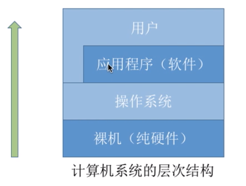

# 操作系统的概念，功能和目标

## 概念

一台电脑的诞生

1. 裸机
2. 安装Windows操作系统
3. 安装软件，比如QQ
4. 使用软件

我们可以看到，图中的层次结构为：裸机-->操作系统-->应用程序-->用户

其中用户也可以和操作系统进行交互

- 硬件：CPU，内存，硬盘等等
- 操作系统
  1. 负责管理协调硬件，软件等计算机资源
  2. 为上层的软件和用户提供服务
  3. 操作系统不是硬件，是系统软件

**定义**

操作系统（Operating System ，OS）是指控制和管理整个计算机系统的硬件和软件资源，并合理的组织调度计算机的工作和资源的分配，以提供给用户和其他软件方便的接口和环境

是计算机系统中最基本的==系统软件==

## 功能和目标

**操作系统需要提供什么功能？**

1. **作为资源的管理者**

进程是一个程序的执行过程，执行前需要将进程放内存中才能被CPU处理

假如我们使用QQ和别人聊天

step1：找到QQ位置：打开位置，文件管理

step2：打开QQ：放入内存中，存储器（内存）管理

step3：QQ运行：被CPU处理，处理机（CPU）管理

step4：摄像头聊天：设备管理

2. **向用户提供服务**

命令接口：允许用户直接使用

- 联机命令接口：用户说一句，系统做一句：比如cmd输入命令time，然后输出
- 脱机命令接口：用户说一堆，系统做一堆：比如.bat的批处理指令

程序接口（广义指令）：允许用户通过程序间接使用

可以通过系统调用，实现各种功能，比如创建一个窗口啥的

GUI：现代操作系统最流行的图形用户接口

3. **对硬件机器的扩展**

